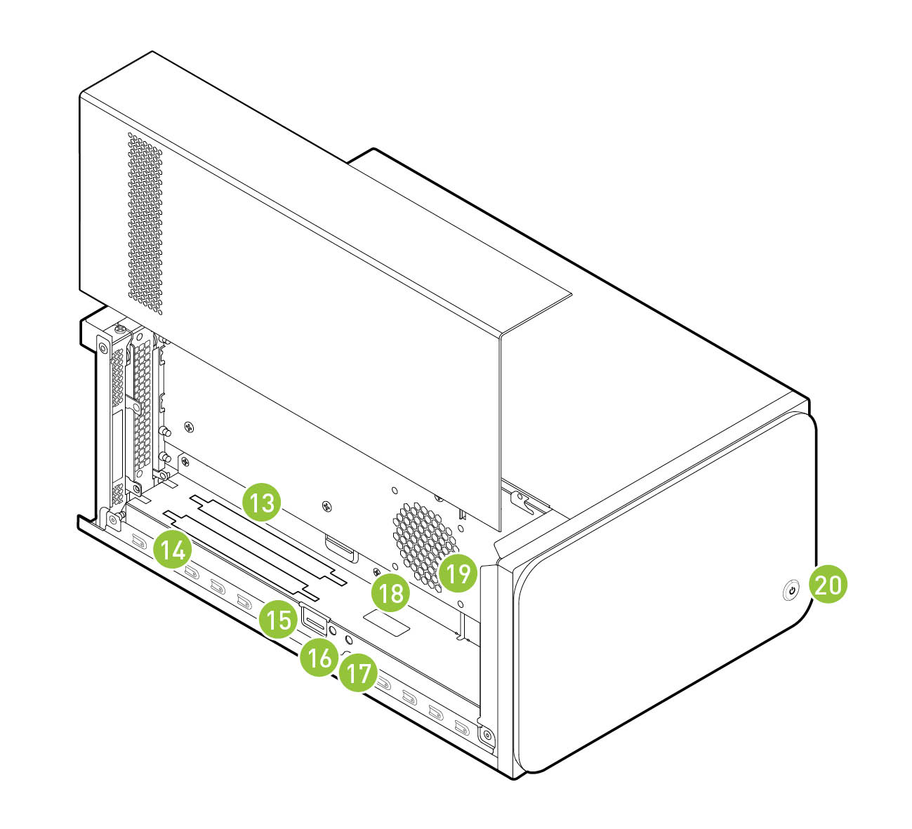
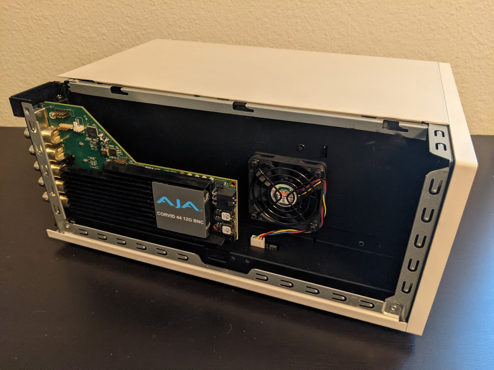

.. _aja_video_systems:

AJA Video Systems
=================

`AJA`_ provides a wide range of proven, professional video I/O devices, and thanks to a
partnership between NVIDIA and AJA, Holoscan provides ongoing support for the AJA NTV2
SDK and device drivers.

The AJA drivers and SDK offer RDMA support for NVIDIA GPUs. This feature allows
video data to be captured directly from the AJA card to GPU memory, which
significantly reduces latency and system PCI bandwidth for GPU video processing
applications as sysmem to GPU copies are eliminated from the processing
pipeline.

The following instructions describe the steps required to setup and use an AJA
device with RDMA support on NVIDIA Developer Kits with a PCIe slot. Note that the AJA NTV2
SDK support for Holoscan includes all of the `AJA Developer Products`_,
though the following instructions have only been verified for the `Corvid 44
12G BNC`_, `KONA XM`, and `KONA HDMI`_ products, specifically.

.. Note::

   The addition of an AJA device to a NVIDIA Developer Kit is
   optional. The Holoscan SDK has elements that can be run with an AJA device
   with the additional features mentioned above, but those elements can also
   run without AJA. For example, there are Holoscan sample applications that have
   an AJA live input component, however they can also take in video replay as
   input. Similarly, the latency measurement tool can measure the latency of
   the video I/O subsystem with or without an AJA device available.

.. _AJA: https://www.aja.com/
.. _AJA Developer Products: https://www.aja.com/family/developer
.. _Corvid 44 12G BNC: https://www.aja.com/products/corvid-44-12g-bnc
.. _KONA XM: https://www.aja.com/products/kona-xm
.. _KONA HDMI: https://www.aja.com/products/kona-hdmi

.. _aja_hardware_install:

Installing the AJA Hardware
---------------------------

This section describes how to install the AJA hardware on the Clara AGX Developer Kit.
Note that the AJA Hardware is also compatible with the NVIDIA IGX Orin Developer Kit.

To install an AJA Video Systems device into the Clara AGX Developer Kit, remove
the side access panel by removing two screws on the back of the Clara AGX. This
provides access to the two available PCIe slots, labelled 13 and 14 in the
`Clara AGX Developer Kit User Guide`_:

While these slots are physically identical PCIe x16 slots, they are connected
to the Clara AGX via different PCIe bridges. Only slot 14 shares the same PCIe
bridge as the RTX6000 dGPU, and so the AJA device must be installed into slot
14 for RDMA support to be available. The following image shows a `Corvid 44 12G
BNC`_ card installed into slot 14 as needed to enable RDMA support.

.. _Clara AGX Developer Kit User Guide: https://developer.nvidia.com/clara-agx-development-kit-user-guide
.. _NVidia IGX Orin Developer Kit User Guide: https://developer.nvidia.com/igx-orin-developer-kit-user-guide

.. _aja_software_install:

Installing the AJA Software
---------------------------

The AJA NTV2 SDK includes both the drivers (kernel module) that are required in
order to enable an AJA device, as well as the SDK (headers and libraries) that
are used to access an AJA device from an application.

The drivers must be loaded every time the system is rebooted, and they must be
loaded natively on the host system (i.e. not inside a container). The drivers
must be loaded regardless of whether applications will be run natively or
inside a container (see :ref:`aja_use_in_containers`).

The SDK only needs to be installed on the native host and/or container that
will be used to compile applications with AJA support. The Holoscan SDK
containers already have the NTV2 SDK installed, and so no additional steps
are required to build AJA-enabled applications (such as the reference Holoscan
applications) within these containers. However, installing the NTV2 SDK and
utilities natively on the host is useful for the initial setup and testing of
the AJA device, so the following instructions cover this native installation.

.. Note::

   To summarize, the steps in this section must be performed on the native host,
   outside of a container, with the following steps **required once**:

     * :ref:`aja_download`
     * :ref:`aja_driver_build`

   The following steps **required after every reboot**:

     * :ref:`aja_driver_load`

   And the following steps are **optional** (but recommended during the initial
   setup):

     * :ref:`aja_sdk_install`
     * :ref:`aja_testing`

Using the AJA NTV2 Driver and SDK Build Script
~~~~~~~~~~~~~~~~~~~~~~~~~~~~~~~~~~~~~~~~~~~~~~

Included in the `scripts` directory is the `aja_build.sh` script which can be
used to download the AJA NTV2 source, build the drivers and SDK, load the
drivers, and run the `ntv2enumerateboards` utility to list the AJA boards that
are connected to the system. To download and build the drivers and SDK, simply
run the script:

   .. code-block:: sh

      $ ./scripts/aja_build.sh

To optionally have the script load the drivers and list the connected devices
once the build is complete, add the `--load-driver` flag:

   .. code-block:: sh

      $ ./scripts/aja_build.sh --load-driver

.. Note::

   The remainder of the steps in this documentation describe how to manually
   build and load the AJA NTV2 drivers and SDK, and are not needed when using
   the build script. However, it will still be required to reload the drivers
   after rebooting the system by running the `load_ajantv2` command as described
   in :ref:`aja_driver_load`.

.. _aja_download:

Downloading the AJA NTV2 SDK Source
~~~~~~~~~~~~~~~~~~~~~~~~~~~~~~~~~~~

Navigate to a directory where you would like the source code to be downloaded,
then perform the following to clone the NTV2 SDK source code.

   .. code-block:: sh

      $ git clone https://github.com/nvidia-holoscan/libajantv2.git
      $ export NTV2=$(pwd)/libajantv2

.. Note::

   These instructions use a fork of the official `AJA NTV2 Repository`_ that is
   maintained by NVIDIA and may contain additional changes that are required for
   Holoscan SDK support. These changes will be pushed to the official AJA NTV2
   repository whenever possible with the goal to minimize or eliminate
   divergence between the two repositories.

.. _AJA NTV2 Repository: https://github.com/aja-video/libajantv2

.. _nvidia_open_driver_install:

Installing the NVIDIA Open Kernel Modules for RDMA Support
~~~~~~~~~~~~~~~~~~~~~~~~~~~~~~~~~~~~~~~~~~~~~~~~~~~~~~~~~~

If the AJA NTV2 drivers are going to be built with RDMA support, the open-source
NVIDIA kernel modules must be installed instead of the default proprietary drivers.
If the drivers were installed from an NVIDIA driver installer package then follow
the directions on the `NVIDIA Open GPU Kernel Module Source GitHub`_ page. If the
NVIDIA drivers were installed using an Ubuntu package via `apt`, then replace the
installed `nvidia-kernel-source` package with the corresponding `nvidia-kernel-open`
package. For example, the following shows that the `545` version drivers are installed:

   .. code-block:: sh

      S dpkg --list | grep nvidia-kernel-source
      ii  nvidia-kernel-source-545    545.23.08-0ubuntu1    amd64    NVIDIA kernel source package

And the following will replace those with the corresponding `nvidia-kernel-open` drivers:

   .. code-block:: sh

      S sudo apt install -y nvidia-kernel-open-545
      $ sudo dpkg-reconfigure nvidia-dkms-545

The system must then be rebooted to load the new open kernel modules.

.. _NVIDIA Open GPU Kernel Module Source GitHub: https://github.com/NVIDIA/open-gpu-kernel-modules

.. _aja_driver_build:

Building the AJA NTV2 Drivers
~~~~~~~~~~~~~~~~~~~~~~~~~~~~~

The following will build the AJA NTV2 drivers with RDMA support enabled. Once
built, the kernel module (**ajantv2.ko**) and load/unload scripts
(**load_ajantv2** and **unload_ajantv2**) will be output to the
:code:`${NTV2}/driver/bin` directory.

   .. code-block:: sh

      $ export AJA_RDMA=1 # Or unset AJA_RDMA to disable RDMA support
      $ unset AJA_IGPU # Or export AJA_IGPU=1 to run on the integrated GPU of the IGX Orin Devkit (L4T >= 35.4)
      $ make -j --directory ${NTV2}/driver/linux

.. _aja_driver_load:

Loading the AJA NTV2 Drivers
~~~~~~~~~~~~~~~~~~~~~~~~~~~~

Running any application that uses an AJA device requires the AJA kernel drivers
to be loaded, even if the application is being run from within a container.

.. Note::

   To enable RDMA with AJA, ensure the :ref:`NVIDIA GPUDirect RDMA kernel module
   is loaded<enable-gpudirect-rdma>` before the AJA NTV2 drivers.

The AJA drivers must be manually loaded every time the machine is rebooted using the
**load_ajantv2** script:

   .. code-block:: sh

      $ sudo sh ${NTV2}/driver/bin/load_ajantv2
      loaded ajantv2 driver module

   .. Note::

      The :code:`NTV2` environment variable must point to the NTV2 SDK path
      where the drivers were previously built as described in
      :ref:`aja_driver_build`.

      Secure boot must be disabled in order to load unsigned module.
      If any errors occur while loading the module refer to the
      :ref:`aja_troubleshooting` section, below.

.. _aja_sdk_install:

Building and Installing the AJA NTV2 SDK
~~~~~~~~~~~~~~~~~~~~~~~~~~~~~~~~~~~~~~~~

Since the AJA NTV2 SDK is already loaded into the Holoscan containers,
this step is not strictly required in order to build or
run any Holoscan applications. However, this builds and installs various
tools that can be useful for testing the operation of the AJA hardware outside
of Holoscan containers, and is required for the steps provided in
:ref:`aja_testing`.

   .. code-block:: sh

      $ sudo apt-get install -y cmake
      $ mkdir ${NTV2}/cmake-build
      $ cd ${NTV2}/cmake-build
      $ export PATH=/usr/local/cuda/bin:${PATH}
      $ cmake ..
      $ make -j
      $ sudo make install

.. _aja_testing:

Testing the AJA Device
~~~~~~~~~~~~~~~~~~~~~~

The following steps depend on tools that were built and installed by the
previous step, :ref:`aja_sdk_install`. If any errors occur, see the
:ref:`aja_troubleshooting` section, below.

1. To ensure that an AJA device has been installed correctly, the
   :code:`ntv2enumerateboards` utility can be used:

   .. code-block:: sh

      $ ntv2enumerateboards
      AJA NTV2 SDK version 16.2.0 build 3 built on Wed Feb 02 21:58:01 UTC 2022
      1 AJA device(s) found:
      AJA device 0 is called 'KonaHDMI - 0'

      This device has a deviceID of 0x10767400
      This device has 0 SDI Input(s)
      This device has 0 SDI Output(s)
      This device has 4 HDMI Input(s)
      This device has 0 HDMI Output(s)
      This device has 0 Analog Input(s)
      This device has 0 Analog Output(s)

      47 video format(s):
          1080i50, 1080i59.94, 1080i60, 720p59.94, 720p60, 1080p29.97, 1080p30,
          1080p25, 1080p23.98, 1080p24, 2Kp23.98, 2Kp24, 720p50, 1080p50b,
          1080p59.94b, 1080p60b, 1080p50a, 1080p59.94a, 1080p60a, 2Kp25, 525i59.94,
          625i50, UHDp23.98, UHDp24, UHDp25, 4Kp23.98, 4Kp24, 4Kp25, UHDp29.97,
          UHDp30, 4Kp29.97, 4Kp30, UHDp50, UHDp59.94, UHDp60, 4Kp50, 4Kp59.94,
          4Kp60, 4Kp47.95, 4Kp48, 2Kp60a, 2Kp59.94a, 2Kp29.97, 2Kp30, 2Kp50a,
          2Kp47.95a, 2Kp48a

2. To ensure that RDMA support has been compiled into the AJA driver and is
   functioning correctly, the :code:`rdmawhacker` utility can be used (use
   `<ctrl-c>` to terminate):

   .. code-block:: sh

      $ rdmawhacker

      DMA engine 1 WRITE 8388608 bytes  rate: 3975.63 MB/sec  496.95 xfers/sec
      Max rate: 4010.03 MB/sec
      Min rate: 3301.69 MB/sec
      Avg rate: 3923.94 MB/sec

.. _aja_use_in_containers:

Using AJA Devices in Containers
---------------------------------

Accessing an AJA device from a container requires the drivers to be loaded
natively on the host (see :ref:`aja_driver_load`), then the device that is
created by the **load_ajantv2** script must be shared with the container using
the :code:`--device` docker argument, such as `--device /dev/ajantv20:/dev/ajantv20`.

.. _aja_troubleshooting:

Troubleshooting
---------------
1. **Problem:** The :code:`sudo sh ${NTV2}/driver/bin/load_ajantv2` command returns
   an error.

   **Solutions:**

   a. Make sure the AJA card is properly installed and powered (see 2.a below)

   b. Check if SecureBoot validation is disabled:

      .. code-block:: sh
         :emphasize-lines: 3

         $ sudo mokutil --sb-state
           SecureBoot enabled
           SecureBoot validation is disabled in shim

      If SecureBoot validation is enabled, disable it with the following procedure:

      .. code-block:: sh

         $ sudo mokutil --disable-validation

      * Enter a temporary password and reboot the system.
      * Upon reboot press any key when you see the blue screen MOK Management
      * Select Change Secure Boot state
      * Enter the password your selected
      * Select Yes to disable Secure Book in shim-signed
      * After reboot you can verify again that SecureBoot validation is disabled in shim.

2. **Problem:** The :code:`ntv2enumerateboards` command does not find any
   devices.

   **Solutions:**

   a. Make sure that the AJA device is installed properly and detected by the
      system (see :ref:`aja_hardware_install`):

      .. code-block:: sh
         :emphasize-lines: 3

         $ lspci
         0000:00:00.0 PCI bridge: NVIDIA Corporation Device 1ad0 (rev a1)
         0000:05:00.0 Multimedia video controller: AJA Video Device eb25 (rev 01)
         0000:06:00.0 PCI bridge: Mellanox Technologies Device 1976
         0000:07:00.0 PCI bridge: Mellanox Technologies Device 1976
         0000:08:00.0 VGA compatible controller: NVIDIA Corporation Device 1e30 (rev a1)

   b. Make sure that the AJA drivers are loaded properly (see
      :ref:`aja_driver_load`):

      .. code-block:: sh
         :emphasize-lines: 3

         $ lsmod
         Module                  Size  Used by
         ajantv2               610066  0
         nvidia_drm             54950  4
         mlx5_ib               170091  0
         nvidia_modeset       1250361  8 nvidia_drm
         ib_core               211721  1 mlx5_ib
         nvidia              34655210  315 nvidia_modeset

3. **Problem:** The :code:`rdmawhacker` command outputs the following error:

      .. code-block:: sh

         ## ERROR: GPU buffer lock failed

   **Solution:** The AJA drivers need to be compiled with RDMA support enabled.
   Follow the instructions in :ref:`aja_driver_build`, making sure not to skip
   the :code:`export AJA_RDMA=1` when building the drivers.
