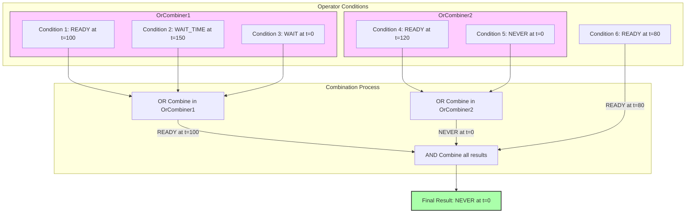
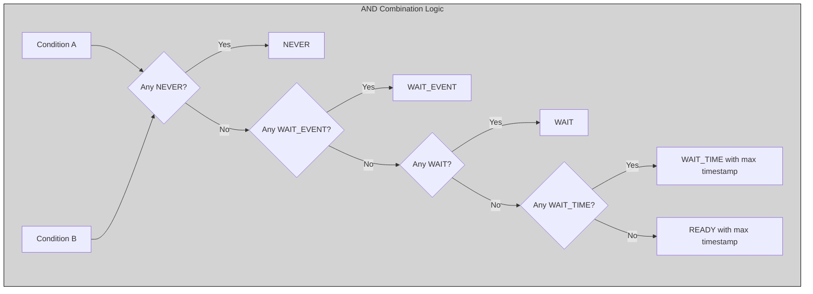
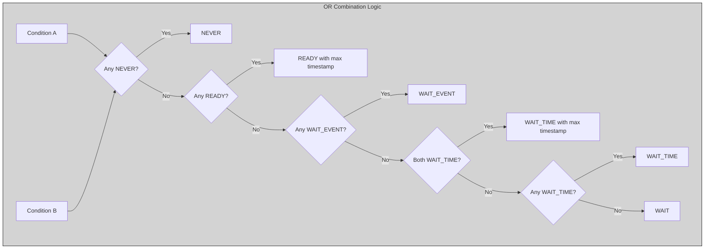

<Anchor id="gxf-conditions" />

The following table shows various states of the scheduling status of an operator:

| **Scheduling Status**         | **Description**                                                         |
|-------------------------------|-------------------------------------------------------------------------|
| NEVER                         | Operator will never execute again                                       |
| READY                         | Operator is ready for execution                                         |
| WAIT                          | Operator may execute in the future                                      |
| WAIT\_TIME                    | Operator will be ready for execution after specified duration           |
| WAIT\_EVENT                   | Operator is waiting on an asynchronous event with unknown time interval |

<Note>

- A failure in execution of any single operator stops the execution of all the operators.
- Operators are naturally unscheduled from execution when their scheduling status reaches `NEVER` state.

</Note>


By default, operators are always `READY`, meaning they are scheduled to continuously execute their `compute()` method. To change that behavior, some condition classes can be assigned to an operator. There are various conditions currently supported in the Holoscan SDK:

- MessageAvailableCondition
- ExpiringMessageAvailableCondition
- MultiMessageAvailableCondition
- MultiMessageAvailableTimeoutCondition
- DownstreamMessageAffordableCondition
- MemoryAvailableCondition
- CountCondition
- BooleanCondition
- PeriodicCondition
- AsynchronousCondition

These conditions fall under various types as detailed below. Often, conditions are explicitly added to an operator by the application author, but it should also be noted that unless the default is overridden, a `MessageAvailableCondition` is automatically added for each of an operator's input ports and a `DownstreamMessageAffordableCondition` is automatically added for each of it's output ports.

<Note>

Detailed APIs can be found here: [C++](/holoscan/sdk-user-guide/api-reference/holoscan/classes/condition)/Python (`holoscan.conditions`).

</Note>


## Condition combination logic

**By Default conditions are AND-combined**

An Operator can be associated with multiple conditions that define its execution behavior. By default, conditions are AND combined to describe the operator's current state.
For an operator to be executed by the scheduler, all conditions must be in the `READY` state. Conversely, the operator is unscheduled whenever any of the scheduling terms reaches the `NEVER` state.
The priority of various states during AND combine follows the order `NEVER`, `WAIT_EVENT`, `WAIT`, `WAIT_TIME`, and `READY`.

**OR combination of conditions**

An `OrConditionCombiner` class is also provided which can be used to allow OR combination of the set of conditions associated with it. For concrete code on how to configure an operator to use OR combination see the section on OR combination of conditions([C++](/holoscan/sdk-user-guide/using-the-sdk/create-an-operator#or-combiner-cpp), [Python](/holoscan/sdk-user-guide/using-the-sdk/create-an-operator#or-combiner-python)) or port conditions([C++](/holoscan/sdk-user-guide/using-the-sdk/create-an-operator#or-port-combine-cpp), [Python](/holoscan/sdk-user-guide/using-the-sdk/create-an-operator#or-port-combine-python)). The general logic when combining conditions is described in the following section and example.

Note that when OR combining conditions if any of the conditions has state NEVER the combination will also return NEVER.

### General Condition Combination Logic Used by GXF

- **Initial Setup**
  - Start with a default combined condition of `READY`

- **Process Any Combiners (e.g. OrConditionCombiner) First**
  - For each `ConditionCombiner` associated with the `Operator`:
    - Get all conditions managed by this combiner
    - Check the first condition and use its result as the initial combiner result
    - For each additional condition in the combiner:
      - Check the status of the condition
      - Combine with previous result using the combiner's logic (OR for `OrConditionCombiner`)
    - AND-combine this combiner's final result with results from other combiners

- **Process Standalone Conditions**
  - For each standalone condition (not in any combiner):
    - Check the status of the condition
    - AND-combine this condition with the current combined result

- **Return Final Result**
  - The final combined condition determines if and when the entity should execute

A concrete diagram illustrating the logic bulleted above is shown in the diagram below:



### Detailed Condition Status Combination Logic Used by AND combination



### Detailed Condition Status Combination Logic Used by OR combination



## Condition Types

The following table gives a rough categorization of the available condition types to help better understand their purpose and how they are assigned. More detailed descriptions of the individual conditions are given in the following sections.

|           Condition Name               |  Classification            |   Associated With              |
|----------------------------------------|----------------------------|--------------------------------|
| MessageAvailableCondition              | message-driven             | single input port              |
| ExpiringMessageAvailableCondition      | message-driven             | single input port              |
| MultiMessageAffordableCondition        | message-driven             | multiple input ports           |
| MultiMessageAffordableTimeoutCondition | message-driven             | single or multiple input ports |
| DownstreamMessageAffordableCondition   | message-driven             | single output port             |
| PeriodicCondition                      | clock-driven               | operator as a whole            |
| CountCondition                         | other                      | operator as a whole            |
| BooleanCondition                       | execution-driven           | operator as a whole            |
| AsynchronousCondition                  | execution-driven           | operator as a whole            |
| MemoryAvailableCondition               | other                      | single holoscan::Allocator     |
| CudaStreamCondition                    | message-driven (CUDA sync) | one or more input ports        |
| CudaEventCondition                     | message-driven (CUDA sync) | single input port              |
| CudaBufferAvailableCondition           | message-driven (CUDA sync) | single input port              |

Here, the various message-driven conditions are associated with an input port (receiver) or output port (transmitter). Message-driven conditions that are associated with a single input port are typically assigned via the `IOSpec::condition` method (C++ (`holoscan::IOSPec::condition`)/Python (`holoscan.core.IOSpec.condition`)) method as called from an operator's `setup` (C++ (`holoscan::Operator::setup`)/Python (`holoscan.core.Operator.setup`)) method. Those associated with multiple input ports would instead be assigned via the `OperatorSpec::multi_port_condition` method (C++ (`holoscan::OperatorSpec::multi_port_condition`)/Python (`holoscan.core.OperatorSpec.multi_port_condition`)) method as called from an operator's `setup` (C++ (`holoscan::Operator::setup`)/Python (`holoscan.core.Operator.setup`)) method.

All other condition types are typically passed as either a positional or keyword argument during operator construction in the application's `compose` method (i.e. passed to `holoscan::Fragment::make_operator` in C++ or the operator class's constructor in Python). Once these conditions are assigned, they automatically enforce the associated criteria for that transmitter/receiver as part of the conditions controlling whether the operator will call `compute`. Due to the AND combination of conditions discussed above, all ports must meet their associated conditions in order for an operator to call `compute`.

As of Holoscan v2.8, it is also possible to add a message-based condition that takes a "receiver" or "transmitter" argument as a positional argument to `Fragment::make_operator` (C++) or the operator's constructor (Python). Any "receiver" or "transmitter" parameter of the condition should be specified via a string-valued argument that takes the name of the port to which the condition would apply. The SDK will then take care of automatically swapping in the actual underlying `Receiver` or `Transmitter` object used by the named port when the application is run. As a concrete example, if the `setup` method of an operator had set a `ConditionType::kNone` (C++) condition on an input port, but we want to add a `MessageAvailableCondition` without modifying that setup method. This could be done via:

```cpp
// assuming that an operator has an input port named "in1" we could explicitly create a condition for this port via
auto in1_condition = make_condition<MessageAvailableCondition>("in1_condition",
                                                               Arg("min_size_", static_cast<uint64_t>(1)),
                                                               Arg("receiver", "in1"));
// then `in1_condition` can be passed as an argument to the `Fragment::make_operator` call for the operator
```

or equivalently, in Python

```py
# assuming that an operator has an input port named "in1" we could explicitly create a condition for this port via
in1_condition = MessageAvailableCondition(fragment, name="in1_condition", min_size=1, receiver="in");

# then in1_condition can be passed as a positional argument to the operator's constructor
```

The `PeriodicCondition` is clock-driven. It automatically takes effect based on timing from it's associated clock. The `CountCondition` is another condition type that automatically takes effect, stopping execution of an operator after a specified count is reached.

The conditions that are marked as execution-driven, by contrast, require an application or operator thread to explicitly trigger a change in the condition. For example, the built-in `HolovizOp` operator's `compute` method implements logic to update an associated `BooleanCondition` to disable the operator when a user closes the display window. Similarly, the `AsynchronousCondition` requires some thread to emit events to trigger an update of its state.

## MessageAvailableCondition

An operator associated with `MessageAvailableCondition` (C++ (`holoscan::gxf::MessageAvailableCondition`)/Python (`holoscan.conditions.MessageAvailableCondition`)) is executed when the associated queue of the input port has at least a certain number of elements.
This condition is associated with a specific input port of an operator through the `condition()` method on the return value (IOSpec) of the OperatorSpec's `input()` method.

The minimum number of messages that permits the execution of the operator is specified by `min_size` parameter (default: `1`). An optional parameter for this condition is `front_stage_max_size`, the maximum front stage message count. If this parameter is set, the condition will only allow execution if the number of messages in the queue does not exceed this count. It can be used for operators which do not consume all messages from the queue.

## ExpiringMessageAvailableCondition

An operator associated with `ExpiringMessageAvailableCondition` (C++ (`holoscan::gxf::ExpiringMessageAvailableCondition`)/Python (`holoscan.conditions.ExpiringMessageAvailableCondition`)) is executed when the first message received in the associated queue is expiring or when there are enough messages in the queue.
This condition is associated with a specific input or output port of an operator through the `condition()` method on the return value (IOSpec) of the OperatorSpec's `input()` or `output()` method.

The parameters ``max_batch_size`` and ``max_delay_ns`` dictate the maximum number of messages to be batched together and the maximum delay from first message to wait before executing the entity respectively.
Please note that `ExpiringMessageAvailableCondition` requires that the input messages sent to any port using this condition must contain a timestamp. This means that the upstream operator has to emit using a timestamp.

To obtain a similar capability without the need for a timestamp, the `MultiMessageAvailableTimeoutCondition` described below can be used with only a single input port assigned. The difference in the timing computation is that `MultiMessageAvailableTimeOutCondition` measures time between the last time `compute` was called on the operator while `ExpiringMessageAvailableCondition` is instead based on the elapsed time since a message arrived in the operator's input queue.

## DownstreamMessageAffordableCondition

The `DownstreamMessageAffordableCondition` (C++ (`holoscan::gxf::DownstreamMessageAffordableCondition`)/Python (`holoscan.conditions.DownstreamMessageAffordableCondition`)) condition specifies that an operator shall be executed if the input port of the downstream operator for a given output port can accept new messages.
This condition is associated with a specific output port of an operator through the `condition()` method on the return value (IOSpec) of the OperatorSpec's `output()` method.
The minimum number of messages that permits the execution of the operator is specified by `min_size` parameter (default: `1`).

## MultiMessageAvailableCondition

An operator associated with `MultiMessageAvailableCondition` (C++ (`holoscan::gxf::MessageAvailableCondition`)/Python (`holoscan.conditions.MessageAvailableCondition`)) is executed when the associated queues of multiple user-specified input ports have the required number of elements.

This condition is associated with multiple input ports of an operator through the `multi_port_condition()` method on OperatorSpec. The `port_names` argument to `multi_port_condition` controls which input ports are associated with this condition.

This condition has two operating modes. The first mode is `MultiMessageAvailableCondition::SamplingMode::SumOfAll` (C++) or `holoscan.conditions.MultiMessageAvailableCondition.SamplingMode.SUM_OF_ALL` (Python). In this mode, the `min_sum` parameter is used to specify the total number of messages that must be received across all the ports included in `port_names` for the operator to execute. The second available mode is `MultiMessageAvailableCondition::SamplingMode::PerReceiver` (C++) or `holoscan.conditions.MultiMessageAvailableCondition.SamplingMode.PER_RECEIVER` (Python). This mode instead takes a vector/list of `min_sizes` equal in length to the `port_names`. This controls the number of messages that must arrive at each individual port in order for the operator to execute. This latter, "per-receiver" mode is equivalent to setting a `MessageAvailableCondition` in each input port individually.

For more details see the [C++ example](https://github.com/nvidia-holoscan/holoscan-sdk/blob/main/examples/conditions/multi_message/cpp/multi_message_per_receiver.cpp) or [Python example](https://github.com/nvidia-holoscan/holoscan-sdk/blob/main/examples/conditions/multi_message/python/multi_message_per_receiver.py).

## MultiMessageAvailableTimeoutCondition

This operator is the same as `MultiMessageAvailableCondition` described above, but has one additional parameter "execution_frequency" that can be used to specify a timeout interval after which the operator will be allowed to execute even if the condition on the number of messages received has not yet been met.

For more details see the [C++ example](https://github.com/nvidia-holoscan/holoscan-sdk/blob/main/examples/conditions/multi_message/cpp/multi_message_sum_of_all.cpp) or [Python example](https://github.com/nvidia-holoscan/holoscan-sdk/blob/main/examples/conditions/multi_message/python/multi_message_sum_of_all.py).

<Note>

This condition can also be assigned via `IOSpec::condition` instead of `OperatorSpec::multi_port_condition` to support the use case where there is only one port to consider. This provides a way for a single input port to support a message available condition that has a timeout interval.

</Note>


## CountCondition

An operator associated with `CountCondition` (C++ (`holoscan::gxf::CountCondition`)/Python (`holoscan.conditions.CountCondition`)) is executed for a specific number of times specified using its `count` parameter.
The scheduling status of the operator associated with this condition can either be in `READY` or `NEVER` state.
The scheduling status reaches the `NEVER` state when the operator has been executed `count` number of times.
The `count` parameter can be set to a negative value to indicate that the operator should be executed an infinite number of times (default: `1`).

## BooleanCondition

An operator associated with `BooleanCondition` (C++ (`holoscan::gxf::BooleanCondition`)/Python (`holoscan.conditions.BooleanCondition`)) is executed when the associated boolean variable is set to `true`.
The boolean variable is set to `true`/`false` by calling the `enable_tick()`/`disable_tick()` methods on the `BooleanCondition` object.
The `check_tick_enabled()` method can be used to check if the boolean variable is set to `true`/`false`.
The scheduling status of the operator associated with this condition can either be in `READY` or `NEVER` state.
If the boolean variable is set to `true`, the scheduling status of the operator associated with this condition is set to `READY`.
If the boolean variable is set to `false`, the scheduling status of the operator associated with this condition is set to `NEVER`.
The `enable_tick()`/`disable_tick()` methods can be called from any operator in the workflow.

<Tabs>

  <Tab title="C++" language="cpp">

  ```cpp
    void compute(InputContext&, OutputContext& op_output, ExecutionContext&) override {
      // ...
      if (<condition expression>) {           // e.g. if (index_ >= 10)
        auto my_bool_condition = condition<BooleanCondition>("my_bool_condition");
        if (my_bool_condition) {              // if condition exists (not true or false)
          my_bool_condition->disable_tick();  // this will stop the operator
        }
      }
      // ...
    }
  ```

</Tab>
<Tab title="Python" language="python">

  ```python
    def compute(self, op_input, op_output, context):
      # ...
      if <condition expression>:              # e.g, self.index >= 10
          my_bool_condition = self.conditions.get("my_bool_condition")
          if my_bool_condition:               # if condition exists (not true or false)
            my_bool_condition.disable_tick()  # this will stop the operator
      # ...
  ```

</Tab>
</Tabs>


## PeriodicCondition

An operator associated with `PeriodicCondition` (C++ (`holoscan::PeriodicCondition`)/Python (`holoscan.conditions.PeriodicCondition`)) is executed after periodic time intervals specified using its `recess_period` parameter. The scheduling status of the operator associated with this condition can either be in `READY` or `WAIT_TIME` state.
For the first time or after periodic time intervals, the scheduling status of the operator associated with this condition is set to `READY` and the operator is executed. After the operator is executed, the scheduling status is set to `WAIT_TIME`, and the operator is not executed until the `recess_period` time interval. The `PeriodicConditionPolicy` (C++ (`holoscan::PeriodicConditionPolicy`)/Python (`holoscan.conditions.PeriodicConditionPolicy`)) specifies how the scheduler handles the recess period: `CatchUpMissedTicks (default)`,`MinTimeBetweenTicks`, or `NoCatchUpMissedTicks`.

The `PeriodicConditionPolicy` enum defines three different policies for handling periodic tasks:

`CatchUpMissedTicks`:

- Tries to catch up on any missed ticks by executing them as quickly as possible
- If multiple ticks were missed, it will try to execute them in rapid succession
- For example, if a tick at 100ms was missed and the time at next tick was 250ms, it will still set the next target time as 200ms resulting in possible immediate rescheduling of the operator since we are already at time 250 ms (i.e. next tick is shown at 255 ms in the example below). After this tick at 255 ms, the target time is then 300 ms.

```bash
// eg. assume recess period of 100ms:
 tick 0 at 0ms -> next_target_ = 100ms
 tick 1 at 250ms -> next_target_ = 200ms (next_target_ < timestamp)
 tick 2 at 255ms -> next_target_ = 300ms (double tick before 300ms)
```

`MinTimeBetweenTicks`:

- Ensures that at least the specified period has elapsed between ticks
- Won't try to catch up, but guarantees minimum spacing between ticks
- For example, with 100ms period, if current time is 350ms, next tick will be at 450ms (current time + period)

```bash
// eg. assume recess period of 100ms:
// tick 0 at 0ms -> next_target_ = 100ms
// tick 1 at 101ms -> next_target_ = 201ms
// tick 2 at 350ms -> next_target_ = 450ms
```

`NoCatchUpMissedTicks`:

- Simply continues with the regular schedule without trying to catch up
- If ticks are missed, they stay missed and scheduling continues from current time
- For example, if at 250ms and period is 100ms, next tick will be at 300ms (rounds up to next period boundary)

```bash
// eg. assume recess period of 100ms:
// tick 0 at 0ms -> next_target_ = 100ms
// tick 1 at 250ms -> next_target_ = 300ms (single tick before 300ms)
// tick 2 at 305ms -> next_target_ = 400ms
```

## MemoryAvailableCondition

For operators that have an associated `Allocator` (C++ (`holoscan::Allocator`)/Python (`holoscan.resources.Allocator`)), that allocator can be assigned to a `MemoryAvailableCondition` (C++ (`holoscan::MemoryAvailableCondition`)/Python (`holoscan.conditions.MemoryAvailableCondition`)). This condition will prevent the operator from executing unless the allocatore has a specified number of bytes free to be allocated.

For the `BlockMemoryPool`, the user can optionally specify the condition in terms of the minimum number of memory blocks instead of in terms of raw bytes.

This condition can be used with `BlockMemoryPool` or `StreamOrderedAllocator` classes to prevent operators using one of those allocator types from executing if there is not sufficient memory available.

<Note>

This condition type will have no effect if it is used with an `UnboundedAllocator` as there is no associated memory limit for that allocator type. It also currently does **not** have any affect when applied with an `RMMAllocator` because that allocator supports dual (host and device) memory pools and does not meet the API assumptions of this condition.

</Note>


Example code for how the condition would be configured from an application's `compose` method is shown below.

<Tabs>

  <Tab title="C++" language="cpp">

  ```cpp
    void compose() override {
      // ...

      // declare an allocator
      auto block_allocator = make_resource<BlockMemoryPool>(
          "block_mem_pool",
          Arg("storage_type", MemoryStorageType::kDevice),
          Arg("block_size", 1024*768*4),
          Arg("num_blocks", 4));

      // create a Memory available condition associate with that allocator
      // can use `min_blocks` for BlockMemoryPool, but for other, non-block
      // allocators, the user should specify `min_bytes` instead.
      auto mem_available_condition = make_condition<MemoryAvailableCondition>(
          "mem_avail_tx"
          Arg("allocator", block_allocator),
          Arg("min_blocks, static_cast<uint64_t>(1));

      // pass the condition as a positional argument to an operator that uses that
      // same allocator. This will prevent the operator from executing unless the
      // amount of memory specified by the condition is available.
      auto tx = make_operator<PingTensorTxOp>(
          "tx",
          mem_available_condition,
          Arg("allocator", block_allocator),
          Arg("rows", 768),
          Arg("columns", 1024),
          Arg("channels", 4));

      // ...
  ```

</Tab>
<Tab title="Python" language="python">

  ```python
    def compose(self):
        # ...

        # declare an allocator
        block_allocator = BlockMemoryPool(
            self,
            storage_type=MemoryStorageType.DEVICE,
            block_size=1024*768*4,
            num_blocks=4,
            name="block_mem_pool",
        )

        # create a Memory available condition associate with that allocator
        # can use `min_blocks` for BlockMemoryPool, but for other, non-block
        # allocators, the user should specify `min_bytes` instead.
        mem_available_condition = MemoryAvailableCondition(
            self,
            allocator=block_allocator,
            min_blocks=1,
            name="mem_avail_tx",
        )

        # pass the condition as a positional argument to an operator that uses that
        # same allocator. This will prevent the operator from executing unless the
        # amount of memory specified by the condition is available.
        tx = PingTensorTxOp(
            self
            mem_available_condition,
            allocator=block_allocator,
            rows=768,
            columns=1024,
            channels=4,
            name="tx",
        )

        # ...
  ```

</Tab>
</Tabs>


<Anchor id="holoscan-conditions-asynchronous" />

## AsynchronousCondition

`AsynchronousCondition` (C++ (`holoscan::gxf::AsynchronousCondition`)/Python (`holoscan.conditions.AsynchronousCondition`)) is primarily associated with operators which are working with asynchronous events happening outside of their regular execution performed by the scheduler. Since these events are non-periodic in nature, `AsynchronousCondition` prevents the scheduler from polling the operator for its status regularly and reduces CPU utilization. The scheduling status of the operator associated with this condition can either be in `READY`, `WAIT`, `WAIT_EVENT`, or `NEVER` states based on the asynchronous event it's waiting on.

The state of an asynchronous event is described using `AsynchronousEventState` and is updated using the `event_state()` API.

| **AsynchronousEventState**     | **Description**                                                     |
|--------------------------------|---------------------------------------------------------------------|
| READY (kReady)                 | Init state, first execution of `compute()` method is pending        |
| WAIT (kWait)                   | Request to async service yet to be sent, nothing to do but wait     |
| EVENT\_WAITING (kEventWaiting) | Request sent to an async service, pending event done notification   |
| EVENT\_DONE (kEventDone)       | Event done notification received, operator ready to be ticked       |
| EVENT\_NEVER (kEventNone)      | Operator does not want to be executed again, end of execution       |

Note that usually Holoscan's Python API uses an UPPER_CASE naming convention while the C++ API uses a k-prefix naming convention. The `AsynchronousEventState` enum also supports UPPER_CASE in C++ for backwards compatibility with older releases, but the use of uppercase from C++ should be considered deprecated.

Operators associated with this scheduling term most likely have an asynchronous thread which can update the state of the condition outside of its regular execution cycle performed by the scheduler. When the asynchronous event state is in `WAIT` state, the scheduler regularly polls for the scheduling state of the operator. When the asynchronous event state is in `EVENT_WAITING` state, schedulers will not check the scheduling status of the operator again until they receive an event notification. Setting the state of the asynchronous event to `EVENT_DONE` automatically sends the event notification to the scheduler. Operators can use the `EVENT_NEVER` state to indicate the end of its execution cycle. As for all of the condition types, the condition type can be used with any of the schedulers.

Please refer to the [Asynchronous Operator Execution Control Example](https://github.com/nvidia-holoscan/holoscan-sdk/blob/main/examples/execution_control/async_operator_execution_control/README.md) and [Ping Async Example](https://github.com/nvidia-holoscan/holoscan-sdk/blob/main/examples/conditions/asynchronous/README.md) for more details on how to use this condition.

## CudaStreamCondition

`CudaStreamCondition` (C++ (`holoscan::CudaStreamCondition`)/Python (`holoscan.conditions.CudaStreamCondition`)) can be used to require work on an input stream to complete before an operator is ready to schedule. When a message is sent to the port to which a `CudaStreamCondition` has been assigned, this condition sets an internal host callback function on the CUDA stream found on this input port. The callback function will set the operator's status to READY once other work on the stream has completed. This will then allow the scheduler to execute the operator.

This condition supports:

- **Multiple input ports**: A single condition can monitor multiple input ports (both regular and multi-receiver ports like `IOSpec::kAnySize`).
- **All messages in queue**: By default, it checks CUDA streams on all messages in the queue, not just the first message.
- **Multiple streams per entity**: Handles messages containing multiple `CudaStreamId` components.

The condition uses `cudaLaunchHostFunc` to register callbacks on each CUDA stream found. An atomic counter tracks pending callbacks, and the operator becomes READY only after all callbacks have fired. In cases where no stream is found in the input message, this condition will allow execution of the operator.

**Parameters:**

- `receivers`: A single port name (string) or list of port names to monitor. For multi-receiver ports (`IOSpec::kAnySize`), specify the base name (e.g., `"receivers"`) and the condition will automatically discover all indexed ports (`receivers:0`, `receivers:1`, etc.).
- `check_all_messages`: Boolean (default `true`). When `true`, checks streams on all messages in each receiver's queue. When `false`, only checks the first message.

<Warning title="Deprecated Parameter">

The `receiver` parameter (singular) is deprecated and should not be used for new code. Use `receivers` instead. The `receiver` parameter only supports a single input port and does not support specifying multiple ports or multi-receiver ports (`IOSpec::kAnySize`). When the `receiver` parameter is used, a deprecation warning will be logged.

Legacy usage with `receiver` (deprecated):

```cpp
// DEPRECATED - use "receivers" instead
auto stream_cond = make_condition<CudaStreamCondition>("stream_cond",
    Arg("receiver", "in"));
```

</Warning>


Example usage:

<Tabs>

  <Tab title="C++" language="cpp">

  ```cpp
    // Monitor a single input port
    auto stream_cond = make_condition<CudaStreamCondition>("stream_cond",
        Arg("receivers", std::string("in")));

    // Monitor a multi-receiver port (kAnySize)
    auto stream_cond = make_condition<CudaStreamCondition>("stream_cond",
        Arg("receivers", std::string("receivers")));  // discovers receivers:0, receivers:1, etc.

    // Monitor multiple input ports
    auto stream_cond = make_condition<CudaStreamCondition>("stream_cond",
        Arg("receivers", std::vector&lt;std::string&gt;{"in1", "in2"}));

    auto my_op = make_operator<MyOperator>("my_op", stream_cond, other_args);
  ```

</Tab>
<Tab title="Python" language="python">

  ```python
    # Monitor a single input port
    stream_cond = CudaStreamCondition(self, receivers="in", name="stream_cond")

    # Monitor a multi-receiver port (kAnySize)
    stream_cond = CudaStreamCondition(self, receivers="receivers", name="stream_cond")

    # Monitor multiple input ports
    stream_cond = CudaStreamCondition(self, receivers=["in1", "in2"], name="stream_cond")

    my_op = MyOperator(self, stream_cond, name="my_op", **kwargs)
  ```

</Tab>
</Tabs>


## CudaEventCondition

This condition is not intended for regular use in Holoscan applications as Holoscan does not provide any API related to GXF's `nvidia::gxf:CudaEvent` type. This condition is provided purely to allow writing an operator that could interoperate with a different operator that wraps a GXF codelet that includes a `CudaEvent` component in its emitted output messages. It checks for a `CudaEvent` with the specified `event_name` in the first message of the input queue. It will then only allow execution of an operator once a `cudaEventQuery` on the corresponding event indicates that it is ready.

## CudaBufferAvailableCondition

This condition is not intended for regular use in Holoscan applications as Holoscan does not provide any API related to GXF's `nvidia::gxf:CudaBuffer` type. This condition is provided purely to allow writing an operator that could interoperate with a different operator that wraps a GXF codelet that includes a `CudaBuffer` component in its emitted output messages. It checks for a `CudaBuffer` component in the first message of the input queue and will only allow execution of the operator once that buffer has status `CudaBuffer::State::DATA_AVAILABLE`.
