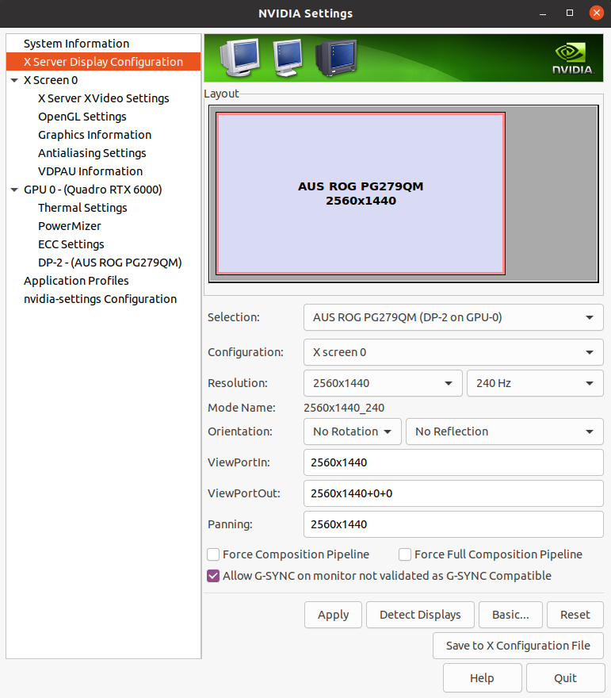
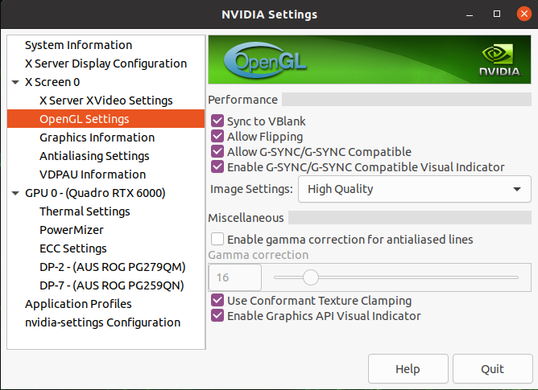

(enable-gsync-for-display)=

# Enabling G-SYNC

For better performance and to keep up with the high refresh rate of Holoscan applications, we recommend the use of a [G-SYNC display](https://www.nvidia.com/en-us/geforce/products/g-sync-monitors/specs/).

:::{tip}
Holoscan has been tested with these two G-SYNC displays:
- [Asus ROG Swift PG279QM](https://rog.asus.com/us/monitors/27-to-31-5-inches/rog-swift-pg279qm-model/)
- [Asus ROG Swift 360 Hz PG259QNR](https://rog.asus.com/us/monitors/23-to-24-5-inches/rog-swift-360hz-pg259qnr-model/)
:::

Follow these steps to ensure G-SYNC is enabled on your display:

1. Open the "NVIDIA Settings" Graphical application (`nvidia-settings` in Terminal).

2. Click on `X Server Display Configuration` then the `Advanced` button. This will
show the `Allow G-SYNC on monitor not validated as G-SYNC compatible` option. Enable the option and click `Apply`:

:::{figure-md} fig-gsync-x-server-enable
:align: center

Enable G-SYNC for the current display

:::

3. To show the refresh rate and G-SYNC label on the display window, click on `OpenGL Settings` for the selected display. Now click `Allow G-SYNC/G-SYNC Compatible` and
`Enable G-SYNC/G-SYNC Compatible Visual Indicator` options and click `Quit`. This
step is shown in below image. The `Gsync` indicator will be at the top right screen
once the application is running.

:::{figure-md} fig-gsync-opengl-settings
:align: center

Enable Visual Indicator for the current display

:::
