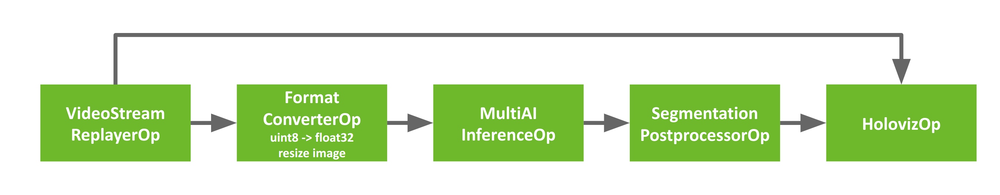
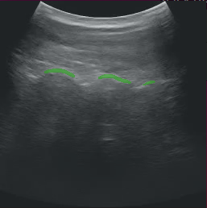

(byom-example)=
# Bring Your Own Model (BYOM)

The Holoscan platform is optimized for performing AI inferencing workflows.  This section shows how the user can easily modify the `bring_your_own_model` example to
create their own AI applications.

In this example we'll cover:

- The usage of `FormatConverterOp`, `InferenceOp`, `SegmentationPostprocessorOp` operators to add AI inference into the workflow.
- How to modify the existing code in this example to create an ultrasound segmentation application to visualize the results from a spinal scoliosis segmentation model.

:::{note}
The example source code and run instructions can be found in the [examples](https://github.com/nvidia-holoscan/holoscan-sdk/blob/main/examples#holoscan-sdk-examples) directory on GitHub, or under `/opt/nvidia/holoscan/examples` in the NGC container and the Debian package, alongside their executables.
:::

## Operators and Workflow

Here is the diagram of the operators and workflow used in the [byom.py](https://github.com/nvidia-holoscan/holoscan-sdk/blob/main/examples/bring_your_own_model/python/byom.py) example.


:::{figure-md} fig-byom-workflow
:align: center



The BYOM inference workflow

:::

The example code already contains the plumbing required to create the pipeline above where the video is loaded by `VideoStreamReplayer` and passed to two branches.
The first branch goes directly to `Holoviz` to display the original video.
The second branch in this workflow goes through AI inferencing and can be used to generate
overlays such as bounding boxes, segmentation masks, or text to add additional information.

This second branch has three operators we haven't yet encountered.

- **Format Converter**: The input video stream goes through a preprocessing stage to convert the tensors to the appropriate shape/format before being fed into the AI model.  It is used here to convert the datatype of the image from `uint8` to `float32` and resized to match the model's expectations.<br><br>

- **Inference**: This operator performs AI inferencing on the input video stream with the provided model. It supports inferencing of multiple input video streams and models.<br><br>

- **Segmentation Postprocessor**: This postprocessing stage takes the output of inference, either with the final softmax layer (multiclass) or sigmoid (2-class), and emits a tensor with `uint8` values that contain the highest probability class index. The output of the segmentation postprocessor is then fed into the Holoviz visualizer to create the overlay.

## Prerequisites

To follow along this example, you can download the ultrasound dataset with the following commands:

```
$ wget --content-disposition \
  https://api.ngc.nvidia.com/v2/resources/nvidia/clara-holoscan/holoscan_ultrasound_sample_data/versions/20220608/zip \
  -O holoscan_ultrasound_sample_data_20220608.zip
$ unzip holoscan_ultrasound_sample_data_20220608.zip -d <SDK_ROOT>/data/ultrasound_segmentation
```

You can also follow along using your own dataset by adjusting the operator parameters based on your input video and model, and converting your video and model to a format that is understood by Holoscan.

### Input Video

The video stream replayer supports reading video files that are encoded as GXF entities.  These files are provided with the ultrasound dataset as the `ultrasound_256x256.gxf_entities` and `ultrasound_256x256.gxf_index` files.

:::{note}
To use your own video data, you can use the `convert_video_to_gxf_entities.py` script (installed in `/opt/nvidia/holoscan/bin` or [on GitHub](https://github.com/nvidia-holoscan/holoscan-sdk/tree/main/scripts#convert_video_to_gxf_entitiespy)) to encode your video. Note that - using this script - the metadata in the generated GXF tensor files will indicate that the data should be copied to the GPU on read.
:::

### Input model

Currently, the inference operators in Holoscan are able to load [ONNX models](https://onnx.ai/), or [TensorRT](https://developer.nvidia.com/tensorrt) engine files built for the GPU architecture on which you will be running the model. TensorRT engines are automatically generated from ONNX by the operators when the applications run.

If you are converting your model from PyTorch to ONNX, chances are your input is NCHW and will need to be converted to NHWC. We provide an example transformation script named  `graph_surgeon.py`, installed in `/opt/nvidia/holoscan/bin` or available [on GitHub](https://github.com/nvidia-holoscan/holoscan-sdk/tree/main/scripts#graph_surgeonpy). You may need to modify the dimensions as needed before modifying your model.

:::{tip}
To get a better understanding of your model, and if this step is necessary, websites such as [netron.app](https://netron.app/) can be used.
:::

(ultrasound-app-customization)=
## Understanding the Application Code

Before modifying the application, let's look at the existing code to get a better understanding of how it works.


`````{tab-set}
````{tab-item} Python
```{code-block} python
:linenos: true
:emphasize-lines: 7, 9, 10, 13, 35-38, 40
:name: holoscan-one-operator-workflow-python

import os
from argparse import ArgumentParser

from holoscan.core import Application

from holoscan.operators import (
    FormatConverterOp,
    HolovizOp,
    InferenceOp,
    SegmentationPostprocessorOp,
    VideoStreamReplayerOp,
)
from holoscan.resources import UnboundedAllocator


class BYOMApp(Application):
    def __init__(self, data):
        """Initialize the application

        Parameters
        ----------
        data : Location to the data
        """

        super().__init__()

        # set name
        self.name = "BYOM App"

        if data == "none":
            data = os.environ.get("HOLOSCAN_INPUT_PATH", "../data")

        self.sample_data_path = data

        self.model_path = os.path.join(os.path.dirname(__file__), "../model")
        self.model_path_map = {
            "byom_model": os.path.join(self.model_path, "identity_model.onnx"),
        }

        self.video_dir = os.path.join(self.sample_data_path, "racerx")
        if not os.path.exists(self.video_dir):
            raise ValueError(f"Could not find video data: {self.video_dir=}")
```
- The built-in `FormatConvertOp`, `InferenceOp`, and `SegmentationPostprocessorOp` operators are imported on lines `7`, `9`, and `10`. These 3 operators make up the preprocessing, inference, and postprocessing stages of our AI pipeline respectively.
- The `UnboundedAllocator` resource is imported on line `13`.  This is used by our application's operators for memory allocation.
- The paths to the `identity` model are defined on lines `35-38`.  This model passes its input tensor to its output, and  acts as a placeholder for this example.
- The directory of the video files are defined on line `40`.
````
`````

Next, we look at the operators and their parameters defined in the application YAML file.

<!-- Note that NVIDIA's public user guide doesn't seem to support the `lineno-start` tag, such as `:lineno-start: 43` in the code block, so we are removing it. -->

`````{tab-set}
````{tab-item} Python
```{code-block} python
:linenos: true
:emphasize-lines: 2, 8, 12, 20
:name: holoscan-one-operator-workflow-python

    def compose(self):
        host_allocator = UnboundedAllocator(self, name="host_allocator")

        source = VideoStreamReplayerOp(
            self, name="replayer", directory=self.video_dir, **self.kwargs("replayer")
        )

        preprocessor = FormatConverterOp(
            self, name="preprocessor", pool=host_allocator, **self.kwargs("preprocessor")
        )

        inference = InferenceOp(
            self,
            name="inference",
            allocator=host_allocator,
            model_path_map=self.model_path_map,
            **self.kwargs("inference"),
        )

        postprocessor = SegmentationPostprocessorOp(
            self, name="postprocessor", allocator=host_allocator, **self.kwargs("postprocessor")
        )

        viz = HolovizOp(self, name="viz", **self.kwargs("viz"))
```
- An instance of the `UnboundedAllocator` resource class is created (line `2`) and used by subsequent operators for
memory allocation.  This allocator allocates memory dynamically on the host as needed.  For applications where latency
becomes an issue, an allocator supporting a memory pool such as  `BlockMemoryPool` or `RMMAllocator` could be used instead.
- The preprocessor operator (line `8`) takes care of converting the input video from the source video to a format that can be used by the AI model.
- The inference operator (line `12`) feeds the output from the preprocessor to the AI model to perform inference.
- The postprocessor operator (line `20`) postprocesses the output from the inference operator before passing it downstream to the visualizer.
Here, the segmentation postprocessor checks the probabilities output from the model to determine which class is most likely and emits this class index.
This is then used by the `Holoviz` operator to create a segmentation mask overlay.
````

````{tab-item} YAML
```{code-block} yaml
:linenos: true
:emphasize-lines: 10-13, 18, 20, 23-24, 30-32
:name: holoscan-one-operator-workflow-python

%YAML 1.2
replayer:  # VideoStreamReplayer
  basename: "racerx"
  frame_rate: 0 # as specified in timestamps
  repeat: true # default: false
  realtime: true # default: true
  count: 0 # default: 0 (no frame count restriction)

preprocessor:  # FormatConverter
  out_tensor_name: source_video
  out_dtype: "float32"
  resize_width: 512
  resize_height: 512

inference:  # Inference
  backend: "trt"
  pre_processor_map:
    "byom_model": ["source_video"]
  inference_map:
    "byom_model": ["output"]

postprocessor:  # SegmentationPostprocessor
  in_tensor_name: output
  # network_output_type: None
  data_format: nchw

viz:  # Holoviz
  width: 854
  height: 480
  color_lut: [
    [0.65, 0.81, 0.89, 0.1],
    ]
```
- The preprocessor converts the tensors to `float32` values (line `11`) and ensures that the image is resized to 512x512 (line `12-13`).

- The `pre_processor_map` parameter (lines `17-18`) maps the model name(s) to input tensor name(s).
Here, "source_video" matches the output tensor name of the preprocessor (line `10`).
The `inference_map` parameter maps the model name(s) to the output tensor name(s).
Here, "output" matches the input tensor name of the postprocessor (line `23`).  For more details on `InferenceOp` parameters, see {ref}`customizing-multiai-op` or refer to {ref}`holoinfer`.

- The `network_output_type` parameter is commented out on line `24` to remind ourselves that this second branch is currently not generating anything interesting.  If not specified, this parameter defaults to "softmax" for `SegmentationPostprocessorOp`.

- The color lookup table defined on lines `30-32` is used here to create a segmentation mask overlay.  The values of each entry in the table are RGBA values between 0.0 and 1.0.  For the alpha value, 0.0 is fully transparent and 1.0 is fully opaque.

````
`````


Finally, we define the application and workflow.

`````{tab-set}
````{tab-item} Python
```{code-block} python
:linenos: true
:emphasize-lines: 2-6

        # Define the workflow
        self.add_flow(source, viz, {("output", "receivers")})
        self.add_flow(source, preprocessor, {("output", "source_video")})
        self.add_flow(preprocessor, inference, {("tensor", "receivers")})
        self.add_flow(inference, postprocessor, {("transmitter", "in_tensor")})
        self.add_flow(postprocessor, viz, {("out_tensor", "receivers")})


def main(config_file, data):
    app = BYOMApp(data=data)
    # if the --config command line argument was provided, it will override this config_file
    app.config(config_file)
    app.run()


if __name__ == "__main__":
    # Parse args
    parser = ArgumentParser(description="BYOM demo application.")
    parser.add_argument(
        "-d",
        "--data",
        default="none",
        help=("Set the data path"),
    )

    args = parser.parse_args()
    config_file = os.path.join(os.path.dirname(__file__), "byom.yaml")
    main(config_file=config_file, data=args.data)
```
- The `add_flow()` on line `2` defines the first branch to display the original video.
- The `add_flow()` commands from line `3-6` defines the second branch to display the segmentation mask overlay.
````
`````

(byom-modifying-app)=
## Modifying the Application for Ultrasound Segmentation

To create the ultrasound segmentation application, we need to swap out the input video and model to use the ultrasound files, and adjust the parameters to ensure the input video is resized correctly to the model's expectations.

We will need to modify the Python and YAML files to change our application to the ultrasound segmentation application.


`````{tab-set}
````{tab-item} Python
```{code-block} python
:linenos: true
:emphasize-lines: 20-23, 25

class BYOMApp(Application):
    def __init__(self, data):
        """Initialize the application

        Parameters
        ----------
        data : Location to the data
        """

        super().__init__()

        # set name
        self.name = "BYOM App"

        if data == "none":
            data = os.environ.get("HOLOSCAN_INPUT_PATH", "../data")

        self.sample_data_path = data

        self.model_path = os.path.join(self.sample_data_path, "ultrasound_segmentation", "model")
        self.model_path_map = {
            "byom_model": os.path.join(self.model_path, "us_unet_256x256_nhwc.onnx"),
       }

        self.video_dir = os.path.join(self.sample_data_path, "ultrasound_segmentation", "video")
        if not os.path.exists(self.video_dir):
            raise ValueError(f"Could not find video data: {self.video_dir=}")
```
- Update `self.model_path_map` to the ultrasound segmentation model (lines `20-23`).
- Update `self.video_dir` to point to the directory of the ultrasound video files (line `25`).
````

````{tab-item} YAML
```{code-block} yaml
:linenos: true
:emphasize-lines: 2, 11, 12, 23, 31

replayer:  # VideoStreamReplayer
  basename: "ultrasound_256x256"
  frame_rate: 0 # as specified in timestamps
  repeat: true # default: false
  realtime: true # default: true
  count: 0 # default: 0 (no frame count restriction)

preprocessor:  # FormatConverter
  out_tensor_name: source_video
  out_dtype: "float32"
  resize_width: 256
  resize_height: 256

inference:  # Inference
  backend: "trt"
  pre_processor_map:
    "byom_model": ["source_video"]
  inference_map:
    "byom_model": ["output"]

postprocessor:  # SegmentationPostprocessor
  in_tensor_name: output
  network_output_type: softmax
  data_format: nchw

viz:  # Holoviz
  width: 854
  height: 480
  color_lut: [
    [0.65, 0.81, 0.89, 0.1],
    [0.2, 0.63, 0.17, 0.7]
    ]
```
- Update `basename` to the basename of the ultrasound video files (line `2`).
- The AI model expects the width and height of the images to be 256x256, update the preprocessor's parameters to resize the input to 256x256 (line `11-12`).
- The AI model's final output layer is a softmax, so we indicate this to the postprocessor (line `23`).
- Since this model predicts between two classes, we need another entry in Holoviz's color lookup table (line `31`).
Note that the alpha value of the first color entry is `0.1` (line `30`) so the mask for the background class may not be visible.
The second entry we just added is a green color and has an alpha value of `0.7` so it will be easily visible.
````
`````

The above changes are enough to update the BYOM example to the ultrasound segmentation application.<br>

In general, when deploying your own AI models, you will need to consider the operators in the second branch. This example uses a pretty typical AI workflow:

- **Input**: This could be a video on disk, an input stream from a capture device, or other data stream.
- **Preprocessing**: You may need to preprocess the input stream to convert tensors into the shape and format that is expected by your AI model (e.g., converting datatype and resizing).
- **Inference**: Your model will need to be in ONNX or TensorRT format.
- **Postprocessing**: An operator that postprocesses the output of the model to a format that can be readily used by downstream operators.
- **Output**: The postprocessed stream can be displayed or used by other downstream operators.

The Holoscan SDK comes with a number of [built-in operators](https://github.com/nvidia-holoscan/holoscan-sdk/tree/main/src/operators) that you can use to configure your own workflow.
If needed, you can write your own custom operators or visit [Holohub](https://github.com/nvidia-holoscan/holohub) for additional implementations and ideas for operators.

## Running the Application

After modifying the application as instructed above, running the application should bring up the ultrasound video with a segmentation mask overlay similar to the image below.

:::{figure-md} fig-byom-ultrasound
:align: center



Ultrasound Segmentation
:::

:::{note}
If you run the byom.py application without modification and are using the debian installation, you may run into the following error message:
```text
[error] Error in Inference Manager ... TRT Inference: failed to build TRT engine file.
```
In this case, modifying the write permissions for the model directory should help (use with caution):
```bash
sudo chmod a+w /opt/nvidia/holoscan/examples/bring_your_own_model/model
```
:::

(customizing-multiai-op)=
## Customizing the Inference Operator

The built-in `InferenceOp` operator provides the functionality of the {ref}`holoinfer`.
This operator has a `receivers` port that can connect to any number of upstream ports to allow for multiai inferencing, and one `transmitter` port to send results downstream.
Below is a description of some of the operator's parameters and a general guidance on how to use them.

- `backend`: If the input models are in `tensorrt engine file` format, select `trt` as the
backend.  If the input models are in `onnx` format select either `trt` or `onnx` as the backend.
- `allocator`: Can be passed to this operator to specify how the output tensors are allocated.
- `model_path_map`: Contains dictionary keys with unique strings that refer to each model.  The values are set to the path to the model files on disk.  All models must be either in `onnx` or in `tensorrt engine file` format.  The Holoscan Inference Module will do the `onnx` to `tensorrt` model conversion if the TensorRT engine files do not exist.
- `pre_processor_map`: This dictionary should contain the same keys as `model_path_map`, mapping to the output tensor name for each model.
- `inference_map`: This dictionary should contain the same keys as `model_path_map`, mapping to the output tensor name for each model.
- `enable_fp16`: Boolean variable indicating if half-precision should be used to speed up inferencing.  The default value is False, and uses single-precision (32-bit fp) values.
- `input_on_cuda`: Indicates whether input tensors are on device or host.
- `output_on_cuda`: Indicates whether output tensors are on device or host.
- `transmit_on_cuda`: If True, it means the data transmission from the inference will be on **Device**, otherwise it means the data transmission from the inference will be on **Host**.


## Common Pitfalls Deploying New Models

### Color Channel Order

It is important to know what channel order your model expects. This may be indicated by the training data, pre-training transformations performed at training, or the expected inference format used in your application.

For example, if your inference data is RGB, but your model expects BGR, you will need to add the following to your segmentation_preprocessor in the yaml file: `out_channel_order: [2,1,0]`.

### Normalizing Your Data

Similarly, default scaling for streaming data is `[0,1]`, but dependent on how your model was trained, you may be expecting `[0,255]`.

For the above case, you would add the following to your segmentation_preprocessor in the YAML file:

`scale_min: 0.0`
`scale_max: 255.0`

### Network Output Type

Models often have different output types such as `Sigmoid`, `Softmax`, or perhaps something else, and you may need to examine the last few layers of your model to determine which applies to your case.

As in the case of our ultrasound segmentation example above, we added the following in our YAML file:
`network_output_type: softmax`
