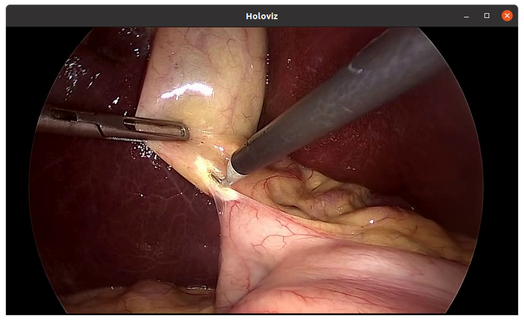

(video-replayer-example)=
# Video Replayer

So far we have been working with simple operators to demonstrate Holoscan SDK concepts.
In this example, we look at two built-in Holoscan operators that have many practical
applications.

In this example we'll cover:

- how to load a video file from disk using **VideoStreamReplayerOp** operator
- how to display video using **HolovizOp** operator
- how to configure your operator's parameters using a YAML configuration file

:::{note}
The example source code and run instructions can be found in the [examples](https://github.com/nvidia-holoscan/holoscan-sdk/blob/main/examples#holoscan-sdk-examples) directory on GitHub, or under `/opt/nvidia/holoscan/examples` in the NGC container and the debian package, alongside their executables.
:::

## Operators and Workflow

Here is the diagram of the operators and workflow used in this example.

```{mermaid}
:align: center
:caption: Workflow to load and display video from a file

%%{init: {"theme": "base", "themeVariables": { "fontSize": "16px"}} }%%

classDiagram
    direction LR

    VideoStreamReplayerOp --|> HolovizOp : output...receivers

    class VideoStreamReplayerOp {
        output(out) Tensor
    }
    class HolovizOp {
        [in]receivers : Tensor
    }
```

We connect the "output" port of the replayer operator to the "receivers" port of the Holoviz
operator.

## Video Stream Replayer Operator

The built-in video stream replayer operator can be used to replay a video stream that has been encoded as gxf entities.  You can use the [convert_video_to_gxf_entities.py](https://github.com/nvidia-holoscan/holoscan-sdk/tree/main/scripts#convert_video_to_gxf_entitiespy) script to encode a video file as gxf entities for use by this operator.

This operator processes the encoded file sequentially and supports realtime, faster than realtime, or slower than realtime playback of prerecorded data. The input data can optionally be repeated to loop forever or only for a specified count. For more details, see {ref}`operators-video-stream-replayer`.

We will use the replayer to read gxf entities from disk and send the frames downstream to the Holoviz operator.

## Holoviz Operator

The built-in Holoviz operator provides the functionality to composite real time streams of frames with multiple different other layers like segmentation mask layers, geometry layers and GUI layers.

We will use Holoviz to display frames that have been sent by the replayer operator to it's "receivers" port which can receive any number of inputs.  In more intricate workflows, this port can receive multiple streams of input data where, for example, one stream is the original video data while other streams detect objects in the video to create bounding boxes and/or text overlays.


(video-replayer-application-config)=
## Application Configuration File (YAML)

The SDK supports reading an optional YAML configuration file and can be used to customize the application's
workflow and operators.  For more complex workflows, it may be helpful to use the application configuration file to help separate operator parameter settings from your code.  See {ref}`configuring-an-application` for additional details.

:::{tip} For C++ applications, the configuration file can be a nice way to set the behavior of the application at runtime without having to recompile the code.
:::

This example uses the following configuration file to configure the parameters for the replayer and Holoviz operators.  The full list of parameters can
be found at {ref}`operators-video-stream-replayer` and {ref}`operators-holoviz`.

```
%YAML 1.2
replayer:
  directory: "../data/racerx"   # Path to gxf entity video data
  basename: "racerx"             # Look for <basename>.gxf_{entities|index}
  frame_rate: 0       # Frame rate to replay.  (default: 0 follow frame rate in timestamps)
  repeat: true        # Loop video?   (default: false)
  realtime: true      # Play in realtime, based on frame_rate/timestamps   (default: true)
  count: 0            # Number of frames to read  (default: 0 for no frame count restriction)

holoviz:
  width: 854          # width of window size
  height: 480         # height of window size
  tensors:
    - name: ""        # name of tensor containing input data to display
      type: color     # input type e.g., color, triangles, text, depth_map
      opacity: 1.0    # layer opacity
      priority: 0     # determines render order, higher priority layers are rendered on top
```

The code below shows our `video_replayer` example.  Operator parameters are configured from a configuration file
using `from_config()` (C++) and `self.**kwargs()` (Python).

`````{tab-set}
````{tab-item} C++
```{code-block} cpp
:linenos: true
:emphasize-lines: 2-3, 11-12, 15, 28
:name: holoscan-one-operator-workflow-cpp

#include <holoscan/holoscan.hpp>
#include <holoscan/operators/video_stream_replayer/video_stream_replayer.hpp>
#include <holoscan/operators/holoviz/holoviz.hpp>

class VideoReplayerApp : public holoscan::Application {
 public:
  void compose() override {
    using namespace holoscan;

    // Define the replayer and holoviz operators and configure using yaml configuration
    auto replayer = make_operator<ops::VideoStreamReplayerOp>("replayer", from_config("replayer"));
    auto visualizer = make_operator<ops::HolovizOp>("holoviz", from_config("holoviz"));

    // Define the workflow: replayer -> holoviz
    add_flow(replayer, visualizer, {{"output", "receivers"}});
  }
};

int main(int argc, char** argv) {
  // Get the yaml configuration file
  auto config_path = std::filesystem::canonical(argv[0]).parent_path();
  config_path /= std::filesystem::path("video_replayer.yaml");
  if ( argc >= 2 ) {
    config_path = argv[1];
  }

  auto app = holoscan::make_application<VideoReplayerApp>();
  app->config(config_path);
  app->run();

  return 0;
}
```
- The built-in **VideoStreamReplayerOp** and **HolovizOp** operators are included from lines 1 and 2 respectively.
- We create an instance of **VideoStreamReplayerOp** named "replayer" with parameters initialized from
  the YAML configuration file using the call to `from_config()` (line 11).
- We create an instance of **HolovizOp** named "holoviz" with parameters initialized from the
  YAML configuration file using the call to `from_config()` (line 12).
- The "output" port of "replayer" operator is connected to the "receivers" port of the "holoviz" operator and defines the application workflow (line 34).
- The application's YAML configuration file contains the parameters for our operators, and is loaded on line 28. If no argument is passed to the executable, the application looks for a file with the name "video_replayer.yaml" in the same directory as the executable (lines 21-22), otherwise it treats the argument as the path to the app's YAML configuration file (lines 23-25).
````
````{tab-item} Python
```{code-block} python
:linenos: true
:emphasize-lines: 5, 28-30, 31, 34, 45
:name: holoscan-one-operator-workflow-python

import os
import sys

from holoscan.core import Application
from holoscan.operators import HolovizOp, VideoStreamReplayerOp

sample_data_path = os.environ.get("HOLOSCAN_INPUT_PATH", "../data")


class VideoReplayerApp(Application):
    """Example of an application that uses the operators defined above.

    This application has the following operators:

    - VideoStreamReplayerOp
    - HolovizOp

    The VideoStreamReplayerOp reads a video file and sends the frames to the HolovizOp.
    The HolovizOp displays the frames.
    """

    def compose(self):
        video_dir = os.path.join(sample_data_path, "racerx")
        if not os.path.exists(video_dir):
            raise ValueError(f"Could not find video data: {video_dir=}")

        # Define the replayer and holoviz operators
        replayer = VideoStreamReplayerOp(
            self, name="replayer", directory=video_dir, **self.kwargs("replayer")
        )
        visualizer = HolovizOp(self, name="holoviz", **self.kwargs("holoviz"))

        # Define the workflow
        self.add_flow(replayer, visualizer, {("output", "receivers")})


def main(config_file):
    app = VideoReplayerApp()
    # if the --config command line argument was provided, it will override this config_file
    app.config(config_file)
    app.run()


if __name__ == "__main__":
    config_file = os.path.join(os.path.dirname(__file__), "video_replayer.yaml")
    main(config_file=config_file)
```
- The built-in **VideoStreamReplayerOp** and **HolovizOp** operators are imported on line 5.
- We create an instance of **VideoStreamReplayerOp** named "replayer" with parameters initialized from
  the YAML configuration file using `**self.kwargs()` (lines 28-30).
- For the python script, the path to the gxf entity video data is not set in the application configuration file but
determined by the code on lines 7 and 23 and is passed directly as the "directory" argument (line 29). This allows more
flexibility for the user to run the script from any directory by setting the `HOLOSCAN_INPUT_PATH` directory (line 7).
- We create an instance of **HolovizOp** named "holoviz" with parameters initialized from the
  YAML configuration file using `**self.kwargs()` (line 31).
- The "output" port of "replayer" operator is connected to the "receivers" port of the "holoviz" operator and defines the application workflow (line 34).
- The application's YAML configuration file contains the parameters for our operators, and is loaded on line 45. If no argument is passed to the python script, the application looks for a file with the name "video_replayer.yaml" in the same directory as the script (line 39), otherwise it treats the argument as the path to the app's YAML configuration file (lines 41-42).
````
`````

## Running the Application

Running the application should bring up video playback of the video referenced in the YAML file.


