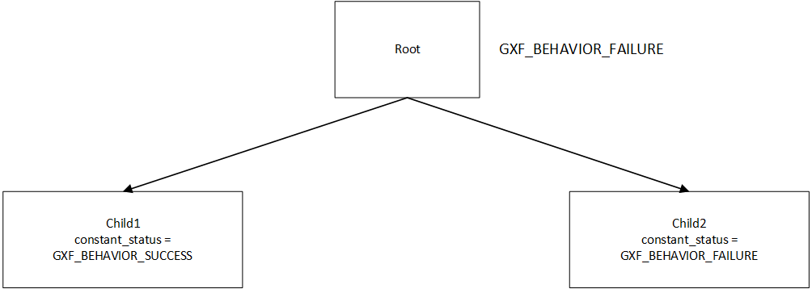
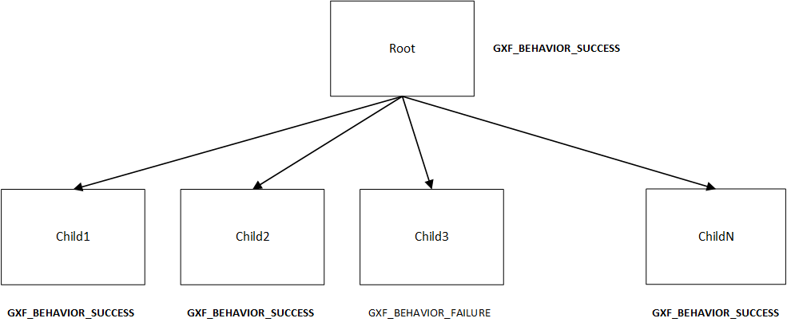
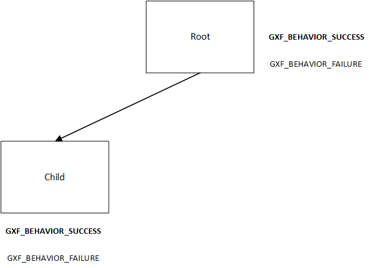
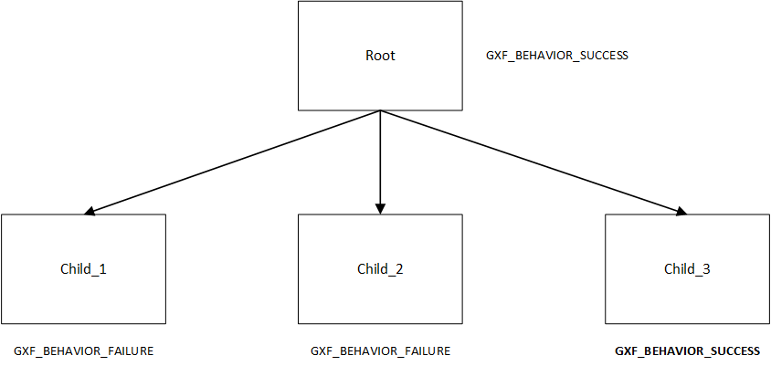
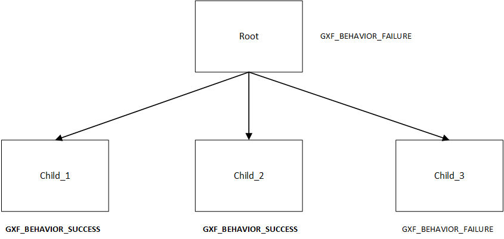
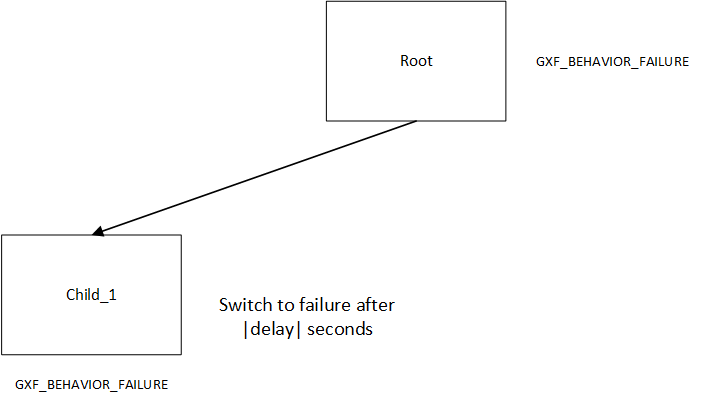

..
   Copyright (c) 2021-2022, NVIDIA CORPORATION. All rights reserved.
   NVIDIA CORPORATION and its licensors retain all intellectual property
   and proprietary rights in and to this software, related documentation
   and any modifications thereto. Any use, reproduction, disclosure or
   distribution of this software and related documentation without an express
   license agreement from NVIDIA CORPORATION is strictly prohibited.

.. _behavior_trees:

Behavior Trees
==============

Behavior tree codelets are one of the mechanisms to control the flow of tasks in GXF. They follow the same general behavior as classical behavior trees, with some useful additions for robotics applications. This document gives an overview of the general concept, the available behavior tree node types, and some examples of how to use them individually or in conjunction with
each other.

General Concept
---------------

Behavior trees consist of n-ary trees of entities that can have zero or more children. The conditional execution of parent entity is based on the status of execution of the children. A behavior tree is graphically represented as a directed tree in which
the nodes are classified as root, control flow nodes, or execution nodes
(tasks). For each pair of connected nodes, the outgoing node is called
parent and the incoming node is called child.

The execution of a behavior tree starts from the root which sends ticks
with a certain frequency to its child. When the execution of a node in
the behavior tree is allowed, it returns to the parent a
status ``running`` if its execution has not finished yet, ``success`` if it has
achieved its goal, or ``failure`` otherwise. The behavior tree also uses a
controller component for controlling the entity's termination policy and
the execution status. One of the controller behaviors currently
implemented for Behavior Tree is
:code:`EntityCountFailureRepeatController`, which repeats the entity on
failure up to :code:`repeat_count` times before deactivating it.

GXF supports several behavior tree codelets which are explained in the
following section.

Behavior Tree Codelets
----------------------

Each behavior tree codelet can have a set of parameters defining how it
should behave. Note that in all the examples given below, the naming convention for configuring the ``children`` parameter for root codelets is ``[child_codelet_name\child_codelet_scheduling_term]``.

Constant Behavior
~~~~~~~~~~~~~~~~~

After each tick period, switches its own status to the configured
desired constant status.

+--------------------+----------------------------------------------------------+
| Parameter          | Description                                              |
+====================+==========================================================+
| s\_term            | scheduling term used for scheduling the entity itself    |
+--------------------+----------------------------------------------------------+
| constant\_status   | The desired status to switch to during each tick time.   |
+--------------------+----------------------------------------------------------+

An example diagram depicting Constant behavior used in conjunction with a Sequence behavior defined for root entity is shown below:

Here, the child1 is configured to return a constant status of success
(``GXF\_BEHAVIOR\_SUCCESS``) and child2 returns failure (``GXF\_BEHAVIOR\_FAILURE``), resulting into the root node (configured to exhibit sequence behavior) returning ``GXF\_BEHAVIOR\_FAILURE``.

The controller for each child can be configured to repeat the execution
on failure. A code snippet of configuring the example described is shown below.

.. code-block:: yaml

   name: root
   components:
   - name: root_controller
     type: nvidia::gxf::EntityCountFailureRepeatController
     parameters:
       max_repeat_count: 0
   - name: root_st
     type: nvidia::gxf::BTSchedulingTerm
     parameters:
       is_root: true
   - name: root_codelet
     type: nvidia::gxf::SequenceBehavior
     parameters:
       children: [ child1/child1_st, child2/child2_st ]
       s_term: root_st
   ---
    name: child2
    components:
    - name: child2_controller
      type: nvidia::gxf::EntityCountFailureRepeatController
      parameters:
        max_repeat_count: 3
        return_behavior_running_if_failure_repeat: true
    - name: child2_st
      type: nvidia::gxf::BTSchedulingTerm
      parameters:
        is_root: false
    - name: child2_codelet
      type: nvidia::gxf::ConstantBehavior
      parameters:
        s_term: child2_st
        constant_status: 1

Parallel Behavior
~~~~~~~~~~~~~~~~~

Runs its child nodes in parallel. By default, succeeds when all child
nodes succeed, and fails when all child nodes fail. This behavior can be
customized using the parameters below.

+-----------------------+-------------------------------------------------------------------------------------------------------------------------------+
| Parameter             | Description                                                                                                                   |
+=======================+===============================================================================================================================+
| s\_term               | scheduling term used for scheduling the entity itself                                                                         |
+-----------------------+-------------------------------------------------------------------------------------------------------------------------------+
| children              | Child entities                                                                                                                |
+-----------------------+-------------------------------------------------------------------------------------------------------------------------------+
| success\_threshold    | Number of successful children required for success. A value of -1 means all children must succeed for this node to succeed.   |
+-----------------------+-------------------------------------------------------------------------------------------------------------------------------+
| failure\_threshold    | Number of failed children required for failure. A value of -1 means all children must fail for this node to fail.             |
+-----------------------+-------------------------------------------------------------------------------------------------------------------------------+

The diagram below shows a graphical representation of a parallel
behavior configured with ``failure\_threshold`` configured as ``-1``. Hence, the
root node returns ``GXF\_BEHAVIOR\_SUCCESS`` even if one child returns a
``failure`` status.

A code snippet to configure the example described is shown below.

.. code-block:: yaml

   name: root
   components:
   - name: root_controller
     type: nvidia::gxf::EntityCountFailureRepeatController
     parameters:
       max_repeat_count: 0
   - name: root_st
     type: nvidia::gxf::BTSchedulingTerm
     parameters:
       is_root: true
   - name: root_codelet
     type: nvidia::gxf::ParallelBehavior
     parameters:
       children: [ child1/child1_st, child2/child2_st ]
       s_term: root_st
       success_threshold: 1
       failure_threshold: -1

Repeat Behavior
~~~~~~~~~~~~~~~

Repeats its only child entity. By default, won't repeat when the child
entity fails. This can be customized using the parameters below.

+--------------------------+------------------------------------------------------------+
| Parameter                | Description                                                |
+==========================+============================================================+
| s\_term                  | scheduling term used for scheduling the entity itself      |
+--------------------------+------------------------------------------------------------+
| repeat\_after\_failure   | Denotes whether to repeat the child after it has failed.   |
+--------------------------+------------------------------------------------------------+

The diagram below shows a graphical representation of a repeat behavior.
The root entity can be configured to repeat the only child to repeat
after failure. It succeeds when the child entity succeeds.

A code snippet to configure a repeat behavior is as shown below -

.. code-block:: yaml

   name: repeat_knock
   components:
   - name: repeat_knock_controller
     type: nvidia::gxf::EntityCountFailureRepeatController
     parameters:
       max_repeat_count: 0
   - name: repeat_knock_st
     type: nvidia::gxf::BTSchedulingTerm
     parameters:
       is_root: false
   - name: repeat_codelet
     type: nvidia::gxf::RepeatBehavior
     parameters:
       s_term: repeat_knock_st
       children: [ knock_on_door/knock_on_door_st ]
       repeat_after_failure: true
   ---

Selector Behavior
~~~~~~~~~~~~~~~~~

Runs all child entities in sequence until one succeeds, then reports
success. If all child entities fail (or no child entities are present),
this codelet fails.

+--------------+---------------------------------------------------------+
| Parameter    | Description                                             |
+==============+=========================================================+
| s\_term      | scheduling term used for scheduling the entity itself   |
+--------------+---------------------------------------------------------+
| children     | Child entities                                          |
+--------------+---------------------------------------------------------+

The diagram below shows a graphical representation of a Selector
behavior. The root entity starts ``child\_1``, ``child\_2``, and ``child\_3`` in a
sequence. Although ``child\_1`` and ``child\_2`` fail, the root entity will
return ``success`` since ``child\_3`` returns successfully.

A code snippet to configure a selector behavior is as shown below.

.. code-block:: yaml

   name: root
   components:
   - name: root_controller
     type: nvidia::gxf::EntityCountFailureRepeatController
     parameters:
       max_repeat_count: 0
   - name: root_st
     type: nvidia::gxf::BTSchedulingTerm
     parameters:
       is_root: true
   - name: root_sel_codelet
     type: nvidia::gxf::SelectorBehavior
     parameters:
       children: [ door_distance/door_distance_st, door_detected/door_detected_st, knock/knock_st ]
       s_term: root_st
   ---
   name: door_distance
   components:
   - name: door_distance_controller
     type: nvidia::gxf::EntityCountFailureRepeatController
     parameters:
       max_repeat_count: 0
   - name: door_distance_st
     type: nvidia::gxf::BTSchedulingTerm
     parameters:
       is_root: false
   - name: door_dist
     type: nvidia::gxf::SequenceBehavior
     parameters:
       children: []
       s_term: door_distance_st
   ---

Sequence Behavior
~~~~~~~~~~~~~~~~~

Runs its child entities in sequence, in the order in which they are
defined. Succeeds when all child entities succeed or fails as soon as
one child entity fails.

+--------------+---------------------------------------------------------+
| Parameter    | Description                                             |
+==============+=========================================================+
| s\_term      | scheduling term used for scheduling the entity itself   |
+--------------+---------------------------------------------------------+
| children     | Child entities                                          |
+--------------+---------------------------------------------------------+

The diagram below shows a graphical representation of a Sequence
behavior. The root entity starts ``child\_1``, ``child\_2`` and ``child\_3`` in a
sequence. Although ``child\_1`` and ``child\_2`` pass, the root entity will
return failure since ``child\_3`` returns ``failure``.

A code snippet to configure a sequence behavior is as shown below.

.. code-block:: yaml

  name: root
  components:
  - name: root_controller
    type: nvidia::gxf::EntityCountFailureRepeatController
    parameters:
      max_repeat_count: 0
  - name: root_st
    type: nvidia::gxf::BTSchedulingTerm
    parameters:
      is_root: true
  - name: root_codelet
    type: nvidia::gxf::SequenceBehavior
    parameters:
      children: [ child1/child1_st, child2/child2_st ]
      s_term: root_st

Switch Behavior
~~~~~~~~~~~~~~~

Runs the child entity with the index defined as ``desired\_behavior``.

+---------------------+----------------------------------------------------------------+
| Parameter           | Description                                                    |
+=====================+================================================================+
| s\_term             | scheduling term used for scheduling the entity itself          |
+---------------------+----------------------------------------------------------------+
| children            | Child entities                                                 |
+---------------------+----------------------------------------------------------------+
| desired\_behavior   | The index of child entity to switch to when this entity runs   |
+---------------------+----------------------------------------------------------------+

In the code snippet shown below, the desired behavior of the root entity
is designated to be the the child at index 1 (scene). Hence, that is
the entity that is run.

.. code-block:: yaml

   name: root
   components:
   - name: root_controller
     type: nvidia::gxf::EntityCountFailureRepeatController
     parameters:
       max_repeat_count: 0
   - name: root_st
     type: nvidia::gxf::BTSchedulingTerm
     parameters:
       is_root: true
   - name: root_switch_codelet
     type: nvidia::gxf::SwitchBehavior
     parameters:
       children: [ scene/scene_st, ref/ref_st ]
       s_term: root_st
       desired_behavior: 0
   ---
   name: scene
   components:
   - name: scene_controller
     type: nvidia::gxf::EntityCountFailureRepeatController
     parameters:
       max_repeat_count: 0
   - name: scene_st
     type: nvidia::gxf::BTSchedulingTerm
     parameters:
       is_root: false
   - name: scene_seq
     type: nvidia::gxf::SequenceBehavior
     parameters:
       children: [ pose/pose_st, det/det_st, seg/seg_st ]
       s_term: scene_st
   ---

Timer Behavior
~~~~~~~~~~~~~~

Waits for a specified amount of time delay and switches to the
configured result ``switch\_status`` afterwards.

+----------------+----------------------------------------------------------+
| Parameter      | Description                                              |
+================+==========================================================+
| s\_term        | scheduling term used for scheduling the entity itself    |
+----------------+----------------------------------------------------------+
| clock          | Clock                                                    |
+----------------+----------------------------------------------------------+
| switch\_status | Configured result to switch to after the specified delay |
+----------------+----------------------------------------------------------+
| delay          | Configured delay                                         |
+----------------+----------------------------------------------------------+

In the diagram shown below, the child entity switches to failure after a
configured delay period. The root entity hence returns failure.

A code snippet for the same shown below.

.. code-block:: yaml

   name: knock_on_door
   components:
   - name: knock_on_door_controller
     type: nvidia::gxf::EntityCountFailureRepeatController
     parameters:
       max_repeat_count: 10
   - name: knock_on_door_st
     type: nvidia::gxf::BTSchedulingTerm
     parameters:
       is_root: false
   - name: knock
     type: nvidia::gxf::TimerBehavior
     parameters:
       switch_status: 1
       clock: sched/clock
       delay: 1
       s_term: knock_on_door_st
    ---