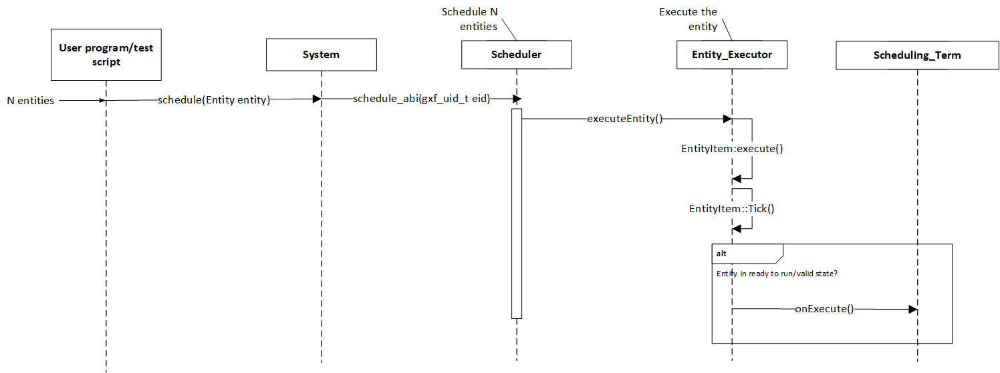
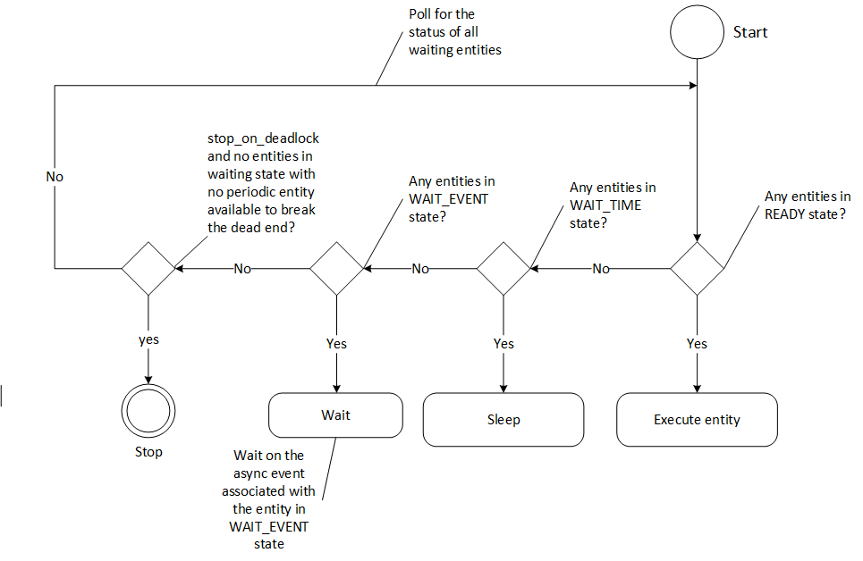
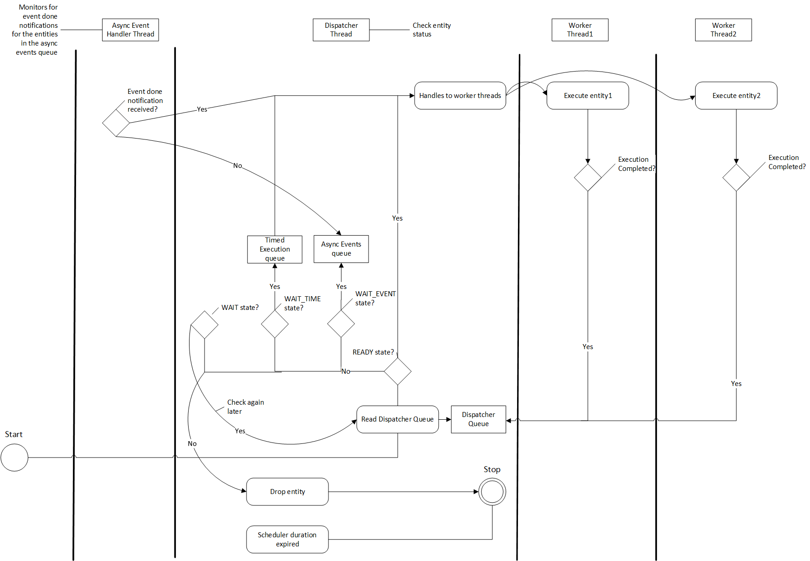

..
   Copyright (c) 2021-2022, NVIDIA CORPORATION. All rights reserved.
   NVIDIA CORPORATION and its licensors retain all intellectual property
   and proprietary rights in and to this software, related documentation
   and any modifications thereto. Any use, reproduction, disclosure or
   distribution of this software and related documentation without an express
   license agreement from NVIDIA CORPORATION is strictly prohibited.

.. _scheduler:

The GXF Scheduler
=================

The execution of entities in a graph is governed by the scheduler and
the scheduling terms associated with every entity. A scheduler is a
component responsible for orchestrating the execution of all the
entities defined in a graph. A scheduler typically keeps track of the
graph entities and their current execution states and passes them on to
a ``nvidia::gxf::EntityExecutor`` component when ready for execution. The
following diagram depicts the flow for an entity execution.

**Figure: Entity execution sequence**

As shown in the sequence diagram, the schedulers begin executing the
graph entities via the ``nvidia::gxf::System::runAsync\_abi()`` interface,
and continue this process until it meets the certain ending criteria. A
single entity can have multiple codelets. These codelets are executed in
the same order in which they were defined in the entity. A failure in
execution of any single codelet stops the execution of all the entities.
Entities are naturally unscheduled from execution when any one of their
scheduling term reaches the ``NEVER`` state.

Scheduling terms are components used to define the execution readiness
of an entity. An entity can have multiple scheduling terms associated
with it and each scheduling term represents the state of an entity using
SchedulingCondition.

The table below shows various states of ``nvidia::gxf::SchedulingConditionType`` described
using ``nvidia::gxf::SchedulingCondition``.

+-------------------------------+-------------------------------------------------------------------------+
| **SchedulingConditionType**   | **Description**                                                         |
+===============================+=========================================================================+
| NEVER                         | Entity will never execute again                                         |
+-------------------------------+-------------------------------------------------------------------------+
| READY                         | Entity is ready for execution                                           |
+-------------------------------+-------------------------------------------------------------------------+
| WAIT                          | Entity may execute in the future                                        |
+-------------------------------+-------------------------------------------------------------------------+
| WAIT\_TIME                    | Entity will be ready for execution after specified duration             |
+-------------------------------+-------------------------------------------------------------------------+
| WAIT\_EVENT                   | Entity is waiting on an asynchronous event with unknown time interval   |
+-------------------------------+-------------------------------------------------------------------------+

Schedulers define deadlock as a condition when there are no entities which
are in ``READY``, ``WAIT\_TIME`` or ``WAIT\_EVENT`` states, which guarantee execution
at a future point in time. This implies all the entities are
in the ``WAIT`` state, for which the scheduler does not know if they ever will
reach the ``READY`` state in the future. The scheduler can be configured to
stop when it reaches such a state using
the ``stop\_on\_deadlock`` parameter, else the entities are polled to check
if any of them have reached the ``READY`` state. The ``max\_duration`` configuration parameter
can be used to stop execution of all entities, regardless of their state,
after a specified amount of time has elapsed.

There are two types of schedulers currently supported by GXF

1. Greedy Scheduler

2. Multithread Scheduler

Greedy Scheduler
----------------

This is a basic single threaded scheduler which tests scheduling term
greedily. It is great for simple use cases and predictable execution, but
may incur a large overhead of scheduling term execution, making it
unsuitable for large applications. The scheduler requires a clock to
keep track of time. Based on the choice of clock the scheduler will
execute differently. If a Realtime clock is used, the scheduler will
execute in real-time. This means pausing execution – sleeping the
thread – until periodic scheduling terms are due again. If a ManualClock
is used, scheduling will happen “time-compressed.” This means the flow of
time is altered to execute codelets in immediate succession.

The ``GreedyScheduler`` maintains a running count of entities which are
in ``READY``, ``WAIT\_TIME`` and ``WAIT\_EVENT`` states. The following activity
diagram depicts the gist of the decision making for scheduling an entity
by the Greedy Scheduler:

**Figure: Greedy Scheduler Activity Diagram**

Greedy Scheduler Configuration
~~~~~~~~~~~~~~~~~~~~~~~~~~~~~~

The Greedy Scheduler takes in the following parameters from the configuration file: 

.. csv-table::
    :header: Parameter name, Description
    :widths: 30, 70

    clock, "The clock used by the scheduler to define the flow of time. Typical choices are RealtimeClock or ManualClock"
    max\_duration\_ms, "The maximum duration for which the scheduler will execute (in ms). If not specified, the scheduler will run until all work is done. If periodic terms are present this means the application will run indefinitely"
    stop\_on\_deadlock, "If stop\_on\_deadlock is disabled, the GreedyScheduler constantly polls for the status of all the waiting entities to check if any of them are ready for execution."

Example usage – The following code snippet configures a Greedy Scheduler with a ManualClock option specified.

.. code-block:: yaml

   name: scheduler
   components:
   - type: nvidia::gxf::GreedyScheduler
     parameters:
       max_duration_ms: 3000
       clock: misc/clock
       stop_on_deadlock: true
   ---
   name: misc
   components:
   - name: clock
     type: nvidia::gxf::ManualClock

.. _multithread_scheduler:

Multithread Scheduler
---------------------

The MultiThread Scheduler is more suitable for large applications with
complex execution patterns. The scheduler consists of a dispatcher
thread which checks the status of an entity, and dispatches it to a
thread pool of worker threads responsible for executing them. Worker
threads enqueue the entity back on to the dispatch queue upon completion
of execution. The number of worker threads can be configured
using the ``worker\_thread\_number`` parameter. The MultiThread Scheduler also
manages a dedicated queue and thread to handle asynchronous events. The
following activity diagram demonstrates the gist of the multithread
scheduler implementation.

**Figure: MultiThread Scheduler Activity Diagram**

As depicted in the diagram, when an entity reaches the ``WAIT\_EVENT`` state,
it's moved to a queue where they wait to receive event done
notification. The asynchronous event handler thread is responsible for
moving entities to the dispatcher upon receiving event done
notification. The dispatcher thread also maintains a running count of
the number of entities in ``READY``, ``WAIT\_EVENT`` and ``WAIT\_TIME`` states, and
uses these statistics to check if the scheduler has reached a
deadlock. The scheduler also needs a clock component to keep track of
time and it is configured using the ``clock`` parameter.

The MultiThread Scheduler is more resource efficient compared to the Greedy
Scheduler, and does not incur any additional overhead for constantly
polling the states of scheduling terms.
The ``check\_recession\_period\_ms`` parameter can be used to configure the
time interval the scheduler must wait to poll the state of entities
which are in the ``WAIT`` state.

Multithread Scheduler Configuration
~~~~~~~~~~~~~~~~~~~~~~~~~~~~~~~~~~~

The Multithread Scheduler takes in the following parameters from the configuration file:

.. csv-table::
    :header: Parameter name, Description
    :widths: 30, 70

    clock, "The clock used by the scheduler to define the flow of time. Typical choices are RealtimeClock or ManualClock."
    max\_duration\_ms, "The maximum duration for which the scheduler will execute (in ms). If not specified, the scheduler will run until all work is done. If periodic terms are present this means the application will run indefinitely."
    check\_recess\_period\_ms, "Duration to sleep before checking the condition of an entity again [ms]. This is the maximum duration for which the scheduler would wait when an entity is not yet ready to run."
    stop\_on\_deadlock, "If enabled the scheduler will stop when all entities are in a waiting state, but no periodic entity exists to break the dead end. Should be disabled when scheduling conditions can be changed by external actors, for example by clearing queues manually."
    worker\_thread\_number, "Number of threads."

Example usage – The following code snippet configures a Multithread Scheduler with the number of worked threads and max duration specified:

.. code-block:: yaml

   name: scheduler
   components:
   - type: nvidia::gxf::MultiThreadScheduler
     parameters:
       max_duration_ms: 5000
       clock: misc/clock
       worker_thread_number: 5
       check_recession_period_ms: 3
       stop_on_deadlock: false
   ---
   name: misc
   components:
   - name: clock
     type: nvidia::gxf::RealtimeClock

.. _epoch_scheduler:

Epoch Scheduler
---------------------

The Epoch Scheduler is used for running loads in externally managed threads. Each run is called an Epoch. The scheduler goes over all entities that are known to be active and executes them one by one. If the epoch budget is provided (in ms), it would keep running all codelets until the budget is consumed or no codelet is ready. It might run over budget since it guarantees to cover all codelets in an epoch. In case the budget is not provided, it would go over all the codelets once and execute them only once.

The Epoch Scheduler takes in the following parameters from the configuration file:

.. csv-table::
    :header: Parameter name, Description
    :widths: 30, 70

    clock, "The clock used by the scheduler to define the flow of time. Typical choice is a RealtimeClock."

Example usage – The following code snippet configures an Epoch Scheduler:

.. code-block:: yaml

   name: scheduler
   components:
   - name: clock
     type: nvidia::gxf::RealtimeClock
   - name: epoch
     type: nvidia::gxf::EpochScheduler
     parameters:
       clock: clock

Note that the Epoch Scheduler is intended to run from an external thread. The ``runEpoch(float budget_ms);`` can be used to set the budget_ms and run the scheduler from the external thread. If the specified budget is not positive, all the nodes are executed once.

SchedulingTerms
---------------

A ``SchedulingTerm`` defines a specific condition that is used by an entity
to let the scheduler know when it's ready for execution. There are
various scheduling terms currently supported by GXF.

.. _periodic_scheduling_term:

PeriodicSchedulingTerm
~~~~~~~~~~~~~~~~~~~~~~

An entity associated with ``nvidia::gxf::PeriodicSchedulingTerm`` is ready
for execution after periodic time intervals specified using
its ``recess\_period`` parameter. The ``PeriodicSchedulingTerm`` can either be
in ``READY`` or ``WAIT\_TIME`` state.

Example usage:

.. code-block:: yaml

   - name: scheduling_term
     type: nvidia::gxf::PeriodicSchedulingTerm
     parameters:
      recess_period: 50000000

CountSchedulingTerm
~~~~~~~~~~~~~~~~~~~

An entity associated with ``nvidia::gxf::CountSchedulingTerm`` is executed
for a specific number of times specified using its ``count`` parameter.
The ``CountSchedulingTerm`` can either be in ``READY`` or ``NEVER`` state. The
scheduling term reaches the ``NEVER`` state when the entity has been
executed ``count`` number of times.

Example usage:

.. code-block:: yaml

   - name: scheduling_term
     type: nvidia::gxf::CountSchedulingTerm
     parameters:
      count: 42

MessageAvailableSchedulingTerm
~~~~~~~~~~~~~~~~~~~~~~~~~~~~~~

An entity associated with ``nvidia::gxf::MessageAvailableSchedulingTerm`` is executed when the associated receiver queue has at least a certain number of elements.
The receiver is specified using the ``receiver`` parameter of the scheduling term. The minimum number of messages that permits the execution of the entity is specified by ``min_size``. An optional parameter for this scheduling term is ``front_stage_max_size``, the maximum front stage message count. If this parameter is set, the scheduling term will only allow execution if the number of messages in the queue does not exceed this count. It can be used for codelets which do not consume all messages from the queue.

In the example shown below, the minimum size of the queue is configured to be 4. This means the entity will not be executed until there are at least 4 messages in the queue.

.. code-block:: yaml

   - type: nvidia::gxf::MessageAvailableSchedulingTerm
     parameters:
       receiver: tensors
       min_size: 4

.. _multi_message_available_scheduling_term:

MultiMessageAvailableSchedulingTerm
~~~~~~~~~~~~~~~~~~~~~~~~~~~~~~~~~~~

An entity associated with ``nvidia::gxf::MultiMessageAvailableSchedulingTerm`` is executed when a list of provided input receivers combined have at least a given number of messages. The ``receivers`` parameter is used to specify a list of the input channels/receivers. The minimum number of messages needed to permit the entity execution is set by ``min_size`` parameter.

Consider the example shown below. The associated entity will be executed when the number of messages combined for all the three receivers is at least the min_size; i.e., 5.

.. code-block:: yaml

  - name: input_1
    type: nvidia::gxf::test::MockReceiver
    parameters:
      max_capacity: 10
  - name: input_2
    type: nvidia::gxf::test::MockReceiver
    parameters:
      max_capacity: 10
  - name: input_3
    type: nvidia::gxf::test::MockReceiver
    parameters:
      max_capacity: 10
  - type: nvidia::gxf::MultiMessageAvailableSchedulingTerm
    parameters:
      receivers: [input_1, input_2, input_3]
      min_size: 5

BooleanSchedulingTerm
~~~~~~~~~~~~~~~~~~~~~

An entity associated with ``nvidia::gxf::BooleanSchedulingTerm`` is executed when its internal state is set to tick. The parameter ``enable_tick`` is used to control the entity execution. The scheduling term also has two APIs ``enable_tick()`` and ``disable_tick()`` to toggle its internal state. The entity execution can be controlled by calling these APIs. If ``enable_tick`` is set to false, the entity is not executed (Scheduling condition is set to ``NEVER``). If ``enable_tick`` is set to true, the entity will be executed (Scheduling condition is set to ``READY``). Entities can toggle the state of the scheduling term by maintaining a handle to it.

Example usage:

.. code-block:: yaml

   - type: nvidia::gxf::BooleanSchedulingTerm
     parameters:
      enable_tick: true

.. _async_scheduling_term:

AsynchronousSchedulingTerm
~~~~~~~~~~~~~~~~~~~~~~~~~~

``AsynchronousSchedulingTerm`` is primarily associated with entities which
are working with asynchronous events happening outside of their regular
execution performed by the scheduler. Since these events are
non-periodic in nature, ``AsynchronousSchedulingTerm`` prevents the
scheduler from polling the entity for its status regularly and reduces
CPU utilization. ``AsynchronousSchedulingTerm`` can either be
in ``READY``, ``WAIT``, ``WAIT\_EVENT`` or ``NEVER`` states based on asynchronous event
it's waiting on.

The state of an asynchronous event is described
using ``nvidia::gxf::AsynchronousEventState`` and is updated using
the ``setEventState`` API.

+------------------------------+---------------------------------------------------------------------+
| **AsynchronousEventState**   | **Description**                                                     |
+==============================+=====================================================================+
| READY                        | Init state, first tick is pending                                   |
+------------------------------+---------------------------------------------------------------------+
| WAIT                         | Request to async service yet to be sent, nothing to do but wait     |
+------------------------------+---------------------------------------------------------------------+
| EVENT\_WAITING               | Request sent to an async service, pending event done notification   |
+------------------------------+---------------------------------------------------------------------+
| EVENT\_DONE                  | Event done notification received, entity ready to be ticked         |
+------------------------------+---------------------------------------------------------------------+
| EVENT\_NEVER                 | Entity does not want to be ticked again, end of execution           |
+------------------------------+---------------------------------------------------------------------+

Entities associated with this scheduling term most likely have an
asynchronous thread which can update the state of the scheduling term
outside of its regular execution cycle performed by the GXF scheduler.
When the scheduling term is in ``WAIT`` state, the scheduler regularly polls
for the state of the entity. When the scheduling term is
in ``EVENT\_WAITING`` state, schedulers will not check the status of the
entity again until they receive an event notification which can be
triggered using the ``GxfEntityEventNotify`` API. Setting the state of the
scheduling term to ``EVENT\_DONE`` automatically sends this notification to
the scheduler. Entities can use the ``EVENT\_NEVER`` state to indicate the
end of its execution cycle.

Example usage:

.. code-block:: yaml

   - name: async_scheduling_term
     type: nvidia::gxf::AsynchronousSchedulingTerm

DownsteamReceptiveSchedulingTerm
~~~~~~~~~~~~~~~~~~~~~~~~~~~~~~~~
This scheduling term specifies that an entity shall be executed if the receiver for a given transmitter can accept new messages.

Example usage:

.. code-block:: yaml

   - name: downstream_st
     type: nvidia::gxf::DownstreamReceptiveSchedulingTerm
     parameters:
      transmitter: output
      min_size: 1

.. _target_time_scheduling_term:

TargetTimeSchedulingTerm
~~~~~~~~~~~~~~~~~~~~~~~~
This scheduling term permits execution at a user-specified timestamp. The timestamp is specified on the clock provided.

Example usage:

.. code-block:: yaml

   - name: target_st
     type: nvidia::gxf::TargetTimeSchedulingTerm
     parameters:
      clock: clock/manual_clock

.. _expiring_message_available_scheduling_term:

ExpiringMessageAvailableSchedulingTerm
~~~~~~~~~~~~~~~~~~~~~~~~~~~~~~~~~~~~~~
This scheduling waits for a specified number of messages in the receiver. The entity is executed when the first message received in the queue is expiring or when there are enough messages in the queue. The ``receiver`` parameter is used to set the receiver to watch on. The parameters ``max_batch_size`` and ``max_delay_ns`` dictate the maximum number of messages to be batched together and the maximum delay from first message to wait before executing the entity respectively.

In the example shown below, the associated entity will be executed when the number of messages in the queue is greater than ``max_batch_size`` (i.e., 5), or when the delay from the first message to current time is greater than ``max_delay_ns`` (i.e., 10000000).

.. code-block:: yaml

   - name: target_st
     type: nvidia::gxf::ExpiringMessageAvailableSchedulingTerm
     parameters:
      receiver: signal
      max_batch_size: 5
      max_delay_ns: 10000000
      clock: misc/clock

AND Combined
~~~~~~~~~~~~

An entity can be associated with multiple scheduling terms which define
its execution behavior. Scheduling terms are ``AND`` combined to describe
the current state of an entity. For an entity to be executed by the
scheduler, all the scheduling terms must be in ``READY`` state and
conversely, the entity is unscheduled from execution whenever any one of
the scheduling term reaches ``NEVER`` state. The priority of various states
during ``AND`` combine follows the
order ``NEVER``, ``WAIT\_EVENT``, ``WAIT``, ``WAIT\_TIME``, and ``READY``.

Example usage:

.. code-block:: yaml

   components:
   - name: integers
     type: nvidia::gxf::DoubleBufferTransmitter
   - name: fibonacci
     type: nvidia::gxf::DoubleBufferTransmitter
   - type: nvidia::gxf::CountSchedulingTerm
     parameters:
       count: 100
   - type: nvidia::gxf::DownstreamReceptiveSchedulingTerm
     parameters:
       transmitter: integers
       min_size: 1

BTSchedulingTerm
~~~~~~~~~~~~~~~~~~~~~~~~~~~~~~~~~~~~~~
A BT (Behavior Tree) scheduling term is used to schedule a behavior tree entity itself and its child entities (if any) in a Behavior tree.

Example usage:

.. code-block:: yaml

   name: root
   components:
   - name: root_controller
     type: nvidia::gxf::EntityCountFailureRepeatController
     parameters:
       max_repeat_count: 0
   - name: root_st
     type: nvidia::gxf::BTSchedulingTerm
     parameters:
       is_root: true
   - name: root_codelet
     type: nvidia::gxf::SequenceBehavior
     parameters:
       children: [ child1/child1_st ]
       s_term: root_st
       controller: root_controller
