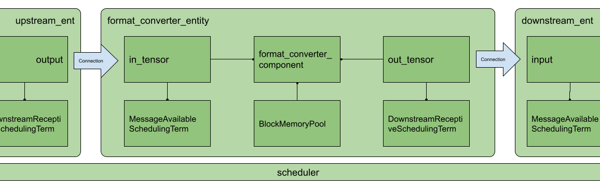
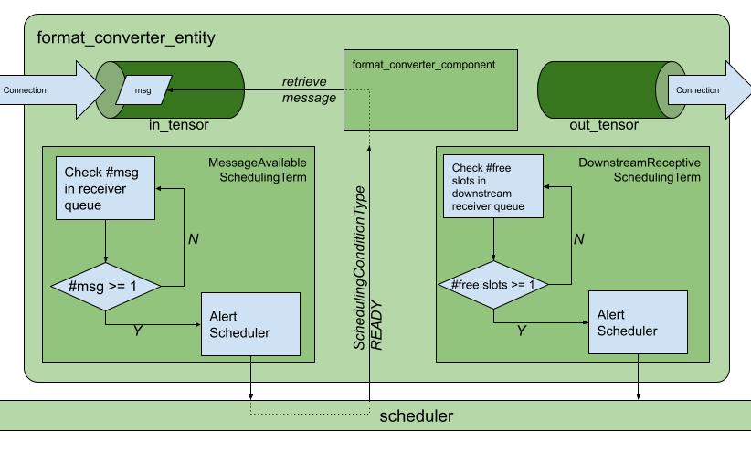
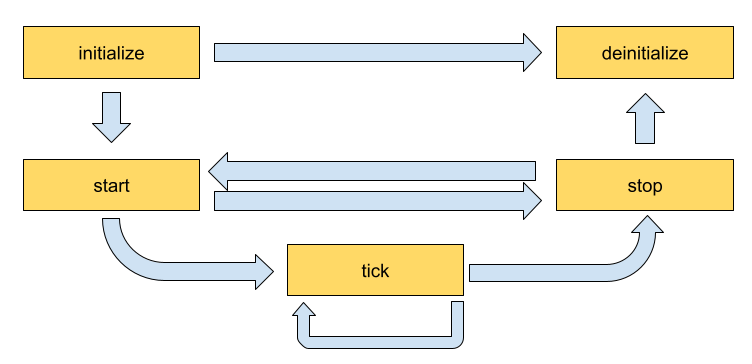

(gxf-by-example)=
# GXF by Example

:::{warning}
This section is legacy (0.2), as we recommend developing extensions and applications using the C++ or Python APIs. Refer to the developer guide for up-to-date recommendations.
:::

## Inner Workings of a GXF Entity

Let us look at an example of a GXF entity to try to understand its general anatomy. As an example let's start with the entity definition for an image format converter entity named `format_converter_entity` as shown below.

```{code-block} yaml
:caption: An example GXF Application YAML snippet
:linenos: true
%YAML 1.2
---
# other entities declared
---
name: format_converter_entity
components:
  - name: in_tensor
    type: nvidia::gxf::DoubleBufferReceiver
  - type: nvidia::gxf::MessageAvailableSchedulingTerm
    parameters:
      receiver: in_tensor
      min_size: 1
  - name: out_tensor
    type: nvidia::gxf::DoubleBufferTransmitter
  - type: nvidia::gxf::DownstreamReceptiveSchedulingTerm
    parameters:
      transmitter: out_tensor
      min_size: 1
  - name: pool
    type: nvidia::gxf::BlockMemoryPool
    parameters:
      storage_type: 1
      block_size: 4919040 # 854 * 480 * 3 (channel) * 4 (bytes per pixel)
      num_blocks: 2
  - name: format_converter_component
    type: nvidia::holoscan::formatconverter::FormatConverter
    parameters:
      in: in_tensor
      out: out_tensor
      out_tensor_name: source_video
      out_dtype: "float32"
      scale_min: 0.0
      scale_max: 255.0
      pool: pool
---
# other entities declared
---
components:
  - name: input_connection
    type: nvidia::gxf::Connection
    parameters:
      source: upstream_entity/output
      target: format_converter/in_tensor
---
components:
  - name: output_connection
    type: nvidia::gxf::Connection
    parameters:
      source: format_converter/out_tensor
      target: downstream_entity/input
---
name: scheduler
components:
  - type: nvidia::gxf::GreedyScheduler
```

Above:
1. The entity `format_converter_entity` receives a message in its `in_tensor` message from an upstream entity `upstream_entity` as declared in the `input_connection`.
2. The received message is passed to the `format_converter_component` component to convert the tensor element precision from `uint8` to `float32` and scale any input in the `[0, 255]` intensity range.
3. The `format_converter_component` component finally places the result in the `out_tensor` message so that its result is made available to a downstream entity (`downstream_ent` as declared in `output_connection`).
4. The `Connection` components tie the inputs and outputs of various components together, in the above case `upstream_entity/output -> format_converter_entity/in_tensor` and `format_converter_entity/out_tensor -> downstream_entity/input`.
5. The `scheduler` entity declares a `GreedyScheduler` "system component" which orchestrates the execution of the entities declared in the graph. In the specific case of `GreedyScheduler` entities are scheduled to run exclusively, where no more than one entity can run at any given time.

The YAML snippet above can be visually represented as follows.

:::{figure-md} fig-entity-diagram
:align: center



Arrangement of components and entities in a Holoscan application

:::

In the image, as in the YAML, you will notice the use of `MessageAvailableSchedulingTerm`, `DownstreamReceptiveSchedulingTerm`, and `BlockMemoryPool`. These are components that play a "supporting" role to `in_tensor`, `out_tensor`, and `format_converter_component` components respectively. Specifically:
- `MessageAvailableSchedulingTerm` is a component that takes a `Receiver` (in this case `DoubleBufferReceiver` named `in_tensor`) and alerts the graph `Executor` that a message is available. This alert triggers `format_converter_component`.
- `DownstreamReceptiveSchedulingTerm` is a component that takes a `Transmitter` (in this case `DoubleBufferTransmitter` named `out_tensor`) and alerts the graph `Executor` that a message has been placed on the output.
- `BlockMemoryPool` provides two blocks of almost `5MB` allocated on the GPU device and is used by `format_converted_ent` to allocate the output tensor where the converted data will be placed within the format converted component.

Together these components allow the entity to perform a specific function and coordinate communication with other entities in the graph, via the declared scheduler.

More generally, an entity can be thought of as a collection of components where components can be passed to one another to perform specific subtasks (e.g., event triggering or message notification, format conversion, memory allocation), and an application as a graph of entities.

The scheduler is a component of type `nvidia::gxf::System` which orchestrates the execution components in each entity at application runtime based on triggering rules.

## Data Flow and Triggering Rules

Entities communicate with one another via messages which may contain one or more payloads. Messages are passed and received via a component of type `nvidia::gxf::Queue` from which both `nvidia::gxf::Receiver` and `nvidia::gxf::Transmitter` are derived. Every entity that receives and transmits messages has at least one receiver and one transmitter queue.

Holoscan uses the `nvidia::gxf::SchedulingTerm` component to coordinate data access and component orchestration for a `Scheduler` which invokes execution through the `tick()` function in each `Codelet`.

:::{tip}

A `SchedulingTerm` defines a specific condition that is used by an entity to let the scheduler know when it's ready for execution.

:::

In the above example, we used a `MessageAvailableSchedulingTerm` to trigger the execution of the components waiting for data from `in_tensor` receiver queue, namely `format_converter_component`.

```{code-block} yaml
:caption: MessageAvailableSchedulingTerm
:linenos: true
  - type: nvidia::gxf::MessageAvailableSchedulingTerm
    parameters:
      receiver: in_tensor
      min_size: 1
```

Similarly, `DownStreamReceptiveSchedulingTerm` checks whether the `out_tensor` transmitter queue has at least one outgoing message in it. If there are one or more outgoing messages,  `DownStreamReceptiveSchedulingTerm` will notify the scheduler, which in turn attempts to place the message in the receiver queue of a downstream entity. If, however, the downstream entity has a full receiver queue, the message is held in the `out_tensor` queue as a means to handle back-pressure.

```{code-block} yaml
:caption: DownstreamReceptiveSchedulingTerm
:linenos: true
  - type: nvidia::gxf::DownstreamReceptiveSchedulingTerm
    parameters:
      transmitter: out_tensor
      min_size: 1
```

If we were to draw the entity in [{numref}`fig-entity-diagram`](fig-entity-diagram) in greater detail it would look something like the following.

:::{figure-md} fig-entity-diagram-detail-1
:align: center



Receive and transmit `Queues` and `SchedulingTerm`s in entities.
:::

Up to this point, we have covered the "entity component system" at a high level and showed the functional parts of an entity; namely, the messaging queues and the scheduling terms that support the execution of components in the entity.  To complete the picture, the next section covers the anatomy and lifecycle of a component, and how to handle events within it.


(creating-gxf-extension)=

## Creating a GXF Extension

GXF components in Holoscan can perform a multitude of sub-tasks ranging from data transformations, to memory management, to entity scheduling. In this section, we will explore an `nvidia::gxf::Codelet` component which in Holoscan is known as a "GXF extension." {ref}`Holoscan (GXF) extensions <sdk-extensions>` are typically concerned with application-specific sub-tasks such as data transformations, AI model inference, and the like.

### Extension Lifecycle

The lifecycle of a `Codelet` is composed of the following five stages.
1. `initialize` - called only once when the codelet is created for the first time, and use of lightweight initialization.
2. `deinitialize` - called only once before the codelet is destroyed, and used for lightweight deinitialization.
3. `start` - called multiple times over the lifecycle of the codelet according to the order defined in the lifecycle, and used for heavy initialization tasks such as allocating memory resources.
4. `stop` - called multiple times over the lifecycle of the codelet according to the order defined in the lifecycle, and used for heavy deinitialization tasks such as deallocation of all resources previously assigned in `start`.
5. `tick` - called when the codelet is triggered, and is called multiple times over the codelet lifecycle; even multiple times between `start` and `stop`.

The flow between these stages is detailed in [{numref}`fig-codelet-lifecycle`](fig-codelet-lifecycle).

:::{figure-md} fig-codelet-lifecycle
:align: center



Sequence of method calls in the lifecycle of a Holoscan extension

:::

### Implementing an Extension

In this section, we will implement a simple recorder that will highlight the actions we would perform in the lifecycle methods. The recorder receives data in the input queue and records the data to a configured location on the disk. The output format of the recorder files is the GXF-formatted index/binary replayer files (the format is also used for the data in the sample applications), where the `gxf_index` file contains timing and sequence metadata that refer to the binary/tensor data held in the `gxf_entities` file.

#### Declare the Class That Will Implement the Extension Functionality

The developer can create their Holoscan extension by extending the `Codelet` class, implementing the extension functionality by overriding the lifecycle methods, and defining the parameters the extension exposes at the application level via the `registerInterface` method. To define our recorder component, we would need to implement some of the methods in the `Codelet`.

First, clone the Holoscan project from [here](https://github.com/nvidia-holoscan/holoscan-sdk) and create a folder to develop our extension such as under `gxf_extensions/my_recorder`.

:::{tip}
Using Bash we create a Holoscan extension folder as follows.
```bash
git clone https://github.com/nvidia-holoscan/holoscan-sdk.git
cd clara-holoscan-embedded-sdk
mkdir -p gxf_extensions/my_recorder
```
:::

In our extension folder, we create a header file `my_recorder.hpp` with a declaration of our Holoscan component.

```{code-block} cpp
:caption: gxf_extensions/my_recorder/my_recorder.hpp
:linenos: true
:name: my-recorder-hpp
#include <string>

#include "gxf/core/handle.hpp"
#include "gxf/std/codelet.hpp"
#include "gxf/std/receiver.hpp"
#include "gxf/std/transmitter.hpp"
#include "gxf/serialization/file_stream.hpp"
#include "gxf/serialization/entity_serializer.hpp"


class MyRecorder : public nvidia::gxf::Codelet {
 public:
  gxf_result_t registerInterface(nvidia::gxf::Registrar* registrar) override;
  gxf_result_t initialize() override;
  gxf_result_t deinitialize() override;

  gxf_result_t start() override;
  gxf_result_t tick() override;
  gxf_result_t stop() override;

 private:
  nvidia::gxf::Parameter<nvidia::gxf::Handle<nvidia::gxf::Receiver>> receiver_;
  nvidia::gxf::Parameter<nvidia::gxf::Handle<nvidia::gxf::EntitySerializer>> my_serializer_;
  nvidia::gxf::Parameter<std::string> directory_;
  nvidia::gxf::Parameter<std::string> basename_;
  nvidia::gxf::Parameter<bool> flush_on_tick_;

  // File stream for data index
  nvidia::gxf::FileStream index_file_stream_;
  // File stream for binary data
  nvidia::gxf::FileStream binary_file_stream_;
  // Offset into binary file
  size_t binary_file_offset_;
};
```

(declare-the-parameters-to-expose-at-the-application-level)=
#### Declare the Parameters to Expose at the Application Level

Next, we can start implementing our lifecycle methods in the `my_recorder.cpp` file, which we also create in `gxf_extensions/my_recorder` path.

Our recorder will need to expose the `nvidia::gxf::Parameter` variables to the application so the parameters can be modified by configuration.

```{code-block} cpp
:caption: registerInterface in gxf_extensions/my_recorder/my_recorder.cpp
:linenos: true
:name: my-recorder-cpp
#include "my_recorder.hpp"

gxf_result_t MyRecorder::registerInterface(nvidia::gxf::Registrar* registrar) {
  nvidia::gxf::Expected<void> result;
  result &= registrar->parameter(
      receiver_, "receiver", "Entity receiver",
      "Receiver channel to log");
  result &= registrar->parameter(
      my_serializer_, "serializer", "Entity serializer",
      "Serializer for serializing input data");
  result &= registrar->parameter(
      directory_, "out_directory", "Output directory path",
      "Directory path to store received output");
  result &= registrar->parameter(
      basename_, "basename", "File base name",
      "User specified file name without extension",
      nvidia::gxf::Registrar::NoDefaultParameter(), GXF_PARAMETER_FLAGS_OPTIONAL);
  result &= registrar->parameter(
      flush_on_tick_, "flush_on_tick", "Boolean to flush on tick",
      "Flushes output buffer on every `tick` when true", false);  // default value `false`
  return nvidia::gxf::ToResultCode(result);
}
```

For pure GXF applications, our component's parameters can be specified in the following format in the YAML file:

```{code-block} yaml
:caption: Example parameters for MyRecorder component
:linenos: true
name: my_recorder_entity
components:
  - name: my_recorder_component
    type: MyRecorder
    parameters:
      receiver: receiver
      serializer: my_serializer
      out_directory: /home/user/out_path
      basename: my_output_file  # optional
      # flush_on_tick: false    # optional
```
Note that all the parameters exposed at the application level are mandatory except for `flush_on_tick`, which defaults to `false`, and `basename`, whose default is handled at `initialize()` below.

#### Implement the Lifecycle Methods

This extension does not need to perform any heavy-weight initialization tasks, so we will concentrate on `initialize()`, `tick()`, and `deinitialize()` methods, which define the core functionality of our component. At initialization, we will create a file stream and keep track of the bytes we write on `tick()` via `binary_file_offset`.

```{code-block} cpp
:caption: initialize in gxf_extensions/my_recorder/my_recorder.cpp
:linenos: true
:lineno-start: 24
gxf_result_t MyRecorder::initialize() {
  // Create path by appending receiver name to directory path if basename is not provided
  std::string path = directory_.get() + '/';
  if (const auto& basename = basename_.try_get()) {
    path += basename.value();
  } else {
    path += receiver_->name();
  }

  // Initialize index file stream as write-only
  index_file_stream_ = nvidia::gxf::FileStream("", path + nvidia::gxf::FileStream::kIndexFileExtension);

  // Initialize binary file stream as write-only
  binary_file_stream_ = nvidia::gxf::FileStream("", path + nvidia::gxf::FileStream::kBinaryFileExtension);

  // Open index file stream
  nvidia::gxf::Expected<void> result = index_file_stream_.open();
  if (!result) {
    return nvidia::gxf::ToResultCode(result);
  }

  // Open binary file stream
  result = binary_file_stream_.open();
  if (!result) {
    return nvidia::gxf::ToResultCode(result);
  }
  binary_file_offset_ = 0;

  return GXF_SUCCESS;
}
```

When de-initializing, our component will take care of closing the file streams that were created at initialization.

```{code-block} cpp
:caption: deinitialize in gxf_extensions/my_recorder/my_recorder.cpp
:linenos: true
:lineno-start: 55
gxf_result_t MyRecorder::deinitialize() {
  // Close binary file stream
  nvidia::gxf::Expected<void> result = binary_file_stream_.close();
  if (!result) {
    return nvidia::gxf::ToResultCode(result);
  }

  // Close index file stream
  result = index_file_stream_.close();
  if (!result) {
    return nvidia::gxf::ToResultCode(result);
  }

  return GXF_SUCCESS;
}
```

In our recorder, no heavyweight initialization tasks are required, so we implement the following; however,  we would use `start()` and `stop()` methods for heavyweight tasks such as memory allocation and deallocation.

```{code-block} cpp
:caption: start/stop in gxf_extensions/my_recorder/my_recorder.cpp
:linenos: true
:lineno-start: 71
gxf_result_t MyRecorder::start() {
  return GXF_SUCCESS;
}

gxf_result_t MyRecorder::stop() {
  return GXF_SUCCESS;
}
```

:::{tip}

For a detailed implementation of `start()` and `stop()`, and how memory management can be handled therein, please refer to the implementation of the [AJA Video source extension](https://github.com/nvidia-holoscan/holoscan-sdk/tree/main/gxf_extensions/aja).

:::

Finally, we write the component-specific functionality of our extension by implementing `tick()`.

```{code-block} cpp
:caption: tick in gxf_extensions/my_recorder/my_recorder.cpp
:linenos: true
:lineno-start: 79
gxf_result_t MyRecorder::tick() {
  // Receive entity
  nvidia::gxf::Expected<nvidia::gxf::Entity> entity = receiver_->receive();
  if (!entity) {
    return nvidia::gxf::ToResultCode(entity);
  }

  // Write entity to binary file
  nvidia::gxf::Expected<size_t> size = my_serializer_->serializeEntity(entity.value(), &binary_file_stream_);
  if (!size) {
    return nvidia::gxf::ToResultCode(size);
  }

  // Create entity index
  nvidia::gxf::EntityIndex index;
  index.log_time = std::chrono::system_clock::now().time_since_epoch().count();
  index.data_size = size.value();
  index.data_offset = binary_file_offset_;

  // Write entity index to index file
  nvidia::gxf::Expected<size_t> result = index_file_stream_.writeTrivialType(&index);
  if (!result) {
    return nvidia::gxf::ToResultCode(result);
  }
  binary_file_offset_ += size.value();

  if (flush_on_tick_) {
    // Flush binary file output stream
    nvidia::gxf::Expected<void> result = binary_file_stream_.flush();
    if (!result) {
      return nvidia::gxf::ToResultCode(result);
    }

    // Flush index file output stream
    result = index_file_stream_.flush();
    if (!result) {
      return nvidia::gxf::ToResultCode(result);
    }
  }

  return GXF_SUCCESS;
}
```

(register-the-extension-as-a-holoscan-component)=
#### Register the Extension as a Holoscan Component

As a final step, we must register our extension so it is recognized as a component and loaded by the application executor. For this we create a simple declaration in `my_recorder_ext.cpp` as follows.

```{code-block} cpp
:caption: gxf_extensions/my_recorder/my_recorder_ext.cpp
:linenos: true
#include "gxf/std/extension_factory_helper.hpp"

#include "my_recorder.hpp"

GXF_EXT_FACTORY_BEGIN()
GXF_EXT_FACTORY_SET_INFO(0xb891cef3ce754825, 0x9dd3dcac9bbd8483, "MyRecorderExtension",
                         "My example recorder extension", "NVIDIA", "0.1.0", "LICENSE");
GXF_EXT_FACTORY_ADD(0x2464fabf91b34ccf, 0xb554977fa22096bd, MyRecorder,
                    nvidia::gxf::Codelet, "My example recorder codelet.");
GXF_EXT_FACTORY_END()
```

`GXF_EXT_FACTORY_SET_INFO` configures the extension with the following information in order:
- UUID which can be generated using `scripts/generate_extension_uuids.py` which defines the __extension id__
- extension name
- extension description
- author
- extension version
- license text

`GXF_EXT_FACTORY_ADD` registers the newly built extension as a valid `Codelet` component with the following information in order:
- UUID which can be generated using `scripts/generate_extension_uuids.py` which defines the __component id__ (this must be different from the extension id),
- fully qualified extension class,
- fully qualifies base class,
- component description

To build a shared library for our new extension which can be loaded by a Holoscan application at runtime we use a CMake file under `gxf_extensions/my_recorder/CMakeLists.txt` with the following content.

```{code-block} cmake
:caption: gxf_extensions/my_recorder/CMakeLists.txt
:linenos: true
# Create library
add_library(my_recorder_lib SHARED
  my_recorder.cpp
  my_recorder.hpp
)
target_link_libraries(my_recorder_lib
  PUBLIC
    GXF::std
    GXF::serialization
    yaml-cpp
)

# Create extension
add_library(my_recorder SHARED
  my_recorder_ext.cpp
)
target_link_libraries(my_recorder
  PUBLIC my_recorder_lib
)

# Install GXF extension as a component 'holoscan-gxf_extensions'
install_gxf_extension(my_recorder) # this will also install my_recorder_lib
# install_gxf_extension(my_recorder_lib) # this statement is not necessary because this library follows `<extension library name>_lib` convention.
```
Here, we create a library `my_recorder_lib` with the implementation of the lifecycle methods, and the extension `my_recorder` which exposes the C API necessary for the application runtime to interact with our component.

To make our extension discoverable from the project root we add the line:

```cmake
add_subdirectory(my_recorder)
```
to the CMake file `gxf_extensions/CMakeLists.txt`.

:::{tip}

To build our extension, we can follow the steps in the [README](https://github.com/nvidia-holoscan/holoscan-sdk#using-a-development-container).

:::

At this point, we have a complete extension that records data coming into its receiver queue to the specified location on the disk using the GXF-formatted binary/index files.


(creating-gxf-application)=
## Creating a GXF Application

For our application, we create the directory `apps/my_recorder_app_gxf` with the application definition file `my_recorder_gxf.yaml`. The `my_recorder_gxf.yaml` application is as follows:

```{code-block} yaml
:caption: apps/my_recorder_app_gxf/my_recorder_gxf.yaml
:linenos: true
:name: my-recorder-gxf-yaml
%YAML 1.2
---
name: replayer
components:
  - name: output
    type: nvidia::gxf::DoubleBufferTransmitter
  - name: allocator
    type: nvidia::gxf::UnboundedAllocator
  - name: component_serializer
    type: nvidia::gxf::StdComponentSerializer
    parameters:
      allocator: allocator
  - name: entity_serializer
    type: nvidia::holoscan::stream_playback::VideoStreamSerializer   # inheriting from nvidia::gxf::EntitySerializer
    parameters:
      component_serializers: [component_serializer]
  - type: nvidia::holoscan::stream_playback::VideoStreamReplayer
    parameters:
      transmitter: output
      entity_serializer: entity_serializer
      boolean_scheduling_term: boolean_scheduling
      directory: "/workspace/data/racerx"
      basename: "racerx"
      frame_rate: 0       # as specified in timestamps
      repeat: false       # default: false
      realtime: true      # default: true
      count: 0            # default: 0 (no frame count restriction)
  - name: boolean_scheduling
    type: nvidia::gxf::BooleanSchedulingTerm
  - type: nvidia::gxf::DownstreamReceptiveSchedulingTerm
    parameters:
      transmitter: output
      min_size: 1
---
name: recorder
components:
 - name: input
   type: nvidia::gxf::DoubleBufferReceiver
 - name: allocator
   type: nvidia::gxf::UnboundedAllocator
 - name: component_serializer
   type: nvidia::gxf::StdComponentSerializer
   parameters:
     allocator: allocator
 - name: entity_serializer
   type: nvidia::holoscan::stream_playback::VideoStreamSerializer   # inheriting from nvidia::gxf::EntitySerializer
   parameters:
     component_serializers: [component_serializer]
 - type: MyRecorder
   parameters:
     receiver: input
     serializer: entity_serializer
     out_directory: "/tmp"
     basename: "tensor_out"
 - type: nvidia::gxf::MessageAvailableSchedulingTerm
   parameters:
     receiver: input
     min_size: 1
---
components:
  - name: input_connection
    type: nvidia::gxf::Connection
    parameters:
      source: replayer/output
      target: recorder/input
---
name: scheduler
components:
  - name: clock
    type: nvidia::gxf::RealtimeClock
  - name: greedy_scheduler
    type: nvidia::gxf::GreedyScheduler
    parameters:
      clock: clock
```

Above:
- The replayer reads data from `/workspace/data/racerx/racerx.gxf_[index|entities]` files, deserializes the binary data to a `nvidia::gxf::Tensor` using `VideoStreamSerializer`, and puts the data on an output message in the `replayer/output` transmitter queue.
- The `input_connection` component connects the `replayer/output` transmitter queue to the `recorder/input` receiver queue.
- The recorder reads the data in the `input` receiver queue, uses `StdEntitySerializer` to convert the received `nvidia::gxf::Tensor` to a binary stream, and outputs to the `/tmp/tensor_out.gxf_[index|entities]` location specified in the parameters.
- The `scheduler` component, while not explicitly connected to the application-specific entities, performs the orchestration of the components discussed in the [Data Flow and Triggering Rules](#data-flow-and-triggering-rules).

Note the use of the `component_serializer` in our newly built recorder. This component is declared separately in the following entity:

```YAML
- name: entity_serializer
  type: nvidia::holoscan::stream_playback::VideoStreamSerializer   # inheriting from nvidia::gxf::EntitySerializer
  parameters:
    component_serializers: [component_serializer]
```
This is then passed into `MyRecorder` via the `serializer` parameter, which we exposed in the {ref}`extension development section (Declare the Parameters to Expose at the Application Level) <declare-the-parameters-to-expose-at-the-application-level>`.

```YAML
- type: MyRecorder
  parameters:
    receiver: input
    serializer: entity_serializer
    directory: "/tmp"
    basename: "tensor_out"
```

For our app to be able to load (and also compile where necessary) the extensions required at runtime, we need to declare a CMake file `apps/my_recorder_app_gxf/CMakeLists.txt` as follows.

```{code-block} cmake
:caption: apps/my_recorder_app_gxf/CMakeLists.txt
:linenos: true
create_gxe_application(
  NAME my_recorder_gxf
  YAML my_recorder_gxf.yaml
  EXTENSIONS
    GXF::std
    GXF::cuda
    GXF::multimedia
    GXF::serialization
    my_recorder
    stream_playback
)

# Download the associated dataset if needed
if(HOLOSCAN_DOWNLOAD_DATASETS)
  add_dependencies(my_recorder_gxf racerx_data)
endif()
```

In the declaration of `create_gxe_application` we list:
- `my_recorder` component declared in the CMake file of the {ref}`extension development section <register-the-extension-as-a-holoscan-component>` under the `EXTENSIONS` argument
- the existing `stream_playback` Holoscan extension which reads data from disk

To make our newly built application discoverable by the build, in the root of the repository, we add the following line to `apps/CMakeLists.txt`:

```cmake
add_subdirectory(my_recorder_app_gxf)
```

We now have a minimal working application to test the integration of our newly built `MyRecorder` extension.

## Running the GXF Recorder Application

To run our application in a local development container:

1. Follow the instructions under the [Using a Development Container](https://github.com/nvidia-holoscan/holoscan-sdk#using-a-development-container) section steps 1-5 (try clearing the CMake cache by removing the `build` folder before compiling).

   You can execute the following commands to build: 

   ```bash
   ./run build
   # ./run clear_cache # if you want to clear build/install/cache folders
   ```
2. Our test application can now be run in the development container using the command:
   
    ```bash
    ./apps/my_recorder_app_gxf/my_recorder_gxf
    ```
    from inside the development container.

    (You can execute `./run launch` to run the development container.)

    ```bash
    @LINUX:/workspace/holoscan-sdk/build$ ./apps/my_recorder_app_gxf/my_recorder_gxf
    2022-08-24 04:46:47.333 INFO  gxf/gxe/gxe.cpp@230: Creating context
    2022-08-24 04:46:47.339 INFO  gxf/gxe/gxe.cpp@107: Loading app: 'apps/my_recorder_app_gxf/my_recorder_gxf.yaml'
    2022-08-24 04:46:47.339 INFO  gxf/std/yaml_file_loader.cpp@117: Loading GXF entities from YAML file 'apps/my_recorder_app_gxf/my_recorder_gxf.yaml'...
    2022-08-24 04:46:47.340 INFO  gxf/gxe/gxe.cpp@291: Initializing...
    2022-08-24 04:46:47.437 INFO  gxf/gxe/gxe.cpp@298: Running...
    2022-08-24 04:46:47.437 INFO  gxf/std/greedy_scheduler.cpp@170: Scheduling 2 entities
    2022-08-24 04:47:14.829 INFO  /workspace/holoscan-sdk/gxf_extensions/stream_playback/video_stream_replayer.cpp@144: Reach end of file or playback count reaches to the limit. Stop ticking.
    2022-08-24 04:47:14.829 INFO  gxf/std/greedy_scheduler.cpp@329: Scheduler stopped: Some entities are waiting for execution, but there are no periodic or async entities to get out of the deadlock.
    2022-08-24 04:47:14.829 INFO  gxf/std/greedy_scheduler.cpp@353: Scheduler finished.
    2022-08-24 04:47:14.829 INFO  gxf/gxe/gxe.cpp@320: Deinitializing...
    2022-08-24 04:47:14.863 INFO  gxf/gxe/gxe.cpp@327: Destroying context
    2022-08-24 04:47:14.863 INFO  gxf/gxe/gxe.cpp@333: Context destroyed.
    ```

A successful run (it takes about 30 secs) will result in output files (`tensor_out.gxf_index` and `tensor_out.gxf_entities` in `/tmp`) that match the original input files (`racerx.gxf_index` and `racerx.gxf_entities` under `data/racerx`) exactly.

```bash
@LINUX:/workspace/holoscan-sdk/build$ ls -al /tmp/
total 821384
drwxrwxrwt 1 root root      4096 Aug 24 04:37 .
drwxr-xr-x 1 root root      4096 Aug 24 04:36 ..
drwxrwxrwt 2 root root      4096 Aug 11 21:42 .X11-unix
-rw-r--r-- 1 1000 1000    729309 Aug 24 04:47 gxf_log
-rw-r--r-- 1 1000 1000 840054484 Aug 24 04:47 tensor_out.gxf_entities
-rw-r--r-- 1 1000 1000     16392 Aug 24 04:47 tensor_out.gxf_index

@LINUX:/workspace/holoscan-sdk/build$ ls -al ../data/racerx
total 839116
drwxr-xr-x 2 1000 1000      4096 Aug 24 02:08 .
drwxr-xr-x 4 1000 1000      4096 Aug 24 02:07 ..
-rw-r--r-- 1 1000 1000  19164125 Jun 17 16:31 racerx-medium.mp4
-rw-r--r-- 1 1000 1000 840054484 Jun 17 16:31 racerx.gxf_entities
-rw-r--r-- 1 1000 1000     16392 Jun 17 16:31 racerx.gxf_index
```
