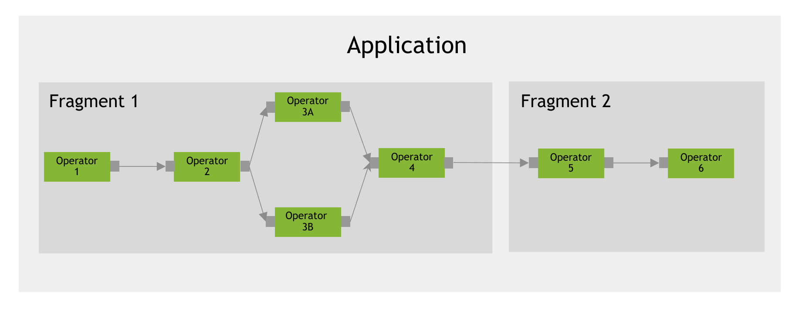
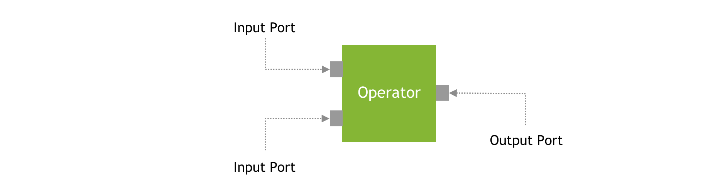

(holoscan-core-concepts)=
# Holoscan Core Concepts

:::{note}
In its early days, the Holoscan SDK was tightly linked to the [GXF core concepts](gxf/gxf_core_concepts.md). While the Holoscan SDK still relies on GXF as a backend to execute applications, it now offers its own interface, including a C++ API (0.3), a Python API (0.4), and the ability to write native operators (0.4) without requiring to wrap a GXF extension. Read the [Holoscan and GXF](gxf/holoscan_and_gxf.md) section for additional details.
:::

An `Application` is composed of `Fragments`, each of which runs a graph of `Operators`. The implementation of that graph is sometimes referred to as a pipeline, or workflow, which can be visualized below:

:::{figure-md} fig-core-concepts-application
:align: center

Core concepts: Application

:::

:::{figure-md} fig-core-concepts-port
:align: center

Core concepts: Port

:::

The core concepts of the Holoscan API are:

- **{ref}`Application <exhale_class_classholoscan_1_1Application>`**: An application acquires and processes streaming data. An application is a collection of fragments where each fragment can be allocated to execute on a physical node of a Holoscan cluster.
- **{ref}`Fragment <exhale_class_classholoscan_1_1Fragment>`**: A fragment is a building block of the Application. It is a directed graph of operators. A fragment can be assigned to a physical node of a Holoscan cluster during execution. The run-time execution manages communication across fragments. In a Fragment, Operators (Graph Nodes) are connected to each other by flows (Graph Edges).
- **{ref}`Operator <exhale_class_classholoscan_1_1Operator>`**: An operator is the most basic unit of work in this framework. An Operator receives streaming data at an input port, processes it, and publishes it to one of its output ports. A {ref}`Codelet <holoscan-core-concepts-gxf>` in GXF would be replaced by an `Operator` in the Holoscan SDK. An `Operator` encapsulates `Receiver`s and `Transmitter`s of a GXF {ref}`Entity <holoscan-core-concepts-gxf>` as Input/Output `Port`s of the `Operator`.
- **{ref}`(Operator) Resource <exhale_class_classholoscan_1_1Resource>`**: Resources such as system memory or a GPU memory pool that an Operator needs to perform its job. Resources are allocated during the initialization phase of the application. This matches the semantics of GXF's Memory `Allocator` or any other components derived from the `Component` class in GXF.
(holoscan-concepts-condition)=
- **{ref}`Condition <exhale_class_classholoscan_1_1Condition>`**: A condition is a predicate that can be evaluated at runtime to determine if an operator should execute. This matches the semantics of GXF's {ref}`Scheduling Term <gxf/doc/scheduler/scheduler:schedulingterms>`.
- **{ref}`Port <exhale_class_classholoscan_1_1IOSpec>`**: An interaction point between two operators. Operators ingest data at Input ports and publish data at Output ports. `Receiver`, `Transmitter`, and `MessageRouter` in GXF would be replaced with the concept of Input/Output `Port` of the `Operator` and the `Flow` (Edge) of the Application Workflow (DAG) in the Framework.
- **{ref}`Message <exhale_class_classholoscan_1_1Message>`**: A generic data object used by operators to communicate information.
- **{ref}`Executor <exhale_class_classholoscan_1_1Executor>`**: An Executor that manages the execution of a Fragment on a physical node. The framework provides a default Executor that uses a GXF [Scheduler](gxf/doc/scheduler/scheduler) to execute an Application.
