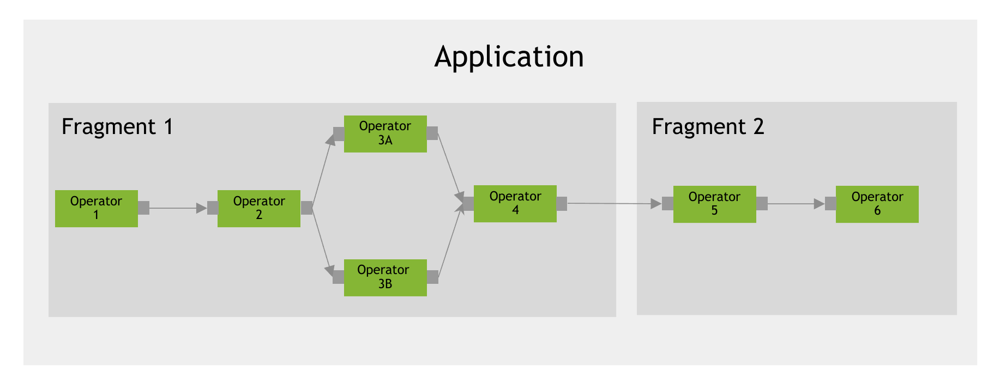
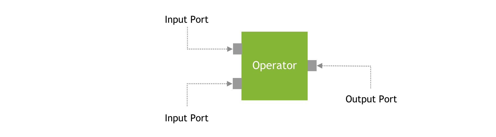

<Anchor id="holoscan-core-concepts" />

An `Application` is composed of `Fragments`, each of which runs a graph of `Operators`. The implementation of that graph is sometimes referred to as a pipeline, or workflow, which can be visualized below:

<figure style="text-align: center; margin: 1em auto;">

<figcaption style="margin-top: 0.5em;">Core concepts: Application</figcaption>
</figure>

<figure style="text-align: center; margin: 1em auto;">

<figcaption style="margin-top: 0.5em;">Core concepts: Port</figcaption>
</figure>

The core concepts of the Holoscan API are:

- **[Application](/holoscan/sdk-user-guide/api-reference/holoscan/classes/application)**: An
  application acquires and processes streaming data. An application is a
  collection of fragments where each fragment can be allocated to execute on an
  exclusive or shared physical node of a Holoscan cluster.
- **[Fragment](/holoscan/sdk-user-guide/api-reference/holoscan/classes/fragment)**: A fragment is a building block of the application. It is a directed graph of operators. A fragment can be assigned to a physical node of a Holoscan cluster during execution. The runtime execution manages communication across fragments. In a fragment, Operators (Graph Nodes) are connected to each other by flows (Graph Edges).
- **[Operator](/holoscan/sdk-user-guide/api-reference/holoscan/classes/operator)**: An operator is the most basic unit of work in this framework. An operator receives streaming data at an input port, processes it, and publishes it to one of its output ports. In applications executed by `holoscan::gxf::GXFExecutor`, an operator corresponds to the GXF-specific [Codelet](#gxf-executor-specific-concepts) concept.
- **[Port](/holoscan/sdk-user-guide/api-reference/holoscan/classes/iospec)**: A port is an interaction point between two operators. Operators ingest data at Input ports and publish data at Output ports. `Port` is a Holoscan concept used by both `holoscan::gxf::GXFExecutor` and `holoscan::GPUResidentExecutor`. In `holoscan::gxf::GXFExecutor`, ports map to the GXF-specific `Receiver`, `Transmitter`, and `MessageRouter` concepts used to move data between connected operators.
- **[Executor](/holoscan/sdk-user-guide/api-reference/holoscan/classes/executor)**: An executor that manages the execution of a fragment on a physical node. The framework provides executor implementations such as `holoscan::gxf::GXFExecutor` and `holoscan::GPUResidentExecutor` to execute an application.
- **Scheduler** (C++ (`holoscan::Scheduler`)/Python (`holoscan.core.Scheduler`)): A scheduler decides *when* each operator in a fragment runs. The SDK ships three — `GreedyScheduler`, `MultiThreadScheduler`, and `EventBasedScheduler`. `EventBasedScheduler` is the recommended default for pipelines with parallelism. See [Choosing a Scheduler](/holoscan/sdk-user-guide/components/schedulers#choosing-a-scheduler) for the decision table and configuration guidance.

<Anchor id="holoscan-core-concepts-gxf" />

## GXF Executor-specific Concepts

The following concepts are specific to applications executed by `holoscan::gxf::GXFExecutor`:

- **Codelet**: A GXF-specific unit of execution. In the Holoscan SDK, this role is represented by an [Operator](/holoscan/sdk-user-guide/api-reference/holoscan/classes/operator).
- **[(Operator) Resource](/holoscan/sdk-user-guide/api-reference/holoscan/classes/resource)**:
        Resources such as system memory or a GPU memory pool that an
        operator needs to perform its job. Resources are allocated during
        the initialization phase of the application. This matches the
        semantics of GXF's Memory `Allocator` or any other components
        derived from the `Component` class in GXF.
<Anchor id="holoscan-concepts-condition" />

- **[Condition](/holoscan/sdk-user-guide/api-reference/holoscan/classes/condition)**: A condition is a predicate that can be evaluated at runtime to determine if an operator should execute.
- **[Message](/holoscan/sdk-user-guide/api-reference/holoscan/classes/message)**: A message is a generic data object used by operators to communicate information.

<Note>

Holoscan 4.1 uses `FlowGraph` and `FlowGraphImpl` for the existing flow-oriented
graph API, along with the Python module `holoscan.flow_graphs`.

</Note>
