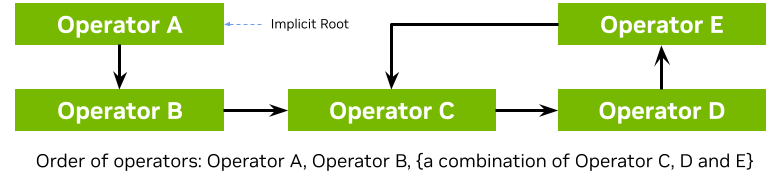

(creating-holoscan-application)=

# Creating an Application

In this section, we'll address:
- how to {ref}`define an Application class<defining-an-application-class>`
- how to {ref}`configure an Application<configuring-an-application>`
- how to {ref}`define different types of workflows<application-workflows>`
- how to [build and run your application](#building-and-running-your-application)

:::{note}
This section covers basics of applications running as a single fragment. For multi-fragment applications, refer to the [distributed application documentation](./holoscan_create_distributed_app.md).
:::

(defining-an-application-class)=

## Defining an Application Class

The following code snippet shows an example Application code skeleton:

`````{tab-set}
````{tab-item} C++
- We define the `App` class that inherits from the {cpp:class}`Application <holoscan::Application>` base class.
- We create an instance of the `App` class in `main()` using the {cpp:func}`make_application() <holoscan::make_application>` function.
- The {cpp:func}`run()<holoscan::Fragment::run>` method starts the application which will execute its {cpp:func}`compose()<holoscan::Fragment::compose>` method where the custom workflow will be defined.

```{code-block} cpp
:emphasize-lines: 3,5,12-13
:name: holoscan-app-skeleton-cpp

#include <holoscan/holoscan.hpp>

class App : public holoscan::Application {
 public:
  void compose() override {
    // Define Operators and workflow
    //   ...
  }
};

int main() {
  auto app = holoscan::make_application<App>();
  app->run();
  return 0;
}
```
````
````{tab-item} Python
- We define the `App` class that inherits from the {py:class}`Application <holoscan.core.Application>` base class.
- We create an instance of the `App` class in a `main()` function that is called from `__main__`.
- The {py:func}`run()<holoscan.Application.run>` method starts the application which will execute its {py:func}`compose()<holoscan.Application.compose>` method where the custom workflow will be defined.

```{code-block} python
:emphasize-lines: 3, 5, 11-12
:name: holoscan-app-skeleton-python

from holoscan.core import Application

class App(Application):

    def compose(self):
        # Define Operators and workflow
        #   ...


def main():
    app = App()
    app.run()

if __name__ == "__main__":
    main()
```

:::{note}
It is recommended to call {py:func}`run()<holoscan.Application.run>` from within a separate `main()` function rather than calling it directly from `__main__`. This will ensure that the Application's destructor is called before the Python process exits.
:::

`````

:::{tip}
This is also illustrated in the [hello_world](./examples/hello_world.md) example.
:::
___

It is also possible to instead launch the application asynchronously (i.e. non-blocking for the thread launching the application), as shown below:

`````{tab-set}
````{tab-item} C++
This can be done simply by replacing the call to {cpp:func}`run()<holoscan::Fragment::run>` with {cpp:func}`run_async()<holoscan::Fragment::run_async>` which returns a `std::future`. Calling `future.get()` will block until the application has finished running and throw an exception if a runtime error occurred during execution.
```{code-block} cpp
:emphasize-lines: 3-4
:name: holoscan-app-skeleton-cpp-async

int main() {
  auto app = holoscan::make_application<App>();
  auto future = app->run_async();
  future.get();
  return 0;
}
```
````
````{tab-item} Python
This can be done simply by replacing the call to {py:func}`run()<holoscan.Application.run>` with {py:func}`run_async()<holoscan.Application.run_async>` which returns a Python `concurrent.futures.Future`. Calling `future.result()` will block until the application has finished running and raise an exception if a runtime error occurred during execution.
```{code-block} python
:emphasize-lines: 3-4
:name: holoscan-app-skeleton-python-async

def main():
    app = App()
    future = app.run_async()
    future.result()


if __name__ == "__main__":
    main()
````
`````

:::{tip}
This is also illustrated in the [ping_simple_run_async](https://github.com/nvidia-holoscan/holoscan-sdk/blob/main/examples/ping_simple_run_async) example.
:::

(configuring-an-application)=

## Configuring an Application

An application can be configured at different levels:

1. {ref}`providing the GXF extensions that need to be loaded<loading-gxf-extensions>` (when using {ref}`GXF operators<wrap-gxf-codelet-as-operator>`)
2. configuring parameters for your application, including for:
   1. {ref}`the operators<configuring-app-operators>` in the workflow
   2. {ref}`the scheduler<configuring-app-scheduler>` of your application
3. {ref}`configuring some runtime properties<configuring-app-runtime>` when deploying for production

The sections below will describe how to configure each of them, starting with a native support for YAML-based configuration for convenience.

(yaml-config-support)=

### YAML Configuration support

Holoscan supports loading arbitrary parameters from a YAML configuration file at runtime, making it convenient to configure each item listed above, or other custom parameters you wish to add on top of the existing API. For C++ applications, it also provides the ability to change the behavior of your application without needing to recompile it.

:::{note}
Usage of the YAML utility is optional. Configurations can be hardcoded in your program, or done using any parser of your choosing.
:::

Here is an example YAML configuration:

```yaml
string_param: "test"
float_param: 0.50
bool_param: true
dict_param:
  key_1: value_1
  key_2: value_2
```

Ingesting these parameters can be done using the two methods below:

`````{tab-set}
````{tab-item} C++

- The {cpp:func}`~holoscan::Fragment::config` method takes the path to the YAML configuration file. If the input path is relative, it will be relative to the current working directory.
- The {cpp:func}`~holoscan::Fragment::from_config` method returns an {cpp:class}`~holoscan::ArgList` object for a given key in the YAML file. It holds a list of {cpp:class}`~holoscan::Arg` objects, each of which holds a name (key) and a value.
  - If the `ArgList` object has only one `Arg` (when the key is pointing to a scalar item), it can be converted to the desired type using the {cpp:func}`~holoscan::ArgList::as` method by passing the type as an argument.
  - The key can be a dot-separated string to access nested fields.
- The {cpp:func}`~holoscan::Fragment::config_keys` method returns an unordered set of the key names accessible via {cpp:func}`~holoscan::Fragment::from_config`.

```{code-block} cpp
:name: holoscan-from-config-cpp

// Pass configuration file
auto app = holoscan::make_application<App>();
app->config("path/to/app_config.yaml");

// Scalars
auto string_param = app->from_config("string_param").as<std::string>();
auto float_param = app->from_config("float_param").as<float>();
auto bool_param = app->from_config("bool_param").as<bool>();

// Dict
auto dict_param = app->from_config("dict_param");
auto dict_nested_param = app->from_config("dict_param.key_1").as<std::string>();

// Print
std::cout << "string_param: " << string_param << std::endl;
std::cout << "float_param: " << float_param << std::endl;
std::cout << "bool_param: " << bool_param << std::endl;
std::cout << "dict_param:\n" << dict_param.description() << std::endl;
std::cout << "dict_param['key1']: " << dict_nested_param << std::endl;

// // Output
// string_param: test
// float_param: 0.5
// bool_param: 1
// dict_param:
// name: arglist
// args:
//   - name: key_1
//     type: YAML::Node
//     value: value_1
//   - name: key_2
//     type: YAML::Node
//     value: value_2
// dict_param['key1']: value_1
```
````

````{tab-item} Python

- The {py:func}`~holoscan.core.Fragment.config` method takes the path to the YAML configuration file. If the input path is relative, it will be relative to the current working directory.
- The {py:func}`~holoscan.core.Fragment.kwargs` method return a regular python dict for a given key in the YAML file.
  - *Advanced*: this method wraps the {py:func}`~holoscan.core.Fragment.from_config` method similar to the C++ equivalent, which returns an {py:class}`~holoscan.core.ArgList` object if the key is pointing to a map item, or an {py:class}`~holoscan.core.Arg` object if the key is pointing to a scalar item. An {py:class}`~holoscan.core.Arg` object can be cast to the desired type (e.g., `str(app.from_config("string_param"))`).
- The {py:func}`~holoscan.core.Fragment.config_keys` method returns a set of the key names accessible via {py:func}`~holoscan.core.Fragment.from_config`.

```{code-block} python
:name: holoscan-from-config-python

# Pass configuration file
app = App()
app.config("path/to/app_config.yaml")

# Scalars
string_param = app.kwargs("string_param")["string_param"]
float_param = app.kwargs("float_param")["float_param"]
bool_param = app.kwargs("bool_param")["bool_param"]

# Dict
dict_param = app.kwargs("dict_param")
dict_nested_param = dict_param["key_1"]

# Print
print(f"string_param: {string_param}")
print(f"float_param: {float_param}")
print(f"bool_param: {bool_param}")
print(f"dict_param: {dict_param}")
print(f"dict_param['key_1']: {dict_nested_param}")

# # Output:
# string_param: test
# float_param: 0.5
# bool_param: True
# dict_param: {'key_1': 'value_1', 'key_2': 'value_2'}
# dict_param['key_1']: 'value_1'
```
:::{warning}
{py:func}`~holoscan.core.Fragment.from_config` cannot be used as inputs to the {py:mod}`built-in operators<holoscan.operators>` at this time, it's therefore recommended to use {py:func}`~holoscan.core.Fragment.kwargs` in Python.
:::
````
`````

:::{tip}
This is also illustrated in the [video_replayer](./examples/video_replayer.md) example.
:::

:::{attention}
With both `from_config` and `kwargs`, the returned `ArgList`/dictionary will include both the key and its associated item if that item value is a scalar. If the item is a map/dictionary itself, the input key is dropped, and the output will only hold the key/values from that item.
:::

(loading-gxf-extensions)=

### Loading GXF extensions

If you use operators that depend on GXF extensions for their implementations (known as {ref}`GXF operators<wrap-gxf-codelet-as-operator>`), the shared libraries (`.so`) of these extensions need to be dynamically loaded as plugins at runtime.

The SDK already automatically handles loading the required extensions for the [built-in operators](./holoscan_operators_extensions.md) in both C++ and Python, as well as common extensions (listed here). To load additional extensions for your own operators, you can use one of the following approach:

````{tab-set-code}
```{code-block} yaml
extensions:
  - libgxf_myextension1.so
  - /path/to/libgxf_myextension2.so
```
```{code-block} c++
auto app = holoscan::make_application<App>();
auto exts = {"libgxf_myextension1.so", "/path/to/libgxf_myextension2.so"};
for (auto& ext : exts) {
  app->executor().extension_manager()->load_extension(ext);
}
```
```{code-block} python
from holoscan.gxf import load_extensions
from holoscan.core import Application
app = Application()
context = app.executor.context_uint64
exts = ["libgxf_myextension1.so", "/path/to/libgxf_myextension2.so"]
load_extensions(context, exts)
```
````

:::{note}
To be discoverable, paths to these shared libraries need to either be absolute, relative to your working directory, installed in the `lib/gxf_extensions` folder of the holoscan package, or listed under the `HOLOSCAN_LIB_PATH` or `LD_LIBRARY_PATH` environment variables.
:::

Please see other examples in the [system tests](https://github.com/nvidia-holoscan/holoscan-sdk/blob/main/tests/system/loading_gxf_extension.cpp) in the Holoscan SDK repository.

(configuring-app-operators)=

### Configuring operators

Operators are defined in the `compose()` method of your application. They are not instantiated
(with the `initialize` method) until an application's `run()` method is called.

Operators have three type of fields which can be configured: parameters, conditions, and resources.

(configuring-app-operator-parameters)=

#### Configuring operator parameters

Operators could have parameters defined in their `setup` method to better control their behavior (see details when [creating your own operators](./holoscan_create_operator.md)). The snippet below would be the implementation of this method for a minimal operator named `MyOp`, that takes a string and a boolean as parameters; we'll ignore any extra details for the sake of this example:

````{tab-set-code}
```{code-block} c++
void setup(OperatorSpec& spec) override {
  spec.param(string_param_, "string_param");
  spec.param(bool_param_, "bool_param");
}
```
```{code-block} python
def setup(self, spec: OperatorSpec):
  spec.param("string_param")
  spec.param("bool_param")
  # Optional in python. Could define `self.<param_name>` instead in `def __init__`
```
````

:::{tip}
Given an instance of an operator class, you can print a human-readable description of its specification to inspect the parameter fields that can be configured on that operator class:

````{tab-set-code}
```{code-block} c++
std::cout << operator_object->spec()->description() << std::endl;
```
```{code-block} python
print(operator_object.spec)
```
````

:::

Given this YAML configuration:

```yaml
myop_param:
  string_param: "test"
  bool_param: true

bool_param: false # we'll use this later
```

We can configure an instance of the `MyOp` operator in the application's `compose` method like this:

````{tab-set-code}
```{code-block} c++
void compose() override {
  // Using YAML
  auto my_op1 = make_operator<MyOp>("my_op1", from_config("myop_param"));

  // Same as above
  auto my_op2 = make_operator<MyOp>("my_op2",
    Arg("string_param", std::string("test")), // can use Arg(key, value)...
    Arg("bool_param") = true                  // ... or Arg(key) = value
  );
}
```
```{code-block} python
def compose(self):
  # Using YAML
  my_op1 = MyOp(self, name="my_op1", **self.kwargs("myop_param"))

  # Same as above
  my_op2 = MyOp(self,
    name="my_op2",
    string_param="test",
    bool_param=True,
  )
```
````

:::{tip}
This is also illustrated in the [ping_custom_op](./examples/ping_custom_op.md) example.
:::

If multiple `ArgList` are provided with duplicate keys, the latest one overrides them:

````{tab-set-code}
```{code-block} c++
void compose() override {
  // Using YAML
  auto my_op1 = make_operator<MyOp>("my_op1",
    from_config("myop_param"),
    from_config("bool_param")
  );

  // Same as above
  auto my_op2 = make_operator<MyOp>("my_op2",
    Arg("string_param", "test"),
    Arg("bool_param") = true,
    Arg("bool_param") = false
  );

  // -> my_op `bool_param_` will be set to `false`
}
```
```{code-block} python
def compose(self):
  # Using YAML
  my_op1 = MyOp(self, name="my_op1",
    from_config("myop_param"),
    from_config("bool_param"),
  )

  # Note: We're using from_config above since we can't merge automatically with kwargs
  # as this would create duplicated keys. However, we recommend using kwargs in python
  # to avoid limitations with wrapped operators, so the code below is preferred.

  # Same as above
  params = self.kwargs("myop_param").update(self.kwargs("bool_param"))
  my_op2 = MyOp(self, name="my_op2", params)

  # -> my_op `bool_param` will be set to `False`
```
````

(configuring-app-operator-conditions)=

#### Configuring operator conditions

By default, operators with no input ports will continuously run, while operators with input ports will run as long as they receive inputs (as they're configured with the [`MessageAvailableCondition`](./components/conditions.md#messageavailablecondition)).

To change that behavior, one or more other [conditions](./components/conditions.md) classes can be passed to the constructor of an operator to define when it should execute.

For example, we set three conditions on this operator `my_op`:

````{tab-set-code}
```{code-block} c++
void compose() override {
  // Limit to 10 iterations
  auto c1 = make_condition<CountCondition>("my_count_condition", 10);

  // Wait at least 200 milliseconds between each execution
  auto c2 = make_condition<PeriodicCondition>("my_periodic_condition", "200ms");

  // Stop when the condition calls `disable_tick()`
  auto c3 = make_condition<BooleanCondition>("my_bool_condition");

  // Pass directly to the operator constructor
  auto my_op = make_operator<MyOp>("my_op", c1, c2, c3);
}
```
```{code-block} python
def compose(self):
  # Limit to 10 iterations
  c1 = CountCondition(self, 10, name="my_count_condition")

  # Wait at least 200 milliseconds between each execution
  c2 = PeriodicCondition(self, timedelta(milliseconds=200), name="my_periodic_condition")

  # Stop when the condition calls `disable_tick()`
  c3 = BooleanCondition(self, name="my_bool_condition")

  # Pass directly to the operator constructor
  my_op = MyOp(self, c1, c2, c3, name="my_op")
```
````

:::{tip}
This is also illustrated in the [conditions](https://github.com/nvidia-holoscan/holoscan-sdk/blob/main/examples/conditions) examples.
:::

:::{note}
You'll need to specify a unique name for the conditions if there are multiple conditions applied to an operator.
:::

(configuring-app-operator-resources)=

#### Configuring operator resources

Some [resources](./components/resources.md) can be passed to the operator's constructor, typically an [allocator](./components/resources.md#allocator) passed as a regular parameter.

For example:

````{tab-set-code}
```{code-block} c++
void compose() override {
  // Allocating memory pool of specific size on the GPU
  // ex: width * height * channels * channel size in bytes
  auto block_size = 640 * 480 * 4 * 2;
  auto p1 = make_resource<BlockMemoryPool>("my_pool1", 1, size, 1);

  // Provide unbounded memory pool
  auto p2 = make_condition<UnboundedAllocator>("my_pool2");

  // Pass to operator as parameters (name defined in operator setup)
  auto my_op = make_operator<MyOp>("my_op",
                                   Arg("pool1", p1),
                                   Arg("pool2", p2));
}
```
```{code-block} python
def compose(self):
  # Allocating memory pool of specific size on the GPU
  # ex: width * height * channels * channel size in bytes
  block_size = 640 * 480 * 4 * 2;
  p1 = BlockMemoryPool(self, name="my_pool1", storage_type=1, block_size=block_size, num_blocks=1)

  # Provide unbounded memory pool
  p2 = UnboundedAllocator(self, name="my_pool2")

  # Pass to operator as parameters (name defined in operator setup)
  auto my_op = MyOp(self, name="my_op", pool1=p1, pool2=p2)
```
````


(configuring-app-operator-native-resources)=

#### Native resource creation

The resources bundled with the SDK are wrapping an underlying GXF component. However, it is also possible to define a "native" resource without any need to create and wrap an underlying GXF component. Such a resource can also be passed conditionally to an operator in the same way as the resources created in the previous section.

For example:

`````{tab-set}
````{tab-item} C++
To create a native resource, implement a class that inherits from {cpp:class}`Resource <holoscan::Resource>`

```{code-block} cpp
namespace holoscan {

class MyNativeResource : public holoscan::Resource {
 public:
  HOLOSCAN_RESOURCE_FORWARD_ARGS_SUPER(MyNativeResource, Resource)

  MyNativeResource() = default;

  // add any desired parameters in the setup method
  // (a single string parameter is shown here for illustration)
  void setup(ComponentSpec& spec) override {
    spec.param(message_, "message", "Message string", "Message String", std::string("test message"));
  }

  // add any user-defined methods (these could be called from an Operator's compute method)
  std::string message() { return message_.get(); }

 private:
  Parameter<std::string> message_;
};
}  // namespace: holoscan
```

The `setup` method can be used to define any parameters needed by the resource.

This resource can be used with a C++ operator, just like any other resource. For example, an operator could have a parameter holding a shared pointer to `MyNativeResource` as below.

```{code-block} cpp
private:

class MyOperator : public holoscan::Operator {
 public:
  HOLOSCAN_OPERATOR_FORWARD_ARGS(MyOperator)

  MyOperator() = default;

  void setup(OperatorSpec& spec) override {
    spec.param(message_resource_, "message_resource", "message resource",
               "resource printing a message");
  }

  void compute(InputContext&, OutputContext& op_output, ExecutionContext&) override {
    HOLOSCAN_LOG_TRACE("MyOp::compute()");

    // get a resource based on its name (this assumes the app author named the resource "message_resource")
    auto res = resource<MyNativeResource>("message_resource");
    if (!res) {
      throw std::runtime_error("resource named 'message_resource' not found!");
    }

    // call a method on the retrieved resource class
    auto message = res->message();

  };

private:
    Parameter<std::shared_ptr<holoscan::MyNativeResource> message_resource_;
}
```
The `compute` method above demonstrates how the templated `resource` method can be used to retrieve a resource.


and the resource could be created and passed via a named argument in the usual way
```{code-block} cpp

// example code for within Application::compose (or Fragment::compose)

    auto message_resource = make_resource<holoscan::MyNativeResource>(
        "message_resource", holoscan::Arg("message", "hello world");

    auto my_op = std::make_operator<holoscan::ops::MyOperator>(
        "my_op", holoscan::Arg("message_resource", message_resource));
```

As with GXF-based resources, it is also possible to pass a native resource as a positional argument to the operator constructor.

For a concreate example of native resource use in a real application, see the [volume_rendering_xr application](https://github.com/nvidia-holoscan/holohub/blob/main/applications/volume_rendering_xr/main.cpp) on Holohub. This application uses a native [XrSession resource](https://github.com/nvidia-holoscan/holohub/blob/main/operators/XrFrameOp/xr_session.hpp) type which corresponds to a single OpenXR session. This single "session" resource can then be shared by both the `XrBeginFrameOp` and `XrEndFrameOp` operators.

````
````{tab-item} Python
To create a native resource, implement a class that inherits from {py:class}`Resource <holoscan.core.Resource>`.

```{code-block} python
class MyNativeResource(Resource):
    def __init__(self, fragment, message="test message", *args, **kwargs):
        self.message = message
        super().__init__(fragment, *args, **kwargs)

    # Could optionally define Parameter as in C++ via spec.param as below.
    # Here, we chose instead to pass message as an argument to __init__ above.
    # def setup(self, spec: ComponentSpec):
    #     spec.param("message", "test message")

    # define a custom method
    def message(self):
        return self.message
```

The below shows how some custom operator could use such a resource in its compute method

```{code-block} python
class MyOperator(Operator):
    def compute(self, op_input, op_output, context):
        resource = self.resource("message_resource")
        if resource is None:
            raise ValueError("expected message resource not found")
        assert isinstance(resource, MyNativeResource)

        print(f"message = {resource.message()")
```

where this native resource could have been created and passed positionally to `MyOperator` as follows

```{code-block} python

# example code within Application.compose (or Fragment.compose)

    message_resource = MyNativeResource(
        fragment=self, message="hello world", name="message_resource")

    # pass the native resource as a positional argument to MyOperator
    my_op = MyOperator(fragment=self, message_resource)
```
````
`````

There is a minimal example of native resource use in the [examples/native](https://github.com/nvidia-holoscan/holoscan-sdk/blob/main/examples/native/) folder.


(configuring-app-scheduler)=

### Configuring the scheduler

The [scheduler](./components/schedulers.md) controls how the application schedules the execution of the operators that make up its [workflow](application-workflows).

The default scheduler is a single-threaded [`GreedyScheduler`](./components/schedulers.md#greedy-scheduler). An application can be configured to use a different scheduler `Scheduler` ({cpp:class}`C++ <holoscan::Scheduler>`/{py:class}`Python <holoscan.core.Scheduler>`) or change the parameters from the default scheduler, using the `scheduler()` function ({cpp:func}`C++ <holoscan::Fragment::scheduler>`/{py:func}`Python <holoscan.core.Fragment.scheduler>`).

For example, if an application needs to run multiple operators in parallel, the [`MultiThreadScheduler`](./components/schedulers.md#multithread-scheduler) or [`EventBasedScheduler`](./components/schedulers.md#event-based-scheduler) can instead be used. The difference between the two is that the MultiThreadScheduler is based on actively polling operators to determine if they are ready to execute, while the EventBasedScheduler will instead wait for an event indicating that an operator is ready to execute.

The code snippet belows shows how to set and configure a non-default scheduler:

`````{tab-set}
````{tab-item} C++

- We create an instance of a {ref}`holoscan::Scheduler <api/holoscan_cpp_api:schedulers>` derived class by using the {cpp:func}`~holoscan::Fragment::make_scheduler` function. Like operators, parameters can come from explicit {cpp:class}`~holoscan::Arg`s or {cpp:class}`~holoscan::ArgList`, or from a YAML configuration.
- The {cpp:func}`~holoscan::Fragment::scheduler` method assigns the scheduler to be used by the application.

```{code-block} cpp
:emphasize-lines: 2-7
:name: holoscan-config-scheduler-cpp

auto app = holoscan::make_application<App>();
auto scheduler = app->make_scheduler<holoscan::EventBasedScheduler>(
  "myscheduler",
  Arg("worker_thread_number", 4),
  Arg("stop_on_deadlock", true)
);
app->scheduler(scheduler);
app->run();
```

````

````{tab-item} Python
- We create an instance of a `Scheduler` class in the {py:mod}`~holoscan.schedulers` module. Like operators, parameters can come from an explicit {py:class}`~holoscan.core.Arg` or {py:class}`~holoscan.core.ArgList`, or from a YAML configuration.
- The {py:func}`~holoscan.core.Fragment.scheduler` method assigns the scheduler to be used by the application.

```{code-block} python
:emphasize-lines: 2-8
:name: holoscan-config-scheduler-python

app = App()
scheduler = holoscan.schedulers.EventBasedScheduler(
    app,
    name="myscheduler",
    worker_thread_number=4,
    stop_on_deadlock=True,
)
app.scheduler(scheduler)
app.run()
```
````
`````

:::{tip}
This is also illustrated in the [multithread](https://github.com/nvidia-holoscan/holoscan-sdk/blob/main/examples/multithread) example.
:::

(configuring-app-runtime)=

### Configuring runtime properties

As described [below](building-and-running-your-application), applications can run simply by executing the C++ or Python application manually on a given node, or by [packaging it](./holoscan_packager.md) in a [HAP container](./cli/hap.md). With the latter, runtime properties need to be configured: refer to the [App Runner Configuration](./cli/run_config.md) for details.

(application-workflows)=

## Application Workflows

:::{note}
Operators are initialized according to the [topological order](https://en.wikipedia.org/wiki/Topological_sorting)
of its fragment-graph. When an application runs, the operators are executed in the same topological order.
Topological ordering of the graph ensures that all the data dependencies of an operator are satisfied before its
instantiation and execution. Currently, we do not support specifying a different and explicit
instantiation and execution order of the operators.
:::

### One-operator Workflow

The simplest form of a workflow would be a single operator.

```{digraph} myop
:align: center
:caption: A one-operator workflow

    rankdir="LR"
    node [shape=record];

    myop [label="MyOp| | "];
```

The graph above shows an **Operator** ({cpp:class}`C++ <holoscan::Operator>`/{py:class}`Python <holoscan.core.Operator>`) (named `MyOp`) that has neither inputs nor output ports.
- Such an operator may accept input data from the outside (e.g., from a file) and produce output data (e.g., to a file) so that it acts as both the source and the sink operator.
- Arguments to the operator (e.g., input/output file paths) can be passed as parameters as described in the {ref}`section above<configuring-an-application>`.

We can add an operator to the workflow by calling `add_operator` ({cpp:func}`C++ <holoscan::Fragment::add_operator>`/{py:func}`Python <holoscan.core.Fragment.add_operator>`) method in the `compose()` method.

The following code shows how to define a one-operator workflow in `compose()` method of the `App` class (assuming that the operator class `MyOp` is declared/defined in the same file).

````{tab-set-code}

```{code-block} cpp
:linenos: true
:name: holoscan-one-operator-workflow-cpp

class App : public holoscan::Application {
 public:
  void compose() override {
    // Define Operators
    auto my_op = make_operator<MyOp>("my_op");

    // Define the workflow
    add_operator(my_op);
  }
};
```

```{code-block} python
:linenos: true
:name: holoscan-one-operator-workflow-python

class App(Application):

    def compose(self):
        # Define Operators
        my_op = MyOp(self, name="my_op")

        # Define the workflow
        self.add_operator(my_op)
```
````

### Linear Workflow

Here is an example workflow where the operators are connected linearly:

```{digraph} linear_workflow
:align: center
:caption: A linear workflow

    rankdir="LR"
    node [shape=record];

    sourceop [label="SourceOp| |output(out) : Tensor"];
    processop [label="ProcessOp| [in]input : Tensor | output(out) : Tensor "];
    sinkop [label="SinkOp| [in]input : Tensor | "];
    sourceop -> processop [label="output...input"]
    processop -> sinkop [label="output...input"]
```

In this example, **SourceOp** produces a message and passes it to **ProcessOp**. **ProcessOp** produces another message and passes it to **SinkOp**.

We can connect two operators by calling the `add_flow()` method ({cpp:func}`C++ <holoscan::Fragment::add_flow>`/{py:func}`Python <holoscan.core.Fragment.add_flow>`) in the `compose()` method.


The `add_flow()` method ({cpp:func}`C++ <holoscan::Fragment::add_flow>`/{py:func}`Python <holoscan.core.Fragment.add_flow>`) takes the source operator, the destination operator, and the optional port name pairs.
The port name pair is used to connect the output port of the source operator to the input port of the destination operator.
The first element of the pair is the output port name of the upstream operator and the second element is the input port name of the downstream operator.
An empty port name ("") can be used for specifying a port name if the operator has only one input/output port.
If there is only one output port in the upstream operator and only one input port in the downstream operator, the port pairs can be omitted.

The following code shows how to define a linear workflow in the `compose()` method of the `App` class (assuming that the operator classes `SourceOp`, `ProcessOp`, and `SinkOp` are declared/defined in the same file).

````{tab-set-code}

```{code-block} cpp
:linenos: true
:name: holoscan-linear-operator-workflow-cpp

class App : public holoscan::Application {
 public:
  void compose() override {
    // Define Operators
    auto source = make_operator<SourceOp>("source");
    auto process = make_operator<ProcessOp>("process");
    auto sink = make_operator<SinkOp>("sink");

    // Define the workflow
    add_flow(source, process); // same as `add_flow(source, process, {{"output", "input"}});`
    add_flow(process, sink);   // same as `add_flow(process, sink, {{"", ""}});`
  }
};
```

```{code-block} python
:linenos: true
:name: holoscan-linear-operator-workflow-python

class App(Application):

    def compose(self):
        # Define Operators
        source = SourceOp(self, name="source")
        process = ProcessOp(self, name="process")
        sink = SinkOp(self, name="sink")

        # Define the workflow
        self.add_flow(source, process) # same as `self.add_flow(source, process, {("output", "input")})`
        self.add_flow(process, sink)   # same as `self.add_flow(process, sink, {("", "")})`
```
````

### Complex Workflow (Multiple Inputs and Outputs)

You can design a complex workflow like below where some operators have multi-inputs and/or multi-outputs:

```{digraph} complex_workflow
:align: center
:caption: A complex workflow (multiple inputs and outputs)

    node [shape=record];

    reader1 [label="{Reader1| |image(out)\nmetadata(out)}"];
    reader2 [label="{Reader2| |roi(out)}"];
    processor1 [label="{Processor1|[in]image1\n[in]image2\n[in]metadata|image(out)}"];
    processor2 [label="{Processor2|[in]image\n[in]roi|image(out)}"];
    processor3 [label="{Processor3|[in]image|seg_image(out)}"];
    writer [label="{Writer|[in]image\n[in]seg_image| }"];
    notifier [label="{Notifier|[in]image| }"];

    reader1->processor1 [label="image...{image1,image2}\nmetadata...metadata"]
    reader2->processor2 [label="roi...roi"]
    processor1->processor2 [label="image...image"]
    processor1->writer [label="image...image"]
    processor2->notifier [label="image...image"]
    processor2->processor3 [label="image...image"]
    processor3->writer [label="seg_image...seg_image"]
```


````{tab-set-code}

```{code-block} cpp
:linenos: true
:name: holoscan-multiio-operator-workflow-cpp

class App : public holoscan::Application {
 public:
  void compose() override {
    // Define Operators
    auto reader1 = make_operator<Reader1>("reader1");
    auto reader2 = make_operator<Reader2>("reader2");
    auto processor1 = make_operator<Processor1>("processor1");
    auto processor2 = make_operator<Processor2>("processor2");
    auto processor3 = make_operator<Processor3>("processor3");
    auto writer = make_operator<Writer>("writer");
    auto notifier = make_operator<Notifier>("notifier");

    // Define the workflow
    add_flow(reader1, processor1, {{"image", "image1"}, {"image", "image2"}, {"metadata", "metadata"}});
    add_flow(reader1, processor1, {{"image", "image2"}});
    add_flow(reader2, processor2, {{"roi", "roi"}});
    add_flow(processor1, processor2, {{"image", "image"}});
    add_flow(processor1, writer, {{"image", "image"}});
    add_flow(processor2, notifier);
    add_flow(processor2, processor3);
    add_flow(processor3, writer, {{"seg_image", "seg_image"}});
  }
};
```

```{code-block} python
:linenos: true
:name: holoscan-multiio-operator-workflow-python

class App(Application):

    def compose(self):
        # Define Operators
        reader1 = Reader1Op(self, name="reader1")
        reader2 = Reader2Op(self, name="reader2")
        processor1 = Processor1Op(self, name="processor1")
        processor2 = Processor2Op(self, name="processor2")
        processor3 = Processor3Op(self, name="processor3")
        notifier = NotifierOp(self, name="notifier")
        writer = WriterOp(self, name="writer")

        # Define the workflow
        self.add_flow(reader1, processor1, {("image", "image1"), ("image", "image2"), ("metadata", "metadata")})
        self.add_flow(reader2, processor2, {("roi", "roi")})
        self.add_flow(processor1, processor2, {("image", "image")})
        self.add_flow(processor1, writer, {("image", "image")})
        self.add_flow(processor2, notifier)
        self.add_flow(processor2, processor3)
        self.add_flow(processor3, writer, {("seg_image", "seg_image")})
```
````

If there is a cycle in the graph with no implicit root operator, the root
operator is either the first operator in the first call to `add_flow` method ({cpp:func}`C++
<holoscan::Fragment::add_flow>`/{py:func}`Python <holoscan.core.Fragment.add_flow>`), or the
operator in the first
call to `add_operator` method ({cpp:func}`C++ <holoscan::Fragment::add_operator>`/{py:func}`Python
<holoscan.core.Fragment.add_operator>`).

````{tab-set-code}
```{code-block} c++
:emphasize-lines: 5
auto op1 = make_operator<...>("op1");
auto op2 = make_operator<...>("op2");
auto op3 = make_operator<...>("op3");

add_flow(op1, op2);
add_flow(op2, op3);
add_flow(op3, op1);
// There is no implicit root operator
// op1 is the root operator because op1 is the first operator in the first call to add_flow
```
````

If there is a cycle in the graph with an implicit root operator which has no input port, then the initialization and execution
orders of the operators are still topologically sorted as far as possible until the cycle needs to
be explicitly broken. An example is given below:



(building-and-running-your-application)=

## Building and running your Application

`````{tab-set}
````{tab-item} C++

You can build your C++ application using CMake, by calling `find_package(holoscan)` in your `CMakeLists.txt` to load the SDK libraries. Your executable will need to link against:
- `holoscan::core`
- any operator defined outside your `main.cpp` which you wish to use in your app workflow, such as:
  - SDK [built-in operators](./holoscan_operators_extensions.md#operators) under the `holoscan::ops` namespace
  - operators created separately in your project with `add_library`
  - operators imported externally using with `find_library` or `find_package`

```{code-block} cmake
:caption: <src_dir>/CMakeLists.txt

# Your CMake project
cmake_minimum_required(VERSION 3.20)
project(my_project CXX)

# Finds the holoscan SDK
find_package(holoscan REQUIRED CONFIG PATHS "/opt/nvidia/holoscan")

# Create an executable for your application
add_executable(my_app main.cpp)

# Link your application against holoscan::core and any existing operators you'd like to use
target_link_libraries(my_app
  PRIVATE
    holoscan::core
    holoscan::ops::<some_built_in_operator_target>
    <some_other_operator_target>
    <...>
)
```

:::{tip}
This is also illustrated in all the examples:
- in `CMakeLists.txt` for the SDK installation directory - `/opt/nvidia/holoscan/examples`
- in `CMakeLists.min.txt` for the SDK [source directory](https://github.com/nvidia-holoscan/holoscan-sdk/blob/main/examples#readme)
:::

Once your `CMakeLists.txt` is ready in `<src_dir>`, you can build in `<build_dir>` with the command line below. You can optionally pass `Holoscan_ROOT` if the SDK installation you'd like to use differs from the `PATHS` given to `find_package(holoscan)` above.
```bash
# Configure
cmake -S <src_dir> -B <build_dir> -D Holoscan_ROOT="/opt/nvidia/holoscan"
# Build
cmake --build <build_dir> -j
```

You can then run your application by running `<build_dir>/my_app`.
````

````{tab-item} Python
Python applications do not require building. Simply ensure that:
- The [`holoscan`](./api/holoscan_python_api.md) python module is installed in your `dist-packages` or is listed under the `PYTHONPATH` env variable so you can import {py:mod}`holoscan.core` and any built-in operator you might need in {py:mod}`holoscan.operators`.
- Any external operators are available in modules in your `dist-packages` or contained in `PYTHONPATH`.

:::{note}
While python applications do not need to be built, they might depend on operators that wrap C++ operators. All python operators built-in in the SDK already ship with the python bindings pre-built. Follow {ref}`this section<python-wrapped-operators>` if you are wrapping C++ operators yourself to use in your python application.
:::

You can then run your application by running `python3 my_app.py`.

````
`````

:::{note}
Given a CMake project, a pre-built executable, or a python application, you can also use the [Holoscan CLI](./cli/cli.md) to [package and run your Holoscan application](./holoscan_packager.md) in a OCI-compliant container image.
:::

## Dynamic Application Metadata

As of Holoscan v2.3 it is possible to send metadata alongside the data emitted from an operator's output ports. This metadata can then be used and/or modified by any downstream operators. Currently this feature is only available for C++ applications, but will also be available to Python applications in a future release. The subsections below describe how this feature can be enabled and used.

### Enabling application metadata

Currently the metadata feature is disabled by default and must be explicitly enabled as shown in the code block below


`````{tab-set}
````{tab-item} C++
```cpp
app = holoscan::make_application<MyApplication>();

// Enable metadata feature before calling app->run() or app->run_async()
app->is_metadata_enabled(true);

app->run();
```
````
`````

### Understanding Metadata Flow

Each operator in the workflow has an associated {cpp:class}`~holoscan::MetadataDictionary` object. At the start of each operator's {cpp:func}`~holoscan::Operator::compute` call this metadata dictionary will be empty (i.e. metadata does not persist from previous compute calls). When any call to {cpp:class}`~holoscan::InputContext::receive` data is made, any metadata also found in the input message will be merged into the operator's local metadata dictionary. The operator's compute method can then read, append to or remove metadata as explained in the next section. Whenever the operator emits data via a call to {cpp:class}`~holoscan::OutputContext::emit` the current status of the operator's metadata dictionary will be transmitted on that port alonside the data passed via the first argument to the emit call. Any downstream operators will then receive this metadata via their input ports.

### Working With Metadata from Operator::compute

Within the operator's {cpp:func}`~holoscan::Operator::compute` method, the {cpp:func}`~holoscan::Operator::metadata` method can be called to get a shared pointer to the {cpp:class}`~holoscan::MetadataDictionary` of the operator. The metadata dictionary provides a similar API to a `std::unordered_map` (C++) where the keys are strings (`std::string` for C++) and the values can store any object type (via a C++ {cpp:type}`~holoscan::MetadataObject` holding a `std::any`). Templated {cpp:func}`~holoscan::MetadataObject::get` and {cpp:func}`~holoscan::MetadataObject::set` method are provided as demonstrated below to allow directly setting values of a given type without having to explicitly work with the internal {cpp:type}`~holoscan::MetadataObject` type.


`````{tab-set}
````{tab-item} C++
```cpp

// Receiving from a port updates operator metadata with any metadata found on the port
auto input_tensors = op_input.receive<TensorMap>("in");

// Get a reference to the shared metadata dictionary
auto& meta = metadata();

// Retrieve existing values.
// Use get<Type> to automatically cast the `std::any` contained within the `holsocan::Message`
auto name = meta->get<std::string>("patient_name");
auto age = meta->get<int>("age");

// Get also provides a two-argument version where a default value to be assigned is given by
// the second argument. The type of the default value should match the expected type of the value.
auto flag = meta->get("flag", false);

// Add a new value (if a key already exists, the value will be updated according to the
// operator's metadata_policy).
std::vector<float> spacing{1.0, 1.0, 3.0};
meta->set("pixel_spacing"s, spacing);

// Remove a value
meta->erase("patient_name")

// ... Some processing to produce output `data` could go here ...

// Current state of `meta` will automatically be emitted along with `data` in the call below
op_output.emit(data, "output1");

// Can clear all items
meta->clear();

// Any emit call after this point would not transmit a metadata object
op_output.emit(data, "output2");
```
````
`````

See the {cpp:class}`~holoscan::MetadataDictionary` API docs for all available methods. Most of these like `begin()` and `end()` iterators and the `find()` method match the corresponding methods of `std::unordered_map`.

#### Metadata Update Policies

The operator class also has a {cpp:func}`~holoscan::Operator::metadata_policy` method that can be used to set a {cpp:func}`~holoscan::MetadataPolicy` to use when handling duplicate metadata keys across multiple input ports of the operator. The available options are:
- "update" (`MetadataPolicy::kUpdate`): replace any existing key from a prior `receive` call with one present in a subsequent `receive` call.
- "reject" (`MetadataPolicy::kReject`): Reject the new key/value pair when a key already exists due to a prior `receive` call.
- "raise" (`MetadataPolicy::kRaise`): Throw a `std::runtime_error` if a duplicate key is encountered. This is the default policy.

The metadata policy would typically be set during {cpp:func}`~holoscan::Application::compose` as in the following example:

`````{tab-set}
````{tab-item} C++
```cpp

// Example for setting metadata policy from Application::compose()
my_op = make_operator<MyOperator>("my_op");
my_op->metadata_policy(holoscan::MetadataPolicy::kRaise);

```
````
`````
The policy only applies to the operator on which it was set.

### Use of Metadata in Distributed Applications

Sending metadata between two fragments of a distributed application is supported, but there are a couple of aspects to be aware of.

1. Sending metadata over the network requires serialization and deserialization of the metadata keys and values. The value types supported for this are the same as for data emitted over output ports (see the table in the section on {ref}`object serialization<object-serialization>`). The only exception is that {cpp:class}`~holoscan::Tensor` and {cpp:func}`~holoscan::TensorMap` values cannot be sent as metadata values between fragments. Any {ref}`custom codecs<object-serialization>` registered for the SDK will automatically also be available for serialization of metadata values.
2. There is a practical size limit of several kilobytes in the amount of metadata that can be transmitted between fragments. This is because metadata is currently sent along with other entity header information in the UCX header, which has fixed size limit (the metadata is stored along with other header information within the size limit defined by the `HOLOSCAN_UCX_SERIALIZATION_BUFFER_SIZE` {ref}`environment variable<holoscan-distributed-env>`).

The above restrictions only apply to metadata sent **between** fragments. Within a fragment there is no size limit on metadata (aside from system memory limits) and no serialization or deserialization step is needed.

### Current limitations

1. The current metadata API is only fully supported for native holoscan Operators and is not currently supported by operators that wrap a GXF codelet (i.e. inheriting from {cpp:class}`~holoscan::GXFOperator` or created via {cpp:class}`~holoscan::ops::GXFCodeletOp`). Aside from `GXFCodeletOp`, the built-in operators provided under the `holoscan::ops` namespace are all native operators, so the feature will work with these. Currently none of these built-in opereators add their own metadata, but any metadata received on input ports will automatically be passed on to their output ports (as long as `app->is_metadata_enabled(true)` was set to enable the metadata feature).
