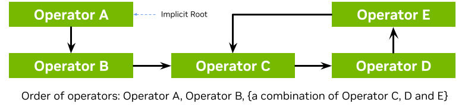

<Anchor id="creating-holoscan-application" />

In this section, we'll address:

- How to [define an Application class](#defining-an-application-class).
- How to [configure an Application](#configuring-an-application).
- How to [define different types of workflows](#application-workflows).
- How to [build and run your application](#building-and-running-your-application).

<Note>

This section covers basics of applications running as a single fragment. For multi-fragment applications, refer to the [distributed application documentation](/holoscan/sdk-user-guide/using-the-sdk/create-a-distributed-application).

</Note>


<Anchor id="defining-an-application-class" />

## Defining an Application Class

The following code snippet shows an example Application code skeleton:

<Tabs>

  <Tab title="C++" language="cpp">

  - We define the `App` class that inherits from the Application (`holoscan::Application`) base class.
  - We create an instance of the `App` class in `main()` using the make_application() (`holoscan::make_application`) function.
  - The run() (`holoscan::Fragment::run`) method starts the application which will execute its compose() (`holoscan::Fragment::compose`) method where the custom workflow will be defined.

  ```cpp
    #include &lt;holoscan/holoscan.hpp&gt;

    class App : public holoscan::Application {
     public:
      void compose() override {
        // Define Operators and workflow
        //   ...
      }
    };

    int main() {
      auto app = holoscan::make_application<App>();
      app->run();
      return 0;
    }
  ```

</Tab>
<Tab title="Python" language="python">

  - We define the `App` class that inherits from the Application (`holoscan.core.Application`) base class.
  - We create an instance of the `App` class in a `main()` function that is called from `__main__`.
  - The run() (`holoscan.Application.run`) method starts the application which will execute its compose() (`holoscan.Application.compose`) method where the custom workflow will be defined.

  ```python
    from holoscan.core import Application

    class App(Application):

        def compose(self):
            # Define Operators and workflow
            #   ...


    def main():
        app = App()
        app.run()

    if __name__ == "__main__":
        main()
  ```

  <Note>

  It is recommended to call run() (`holoscan.Application.run`) from within a separate `main()` function rather than calling it directly from `__main__`. This will ensure that the Application's destructor is called before the Python process exits.

  </Note>

</Tab>
</Tabs>


<Tip>

This is also illustrated in the [hello_world](/holoscan/sdk-user-guide/using-the-sdk/holoscan-by-example/hello-world) example.

</Tip>


It is also possible to instead launch the application asynchronously (i.e., non-blocking for the thread launching the application), as shown below:

<Tabs>

  <Tab title="C++" language="cpp">

  This can be done simply by replacing the call to run() (`holoscan::Fragment::run`) with run_async() (`holoscan::Fragment::run_async`) which returns a `std::future`. Calling `future.get()` will block until the application has finished running and throw an exception if a runtime error occurred during execution.

  ```cpp
    int main() {
      auto app = holoscan::make_application<App>();
      auto future = app->run_async();
      future.get();
      return 0;
    }
  ```

</Tab>
<Tab title="Python" language="python">

  This can be done simply by replacing the call to run() (`holoscan.Application.run`) with run_async() (`holoscan.Application.run_async`) which returns a Python `concurrent.futures.Future`. Calling `future.result()` will block until the application has finished running and raise an exception if a runtime error occurred during execution.

  ```python
    def main():
        app = App()
        future = app.run_async()
        future.result()


    if __name__ == "__main__":
        main()
  ```

</Tab>
</Tabs>


<Tip>

This is also illustrated in the [ping_simple_run_async](https://github.com/nvidia-holoscan/holoscan-sdk/tree/main/examples/ping_simple_run_async) example.

</Tip>


<Anchor id="configuring-an-application" />

## Configuring an Application

An application can be configured at different levels:

1. [providing the GXF extensions that need to be loaded](#loading-gxf-extensions) (when using [GXF operators](/holoscan/sdk-user-guide/using-the-sdk/create-an-operator)).
2. configuring parameters for your application, including for:
   a. [the operators](#configuring-app-operators) in the workflow.
   b. [the scheduler](#configuring-app-scheduler) of your application.

The sections below will describe how to configure each of them, starting with a native support for YAML-based configuration for convenience.

<Anchor id="yaml-config-support" />

### YAML configuration support

Holoscan supports loading arbitrary parameters from a YAML configuration file at runtime, making it convenient to configure each item listed above, or other custom parameters you wish to add on top of the existing API. For C++ applications, it also provides the ability to change the behavior of your application without needing to recompile it.

<Note>

Usage of the YAML utility is optional. Configurations can be hardcoded in your program, or done using any parser that you choose.

</Note>


Here is an example YAML configuration:

```yaml
string_param: "test"
float_param: 0.50
bool_param: true
dict_param:
  key_1: value_1
  key_2: value_2
```

Ingesting these parameters can be done using the two methods below:

<Tabs>

  <Tab title="C++" language="cpp">

  - The `holoscan::Fragment::config` method takes the path to the YAML configuration file. If the input path is relative, it will be relative to the current working directory. An exception will be thrown if the file does not exist.
  - The `holoscan::Fragment::from_config` method returns an `holoscan::ArgList` object for a given key in the YAML file. It holds a list of `holoscan::Arg` objects, each of which holds a name (key) and a value.
  - If the `ArgList` object has only one `Arg` (when the key is pointing to a scalar item), it can be converted to the desired type using the `holoscan::ArgList::as` method by passing the type as an argument.
  - The key can be a dot-separated string to access nested fields.
  - The `holoscan::Fragment::config_keys` method returns an unordered set of the key names accessible via `holoscan::Fragment::from_config`.

  ```cpp
    // Pass configuration file
    auto app = holoscan::make_application<App>();
    app->config("path/to/app_config.yaml");

    // Scalars
    auto string_param = app->from_config("string_param").as&lt;std::string&gt;();
    auto float_param = app->from_config("float_param").as<float>();
    auto bool_param = app->from_config("bool_param").as<bool>();

    // Dict
    auto dict_param = app->from_config("dict_param");
    auto dict_nested_param = app->from_config("dict_param.key_1").as&lt;std::string&gt;();

    // Print
    std::cout << "string_param: " << string_param << std::endl;
    std::cout << "float_param: " << float_param << std::endl;
    std::cout << "bool_param: " << bool_param << std::endl;
    std::cout << "dict_param:\n" << dict_param.description() << std::endl;
    std::cout << "dict_param['key1']: " << dict_nested_param << std::endl;

    // // Output
    // string_param: test
    // float_param: 0.5
    // bool_param: 1
    // dict_param:
    // name: arglist
    // args:
    //   - name: key_1
    //     type: YAML::Node
    //     value: value_1
    //   - name: key_2
    //     type: YAML::Node
    //     value: value_2
    // dict_param['key1']: value_1
  ```

</Tab>
<Tab title="Python" language="python">

  - The `holoscan.core.Fragment.config` method takes the path to the YAML configuration file. If the input path is relative, it will be relative to the current working directory. An exception will be thrown if the file does not exist.
  - The `holoscan.core.Fragment.kwargs` method return a regular Python dict for a given key in the YAML file.
  - **Advanced**: this method wraps the `holoscan.core.Fragment.from_config` method similar to the C++ equivalent, which returns an `holoscan.core.ArgList` object if the key is pointing to a map item, or an `holoscan.core.Arg` object if the key is pointing to a scalar item. An `holoscan.core.Arg` object can be cast to the desired type (e.g., `str(app.from_config("string_param"))`).
  - The `holoscan.core.Fragment.config_keys` method returns a set of the key names accessible via `holoscan.core.Fragment.from_config`.

  ```python
    # Pass configuration file
    app = App()
    app.config("path/to/app_config.yaml")

    # Scalars
    string_param = app.kwargs("string_param")["string_param"]
    float_param = app.kwargs("float_param")["float_param"]
    bool_param = app.kwargs("bool_param")["bool_param"]

    # Dict
    dict_param = app.kwargs("dict_param")
    dict_nested_param = dict_param["key_1"]

    # Print
    print(f"string_param: {string_param}")
    print(f"float_param: {float_param}")
    print(f"bool_param: {bool_param}")
    print(f"dict_param: {dict_param}")
    print(f"dict_param['key_1']: {dict_nested_param}")

    # # Output:
    # string_param: test
    # float_param: 0.5
    # bool_param: True
    # dict_param: {'key_1': 'value_1', 'key_2': 'value_2'}
    # dict_param['key_1']: 'value_1'
  ```
  <Warning>

  `holoscan.core.Fragment.from_config` cannot be used as inputs to the built-in operators (`holoscan.operators`) at this time. Therefore, it's recommended to use `holoscan.core.Fragment.kwargs` in Python.

  </Warning>

</Tab>
</Tabs>


<Tip>

This is also illustrated in the [video_replayer](/holoscan/sdk-user-guide/using-the-sdk/holoscan-by-example/video-replayer) example.

</Tip>


<Warning title="Attention">

With both `from_config` and `kwargs`, the returned `ArgList`/dictionary will include both the key and its associated item if that item value is a scalar. If the item is a map/dictionary itself, the input key is dropped, and the output will only hold the key/values from that item.

</Warning>


<Anchor id="loading-gxf-extensions" />

### Loading GXF extensions

If you use operators that depend on GXF extensions for their implementations (known as [GXF operators](/holoscan/sdk-user-guide/using-the-sdk/create-an-operator)), the shared libraries (`.so`) of these extensions need to be dynamically loaded as plugins at runtime.

The SDK already automatically handles loading the required extensions for the [built-in operators](/holoscan/sdk-user-guide/operators/operators-and-extensions) in both C++ and Python, as well as common extensions (listed here). To load additional extensions for your own operators, you can use one of the following approach:

<Tabs>

  <Tab title="YAML">

  ```yaml
    extensions:
      - libgxf_myextension1.so
      - /path/to/libgxf_myextension2.so
  ```

</Tab>
<Tab title="C++" language="cpp">

  ```cpp
    auto app = holoscan::make_application<App>();
    auto exts = {"libgxf_myextension1.so", "/path/to/libgxf_myextension2.so"};
    for (auto& ext : exts) {
      app->executor().extension_manager()->load_extension(ext);
    }
  ```

</Tab>
<Tab title="Python" language="python">

  ```python
    from holoscan.gxf import load_extensions
    from holoscan.core import Application
    app = Application()
    context = app.executor.context_uint64
    exts = ["libgxf_myextension1.so", "/path/to/libgxf_myextension2.so"]
    load_extensions(context, exts)
  ```

</Tab>
</Tabs>


<Note>

To be discoverable, paths to these shared libraries need to either be absolute, relative to your working directory, installed in the `lib/gxf_extensions` folder of the holoscan package, or listed under the `HOLOSCAN_LIB_PATH` or `LD_LIBRARY_PATH` environment variables.

</Note>


Please see other examples in the [system tests](https://github.com/nvidia-holoscan/holoscan-sdk/blob/main/tests/system/loading_gxf_extension.cpp) in the Holoscan SDK repository.

<Anchor id="configuring-app-operators" />

### Configuring operators

Operators are defined in the `compose()` method of your application. They are not instantiated
(with the `initialize` method) until an application's `run()` method is called.

Operators have three type of fields which can be configured: parameters, conditions, and resources.

<Anchor id="configuring-app-operator-parameters" />

#### Configuring operator parameters

Operators could have parameters defined in their `setup` method to better control their behavior (see details when [creating your own operators](/holoscan/sdk-user-guide/using-the-sdk/create-an-operator)). The snippet below would be the implementation of this method for a minimal operator named `MyOp`, that takes a string and a boolean as parameters; we'll ignore any extra details for the sake of this example:

<Tabs>

  <Tab title="C++" language="cpp">

  ```cpp
    void setup(OperatorSpec& spec) override {
      spec.param(string_param_, "string_param");
      spec.param(bool_param_, "bool_param");
    }
  ```

</Tab>
<Tab title="Python" language="python">

  ```python
    def setup(self, spec: OperatorSpec):
      spec.param("string_param")
      spec.param("bool_param")
      # Optional in python. Could define `self.<param_name>` instead in `def __init__`
  ```

</Tab>
</Tabs>


<Tip>

Given an instance of an operator class, you can print a human-readable description of its specification to inspect the parameter fields that can be configured on that operator class:

<Tabs>

  <Tab title="C++" language="cpp">

  ```cpp
    std::cout << operator_object->spec()->description() << std::endl;
  ```

</Tab>
<Tab title="Python" language="python">

  ```python
    print(operator_object.spec)
  ```

</Tab>
</Tabs>

</Tip>


Given this YAML configuration:

```yaml
myop_param:
  string_param: "test"
  bool_param: true

bool_param: false # we'll use this later
```

We can configure an instance of the `MyOp` operator in the application's `compose` method like this:

<Tabs>

  <Tab title="C++" language="cpp">

  ```cpp
    void compose() override {
      // Using YAML
      auto my_op1 = make_operator<MyOp>("my_op1", from_config("myop_param"));

      // Same as above
      auto my_op2 = make_operator<MyOp>("my_op2",
        Arg("string_param", std::string("test")), // can use Arg(key, value)...
        Arg("bool_param") = true                  // ... or Arg(key) = value
      );
    }
  ```

</Tab>
<Tab title="Python" language="python">

  ```python
    def compose(self):
      # Using YAML
      my_op1 = MyOp(self, name="my_op1", **self.kwargs("myop_param"))

      # Same as above
      my_op2 = MyOp(self,
        name="my_op2",
        string_param="test",
        bool_param=True,
      )
  ```

</Tab>
</Tabs>


<Tip>

This is also illustrated in the [ping_custom_op](/holoscan/sdk-user-guide/using-the-sdk/holoscan-by-example/ping-custom-op) example.

</Tip>


If multiple `ArgList` are provided with duplicate keys, the latest one overrides them:

<Tabs>

  <Tab title="C++" language="cpp">

  ```cpp
    void compose() override {
      // Using YAML
      auto my_op1 = make_operator<MyOp>("my_op1",
        from_config("myop_param"),
        from_config("bool_param")
      );

      // Same as above
      auto my_op2 = make_operator<MyOp>("my_op2",
        Arg("string_param", "test"),
        Arg("bool_param") = true,
        Arg("bool_param") = false
      );

      // -> my_op `bool_param_` will be set to `false`
    }
  ```

</Tab>
<Tab title="Python" language="python">

  ```python
    def compose(self):
      # Using YAML
      my_op1 = MyOp(self, name="my_op1",
        from_config("myop_param"),
        from_config("bool_param"),
      )

      # Note: We're using from_config above since we can't merge automatically with kwargs
      # as this would create duplicated keys. However, we recommend using kwargs in Python
      # to avoid limitations with wrapped operators, so the code below is preferred.

      # Same as above
      params = self.kwargs("myop_param").update(self.kwargs("bool_param"))
      my_op2 = MyOp(self, name="my_op2", params)

      # -> my_op `bool_param` will be set to `False`
  ```

</Tab>
</Tabs>


<Anchor id="configuring-app-operator-conditions" />

#### Configuring operator conditions

By default, operators with no input ports will continuously run, while operators with input ports will run as long as they receive inputs (as they're configured with the [`MessageAvailableCondition`](/holoscan/sdk-user-guide/components/conditions#messageavailablecondition)).

To change that behavior, one or more other [conditions](/holoscan/sdk-user-guide/components/conditions)' classes can be passed to the constructor of an operator to define when it should execute.

For example, we set three conditions on this operator `my_op`:

<Tabs>

  <Tab title="C++" language="cpp">

  ```cpp
    void compose() override {
      using namespace holoscan;
      using namespace std::chrono_literals;

      // Limit to 10 iterations
      auto c1 = make_condition<CountCondition>("my_count_condition", 10);

      // Wait at least 200 milliseconds between each execution
      auto c2 = make_condition<PeriodicCondition>("my_periodic_condition", 200ms);

      // Stop when the condition calls `disable_tick()`
      auto c3 = make_condition<BooleanCondition>("my_bool_condition");

      // Pass directly to the operator constructor
      auto my_op = make_operator<MyOp>("my_op", c1, c2, c3);
    }
  ```

</Tab>
<Tab title="Python" language="python">

  ```python
    def compose(self):
      # Limit to 10 iterations
      c1 = CountCondition(self, 10, name="my_count_condition")

      # Wait at least 200 milliseconds between each execution
      c2 = PeriodicCondition(self, timedelta(milliseconds=200), name="my_periodic_condition")

      # Stop when the condition calls `disable_tick()`
      c3 = BooleanCondition(self, name="my_bool_condition")

      # Pass directly to the operator constructor
      my_op = MyOp(self, c1, c2, c3, name="my_op")
  ```

</Tab>
</Tabs>


<Tip>

This is also illustrated in the [conditions](https://github.com/nvidia-holoscan/holoscan-sdk/tree/main/examples/conditions) examples.

</Tip>


<Note>

You'll need to specify a unique name for the conditions if there are multiple conditions applied to an operator.

</Note>


<Anchor id="configuring-app-operator-resources" />

#### Configuring operator resources

Some [resources](/holoscan/sdk-user-guide/components/resources) can be passed to the operator's constructor, typically an [allocator](/holoscan/sdk-user-guide/components/resources#allocator) passed as a regular parameter.

For example:

<Tabs>

  <Tab title="C++" language="cpp">

  ```cpp
    void compose() override {
      // Allocating memory pool of specific size on the GPU
      // ex: width * height * channels * channel size in bytes
      auto block_size = 640 * 480 * 4 * 2;
      auto p1 = make_resource<BlockMemoryPool>("my_pool1", 1, size, 1);

      // Provide unbounded memory pool
      auto p2 = make_condition<UnboundedAllocator>("my_pool2");

      // Pass to operator as parameters (name defined in operator setup)
      auto my_op = make_operator<MyOp>("my_op",
                                       Arg("pool1", p1),
                                       Arg("pool2", p2));
    }
  ```

</Tab>
<Tab title="Python" language="python">

  ```python
    def compose(self):
      # Allocating memory pool of specific size on the GPU
      # ex: width * height * channels * channel size in bytes
      block_size = 640 * 480 * 4 * 2;
      p1 = BlockMemoryPool(self, name="my_pool1", storage_type=1, block_size=block_size, num_blocks=1)

      # Provide unbounded memory pool
      p2 = UnboundedAllocator(self, name="my_pool2")

      # Pass to operator as parameters (name defined in operator setup)
      auto my_op = MyOp(self, name="my_op", pool1=p1, pool2=p2)
  ```

</Tab>
</Tabs>


<Anchor id="configuring-app-operator-native-resources" />

#### Native resource creation

The resources bundled with the SDK are wrapping an underlying GXF component. However, it is also possible to define a "native" resource without any need to create and wrap an underlying GXF component. Such a resource can also be passed conditionally to an operator in the same way as the resources created in the previous section.

For example:

<Tabs>

  <Tab title="C++" language="cpp">

  To create a native resource, implement a class that inherits from Resource (`holoscan::Resource`)

  ```cpp
    namespace holoscan {

    class MyNativeResource : public holoscan::Resource {
     public:
      HOLOSCAN_RESOURCE_FORWARD_ARGS_SUPER(MyNativeResource, Resource)

      MyNativeResource() = default;

      // add any desired parameters in the setup method
      // (a single string parameter is shown here for illustration)
      void setup(ComponentSpec& spec) override {
        spec.param(message_, "message", "Message string", "Message String", std::string("test message"));
      }

      // add any user-defined methods (these could be called from an Operator's compute method)
      std::string message() { return message_.get(); }

     private:
      Parameter&lt;std::string&gt; message_;
    };
    }  // namespace: holoscan
  ```

  The `setup` method can be used to define any parameters needed by the resource.

  This resource can be used with a C++ operator, just like any other resource. For example, an operator could have a parameter holding a shared pointer to `MyNativeResource` as below.

  ```cpp
    private:

    class MyOperator : public holoscan::Operator {
     public:
      HOLOSCAN_OPERATOR_FORWARD_ARGS(MyOperator)

      MyOperator() = default;

      void setup(OperatorSpec& spec) override {
        spec.param(message_resource_, "message_resource", "message resource",
                   "resource printing a message");
      }

      void compute(InputContext&, OutputContext& op_output, ExecutionContext&) override {
        HOLOSCAN_LOG_TRACE("MyOp::compute()");

        // get a resource based on its name (this assumes the app author named the resource "message_resource")
        auto res = resource<MyNativeResource>("message_resource");
        if (!res) {
          throw std::runtime_error("resource named 'message_resource' not found!");
        }

        // call a method on the retrieved resource class
        auto message = res->message();

      };

    private:
        Parameter<std::shared_ptr&lt;holoscan::MyNativeResource&gt; message_resource_;
    }
  ```
  The `compute` method above demonstrates how the templated `resource` method can be used to retrieve a resource.


  and the resource could be created and passed via a named argument in the usual way

  ```cpp
    // example code for within Application::compose (or Fragment::compose)

        auto message_resource = make_resource&lt;holoscan::MyNativeResource&gt;(
            "message_resource", holoscan::Arg("message", "hello world");

        auto my_op = std::make_operator&lt;holoscan::ops::MyOperator&gt;(
            "my_op", holoscan::Arg("message_resource", message_resource));
  ```

  As with GXF-based resources, it is also possible to pass a native resource as a positional argument to the operator constructor.

  For a concreate example of native resource use in a real application, see the [volume_rendering_xr application](https://github.com/nvidia-holoscan/holohub/blob/main/applications/volume_rendering_xr/main.cpp) on Holohub. This application uses a native [XrSession resource](https://github.com/nvidia-holoscan/holohub/blob/main/operators/xr/xr_session.hpp) type which corresponds to a single OpenXR session. This single "session" resource can then be shared by both the `XrBeginFrameOp` and `XrEndFrameOp` operators.

</Tab>
<Tab title="Python" language="python">

  To create a native resource, implement a class that inherits from Resource (`holoscan.core.Resource`).

  ```python
    class MyNativeResource(Resource):
        def __init__(self, fragment, message="test message", *args, **kwargs):
            self.message = message
            super().__init__(fragment, *args, **kwargs)

        # Could optionally define Parameter as in C++ via spec.param as below.
        # Here, we chose instead to pass message as an argument to __init__ above.
        # def setup(self, spec: ComponentSpec):
        #     spec.param("message", "test message")

        # define a custom method
        def message(self):
            return self.message
  ```

  The below shows how some custom operator could use such a resource in its compute method

  ```python
    class MyOperator(Operator):
        def compute(self, op_input, op_output, context):
            resource = self.resource("message_resource")
            if resource is None:
                raise ValueError("expected message resource not found")
            assert isinstance(resource, MyNativeResource)

            print(f"message = {resource.message()")
  ```

  where this native resource could have been created and passed positionally to `MyOperator` as follows

  ```python
    # example code within Application.compose (or Fragment.compose)

        message_resource = MyNativeResource(
            fragment=self, message="hello world", name="message_resource")

        # pass the native resource as a positional argument to MyOperator
        my_op = MyOperator(fragment=self, message_resource)
  ```

</Tab>
</Tabs>


There is a minimal example of native resource use in the [examples](https://github.com/nvidia-holoscan/holoscan-sdk/tree/main/examples/) folder.

<Anchor id="configuring-app-scheduler" />

### Configuring the scheduler

The [scheduler](/holoscan/sdk-user-guide/components/schedulers) controls how the application schedules the execution of the operators that make up its [workflow](#application-workflows).

The default scheduler is a single-threaded [`GreedyScheduler`](/holoscan/sdk-user-guide/components/schedulers#greedy-scheduler). An application can be configured to use a different scheduler `Scheduler` (C++ (`holoscan::Scheduler`)/Python (`holoscan.core.Scheduler`)) or change the parameters from the default scheduler, using the `scheduler()` function (C++ (`holoscan::Fragment::scheduler`)/Python (`holoscan.core.Fragment.scheduler`)).

<Tip>

This page documents the scheduler-related APIs (signatures, parameters, minimal snippets). For guidance on **which** scheduler to choose, end-to-end tuning recipes, and common pitfalls, see [Choosing a Scheduler](/holoscan/sdk-user-guide/components/schedulers#choosing-a-scheduler), [Scheduler Recipe Multi Branch Low Latency](/holoscan/sdk-user-guide/components/schedulers#scheduler-recipe-multi-branch-low-latency), and [Scheduler Pitfalls](/holoscan/sdk-user-guide/components/schedulers#scheduler-pitfalls).

</Tip>


For applications that need to run multiple operators in parallel, use the [`EventBasedScheduler`](/holoscan/sdk-user-guide/components/schedulers#event-based-scheduler) (recommended). The [`MultiThreadScheduler`](/holoscan/sdk-user-guide/components/schedulers#multithread-scheduler) is retained as a legacy polling-based alternative and is not recommended for new code. The `EventBasedScheduler` waits for an event indicating that an operator is ready to execute (lower CPU overhead than polling) and offers options for running time-critical operators under real-time scheduling policies supported by the Linux kernel (see [Real-time scheduling with thread pools](#configuring-app-thread-pools-realtime)).

The code snippet below shows how to set and configure a non-default scheduler:

<Tabs>

  <Tab title="C++" language="cpp">

  - We create an instance of a [holoscan::Scheduler](/holoscan/sdk-user-guide/api-reference/holoscan/classes/scheduler) derived class by using the `holoscan::Fragment::make_scheduler` function. Like operators, parameters can come from explicit `holoscan::Arg`s or `holoscan::ArgList`, or from a YAML configuration.
  - The `holoscan::Fragment::scheduler` method assigns the scheduler to be used by the application.

  ```cpp
    auto app = holoscan::make_application<App>();
    auto scheduler = app->make_scheduler&lt;holoscan::EventBasedScheduler&gt;(
      "myscheduler",
      Arg("worker_thread_number", static_cast<int64_t>(4)),
      Arg("stop_on_deadlock", true)
    );
    app->scheduler(scheduler);
    app->run();
  ```

  Note that an explicit static cast to the `int64_t` type of the underlying `Parameter<int64_t> worker_thread_number_` is shown here for "worker_thread_number". As of Holoscan v3.9, this explicit static cast is no longer required and any integer type would be automatically cast to the required parameter type (as long as the value is within the representable range).

  The `EventBasedScheduler` also supports a `pin_cores` parameter that restricts the **default thread pool** threads to specific CPU cores:

  ```cpp
    auto scheduler = app->make_scheduler&lt;holoscan::EventBasedScheduler&gt;(
      "myscheduler",
      Arg("worker_thread_number", static_cast<int64_t>(4)),
      Arg("pin_cores", std::vector<uint32_t>{0, 1, 2, 3}),  // Restrict default pool to cores 0-3
      Arg("stop_on_deadlock", true)
    );
  ```

</Tab>
<Tab title="Python" language="python">

  - We create an instance of a `Scheduler` class in the `holoscan.schedulers` module. Like operators, parameters can come from an explicit `holoscan.core.Arg` or `holoscan.core.ArgList`, or from a YAML configuration.
  - The `holoscan.core.Fragment.scheduler` method assigns the scheduler to be used by the application.

  ```python
    app = App()
    scheduler = holoscan.schedulers.EventBasedScheduler(
        app,
        name="myscheduler",
        worker_thread_number=4,
        stop_on_deadlock=True,
    )
    app.scheduler(scheduler)
    app.run()
  ```

  The `EventBasedScheduler` also supports a `pin_cores` parameter that restricts the **default thread pool** threads to specific CPU cores:

  ```python
    scheduler = holoscan.schedulers.EventBasedScheduler(
        app,
        name="myscheduler",
        worker_thread_number=4,
        pin_cores=[0, 1, 2, 3],  # Restrict default pool to cores 0-3
        stop_on_deadlock=True,
    )
  ```

</Tab>
</Tabs>


<Tip>

This is also illustrated in the [multithread](https://github.com/nvidia-holoscan/holoscan-sdk/tree/main/examples/multithread) example.

</Tip>


<Warning title="CPU Core Pinning with EventBasedScheduler Only">

The `pin_cores` parameter for CPU core affinity is only supported with `EventBasedScheduler`. The legacy `MultiThreadScheduler` does not support core pinning for either the default or user-defined thread pools. The ways to set CPU affinity are as follows:

- For the default thread pool (size determined by `worker_thread_number`): Use the scheduler's `pin_cores` parameter.
- For user-defined thread pools: Use the `pin_cores` parameter via `ThreadPool`'s `add()` or `add_realtime()` method.

See [Configuring worker thread pools](#configuring-app-thread-pools) below for details.

</Warning>


<Note title="Pinning the EventBasedScheduler dispatcher thread">

The `EventBasedScheduler` also has a separate dispatcher thread in addition to its worker threads. That dispatcher thread can be pinned to a single CPU core by setting `GXF_EBS_DISPATCHER_CPU_CORE=<core-id>` before launching the application. This setting is separate from the `pin_cores` parameter and only affects the dispatcher thread.

You can optionally combine dispatcher CPU affinity with Linux real-time scheduling by setting:

- `GXF_EBS_DISPATCHER_SCHED_POLICY` to `SCHED_FIFO` or `SCHED_RR`
- `GXF_EBS_DISPATCHER_SCHED_PRIORITY` to a valid priority for the selected policy

For example:

```bash
GXF_EBS_DISPATCHER_CPU_CORE=1 \
GXF_EBS_DISPATCHER_SCHED_POLICY=SCHED_FIFO \
GXF_EBS_DISPATCHER_SCHED_PRIORITY=99 \
./my_app
```

For guidance on choosing dispatcher vs. worker priorities (e.g. `dispatcher=99`, `worker=80`) and a worked multi-branch example, see [Scheduler Recipe Multi Branch Low Latency](/holoscan/sdk-user-guide/components/schedulers#scheduler-recipe-multi-branch-low-latency).

</Note>


<Anchor id="configuring-app-thread-pools" />

### Configuring worker thread pools

The `EventBasedScheduler` (and the legacy `MultiThreadScheduler`) discussed in the previous section automatically creates an internal **default thread pool** with a number of worker threads determined by the `worker_thread_number` parameter. In some scenarios, it may be desirable for users to assign operators to specific **user-defined thread pools**.

#### Understanding default and user-defined thread pools

The scheduler's `worker_thread_number` parameter creates a **default thread pool** with that many worker threads. Any operators not explicitly assigned to a user-defined thread pool will use this default pool. When you create user-defined thread pools via `make_thread_pool()`, these create **additional** worker threads beyond those in the default pool.

For example:

- Scheduler configured with `worker_thread_number=4` → **4 default threads**
- User creates `make_thread_pool("pool1", 2)` → **2 additional threads**
- User creates `make_thread_pool("pool2", 3)` → **3 additional threads**
- **Total threads**: 4 (default) + 2 (pool1) + 3 (pool2) = **9 worker threads**

Operators assigned to user-defined thread pools execute on those pools' threads. Operators not assigned to any user-defined thread pool execute on the default pool's threads.

#### Creating and using thread pools

Assume I have three operators, `op1`, `op2` and `op3`, that I want to assign to a thread pool. I would also like to pin `op2` and `op3` to specific threads within the pool. The example below shows the code for configuring thread pools to achieve this from the Fragment `compose` method.

<Tabs>

  <Tab title="C++" language="cpp">

  We create thread pools via calls to the `holoscan::Fragment::make_thread_pool` method. The first argument is a user-defined name for the thread pool while the second is the number of threads initially in the thread pool. This `make_thread_pool` method returns a shared pointer to a `holoscan::ThreadPool` object. The `holoscan::ThreadPool::add` method of that object can then be used to add a single operator or a vector of operators to the thread pool.

  The `add` method has the following parameters:
  - `pin_operator` (bool): Whether the operator should be pinned to always run on a specific thread within the thread pool
  - `pin_cores` (optional vector of uint32_t): CPU core IDs to restrict the thread's execution. If omitted or empty, the thread can migrate between any CPU cores

  ```cpp
    // The following code would be within `Fragment::compose` after operators have been defined
    // Assume op1, op2 and op3 are `shared_ptr<OperatorType>` as returned by `make_operator`

    // create a thread pool with three threads
    auto pool1 = make_thread_pool("pool1", 3);
    // assign a single operator to the thread pool (unpinned)
    pool1->add(op1, false);
    // assign multiple operators to this thread pool (pinned to dedicated threads)
    pool1->add({op2, op3}, true);
  ```

  The `add` method also accepts an optional third parameter, `pin_cores`, to specify CPU core affinity:

  ```cpp
    // Alternative: Pin op2 to a dedicated thread that can only run on CPU cores 0 and 1
    pool1->add(op2, true, {0, 1});

    // Alternative: Pin op3 to a dedicated thread that can only run on CPU cores 2 and 3
    pool1->add(op3, true, {2, 3});
  ```

  Note that this example demonstrates a 1:1 mapping where each operator has its own dedicated thread with exclusive CPU core affinity, rather than a shared pool of cores across multiple operators.

  This provides both entity-to-thread pinning (operator always runs on the same thread) and CPU core affinity (thread is restricted to specific CPU cores). If `pin_cores` is omitted or empty, the thread can migrate between any CPU cores as determined by the OS scheduler.

  <Note>

  CPU core pinning for user-defined thread pools (via `pin_cores` parameter in `add()` or `add_realtime()`) is **only supported when using EventBasedScheduler**. The legacy `MultiThreadScheduler` ignores this parameter.

  </Note>

</Tab>
<Tab title="Python" language="python">

  We create thread pools via calls to the `holoscan.core.Fragment.make_thread_pool` method. The first argument is a user-defined name for the thread pool while the second is the initial size of the thread pool. It is not necessary to modify this as the size will be incremented as needed automatically. This `make_thread_pool` method returns a `holoscan.resources.ThreadPool` object. The `holoscan.resources.ThreadPool.add` method of that object can then be used to add a single operator or a vector of operators to the thread pool.

  The `add` method has the following parameters:
  - `pin_operator` (bool): Whether the operator should be pinned to always run on a specific thread within the thread pool
  - `pin_cores` (optional list of int): CPU core IDs to restrict the thread's execution. If omitted or empty, the thread can migrate between any CPU cores

  ```python
    # The following code would be within `Fragment::compose` after operators have been defined
    # Assume op1, op2 and op3 are operators as returned by `make_operator`

    # create a thread pool with three threads
    pool1 = self.make_thread_pool("pool1", 3)
    # assign a single operator to the thread pool (unpinned)
    pool1.add(op1, pin_operator=False)
    # assign multiple operators to this thread pool (pinned to dedicated threads)
    pool1.add([op2, op3], pin_operator=True)
  ```

  You can also specify CPU core affinity using the `pin_cores` parameter:

  ```python
    # Pin op2 to a dedicated thread that can only run on CPU cores 0 and 1
    pool1.add(op2, pin_operator=True, pin_cores=[0, 1])

    # Pin op3 to a dedicated thread that can only run on CPU cores 2 and 3
    pool1.add(op3, pin_operator=True, pin_cores=[2, 3])
  ```

  This provides both entity-to-thread pinning (operator always runs on the same thread) and CPU core affinity (thread is restricted to specific CPU cores). If `pin_cores` is omitted or empty, the thread can migrate between any CPU cores as determined by the OS scheduler.

  <Note>

  CPU core pinning for user-defined thread pools (via `pin_cores` parameter in `add()` or `add_realtime()`) is **only supported when using EventBasedScheduler**. The legacy `MultiThreadScheduler` ignores this parameter.

  </Note>

</Tab>
</Tabs>


<Note>

It is not necessary to define user-defined thread pools for Holoscan applications. The scheduler automatically creates a default thread pool with `worker_thread_number` threads (as specified when configuring the scheduler). Any operators not explicitly assigned to a user-defined thread pool will use this default pool. User-defined thread pools provide explicit control over thread pinning and CPU affinity for specific operators.

One case where separate thread pools **must** be used is in order to support pinning of operators involving separate GPU devices. Only a single GPU device should be used from any given thread pool. Operators associated with a GPU device resource are those using one of the CUDA-based allocators like
`BlockMemoryPool`, `CudaStreamPool`, `RMMAllocator` or `StreamOrderedAllocator`.

</Note>


<Tip>

A concrete example of a simple application with two pairs of operators in separate thread pools is given in the [thread pool resource example](https://github.com/nvidia-holoscan/holoscan-sdk/tree/main/examples/resources/thread_pool).

</Tip>


Note that any given operator can only belong to a single thread pool. Assigning the same operator to multiple thread pools may result in errors being logged at application startup time.

There is also a related boolean parameter, `strict_thread_pinning` that can be passed as a `holoscan::Arg` to the legacy `MultiThreadScheduler` constructor (MultiThreadScheduler-only; legacy). When this argument is set to `false` and an operator is pinned to a specific thread, it is allowed for other operators to also run on that same thread whenever the pinned operator is not ready to execute. When `strict_thread_pinning` is `true`, the thread can ONLY be used by the operator that was pinned to the thread. The `EventBasedScheduler` always pins strictly and exposes no such parameter.

If a thread pool is configured by the single-thread `GreedyScheduler` is used a warning will be logged indicating that the user-defined thread pools would be ignored. Only `EventBasedScheduler` (and the legacy `MultiThreadScheduler`) can make use of the thread pools.

<Anchor id="configuring-app-thread-pools-realtime" />

#### Linux real-time scheduling with thread pools

The `EventBasedScheduler` offers additional features to pin an operator to a dedicated worker thread scheduled by real-time scheduling policies supported in the Linux kernel. The configuration can be done by using the `add_realtime()` method (in contrast to the `add()` method) in `ThreadPool` to assign an operator with a real-time scheduling policy along with the parameters required for the selected scheduling policy.

The `add_realtime()` method includes the same `pin_cores` parameter as the regular `add()` method, allowing you to restrict the dedicated thread to specific CPU cores in addition to configuring real-time scheduling policies.

The supported real-time scheduling policies are:

- **SCHED_FIFO** (`SchedulingPolicy::kFirstInFirstOut`): First-in-first-out scheduling policy that provides priority execution. Operators with this policy will run until completion or until preempted by a higher priority Linux process or thread. Operators with the same priority under `SCHED_FIFO` are scheduled in a first-in-first-out fashion.
- **SCHED_RR** (`SchedulingPolicy::kRoundRobin`): Round-robin scheduling policy that provides execution with CPU time sharing for operators with the same priority level in a round-robin fashion.
- **SCHED_DEADLINE** (`SchedulingPolicy::kDeadline`): Earliest Deadline First scheduling policy that ensures operators meet their specified deadlines. This policy requires setting runtime, deadline, and period parameters.

For more detailed information about Linux kernel schedulers, refer to the [Ubuntu Real-time documentation](https://documentation.ubuntu.com/real-time/latest/explanation/schedulers/#id1).

<Warning title="Important Notes About Using Real-time Scheduling Polices:">

- **SCHED_DEADLINE Behavior**: Since SCHED_DEADLINE inherently enforces periodic execution, adding a `PeriodicCondition` to these operators is unnecessary.

- **Operator Conditions Still Apply**: Real-time scheduling policies work alongside existing operator conditions. While real-time policies reduce overall scheduling latency, the actual operator execution start timing may still be constrained by conditions defined in the application's graph structure.

- **Understanding the Scope**: The Holoscan SDK integrates with Linux kernel real-time scheduling policies but cannot guarantee real-time performance across your entire application. This feature offers a way to reduce scheduling overhead for specific time-sensitive operators, but the overall system behavior depends on your application design and the underlying Linux kernel configuration.

</Warning>


<Note>

Using real-time scheduling policies requires appropriate Linux kernel configuration and may require running `sudo sysctl -w kernel.sched_rt_runtime_us=-1` beforehand to disable the real-time runtime limit.

**Container Requirements:**

- **SCHED_DEADLINE**: Requires root privileges and `--cap-add=CAP_SYS_NICE` when running in a container
- **SCHED_FIFO/SCHED_RR**: May require `--ulimit rtprio=99` when running in a container (can replace 99 with the highest value actually used for the `sched_priority` argument to `add_realtime()`)

See [Rt Scheduling Prerequisites](/holoscan/sdk-user-guide/components/schedulers#rt-scheduling-prerequisites) for the full host-and-container setup checklist, including host CPU isolation.

</Note>


Here's an example of configuring operators to run with real-time policies:

<Tabs>

  <Tab title="C++" language="cpp">

  ```cpp
    // Create a thread pool for real-time operators
    auto realtime_pool = make_thread_pool("realtime_pool", 2);

    // Add operator with SCHED_FIFO policy and priority 1, pinned to CPU core 0
    realtime_pool->add_realtime(op1, SchedulingPolicy::kFirstInFirstOut, true, {0}, 1);

    // Add operator with SCHED_RR policy and priority 2, pinned to CPU core 1
    realtime_pool->add_realtime(op2, SchedulingPolicy::kRoundRobin, true, {1}, 2);

    // Add operator with SCHED_DEADLINE policy, pinned to CPU core 2
    // runtime: 1ms, deadline: 10ms, period: 10ms
    realtime_pool->add_realtime(op3, SchedulingPolicy::kDeadline, true, {2}, 0,
                                1000000, 10000000, 10000000);
  ```

</Tab>
<Tab title="Python" language="python">

  ```python
    # Import required for real-time scheduling
    from holoscan.resources import SchedulingPolicy

    # Create a thread pool for real-time operators
    realtime_pool = self.make_thread_pool("realtime_pool", 2)

    # Add operator with SCHED_FIFO policy and priority 1, pinned to CPU core 0
    realtime_pool.add_realtime(
        op1,
        sched_policy=SchedulingPolicy.SCHED_FIFO,
        pin_operator=True,
        pin_cores=[0],
        sched_priority=1
    )

    # Add operator with SCHED_RR policy and priority 2, pinned to CPU core 1
    realtime_pool.add_realtime(
        op2,
        sched_policy=SchedulingPolicy.SCHED_RR,
        pin_operator=True,
        pin_cores=[1],
        sched_priority=2
    )

    # Add operator with SCHED_DEADLINE policy, pinned to CPU core 2
    # runtime: 1ms, deadline: 10ms, period: 10ms
    realtime_pool.add_realtime(
        op3,
        sched_policy=SchedulingPolicy.SCHED_DEADLINE,
        pin_operator=True,
        pin_cores=[2],
        sched_runtime=1000000,
        sched_deadline=10000000,
        sched_period=10000000,
    )
  ```

</Tab>
</Tabs>


<Anchor id="application-workflows" />

## Application Workflows

<Note>

Operators are initialized according to the [topological order](https://en.wikipedia.org/wiki/Topological_sorting)
of its fragment-graph. When an application runs, the operators are executed in the same topological order.
Topological ordering of the graph ensures that all the data dependencies of an operator are satisfied before its instantiation and execution. Currently, we do not support specifying a different and explicit instantiation and execution order of the operators.

</Note>


### One-operator Workflow

The simplest form of a workflow would be a single operator.


The graph above shows an **Operator** (C++ (`holoscan::Operator`)/Python (`holoscan.core.Operator`)) (named `MyOp`) that has neither inputs nor output ports.

- Such an operator may accept input data from the outside (e.g., from a file) and produce output data (e.g., to a file) so that it acts as both the source and the sink operator.
- Arguments to the operator (e.g., input/output file paths) can be passed as parameters as described in the [section above](#configuring-an-application).

We can add an operator to the workflow by calling `add_operator` (C++ (`holoscan::Fragment::add_operator`)/Python (`holoscan.core.Fragment.add_operator`)) method in the `compose()` method.

The following code shows how to define a one-operator workflow in `compose()` method of the `App` class (assuming that the operator class `MyOp` is declared/defined in the same file).

<Tabs>

  <Tab title="C++" language="cpp">

  ```cpp
    class App : public holoscan::Application {
     public:
      void compose() override {
        // Define Operators
        auto my_op = make_operator<MyOp>("my_op");

        // Define the workflow
        add_operator(my_op);
      }
    };
  ```

</Tab>
<Tab title="Python" language="python">

  ```python
    class App(Application):

        def compose(self):
            # Define Operators
            my_op = MyOp(self, name="my_op")

            # Define the workflow
            self.add_operator(my_op)
  ```

</Tab>
</Tabs>


### Linear Workflow

Here is an example workflow where the operators are connected linearly:


In this example, **SourceOp** produces a message and passes it to **ProcessOp**. **ProcessOp** produces another message and passes it to **SinkOp**.

We can connect two operators by calling the `add_flow()` method (C++ (`holoscan::Fragment::add_flow`)/Python (`holoscan.core.Fragment.add_flow`)) in the `compose()` method.

The `add_flow()` method (C++ (`holoscan::Fragment::add_flow`)/Python (`holoscan.core.Fragment.add_flow`)) takes the source operator, the destination operator, and the optional port name pairs.
The port name pair is used to connect the output port of the source operator to the input port of the destination operator.
The first element of the pair is the output port name of the upstream operator and the second element is the input port name of the downstream operator.
An empty port name ("") can be used for specifying a port name if the operator has only one input/output port.
If there is only one output port in the upstream operator and only one input port in the downstream operator, the port pairs can be omitted.

The following code shows how to define a linear workflow in the `compose()` method of the `App` class (assuming that the operator classes `SourceOp`, `ProcessOp`, and `SinkOp` are declared/defined in the same file).

<Tabs>

  <Tab title="C++" language="cpp">

  ```cpp
    class App : public holoscan::Application {
     public:
      void compose() override {
        // Define Operators
        auto source = make_operator<SourceOp>("source");
        auto process = make_operator<ProcessOp>("process");
        auto sink = make_operator<SinkOp>("sink");

        // Define the workflow
        add_flow(source, process); // same as `add_flow(source, process, {{"output", "input"}});`
        add_flow(process, sink);   // same as `add_flow(process, sink, {{"", ""}});`
      }
    };
  ```

</Tab>
<Tab title="Python" language="python">

  ```python
    class App(Application):

        def compose(self):
            # Define Operators
            source = SourceOp(self, name="source")
            process = ProcessOp(self, name="process")
            sink = SinkOp(self, name="sink")

            # Define the workflow
            self.add_flow(source, process) # same as `self.add_flow(source, process, {("output", "input")})`
            self.add_flow(process, sink)   # same as `self.add_flow(process, sink, {("", "")})`
  ```

</Tab>
</Tabs>


### Complex Workflow (Multiple Inputs and Outputs)

You can design a complex workflow like below where some operators have multi-inputs and/or multi-outputs:


<Tabs>

  <Tab title="C++" language="cpp">

  ```cpp
    class App : public holoscan::Application {
     public:
      void compose() override {
        // Define Operators
        auto reader1 = make_operator<Reader1>("reader1");
        auto reader2 = make_operator<Reader2>("reader2");
        auto processor1 = make_operator<Processor1>("processor1");
        auto processor2 = make_operator<Processor2>("processor2");
        auto processor3 = make_operator<Processor3>("processor3");
        auto writer = make_operator<Writer>("writer");
        auto notifier = make_operator<Notifier>("notifier");

        // Define the workflow
        add_flow(reader1, processor1, {{"image", "image1"}, {"image", "image2"}, {"metadata", "metadata"}});
        add_flow(reader1, processor1, {{"image", "image2"}});
        add_flow(reader2, processor2, {{"roi", "roi"}});
        add_flow(processor1, processor2, {{"image", "image"}});
        add_flow(processor1, writer, {{"image", "image"}});
        add_flow(processor2, notifier);
        add_flow(processor2, processor3);
        add_flow(processor3, writer, {{"seg_image", "seg_image"}});
      }
    };
  ```

</Tab>
<Tab title="Python" language="python">

  ```python
    class App(Application):

        def compose(self):
            # Define Operators
            reader1 = Reader1Op(self, name="reader1")
            reader2 = Reader2Op(self, name="reader2")
            processor1 = Processor1Op(self, name="processor1")
            processor2 = Processor2Op(self, name="processor2")
            processor3 = Processor3Op(self, name="processor3")
            notifier = NotifierOp(self, name="notifier")
            writer = WriterOp(self, name="writer")

            # Define the workflow
            self.add_flow(reader1, processor1, {("image", "image1"), ("image", "image2"), ("metadata", "metadata")})
            self.add_flow(reader2, processor2, {("roi", "roi")})
            self.add_flow(processor1, processor2, {("image", "image")})
            self.add_flow(processor1, writer, {("image", "image")})
            self.add_flow(processor2, notifier)
            self.add_flow(processor2, processor3)
            self.add_flow(processor3, writer, {("seg_image", "seg_image")})
  ```

</Tab>
</Tabs>


If there is a cycle in the graph with no implicit root operator, the root
operator is either the first operator in the first call to `add_flow` method (C++ (`holoscan::Fragment::add_flow`)/Python (`holoscan.core.Fragment.add_flow`)), or the
operator in the first
call to `add_operator` method (C++ (`holoscan::Fragment::add_operator`)/Python (`holoscan.core.Fragment.add_operator`)).

<Tabs>

  <Tab title="C++" language="cpp">

  ```cpp
    auto op1 = make_operator<...>("op1");
    auto op2 = make_operator<...>("op2");
    auto op3 = make_operator<...>("op3");

    add_flow(op1, op2);
    add_flow(op2, op3);
    add_flow(op3, op1);
    // There is no implicit root operator
    // op1 is the root operator because op1 is the first operator in the first call to add_flow
  ```

</Tab>
</Tabs>


If there is a cycle in the graph with an implicit root operator which has no input port, then the initialization and execution orders of the operators are still topologically sorted as far as possible until the cycle needs to be explicitly broken. An example is given below:



<Anchor id="creating-and-using-subgraphs" />

### Creating and Using Subgraphs

A Subgraph (C++ (`holoscan::Subgraph`)/Python (`holoscan.core.Subgraph`)) encapsulates a group of related operators and their connections behind a clean interface, enabling modular application design and code reuse.

#### Features of Subgraphs

Subgraphs enable:

- **Reusable components**: Create a subgraph once and instantiate it multiple times within an application
- **Encapsulation**: Hide internal complexity behind well-defined interface ports
- **Modular design**: Organize complex applications into logical, maintainable components
- **Hierarchical composition**: Nest subgraphs within other subgraphs for multi-level decomposition
- **Flexible connections**: Connect subgraphs to other subgraphs or operators using the same `add_flow` API

#### Creating a Subgraph

A Subgraph is created by inheriting from the `Subgraph` base class and implementing the `compose()` method. Within `compose()`, you create operators, define flows between them, and expose interface ports that external components can connect to.

The APIs used to add operators, conditions and resources to a subgraph look the same as the ones for adding them to a `Fragment` or `Application`. A unique aspect of Subgraph creation as compared to defining a `Fragment`/`Application` is the definition of "interface ports" (described further below).

<Tabs>

  <Tab title="C++" language="cpp">

  ```cpp
    class PingTxSubgraph : public holoscan::Subgraph {
     public:
      PingTxSubgraph(holoscan::Fragment* fragment, const std::string& name)
          : holoscan::Subgraph(fragment, name) {}

      void compose() override {
        // Create operators within the subgraph
        auto tx_op = make_operator&lt;ops::PingTxOp&gt;("transmitter", make_condition<CountCondition>(8));
        auto forwarding_op = make_operator&lt;ops::ForwardingOp&gt;("forwarding");

        // Define internal connections
        add_flow(tx_op, forwarding_op);

        // Expose external interface port
        // The "out" port of forwarding_op is exposed as "data_out"
        add_output_interface_port("data_out", forwarding_op, "out");
      }
    };
  ```

  **Key points:**
  - The constructor takes a `Fragment*` and `name` which are passed to the base class
  - Operators created with `make_operator` are automatically qualified with the subgraph name. Specifically, the operator added to the fragment via a subgraph will have a name that is the subgraph `name` followed by an underscore and then the operator name provided within `Subgraph::compose`.
  - `add_flow` defines internal connections between operators (and/or nested subgraphs)
  - `add_interface_port`, `add_output_interface_port`, and `add_input_interface_port` expose ports for external connections

</Tab>
<Tab title="Python" language="python">

  ```python
    class PingTxSubgraph(Subgraph):
        def __init__(self, fragment, name):
            super().__init__(fragment, name)

        def compose(self):
            # Create operators within the subgraph
            tx_op = PingTxOp(self, CountCondition(self, count=8), name="transmitter")
            forwarding_op = ForwardingOp(self, name="forwarding")

            # Define internal connections
            self.add_flow(tx_op, forwarding_op, {("out", "in")})

            # Expose external interface port
            # The "out" port of forwarding_op is exposed as "data_out"
            self.add_output_interface_port("data_out", forwarding_op, "out")
  ```

  **Key points:**
  - The `__init__` method receives `fragment` and `name` and passes them to the base class
  - Operators are created with the subgraph (`self`) as their fragment. An operator added to the fragment via a subgraph will have a name that is the subgraph `name` followed by an underscore and then the operator name provided within `Subgraph.compose`.
  - `add_flow` defines internal connections between operators (and/or nested subgraphs)
  - `add_interface_port`, `add_output_interface_port`, and `add_input_interface_port` expose ports for external connections

</Tab>
</Tabs>


<Note>

Subgraphs are a convenience for graph composition but do not affect operator scheduling. At runtime, an application using subgraphs will behave exactly the same as one composed without them. Any `add_operator` and `add_flow` calls within a subgraph directly add nodes (with qualified names) and edges to the operator graph maintained by the Fragment passed to the subgraph constructor. It is this final, flattened fragment that the application runs.

</Note>


#### Interface Ports

Interface ports define the external API of a subgraph. They map external port names to internal operator ports, allowing external components to connect to the subgraph without knowing its internal structure.

There are three methods for adding interface ports:

- **`add_interface_port`**: General method that auto-detects port direction. If the internal port name uniquely identifies an input or output, the direction is inferred automatically. You can also explicitly specify the direction via the `is_input` parameter if needed.
- **`add_input_interface_port`**: Convenience method for input ports (data flows into the subgraph)
- **`add_output_interface_port`**: Convenience method for output ports (data flows out of the subgraph)

In most cases, `add_interface_port` with auto-detection is sufficient since port names are typically unique to either inputs or outputs. Use the explicit convenience methods when you need to be certain about direction or when the port name exists as both input and output on the operator.

<Tabs>

  <Tab title="C++" language="cpp">

  ```cpp
    // Auto-detect: direction inferred from operator's port definition
    add_interface_port("data_out", forwarding_op, "out");

    // Equivalent explicit methods
    add_output_interface_port("data_out", forwarding_op, "out");
    add_input_interface_port("data_in", receiver_op, "in");

    // Internal port name can be omitted when it matches external name
    add_interface_port("out", forwarding_op);  // uses "out" for both names
    add_output_interface_port("out", forwarding_op);  // same as above
  ```

</Tab>
<Tab title="Python" language="python">

  ```python
    # Auto-detect: direction inferred from operator's port definition
    self.add_interface_port("data_out", forwarding_op, "out")

    # Equivalent explicit methods
    self.add_output_interface_port("data_out", forwarding_op, "out")
    self.add_input_interface_port("data_in", receiver_op, "in")

    # Internal port name can be omitted when it matches external name
    self.add_interface_port("out", forwarding_op)  # uses "out" for both names
    self.add_output_interface_port("out", forwarding_op)  # same as above
  ```

</Tab>
</Tabs>


Interface ports support both single-receiver and multi-receiver patterns, depending on the underlying operator's port configuration. Because interface ports map to an existing operator port, the conditions or other properties defined for the operator port automatically apply to the interface port.

<Note>

It is not supported to define an input interface port with the same name as an output interface port. This differs from Operators, where such naming is currently allowed but not recommended, as it can lead to ambiguous logging when port names are not unique.

</Note>


#### Instantiating and Connecting Subgraphs

Once defined, subgraphs are instantiated from a `Fragment` or `Application` using `make_subgraph` (C++) or the `Subgraph` constructor (Python) and connected like regular operators using `add_flow`. For cases where the concrete subgraph type is determined at runtime (e.g., via a factory), `add_subgraph` can be used instead—see [Factory Pattern with add_subgraph](#factory-pattern-with-add_subgraph) below.

<Tabs>

  <Tab title="C++" language="cpp">

  ```cpp
    // compose method override of an Application or Fragment class
    void compose() override {
      // Create subgraph instances with unique names
      auto tx_subgraph1 = make_subgraph<PingTxSubgraph>("tx1");
      auto tx_subgraph2 = make_subgraph<PingTxSubgraph>("tx2");

      // Create a multi-receiver subgraph (with interface port defined with `IOSpec::kAnySize`)
      auto rx_subgraph = make_subgraph<PingRxSubgraph>("rx");

      // Connect subgraphs via their interface ports
      add_flow(tx_subgraph1, rx_subgraph, {{"data_out", "data_in"}});
      add_flow(tx_subgraph2, rx_subgraph, {{"data_out", "data_in"}});
    }
  ```

  <Tip>

  The Fragment::make_subgraph (`holoscan::Fragment::make_subgraph`) and Subgraph::make_subgraph (`holoscan::Subgraph::make_subgraph`) methods create and then automatically call `compose()` on the newly created subgraph. The application author will not need to call `compose` manually.

  </Tip>

</Tab>
<Tab title="Python" language="python">

  ```python
    # compose method of an Application or Fragment
    def compose(self):
        # Create subgraph instances with unique names
        tx_subgraph1 = PingTxSubgraph(self, "tx1")
        tx_subgraph2 = PingTxSubgraph(self, "tx2")

        # Create a multi-receiver subgraph (with interface port defined with `size=IOSpec.ANY_SIZE`)
        rx_subgraph = PingRxSubgraph(self, "rx")

        # Connect subgraphs via their interface ports
        self.add_flow(tx_subgraph1, rx_subgraph, {("data_out", "data_in")})
        self.add_flow(tx_subgraph2, rx_subgraph, {("data_out", "data_in")})
  ```

  <Tip>

  The Fragment.make_subgraph (`holoscan.core.Fragment.make_subgraph`) and Subgraph.make_subgraph (`holoscan.core.Subgraph.make_subgraph`) methods create and then automatically call `compose()` on the created subgraph. The application author will not need to call `compose` manually.

  </Tip>

</Tab>
</Tabs>


#### Qualified Naming

When a subgraph is instantiated, all operators within it are automatically assigned qualified names by prepending the instance name. This ensures uniqueness when the same subgraph class is used multiple times.

For example, if `PingTxSubgraph` contains a `"transmitter"` operator:

- Instance `"tx1"` creates operator `"tx1_transmitter"`
- Instance `"tx2"` creates operator `"tx2_transmitter"`

This naming scheme extends to nested subgraphs, creating hierarchical names like `"parent_child_operator"`.

Note that it is the qualified name that will show up in tools such as [NSight Systems traces](/holoscan/sdk-user-guide/performance/nsight-profiling), [data flow tracking](/holoscan/sdk-user-guide/performance/flow-tracking) output, [GXF JobStatistics](/holoscan/sdk-user-guide/performance/gxf-job-statistics) reports, and [DataLogger](/holoscan/sdk-user-guide/using-the-sdk/data-logging) topic names. This ensures that it is possible to uniquely distinguish which instance of an operator any given log message or measurement corresponds to.

<Warning>

For the Python API, it is important while in `Subgraph.compose()`, to pass `self` and **not** `self.fragment` as the first argument to any operator constructors. The later would bypass the qualified naming logic and may lead to composition errors due to duplicate node names if there is more than one instance of the subgraph.

</Warning>


#### Mixed Connections

Subgraphs can be connected to both other subgraphs and regular operators interchangeably. As for operator-to-operator connections, in cases where there is only a single port or interface port on the operator/subgraph on either end of a connection, the port name mapping can be omitted.

<Tabs>

  <Tab title="C++" language="cpp">

  ```cpp
    // Subgraph to Subgraph
    add_flow(tx_subgraph, rx_subgraph, {{"data_out", "data_in"}});

    // Operator to Subgraph
    add_flow(tx_operator, rx_subgraph, {{"out", "data_in"}});

    // Subgraph to Operator
    add_flow(tx_subgraph, rx_operator, {{"data_out", "in"}});

    // Operator to Operator (standard)
    add_flow(tx_operator, rx_operator);
  ```

</Tab>
<Tab title="Python" language="python">

  ```python
    # Subgraph to Subgraph
    self.add_flow(tx_subgraph, rx_subgraph, {("data_out", "data_in")})

    # Operator to Subgraph
    self.add_flow(tx_operator, rx_subgraph, {("out", "data_in")})

    # Subgraph to Operator
    self.add_flow(tx_subgraph, rx_operator, {("data_out", "in")})

    # Operator to Operator (standard)
    self.add_flow(tx_operator, rx_operator, {("out", "in")})
  ```

</Tab>
</Tabs>


#### Nested Subgraphs

Subgraphs can contain other subgraphs, enabling hierarchical composition. Nested subgraphs are created using `make_subgraph` within a parent subgraph's `compose()` method. Interface ports from nested subgraphs can be exposed as the parent subgraph's interface ports.

<Tabs>

  <Tab title="C++" language="cpp">

  ```cpp
    class NestedSubgraph : public holoscan::Subgraph {
     public:
      NestedSubgraph(holoscan::Fragment* fragment, const std::string& name)
          : holoscan::Subgraph(fragment, name) {}

      void compose() override {
        // Create a nested subgraph
        auto inner_subgraph = make_subgraph<PingTxSubgraph>("inner");
        auto forwarding_op = make_operator&lt;ops::ForwardingOp&gt;("forwarding");

        // Connect nested subgraph to operator
        add_flow(inner_subgraph, forwarding_op, {{"data_out", "in"}});

        // Expose the forwarding operator's port as this subgraph's interface
        add_output_interface_port("data_out", forwarding_op, "out");

        // Alternative: expose the nested subgraph's interface port directly
        // add_output_interface_port("data_out", inner_subgraph, "data_out");
      }
    };
  ```

</Tab>
<Tab title="Python" language="python">

  ```python
    class NestedSubgraph(Subgraph):
        def __init__(self, fragment, name):
            super().__init__(fragment, name)

        def compose(self):
            # Create a nested subgraph
            inner_subgraph = PingTxSubgraph(self, "inner")
            forwarding_op = ForwardingOp(self, name="forwarding")

            # Connect nested subgraph to operator
            self.add_flow(inner_subgraph, forwarding_op, {("data_out", "in")})

            # Expose the forwarding operator's port as this subgraph's interface
            self.add_output_interface_port("data_out", forwarding_op, "out")

            # Alternative: expose the nested subgraph's interface port directly
            # self.add_output_interface_port("data_out", inner_subgraph, "data_out")
  ```

</Tab>
</Tabs>


#### Multi-Receiver Pattern

Subgraphs support the multi-receiver pattern when the underlying operator port is configured with `IOSpec::kAnySize` (C++) or `IOSpec.ANY_SIZE` (Python). This allows multiple sources to connect to a single input interface port of the subgraph.

<Tabs>

  <Tab title="C++" language="cpp">

  ```cpp
    // Define multi-receiver operator
    void setup(OperatorSpec& spec) override {
      // Port accepts connections from multiple sources
      spec.input<std::vector<int>>("receivers", IOSpec::kAnySize);
    }

    // In subgraph, expose as interface port
    add_input_interface_port("data_in", multi_rx_op, "receivers");

    // Multiple connections to the same interface port
    add_flow(tx_subgraph1, rx_subgraph, {{"data_out", "data_in"}});
    add_flow(tx_subgraph2, rx_subgraph, {{"data_out", "data_in"}});
    add_flow(tx_subgraph3, rx_subgraph, {{"data_out", "data_in"}});
  ```

</Tab>
<Tab title="Python" language="python">

  ```python
    # Define multi-receiver operator
    def setup(self, spec: OperatorSpec):
        # Port accepts connections from multiple sources
        spec.input("receivers", size=IOSpec.ANY_SIZE)

    # In subgraph, expose as interface port
    self.add_input_interface_port("data_in", multi_rx_op, "receivers")

    # Multiple connections to the same interface port
    self.add_flow(tx_subgraph1, rx_subgraph, {("data_out", "data_in")})
    self.add_flow(tx_subgraph2, rx_subgraph, {("data_out", "data_in")})
    self.add_flow(tx_subgraph3, rx_subgraph, {("data_out", "data_in")})
  ```

</Tab>
</Tabs>


<Tip>

Complete working examples demonstrating subgraph functionality are available in the [subgraph examples](https://github.com/nvidia-holoscan/holoscan-sdk/tree/main/examples/subgraph) directory, including the `ping_multi_receiver` example that showcases reusable subgraphs, interface ports, qualified naming, and multi-receiver patterns.

</Tip>


#### Subgraph Configuration

Subgraphs can have their own configuration files, separate from the main application configuration. This enables self-contained, reusable subgraphs that carry their own default settings.

<Tabs>

  <Tab title="C++" language="cpp">

  ```cpp
    class ConfigurableSubgraph : public holoscan::Subgraph {
     public:
      ConfigurableSubgraph(holoscan::Fragment* fragment, const std::string& name,
                           const std::string& config_file = "")
          : holoscan::Subgraph(fragment, name, config_file) {}

      void compose() override {
        // Access configuration using from_config()
        auto tx_op = make_operator&lt;ops::PingTxOp&gt;("tx", from_config("transmitter"));

        // Get all available config keys
        auto keys = config_keys();

        add_output_interface_port("out", tx_op);
      }
    };

    // Usage in application compose()
    auto subgraph = make_subgraph<ConfigurableSubgraph>("my_subgraph", "subgraph_config.yaml");
  ```

</Tab>
<Tab title="Python" language="python">

  ```python
    class ConfigurableSubgraph(Subgraph):
        def __init__(self, fragment, name, *, config=None):
            super().__init__(fragment, name, config=config)

        def compose(self):
            # Access configuration using kwargs() for Python dict unpacking
            tx_op = PingTxOp(self, name="tx", **self.kwargs("transmitter"))

            # Get all available config keys
            keys = self.config_keys()

            self.add_output_interface_port("out", tx_op)

    # Usage in application compose()
    subgraph = ConfigurableSubgraph(self, "my_subgraph", config="subgraph_config.yaml")
  ```

</Tab>
</Tabs>


<Note>

Subgraph configuration files support the same YAML format as application configuration, but GXF extension loading is not supported from subgraph configs—extensions should be loaded from the main application configuration only.

</Note>


#### Broadcast to Multiple Internal Operators

Input interface ports can broadcast incoming data to multiple internal operators. This is useful when the same input data needs to be processed by different operators within the subgraph. Unlike the multi-receiver pattern (which allows multiple external sources to connect to one port), broadcast sends data from one external source to multiple internal destinations.

<Tabs>

  <Tab title="C++" language="cpp">

  ```cpp
    void compose() override {
      auto processor1 = make_operator&lt;ops::ProcessorOp&gt;("processor1");
      auto processor2 = make_operator&lt;ops::ProcessorOp&gt;("processor2");
      auto processor3 = make_operator&lt;ops::ProcessorOp&gt;("processor3");

      // Single input interface port broadcasts to multiple internal operators
      add_input_interface_port("data_in", processor1, "in");
      add_input_interface_port("data_in", processor2, "in");
      add_input_interface_port("data_in", processor3, "in");
    }
  ```

</Tab>
<Tab title="Python" language="python">

  ```python
    def compose(self):
        processor1 = ProcessorOp(self, name="processor1")
        processor2 = ProcessorOp(self, name="processor2")
        processor3 = ProcessorOp(self, name="processor3")

        # Single input interface port broadcasts to multiple internal operators
        self.add_input_interface_port("data_in", processor1, "in")
        self.add_input_interface_port("data_in", processor2, "in")
        self.add_input_interface_port("data_in", processor3, "in")
  ```

</Tab>
</Tabs>


When data flows into the `"data_in"` interface port, it is delivered to all three processor operators.

#### Subgraphs Without Interface Ports

Some subgraphs may not need external connections—they are self-contained pipelines. These subgraphs can be created normally; since `make_subgraph` (C++) and the `Subgraph` constructor (Python) compose the subgraph immediately and take ownership, no `add_flow` call is needed.

<Tabs>

  <Tab title="C++" language="cpp">

  ```cpp
    class SelfContainedSubgraph : public holoscan::Subgraph {
     public:
      SelfContainedSubgraph(holoscan::Fragment* fragment, const std::string& name)
          : holoscan::Subgraph(fragment, name) {}

      void compose() override {
        auto source = make_operator&lt;ops::SourceOp&gt;("source");
        auto sink = make_operator&lt;ops::SinkOp&gt;("sink");
        add_flow(source, sink);
        // No interface ports exposed
      }
    };

    // In application compose()
    void compose() override {
      // make_subgraph composes and takes ownership automatically; no add_subgraph needed
      auto self_contained = make_subgraph<SelfContainedSubgraph>("standalone");
    }
  ```

</Tab>
<Tab title="Python" language="python">

  ```python
    class SelfContainedSubgraph(Subgraph):
        def __init__(self, fragment, name):
            super().__init__(fragment, name)

        def compose(self):
            source = SourceOp(self, name="source")
            sink = SinkOp(self, name="sink")
            self.add_flow(source, sink)
            # No interface ports exposed

    # In application compose()
    def compose(self):
        # Subgraph is composed automatically during construction; no add_subgraph needed
        self_contained = SelfContainedSubgraph(self, "standalone")
  ```

</Tab>
</Tabs>


#### Factory Pattern with `add_subgraph`

When the concrete subgraph type is determined at runtime (e.g., via a factory method), use `add_subgraph` instead of the templated `make_subgraph`. The `add_subgraph` method takes ownership of the subgraph, registers its name for duplicate detection, and composes it if not already composed.

<Tabs>

  <Tab title="C++" language="cpp">

  ```cpp
    // Factory function returning base Subgraph pointer (type chosen at runtime)
    std::shared_ptr&lt;holoscan::Subgraph&gt; create_camera(
        holoscan::Fragment* fragment, const std::string& name, const std::string& type) {
      if (type == "usb") {
        return std::make_shared<UsbCameraSubgraph>(fragment, name);
      } else {
        return std::make_shared<GigECameraSubgraph>(fragment, name);
      }
    }

    // In application compose()
    void compose() override {
      auto camera = create_camera(this, "camera1", config_type);
      add_subgraph(camera);  // composes and takes ownership

      auto visualizer = make_operator<HolovizOp>("visualizer");
      add_flow(camera, visualizer, {{"video_out", "receivers"}});
    }
  ```

  Within a nested subgraph's `compose()`, `add_subgraph` also handles name qualification automatically. The factory should construct the subgraph with an unqualified name, and `add_subgraph` will qualify it with the parent's prefix:

  ```cpp
    class CameraPipeline : public holoscan::Subgraph {
     public:
      CameraPipeline(holoscan::Fragment* fragment, const std::string& name,
                     const std::string& camera_type)
          : holoscan::Subgraph(fragment, name), camera_type_(camera_type) {}

      void compose() override {
        // Factory creates with unqualified name "camera"
        auto camera = create_camera(fragment(), "camera", camera_type_);
        // add_subgraph qualifies to "pipeline1_camera", composes, takes ownership
        add_subgraph(camera);

        add_output_interface_port("video_out", camera, "video_out");
      }

     private:
      std::string camera_type_;
    };
  ```

</Tab>
<Tab title="Python" language="python">

  ```python
    # Factory function returning Subgraph (type chosen at runtime)
    def create_camera(parent, name, camera_type):
        if camera_type == "usb":
            return UsbCameraSubgraph(parent, name)
        else:
            return GigECameraSubgraph(parent, name)

    # In application compose()
    def compose(self):
        camera = create_camera(self, "camera1", config_type)
        self.add_subgraph(camera)  # takes ownership

        visualizer = HolovizOp(self, name="visualizer")
        self.add_flow(camera, visualizer, {("video_out", "receivers")})
  ```

  Within a nested subgraph's `compose()`, `add_subgraph` stores the child for interface port resolution. Name qualification is handled automatically when the child is constructed with `self` (the parent subgraph) as the first argument:

  ```python
    class CameraPipeline(Subgraph):
        def __init__(self, fragment, name, *, camera_type="usb"):
            self.camera_type = camera_type
            super().__init__(fragment, name)

        def compose(self):
            camera = create_camera(self, "camera", self.camera_type)
            self.add_subgraph(camera)  # stores for interface port resolution

            self.add_output_interface_port("video_out", camera, "video_out")
  ```

</Tab>
</Tabs>


<Note>

In C++, `add_subgraph` within a subgraph's `compose()` expects the subgraph to **not** yet be composed—it will qualify the name and call `compose()` automatically. In Python, subgraphs are composed during construction, so `add_subgraph` accepts already-composed subgraphs and validates that the name is properly qualified.

</Note>


#### Accessing Subgraph Operators

The `operators()` method returns all operators within a subgraph, including those in nested subgraphs. This is useful for inspection, debugging, or programmatic access to operators after composition.

<Tabs>

  <Tab title="C++" language="cpp">

  ```cpp
    auto subgraph = make_subgraph<MySubgraph>("my_sg");

    // Get all operators in the subgraph
    auto ops = subgraph->operators();
    for (const auto& op : ops) {
      HOLOSCAN_LOG_INFO("Operator: {}", op->name());
    }
  ```

</Tab>
<Tab title="Python" language="python">

  ```python
    subgraph = MySubgraph(self, "my_sg")

    # Get all operators in the subgraph
    for op in subgraph.operators():
        print(f"Operator: {op.name}")
  ```

</Tab>
</Tabs>


#### Listing Subgraphs

`Fragment::subgraphs()` (C++) / `Fragment.subgraphs` (Python) returns the top-level subgraphs owned by the fragment. Each subgraph in turn exposes `Subgraph::nested_subgraphs()` / `Subgraph.nested_subgraphs` for its direct children. Together these allow walking the subgraph hierarchy—for example, to build a collapsible view in a graph visualization tool.

<Tabs>

  <Tab title="C++" language="cpp">

  ```cpp
    // After compose
    for (const auto& sg : subgraphs()) {
      HOLOSCAN_LOG_INFO("Top-level subgraph: {}", sg->name());
      for (const auto& child : sg->nested_subgraphs()) {
        HOLOSCAN_LOG_INFO("  Nested subgraph: {}", child->name());
      }
    }
  ```

</Tab>
<Tab title="Python" language="python">

  ```python
    # After compose
    for sg in self.subgraphs:
        print(f"Top-level subgraph: {sg.name}")
        for child in sg.nested_subgraphs:
            print(f"  Nested subgraph: {child.name}")
  ```

</Tab>
</Tabs>


#### Additional Convenience Methods

Subgraphs expose `add_data_logger` and `register_service` methods as shortcuts that delegate to the parent fragment. These methods are equivalent to calling `fragment()->add_data_logger()` (C++) or `self.fragment.add_data_logger()` (Python) directly. The registered loggers and services apply to the fragment as a whole, not just the subgraph.

<Tabs>

  <Tab title="C++" language="cpp">

  ```cpp
    void compose() override {
      // These are equivalent - both register with the parent fragment
      add_data_logger(logger);              // shorthand
      // fragment()->add_data_logger(logger);  // explicit

      register_service(service, "my_service");              // shorthand
      // fragment()->register_service(service, "my_service");  // explicit
    }
  ```

</Tab>
<Tab title="Python" language="python">

  ```python
    def compose(self):
        # These are equivalent - both register with the parent fragment
        self.add_data_logger(logger)          # shorthand
        # self.fragment.add_data_logger(logger)  # explicit

        self.register_service(service, "my_service")          # shorthand
        # self.fragment.register_service(service, "my_service")  # explicit
  ```

</Tab>
</Tabs>


See the [Data Logging](/holoscan/sdk-user-guide/using-the-sdk/data-logging) section for details on configuring data loggers. For service registration, see Fragment::register_service (`holoscan::Fragment::register_service`) (C++) or Fragment.register_service (`holoscan.core.Fragment.register_service`) (Python).

### Dynamic Flow Control for Complex Workflows

As of Holoscan v3.0, the dynamic flow control feature is available, enabling operators to modify their connections with other operators at runtime. This allows for the creation of complex workflows with conditional branching, loops, and dynamic routing patterns.

Key features include:

- Implicit input/output execution ports for execution dependency control
- The Start operator concept (`start_op()` (C++ (`holoscan::Fragment::start_op`)/Python (`holoscan.core.Fragment.start_op`))) for managing workflow entry points
- Dynamic flow modification using `set_dynamic_flows()` (C++ (`holoscan::Fragment::set_dynamic_flows`)/Python (`holoscan.core.Application.set_dynamic_flows`)) and `add_dynamic_flow()` (C++ (`holoscan::Operator::add_dynamic_flow`)/Python (`holoscan.core.Operator.add_dynamic_flow`)) methods
- Flow information management via the `FlowInfo` (C++ (`holoscan::Operator::FlowInfo`)/Python (`holoscan.core.FlowInfo`)) class

For details, please refer to the [Dynamic Flow Control](/holoscan/sdk-user-guide/using-the-sdk/dynamic-flow-control#holoscan-dynamic-flow-control) section of the user guide.

### Application Execution Control APIs

Holoscan provides APIs for controlling the execution of operators at the application or fragment level.

#### stop_execution

The `stop_execution()` (C++ (`holoscan::Fragment::stop_execution`)/Python (`holoscan.core.Fragment.stop_execution`)) method allows an application to stop the execution of a specific operator or the entire application:

<Tabs>

  <Tab title="C++" language="cpp">

  ```cpp
    virtual void stop_execution(const std::string& op_name = "");
  ```

  When called with an operator name, this method stops the execution of the specified operator.
  When called with an empty string (the default), it stops all operators in the fragment, effectively shutting down the application.

  Example usage to stop a specific operator:

  ```cpp
    // From within a Fragment/Application method
    stop_execution("source_operator");
  ```

  Example usage to stop the entire application:

  ```cpp
    // From within a Fragment/Application method
    stop_execution();
  ```

  Example usage to access `stop_execution()` method from within an operator:

  ```cpp
    // From within an operator's compute method
    fragment()->stop_execution(); // `fragment()` returns a pointer to the fragment object
  ```

</Tab>
<Tab title="Python" language="python">

  ```python
    def stop_execution(self, op_name="")
  ```

  When called with an operator name, this method stops the execution of the specified operator.
  When called with an empty string (the default), it stops all operators in the fragment, effectively shutting down the application.

  Example usage to stop a specific operator:

  ```python
    # From within a Fragment/Application method
    self.stop_execution("source_operator")
  ```

  Example usage to stop the entire application:

  ```python
    # From within a Fragment/Application method
    self.stop_execution()
  ```

  Example usage to access `stop_execution()` method from within an operator:

  ```python
    # From within an operator's compute method
    self.fragment.stop_execution() # `self.fragment` is the fragment object
  ```

</Tab>
</Tabs>


For a complete example of how to use these methods to implement advanced monitoring behavior, see the [operator_status_tracking](https://github.com/nvidia-holoscan/holoscan-sdk/tree/main/examples/execution_control/operator_status_tracking) example, which demonstrates:

1. A source operator that runs for a limited number of iterations
2. A monitor operator that independently tracks the status of other operators
3. Automatic application shutdown when all processing operators have completed

<Anchor id="fragment-services" />

## Fragment Services

<Note>

The Fragment Service feature is marked as **experimental**. The API may change in future releases.

</Note>


Fragment services provide a mechanism to share resources and functionality across operators within a fragment or application. They are useful for managing shared state, configuration, or services that multiple operators need to access.

### Registering a Service

Services are registered with the fragment in the `compose()` method using `register_service`:

<Tabs>

  <Tab title="C++" language="cpp">

  ```cpp
    void compose() override {
      // Create and register a service
      auto my_service = std::make_shared<MyService>(42);
      register_service(my_service);

      // Create operators that will use the service
      auto op = make_operator<MyOp>("my_op");
      add_operator(op);
    }
  ```

</Tab>
<Tab title="Python" language="python">

  ```python
    def compose(self):
        # Create and register a service
        my_service = MyService(42)
        self.register_service(my_service)

        # Create operators that will use the service
        op = MyOp(self, name="my_op")
        self.add_operator(op)
  ```

</Tab>
</Tabs>


### Retrieving a Service

Operators can retrieve registered services using the `service()` method:

<Tabs>

  <Tab title="C++" language="cpp">

  ```cpp
    void compute(InputContext& op_input, OutputContext& op_output, ExecutionContext& context) override {
      // Retrieve by type (when no ID was specified during registration)
      auto my_service = service<MyService>();

      // Or retrieve by type and ID
      auto my_service = service<MyService>("my_service_id");

      // Use the service
      int value = my_service->value();
    }
  ```

</Tab>
<Tab title="Python" language="python">

  ```python
    def compute(self, op_input, op_output, context):
        # Retrieve by type (when no ID was specified during registration)
        my_service = self.service(MyService)

        # Or retrieve by type and ID
        my_service = self.service(MyService, "my_service_id")

        # Use the service
        value = my_service.value()
  ```

</Tab>
</Tabs>


### Best Practices for Cross-Language Service Lookup

When implementing custom fragment services that will be used in applications with both C++ and Python operators, **implement the service in C++ and provide Python bindings**.

**Why?** When a fragment service is implemented purely in Python (by subclassing `DefaultFragmentService` or `Resource`), the service type information is not preserved during registration. This causes `service<MyService>()` lookups from C++ operators to fail because the C++ runtime cannot find the service by its expected type.

**Recommended approach**: Implement your service class in C++ and expose it to Python via pybind11 bindings:

<Tabs>

  <Tab title="C++ Service Implementation">

  ```cpp
    // my_service.hpp
    class MyService : public holoscan::DefaultFragmentService {
     public:
      explicit MyService(int value) : value_(value) {}
      int value() const { return value_; }
     private:
      int value_;
    };
  ```

</Tab>
<Tab title="Python Binding">

  ```cpp
    // my_service_pybind.cpp
    #include &lt;pybind11/pybind11.h&gt;
    #include "my_service.hpp"

    namespace py = pybind11;

    PYBIND11_MODULE(_my_service, m) {
      py::class_<MyService, holoscan::DefaultFragmentService, std::shared_ptr<MyService>>(
          m, "MyService")
          .def(py::init<int>(), py::arg("value"))
          .def("value", &MyService::value);
    }
  ```

</Tab>
</Tabs>


<Warning title="Important">

**Multiple Inheritance**: If your service class uses multiple inheritance (e.g., inherits from both `Resource` and `DistributedAppService`), you **must** add `py::multiple_inheritance()` to the binding:

```cpp
py::class_<MyMultiService, Resource, DistributedAppService, std::shared_ptr<MyMultiService>>(
    m, "MyMultiService", py::multiple_inheritance())
    // ...
```

Without this flag, pybind11 cannot properly handle runtime casts to non-primary base classes. This can cause silent failures where a service intended to be registered as a `FragmentService` gets registered only as a `Resource`, breaking distributed application behavior.

</Warning>


With this approach, the service can be instantiated and registered in Python, and retrieved by type from both Python and C++ operators.

**When pure Python services are acceptable**: If your application only uses Python operators to access the service, a pure Python implementation is sufficient.

<Note>

- Fragment::register_service (`holoscan::Fragment::register_service`) (C++) / Fragment.register_service (`holoscan.core.Fragment.register_service`) (Python) for registration API details
- [Fragment Service Examples](https://github.com/nvidia-holoscan/holoscan-sdk/tree/main/examples/fragment_service) for complete working examples
- [PoseTreeManager C++ class](https://github.com/nvidia-holoscan/holoscan-sdk/blob/main/include/holoscan/pose_tree/pose_tree_manager.hpp) and its [Python binding](https://github.com/nvidia-holoscan/holoscan-sdk/blob/main/python/holoscan/pose_tree/pose_tree.cpp) for a production example of a C++ service with multiple inheritance

</Note>


<Anchor id="building-and-running-your-application" />

## Building and running your Application

<Tabs>

  <Tab title="C++" language="cpp">

  You can build your C++ application using CMake, by calling `find_package(holoscan)` in your `CMakeLists.txt` to load the SDK libraries. Your executable will need to link against:
  - `holoscan::core`
  - any operator defined outside your `main.cpp` which you wish to use in your app workflow, such as:
  - SDK [built-in operators](/holoscan/sdk-user-guide/operators/operators-and-extensions#operators) under the `holoscan::ops` namespace.
  - operators created separately in your project with `add_library`.
  - operators imported externally using with `find_library` or `find_package`.

  ```cmake
    # Your CMake project
    cmake_minimum_required(VERSION 3.20)
    project(my_project CXX)

    # Finds the holoscan SDK
    find_package(holoscan REQUIRED CONFIG PATHS "/opt/nvidia/holoscan")

    # Create an executable for your application
    add_executable(my_app main.cpp)

    # Link your application against holoscan::core and any existing operators you'd like to use
    target_link_libraries(my_app
      PRIVATE
        holoscan::core
        holoscan::ops::<some_built_in_operator_target>
        <some_other_operator_target>
        <...>
    )
  ```

  <Tip>

  This is also illustrated in all the examples:
  - in `CMakeLists.txt` for the SDK installation directory - `/opt/nvidia/holoscan/examples`.
  - in `CMakeLists.min.txt` for the SDK [source directory](https://github.com/nvidia-holoscan/holoscan-sdk/tree/main/examples#readme).

  </Tip>


  Once your `CMakeLists.txt` is ready in `<src_dir>`, you can build in `<build_dir>` with the command line below. You can optionally pass `Holoscan_ROOT` if the SDK installation you'd like to use differs from the `PATHS` given to `find_package(holoscan)` above.

  ```bash
    # Configure
    cmake -S <src_dir> -B <build_dir> -D Holoscan_ROOT="/opt/nvidia/holoscan"
    # Build
    cmake --build <build_dir> -j
  ```

  You can then run your application by running `<build_dir>/my_app`.

</Tab>
<Tab title="Python" language="python">

  Python applications do not require building. Simply ensure that:
  - The `holoscan` python module is installed in your `dist-packages` or is listed under the `PYTHONPATH` env variable so you can import `holoscan.core` and any built-in operator you might need in `holoscan.operators`.
  - Any external operators are available in modules in your `dist-packages` or contained in `PYTHONPATH`.

  <Note>

  While Python applications do not need to be built, they might depend on operators that wrap C++ operators. All Python operators built-in in the SDK already ship with the Python bindings pre-built. Follow [this section](/holoscan/sdk-user-guide/using-the-sdk/create-an-operator#python-wrapped-operators) if you are wrapping C++ operators yourself to use in your Python application.

  </Note>


  You can then run your application by running `python3 my_app.py`.

</Tab>
</Tabs>


## Dynamic Application Metadata

As of Holoscan v2.3 (for C++) or v2.4 (for Python) it is possible to send metadata alongside the data emitted from an operator's output ports. This metadata can then be used and/or modified by any downstream operators. The subsections below describe how this feature can be used.

### Enabling application metadata

As of Holoscan v3.0, the metadata feature is enabled by default (in older releases it had to be explicitly enabled). If the application author does not wish to use the metadata feature it will not hurt to leave the feature enabled. To avoid even the minor overhead of checking for metadata in received messages, the feature can be explicitly disabled as shown below.

<Tabs>

  <Tab title="C++" language="cpp">

  ```cpp
    app = holoscan::make_application<MyApplication>();

    // Disable metadata feature before calling app->run() or app->run_async()
    app->enable_metadata(false);

    app->run();
  ```

</Tab>
<Tab title="Python" language="python">

  ```python
    app = MyApplication()

    # Disable metadata feature before calling app.run() or app.run_async()
    app.enable_metadata(False)
    app.run()
  ```

</Tab>
</Tabs>


None of the built-in operators provided by the SDK itself currently require that the feature be enabled, but it is possible that some third-party operators might require it in order to work as expected. An example is the `V4L2FormatTranslateOp` defined as part of the [v4l2_camera example](https://github.com/nvidia-holoscan/holoscan-sdk/tree/main/examples/v4l2_camera) (video format information is stored in the metadata).

Note that the `enable_metadata` method exists on the Application, Fragment and Operator classes. Calling this method on the application sets the default for all fragments of a distributed application. Calling the method on an individual fragment sets the default to be used for that fragment (overrides the application-level default). Similarly, calling the method on an individual operator overrides the setting for that specific operator within a fragment.

### Understanding Metadata Flow

Each operator in the workflow has an associated `MetadataDictionary` (C++ (`holoscan::MetadataDictionary`)/Python (`holoscan.core.MetadataDictionary`)) object. The metadata lifecycle within a single `compute()` call is as follows:

1. **Clear**: At the start of each operator's `compute()` (C++ (`holoscan::Operator::compute`)/Python (`holoscan.core.Operator.compute`)) call, this metadata dictionary is automatically cleared (i.e., metadata does not persist from previous compute calls).

2. **Receive**: When any call to `receive()` (C++ (`holoscan::InputContext::receive`)/Python (`holoscan.core.InputContext.receive`)) is made, any metadata found in the input message will be merged into the operator's local metadata dictionary according to the operator's `MetadataPolicy` (C++ (`holoscan::MetadataPolicy`)/Python (`holoscan.core.MetadataPolicy`)).

3. **Modify**: The operator's compute method can read, append to, or remove metadata as explained in the next section.

4. **Emit**: Whenever the operator emits data via a call to `emit()` (C++ (`holoscan::OutputContext::emit`)/Python (`holoscan.core.OutputContext.emit`)), the current state of the operator's metadata dictionary will be transmitted on that port alongside the data passed via the first argument to the emit call. Any downstream operators will then receive this metadata via their input ports.

<Warning title="Important">

Metadata is only populated from upstream messages when `receive()` is called. If an operator does not call `receive()` on an input port, any metadata on that port will not be accessible via `metadata()`.

</Warning>


### Working With Metadata from Operator::compute

Within the operator's `holoscan::Operator::compute` method, the `holoscan::Operator::metadata` method can be called to get a shared pointer to the `holoscan::MetadataDictionary` of the operator. The metadata dictionary provides a similar API to a `std::unordered_map` (C++) or `dict` (Python) where the keys are strings (`std::string` for C++) and the values can store any object type (via a C++ `holoscan::MetadataObject` holding a `std::any`).

<Tabs>

  <Tab title="C++" language="cpp">

  Templated `holoscan::MetadataObject::get` and `holoscan::MetadataObject::set` method are provided as demonstrated below to allow directly setting values of a given type without having to explicitly work with the internal `holoscan::MetadataObject` type.

  ```cpp
    // Receiving from a port updates operator metadata with any metadata found on the port
    auto input_tensors = op_input.receive<TensorMap>("in");

    // Get a shared pointer to the operator's metadata dictionary
    auto meta = metadata();

    // Retrieve existing values.
    // Use get<Type> to automatically cast the `std::any` contained within the `holoscan::Message`
    auto name = meta->get&lt;std::string&gt;("patient_name");
    auto age = meta->get<int>("age");

    // Get also provides a two-argument version where a default value to be assigned is given by
    // the second argument. The type of the default value should match the expected type of the value.
    auto flag = meta->get("flag", false);

    // Add a new value (if a key already exists, the value will be updated according to the
    // operator's metadata_policy).
    std::vector<float> spacing{1.0, 1.0, 3.0};
    meta->set("pixel_spacing"s, spacing);

    // Remove an item
    meta->erase("patient_name");

    // Check if a key exists
    bool has_patient_name = meta->has_key("patient_name");

    // Get a vector&lt;std::string&gt; of all keys in the metadata
    const auto& keys = meta->keys();

    // ... Some processing to produce output `data` could go here ...

    // Current state of `meta` will automatically be emitted along with `data` in the call below
    op_output.emit(data, "output1");

    // Can clear all items
    meta->clear();

    // Any emit call after this point would not transmit a metadata object
    op_output.emit(data, "output2");
  ```
  See the `holoscan.core.MetadataDictionary` API docs for all available methods.

</Tab>
<Tab title="Python" language="python">

  A Pythonic interface is provided for the `holoscan.core.MetadataObject` type.

  ```python
    # Receiving from a port updates operator metadata with any metadata found on the port
    input_tensors = op_input.receive("in")

    # self.metadata can be used to access the shared MetadataDictionary
    # for example we can check if a key exists
    has_key = "my_key" in self.metadata

    # get the number of keys
    num_keys = len(self.metadata)

    # get a list of the keys
    print(f"metadata keys = {self.metadata.keys()}")

    # iterate over the values in the dictionary using the `items()` method
    for key, value in self.metadata.items():
        # process item
        pass

    # print a Python dict of the keys/values
    print(self.metadata)

    # Retrieve existing values. If the underlying value is a C++ class, a conversion to an equivalent Python object will be made (e.g. `std::vector&lt;std::string&gt;` to `List[str]`).
    name = self.metadata["patient_name"]
    age = self.metadata["age"]

    # It is also supported to use the get method along with an optional default value to use
    # if the key is not present.
    flag = self.metadata.get("flag", False)

    # print the current metadata policy
    print(f"metadata policy = {self.metadata_policy}")

    # Add a new value (if a key already exists, the value will be updated according to the
    # operator's metadata_policy). If the value is set via the indexing operator as below,
    # the Python object itself is stored as the value.
    spacing = (1.0, 1.0, 3.0)
    self.metadata["pixel_spacing"] = spacing

    # In some cases, if sending metadata to downstream C++-based operators, it may be desired
    # to instead store the metadata value as an equivalent C++ type. In that case, it is
    # necessary to instead set the value using the `set` method with `cast_to_cpp=True`.
    # Automatic casting is supported for bool, str, and various numeric and iterator or
    # sequence types.

    # The following would result in the spacing `Tuple[float]` being stored as a
    # C++ `std::vector<double>`. Here we show use of the `pop` method to remove a previous value
    # if present.
    self.metadata.pop("pixel_spacing", None)
    self.metadata.set("pixel_spacing", spacing, cast_to_cpp=True)

    # To store floating point elements at a different than the default (double) precision or
    # integers at a different precision than int64_t, use the dtype argument and pass a
    # numpy.dtype argument corresponding to the desired C++ type. For example, the following
    # would instead store `spacing` as a std::vector<float> instead. In this case we show
    # use of Python's `del` instead of the pop method to remove an existing item.
    del self.metadata["pixel_spacing"]
    self.metadata.set("pixel_spacing", spacing, dtype=np.float32, cast_to_cpp=True)

    # Remove a value
    del self.metadata["patient_name"]

    # ... Some processing to produce output `data` could go here ...

    # Current state of `meta` will automatically be emitted along with `data` in the call below
    op_output.emit(data, "output1")

    # Can clear all items
    self.metadata.clear()

    # Any emit call after this point would not transmit a metadata object
    op_output.emit(data, "output2")
  ```

  See the `holoscan.core.MetadataDictionary` API docs for all available methods.

  The above code illustrated various ways of working with and updating an operator's metadata.

  <Note>

  Pay particular attention to the details of how metadata is set. When working with pure Python applications it is best to just use `self.metadata[key] = value` or `self.metadata.set(key, value)` to pass Python objects as the value. This will just use a shared object and not result in copies to/from corresponding C++ types. However, when interacting with other operators that wrap a C++ implementation, their `compute` method would expected C++ metadata. In that case, the `set` method with `cast_to_cpp=True` is needed to cast to the expected C++ type. This was shown in some of the "pixel_spacing" set calls in the example above. For convenience, the `value` passed to the `set` method can also be a NumPy array, but note that in this case, a copy into a new C++ std::vector is performed. The dtype of the array will be respected when creating the vector. In general, the types that can currently be cast to C++ are scalar numeric values, strings and Python Iterators or Sequences of these (the sequence will be converted to a 1D or 2D C++ std::vector&lt;T&gt; so the items in the Python sequence cannot be of mixed type).

  </Note>

</Tab>
</Tabs>


#### Deep Copying Metadata

In some cases, you may want to create an independent snapshot of the metadata dictionary, for example to store it in a queue or buffer for later processing. The `holoscan::MetadataDictionary` class supports deep copying to create fully independent copies.

<Tabs>

  <Tab title="C++" language="cpp">

  Use the `holoscan::MetadataDictionary::deep_copy` method to create an independent copy of the metadata dictionary:

  ```cpp
    // Get the current metadata
    auto meta = metadata();

    // Create a deep copy for storing in a queue
    MetadataDictionary snapshot = meta->deep_copy();
    my_queue.push(snapshot);

    // Modifications to meta won't affect the snapshot
    meta->set("new_key", 123);
    // snapshot does not contain "new_key"
  ```

  The deep copy creates independent `holoscan::MetadataObject` instances, so modifications to the original or the copy do not affect each other.

  <Note>

  **Important limitation**: When metadata values are stored as `std::shared_ptr<T>` (e.g., `std::shared_ptr<std::vector<int>>`), `deep_copy()` only copies the shared pointer, not the pointed-to data. Both the original and the copy will share the same underlying data. To avoid this, store values by-value (e.g., `std::vector<int>` directly) rather than wrapped in `shared_ptr`. For example:

  ```cpp
    // Recommended: Store by value for true independence
    std::vector<int> vec{1, 2, 3};
    meta->set("my_vec", vec);  // std::any will copy the vector
    auto snapshot = meta->deep_copy();  // Truly independent

    // Not recommended: shared_ptr values remain shared after deep_copy
    auto vec_ptr = std::make_shared<std::vector<int>>(std::vector<int>{1, 2, 3});
    meta->set("my_vec_ptr", vec_ptr);
    auto snapshot2 = meta->deep_copy();  // Still shares the vector data!
  ```

  </Note>

</Tab>
<Tab title="Python" language="python">

  Use Python's standard `copy.deepcopy()` to create an independent copy:

  ```python
    import copy

    # Get the current metadata
    meta = self.metadata

    # Create a deep copy for storing in a queue
    snapshot = copy.deepcopy(meta)
    my_queue.append(snapshot)

    # Modifications to meta won't affect the snapshot
    meta["new_key"] = 123
    # snapshot does not contain "new_key"

    # Deep copying also creates independent copies of mutable Python objects
    meta["my_list"] = [1, 2, 3]
    snapshot = copy.deepcopy(meta)
    meta["my_list"].append(4)  # snapshot["my_list"] remains [1, 2, 3]
  ```

  For shallow copying, use `copy.copy()` instead. Note that shallow copies share the underlying data until a modification is made.

</Tab>
</Tabs>


#### Metadata Update Policies

<Tabs>

  <Tab title="C++" language="cpp">

  The operator class also has a `holoscan::Operator::metadata_policy` method that can be used to set a `holoscan::MetadataPolicy` to use when handling duplicate metadata keys across multiple input ports of the operator. The available options are:
  - "update" (`MetadataPolicy::kUpdate`): replace any existing key from a prior `receive` call with one present in a subsequent `receive` call.
  - "inplace_update" (`MetadataPolicy::kInplaceUpdate`): Update the value stored within an existing `MetadataObject` in-place if the key already exists (in contrast to `kUpdate` which always replaces the existing `MetadataObject` with a new one).
  - "reject" (`MetadataPolicy::kReject`): Reject the new key/value pair when a key already exists due to a prior `receive` call.
  - "raise" (`MetadataPolicy::kRaise`): Throw a `std::runtime_error` if a duplicate key is encountered. This is the default policy.

  The metadata policy would typically be set during `holoscan::Application::compose` as in the following example:

  ```cpp
    // Example for setting metadata policy from Application::compose()
    my_op = make_operator<MyOperator>("my_op");
    my_op->metadata_policy(holoscan::MetadataPolicy::kRaise);
  ```

</Tab>
<Tab title="Python" language="python">

  The operator class also has a `holoscan.core.Operator.metadata_policy` property that can be used to set a `holoscan.core.MetadataPolicy` to use when handling duplicate metadata keys across multiple input ports of the operator. The available options are:
  - "update" (`MetadataPolicy.UPDATE`): replace any existing key from a prior `receive` call with one present in a subsequent `receive` call.
  - "inplace_update" (`MetadataPolicy.INPLACE_UPDATE`): Update the value stored within an existing `MetadataObject` in-place if the key already exists (in contrast to `MetadataPolicy.UPDATE` which always replaces the existing `MetadataObject` with a new one). Unlike for `MetadataPolicy.UPDATE`, this means that other shallow copies of the dictionary would also have the value updated.
  - "reject" (`MetadataPolicy.REJECT`): Reject the new key/value pair when a key already exists due to a prior `receive` call.
  - "raise" (`MetadataPolicy.RAISE`): Throw an exception if a duplicate key is encountered. This is the default policy.

  The metadata policy would typically be set during `holoscan.core.Application.compose` as in the following example:

  ```python
    # Example for setting metadata policy from Application.compose()
    my_op = MyOperator(self, name="my_op")
    my_op.metadata_policy = holoscan.core.MetadataPolicy.RAISE
  ```

</Tab>
</Tabs>


The policy applied as in the example above only applies to the operator on which it was set. The default metadata policy can also be set for the application as a whole via `Application::metadata_policy` (C++ (`holoscan::Application::metadata_policy`)/Python (`holoscan.core.Application.metadata_policy`)) or for individual fragments of a distributed application via `Fragment::metadata_policy` (C++ (`holoscan::Fragment::metadata_policy`)/Python (`holoscan.core.Fragment.metadata_policy`)).

### Use of Metadata in Distributed Applications

Sending metadata between two fragments of a distributed application is supported, but there are a couple of aspects to be aware of.

1. Sending metadata over the network requires serialization and deserialization of the metadata keys and values. The value types supported for this are the same as for data emitted over output ports (see the table in the section on [object serialization](/holoscan/sdk-user-guide/using-the-sdk/create-a-distributed-application#object-serialization)). The only exception is that `holoscan::Tensor` and `holoscan::TensorMap` values cannot be sent as metadata values between fragments (this restriction also applies to tensor-like Python objects). Any [custom codecs](/holoscan/sdk-user-guide/using-the-sdk/create-a-distributed-application#object-serialization) registered for the SDK will automatically also be available for serialization of metadata values.
2. The UCX serialization buffer defaults to 127 KiB for the entire serialized entity (including metadata and other non-tensor data content). Tensor data buffers are sent separately and do not count against this limit. **If the serialized entity exceeds this buffer size, serialization will fail** and an error will be logged. To accommodate larger metadata, increase the buffer size via the `HOLOSCAN_UCX_SERIALIZATION_BUFFER_SIZE` [environment variable](/holoscan/sdk-user-guide/using-the-sdk/create-a-distributed-application#holoscan-distributed-env). When using TCP transport, setting `HOLOSCAN_UCX_SERIALIZATION_BUFFER_SIZE` will automatically configure `UCX_TCP_TX_SEG_SIZE` and `UCX_TCP_RX_SEG_SIZE` accordingly (unless those variables were explicitly set by the user).

The above restrictions only apply to metadata sent **between** fragments. Within a fragment there is no size limit on metadata (aside from system memory limits) and no serialization or deserialization step is needed.

<Anchor id="metadata-limitations" />

### Current limitations

1. The current metadata API is only fully supported for native holoscan Operators and is not currently supported by operators that wrap a GXF codelet (i.e. inheriting from `holoscan::GXFOperator` or created via `holoscan::ops::GXFCodeletOp`). Aside from `GXFCodeletOp`, the built-in operators provided under the `holoscan::ops` namespace are all native operators, so the feature will work with these. Currently none of these built-in operators add their own metadata, but any metadata received on input ports will automatically be passed on to their output ports (as long as `app->enable_metadata(false)` was not set to disable the metadata feature).

### Troubleshooting Metadata Issues

If metadata is not appearing as expected in downstream operators, check the following:

1. **Verify metadata is enabled**: Ensure `is_metadata_enabled()` returns `true` for all operators in the data path. Check that `enable_metadata(false)` was not called on the application, fragment, or any operator in the chain.

2. **Ensure receive() is called**: Metadata from upstream operators is only merged into the operator's local metadata dictionary when `holoscan::InputContext::receive` is called. If an operator does not call `receive()` on its input ports, it will not have access to upstream metadata.

3. **Check emit() is called after setting metadata**: Metadata is attached to messages during the `holoscan::OutputContext::emit` call. Any modifications to metadata made after the last `emit()` call will not be transmitted downstream.

4. **Avoid clearing metadata before emit()**: Calling `metadata()->clear()` before `emit()` will result in no metadata being sent. Only clear metadata if you intentionally want to stop propagating it downstream.

5. **Verify operator types**: The metadata API is fully supported only for native Holoscan operators. If using operators that wrap GXF codelets (`GXFCodeletOp`), metadata will not flow through them correctly.

6. **Enable trace logging for debugging**: Set the environment variable `HOLOSCAN_LOG_LEVEL=TRACE` to see detailed logs about metadata handling, including:
   - `"MetadataDictionary with size N found for input 'X' of operator 'Y'"` - logged when metadata is received
   - `"MetadataDictionary with size N emitted on output 'X' of operator 'Y'"` - logged when metadata is being emitted

## CUDA Stream Handling APIs

Please see the dedicated [Holoscan CUDA stream handling](/holoscan/sdk-user-guide/using-the-sdk/cuda-stream-handling#holoscan-cuda-stream-handling) page for details on how Holoscan applications using non-default CUDA streams can be written.
