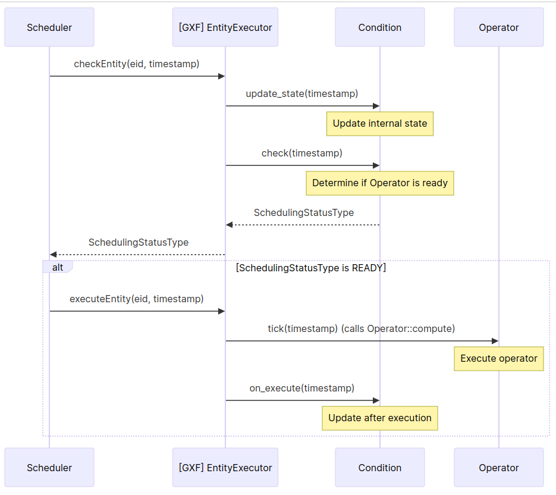

(holoscan-create-conditions)=
# Creating Conditions

:::{tip}
In most cases, applications will be built using one of several provided conditions documented in the [condition components section](components/conditions.md) of this user guide. This page illustrates the advanced use case of adding a user-defined condition to control when an operator can execute.
:::

(holoscan-defining-conditions-cpp)=
## C++ Conditions

When assembling a C++ application, two types of conditions can be used:

 1. **{ref}`Native C++ conditions<native-conditions>`**: custom conditions defined in C++ without using the GXF API, by creating a subclass of {cpp:class}`holoscan::Condition`.
 2. **{ref}`GXF Conditions<gxf-conditions>`**: conditions defined in the underlying C++ library by inheriting from the {cpp:class}`holoscan::ops::GXFCondition <holoscan::GXFCondition>` class. These conditions wrap GXF scheduling term components from GXF extensions. Examples are {cpp:class}`~holoscan::CountCondition` for limiting operator execution to a specified count and {cpp:class}`~holoscan::PeriodicCondition` for restricting the rate of execution of an operator to a specified period. Several additional built-in conditions are documented in the [condition components section](components/conditions.md).

:::{note}
It is possible to assign a mixture of GXF conditions and native conditions to an operator.
:::

(native-conditions)=
### Native Conditions

#### Understanding operator scheduling


`````{tab-set}
````{tab-item} C++
The {cpp:enum}`holoscan::SchedulingStatusType` enum defines the current status of the condition.

| **Condition Scheduling Status**         | **Description**                                                         |
|-----------------------------------------|-------------------------------------------------------------------------|
| kNever                                  | Operator will never execute again                                       |
| kReady                                  | Operator is ready for execution                                         |
| kWait                                   | Operator may execute in the future                                      |
| kWaitTime                               | Operator will be ready for execution after specified duration           |
| kWaitEvent                              | Operator is waiting on an asynchronous event with unknown time interval |

The overall readiness of an operator to execute will be determined by AND combination of the status of all of the individual conditions present on an operator. In other words, the operator will only be able to execute once all conditions are in a `kReady` state. If any condition is in `kNever` state, the operator will never execute again.

When multiple operators are ready to execute at the same time, the order in which they execute will depend on the specific {cpp:class}`~holoscan::Scheduler` being used by the application. For example, the {cpp:class}`~holoscan::GreedyScheduler` executes one operator at a time in a fixed, deterministic order while the {cpp:class}`~holoscan::EventBasedScheduler` and {cpp:class}`~holoscan::MultiThreadScheduler` can have multiple worker threads that allow operators to execute in parallel.
````
````{tab-item} Python
The {py:class}`holoscan.core.SchedulingStatusType` enum defines the current status of the condition.

| **Condition Scheduling Status**         | **Description**                                                         |
|-----------------------------------------|-------------------------------------------------------------------------|
| NEVER                                   | Operator will never execute again                                       |
| READY                                   | Operator is ready for execution                                         |
| WAIT                                    | Operator may execute in the future                                      |
| WAIT_TIME                               | Operator will be ready for execution after specified duration           |
| WAIT_EVENT                              | Operator is waiting on an asynchronous event with unknown time interval |

The overall readiness of an operator to execute will be determined by AND combination of the status of all of the individual conditions present on an operator. In other words, the operator will only be able to execute once all conditions are in a `READY` state. If any condition is in `NEVER` state, the operator will never execute again.

When multiple operators are ready to execute at the same time, the order in which they execute will depend on the specific {cpp:class}`~holoscan::Scheduler` being used by the application. For example, the {py:class}`~holoscan.schedulers.GreedyScheduler` executes one operator at a time in a fixed, deterministic order while the {py:class}`~holoscan.schedulers.EventBasedScheduler` and {py:class}`~holoscan.schedulers.MultiThreadScheduler` can have multiple worker threads that allow operators to execute in parallel.
````
`````
#### Creating a custom condition (C++)

When creating a native `Condition` ({cpp:class}`C++ <holoscan::Condition>`/{py:class}`Python <holoscan.core.Condition>`), one will typically need to override the following base component class methods
* `initialize` ({cpp:func}`C++ <holoscan::Condition::initialize>`/{py:func}`Python <holoscan.core.Condition.initialize>`) is called once during initialization after the applications `run` ({cpp:func}`C++ <holoscan::Application::run>`/{py:func}`Python <holoscan.core.Application.run>`) method is called. This can be used to setup any initial status for the member variables defined for the condition. It is important that this method call the base `initialize` ({cpp:func}`C++ <holoscan::Condition::initialize>`/{py:func}`Python <holoscan.core.Condition.initialize>`) method prior to using any parameters defined by `setup` ({cpp:func}`C++ <holoscan::Condition::setup>`/{py:func}`Python <holoscan.core.Condition.setup>`).
* `setup` ({cpp:func}`C++ <holoscan::Condition::setup>`/{py:func}`Python <holoscan.core.Condition.setup>`) This method is used to configure any parameters defined for the condition. This method will be called automatically by the `Application` ({cpp:class}`C++ <holoscan::Application>`/{py:class}`Python <holoscan.core.Application>`) class when its `run` ({cpp:func}`C++ <holoscan::Application::run>`/{py:func}`Python <holoscan.core.Application.run>`) method is called.

It is also required to override the following three methods that will be used by the underlying GXF scheduler. Of these, the `check` method is the only one that is always required to have a non-empty implementation.
* `check` ({cpp:func}`C++ <holoscan::Condition::check>`/{py:func}`Python <holoscan.core.Condition.check>`) is called by the underlying GXF scheduler in order to check whether the operator to which this condition is assigned is ready to execute. The operator will only execute when this check sets the `type` output argument to `holoscan::SchedulingStatusType::kReady` (C++) / `holoscan.core.SchedulingStatusType.READY` (Python).
* `on_execute` ({cpp:func}`C++ <holoscan::Condition::on_execute>`/{py:func}`Python <holoscan.core.Condition.on_execute>`) is called immediately after an operator's `compute` method ({cpp:func}`C++ <holoscan::Operator::compute>`/{py:func}`Python <holoscan.core.Operator.compute>`), just before any emitted messages are actually distributed to downstream receivers.
* `update_state` ({cpp:func}`C++ <holoscan::Condition::update_state>`/{py:func}`Python <holoscan.core.Condition.update_state>`) is always called immediately before `check` ({cpp:func}`C++ <holoscan::Condition::check>`/{py:func}`Python <holoscan.core.Condition.check>`) and is always passed the current timestamp as an input argument. This is used by operator whose status depends on the current timestamp.

To create a custom condition in C++, it is necessary to create a subclass of
`Condition` ({cpp:class}`C++ <holoscan::Condition>`/{py:class}`Python <holoscan.core.Condition>`). The following example demonstrates how to use native conditions (conditions that do not have an underlying, pre-compiled GXF SchedulingTerm).

`````{tab-set}
````{tab-item} C++

**Code Snippet:** [**examples/conditions/native/cpp/ping_periodic_native.cpp**](https://github.com/nvidia-holoscan/holoscan-sdk/blob/main/examples/conditions/native/cpp/ping_periodic_native.cpp)


```{code-block} cpp
:caption: examples/conditions/native/cpp/ping_periodic_native.cpp
:linenos: true
:lineno-start: 18
:emphasize-lines: 9,78-79
:name: ping-periodic-native-cpp

#include <optional>

#include "holoscan/holoscan.hpp"
#include "holoscan/operators/ping_rx/ping_rx.hpp"
#include "holoscan/operators/ping_tx/ping_tx.hpp"

namespace holoscan::conditions {

class NativePeriodicCondition : public Condition {
 public:
  HOLOSCAN_CONDITION_FORWARD_ARGS(NativePeriodicCondition)

  NativePeriodicCondition() = default;

  void initialize() override {
    // call parent initialize or parameters will not be registered
    Condition::initialize();
    recess_period_ns_ = recess_period_.get();
  };

  void setup(ComponentSpec& spec) override {
    spec.param(recess_period_,
               "recess_period",
               "Recess Period",
               "Recession period in nanoseconds",
               static_cast<int64_t>(0));
  }

  void check(int64_t timestamp, SchedulingStatusType* status_type,
             int64_t* target_timestamp) const override {
    if (status_type == nullptr) {
      throw std::runtime_error(
          fmt::format("Condition '{}' received nullptr for status_type", name()));
    }
    if (target_timestamp == nullptr) {
      throw std::runtime_error(
          fmt::format("Condition '{}' received nullptr for target_timestamp", name()));
    }
    if (!next_target_.has_value()) {
      *status_type = SchedulingStatusType::kReady;
      *target_timestamp = timestamp;
      return;
    }
    *target_timestamp = next_target_.value();
    *status_type = timestamp > *target_timestamp ? SchedulingStatusType::kReady
                                                 : SchedulingStatusType::kWaitTime;
  };

  void on_execute(int64_t timestamp) override {
    if (next_target_.has_value()) {
      next_target_ = next_target_.value() + recess_period_ns_;
    } else {
      next_target_ = timestamp + recess_period_ns_;
    }
  };

  void update_state([[maybe_unused]] int64_t timestamp) override {
    // no-op for this condition
  };

 private:
  Parameter<int64_t> recess_period_;

  int64_t recess_period_ns_ = 0;
  std::optional<int64_t> next_target_ = std::nullopt;
};

}  // namespace holoscan::conditions

class App : public holoscan::Application {
 public:
  void compose() override {
    using namespace holoscan;

    auto tx = make_operator<ops::PingTxOp>(
        "tx",
        make_condition<CountCondition>("count-condition", 5),
        make_condition<conditions::NativePeriodicCondition>(
            "dummy-condition", Arg("recess_period", static_cast<int64_t>(200'000'000))));

    auto rx = make_operator<ops::PingRxOp>("rx");

    add_flow(tx, rx);
  }
};

int main([[maybe_unused]] int argc, char** argv) {
  auto app = holoscan::make_application<App>();

  app->run();

  return 0;
}
```
````
````{tab-item} Python

**Code Snippet:** [**examples/conditions/native/python/ping_periodic_native.py**](https://github.com/nvidia-holoscan/holoscan-sdk/blob/main/examples/conditions/native/python/ping_periodic_native.py)

```{code-block} python
:caption: examples/conditions/native/python/ping_periodic_native.py
:linenos: true
:lineno-start: 18
:emphasize-lines: 8,77
:name: ping-periodic-native-py

from holoscan.conditions import CountCondition
from holoscan.core import Application, ComponentSpec, Condition, SchedulingStatusType
from holoscan.operators import PingRxOp, PingTxOp

# Now define a simple application using the operators defined above


class NativePeriodicCondition(Condition):
    """Example native Python periodic condition

    This behaves like holoscan.conditions.PeriodicCondition (which wraps an
    underlying C++ class). It is simplified in that it does not support a
    separate `policy` kwarg.

    Parameters
    ----------
    fragment: holoscan.core.Fragment
        The fragment (or Application) to which this condition will belong.
    recess_period : int, optional
        The time to wait before an operator can execute again (units are in
        nanoseconds).
    """

    def __init__(self, fragment, *args, recess_period=0, **kwargs):
        self.recess_period_ns = recess_period
        self.next_target = -1
        super().__init__(fragment, *args, **kwargs)

    # Could add a `recess_period` Parameter via `setup` like in the following
    #
    #   def setup(self, ComponentSpec: spec):
    #       spec.param("recess_period", 0)
    #
    # and then configure that parameter in `initialize`, but for Python it is
    # easier to just add parameters to `__init__` as shown above.

    def setup(self, spec: ComponentSpec):
        print("** native condition setup method called **")

    def initialize(self):
        print("** native condition initialize method called **")

    def update_state(self, timestamp):
        print("** native condition update_state method called **")

    def check(self, timestamp):
        print("** native condition check method called **")
        # initially ready when the operator hasn't been called previously
        if self.next_target < 0:
            return (SchedulingStatusType.READY, timestamp)

        # return WAIT_TIME and the timestamp if the specified `recess_period` hasn't been reached
        status_type = (
            SchedulingStatusType.READY
            if (timestamp > self.next_target)
            else SchedulingStatusType.WAIT_TIME
        )
        return (status_type, self.next_target)

    def on_execute(self, timestamp):
        print("** native condition on_execute method called **")
        if self.next_target > 0:
            self.next_target = self.next_target + self.recess_period_ns
        else:
            self.next_target = timestamp + self.recess_period_ns


class MyPingApp(Application):
    def compose(self):
        # Configure the operators. Here we use CountCondition to terminate
        # execution after a specific number of messages have been sent.
        # PeriodicCondition is used so that each subsequent message is
        # sent only after a period of 200 milliseconds has elapsed.
        tx = PingTxOp(
            self,
            CountCondition(self, 10),
            NativePeriodicCondition(self, recess_period=200_000_000),
            name="tx",
        )
        rx = PingRxOp(self, name="rx")

        # Connect the operators into the workflow:  tx -> rx
        self.add_flow(tx, rx)


def main():
    app = MyPingApp()
    app.run()


if __name__ == "__main__":
    main()
```
````
`````
In this application, two operators are created: `PingTxOp` ({cpp:class}`C++ <holoscan::Operators::PingTxOp>` / {py:class}`Python <holoscan.operators.PingRxOp>`).

  1. The `tx` operator is a source operator that emits an integer value each time it is evoked.
  2. The `rx` operator is a sink operator that receives one value from the `tx` operator.

One custom condition, `NativePeriodicCondition` is created by inheriting from the `Condition` ({cpp:class}`C++ <holoscan::Condition>`/{py:class}`Python <holoscan.core.Condition>`) class. This condition is a simplified version of the provided `PeriodicCondition` ({cpp:class}`C++ <holoscan::PeriodicCondition>`/{py:class}`Python <holoscan.conditions.PeriodicCondition>`) (it does not implement the `policy` argument and only accepts an integer valued `recess_period`). We only create this condition to have a simple case to illustrate how a custom condition can be created.

The `setup` method of `NativePeriodicCondition` defines a single parameter named "recess_period", which represents the amount of time in nanoseconds that an operator will have to wait after executing before it can execute again.

In defining the `initialize` method, note that we start by calling `initialize` ({cpp:func}`C++ <holoscan::Condition::initialize>`/{py:func}`Python <holoscan.core.Condition.initialize>`) so that we can get the value for the built in "recess_period" parameter. This initialize method then sets the initial state of the private member variables for this operator.

The `check` method is implemented to set `type` to `SchedulingStatusType::kReady` (C++) / `SchedulingStatusType.READY` (Python) if the specified period has elapsed. Otherwise, it sets the `target_timestamp` and sets `type` to `SchedulingStatusType::kWaitTime` (C++) / `SchedulingStatusType.WAIT_TIME` (Python). In this case `kWaitTime` is used because we know specifically what the target timestamp is. Note that for other types of conditions, we may not know the specific time at which the condition will be satisfied. In such a case where a target timestamp isn't known, one should instead set the status to `kWait` (C++) / `WAIT` (Python) and would not need to set `target_timestamp`. There is also a `kWaitEvent` (C++) / `WAIT_EVENT` (Python) state which can be used, but this is less common. Currently only the built-in `AsynchronousCondition` uses this status type. Finally, if we wanted to indicate that an operator would never execute again, we would return `kNever` (C++) / `NEVER` (Python) (a concrete example that uses never is the `CountCondition` ({cpp:class}`C++ <holoscan::CountCondition>`/{py:class}`Python <holoscan.core.CountCondition>`) which sets that state once the specified count has been reached).

The `on_execute` method sets the internal `next_target_` timestamp to the timestamp passed in. Because the underlying GXF framework calls this method immediately after `Operator::compute`, this is setting the period waited by this condition to be from the time when the prior call to `compute` completed.

The `update_state` method was not needed for this operator. This method is always called immediately prior to `check` and sometimes conditions choose to call it from the `on_execute` method. It is intended to perform some update of the internal state of the condition based on the timestamp at the time it is called.

For the C++ API, we can construct a shared pointer to an instance of the condition using the `make_condition` method. That condition can then be passed to the `make_operator` method for the operator the condition will apply to (in this case `PingTxOp`). For the Python API, we instead directly pass the constructed `NativePeriodicCondition` as a positional argument to the `tx` operator.

#### Condition Evaluation Timing Diagram

To better understand when a condition's `check`, `update_state` and `on_execute` methods would be called by the underlying GXF entity executor, please see the following diagram.



It can be seen that when checking if an operator is ready to execute the `Condition::update_state` method will be called immediately before `Condition::check`. If the check was successful (across the combination of all conditions on the operator), then the compute method would be called for that operator. The `Condition::on_execute` method is only called once compute completes.

#### Creating a custom condition involving transmitter or receiver queues

Some condition types depend on the state of the receiver or transmitter queues corresponding to an input or output port of an operator. This type of condition can also be created as a native condition. An illustration of this for an equivalent of `MessageAvailableCondition` is given in a second example. See **C++:** [**examples/conditions/native/cpp/message_available_native.cpp**](https://github.com/nvidia-holoscan/holoscan-sdk/blob/main/examples/conditions/native/cpp/message_available_native.cpp), **Python:** [**examples/conditions/native/python/message_available_native.py**](https://github.com/nvidia-holoscan/holoscan-sdk/blob/main/examples/conditions/native/python/message_available_native.py).

The primary additional consideration in designing such a message-based condition is how to retrieve the `Receiver` ({cpp:class}`C++ <holoscan::Receiver>`/{py:class}`Python <holoscan.resources.Receiver>`) or `Transmitter` ({cpp:class}`C++ <holoscan::Transmitter>`/{py:class}`Python <holoscan.resources.Transmitter>`) object for use in the native Condition's methods.

`````{tab-set}
````{tab-item} C++
In the case of a native C++ condition, a parameter of type `Parameter<std::shared_ptr<holoscan::Receiver>> receiver_` should be defined as shown on lines 114 and 67-71. Methods to query the queue size can then be used as demonstrated for the `check_min_size` method on lines 109-112.

**Code Snippet:** [**examples/conditions/native/cpp/message_available_native.cpp**](https://github.com/nvidia-holoscan/holoscan-sdk/blob/main/examples/conditions/native/cpp/message_available_native.cpp)


```{code-block} cpp
:caption: examples/conditions/native/cpp/message_available_native.cpp
:linenos: true
:lineno-start: 55
:emphasize-lines: 13-17, 55-58, 60
:name: message-available-native-cpp

class NativeMessageAvailableCondition : public Condition {
 public:
  HOLOSCAN_CONDITION_FORWARD_ARGS(NativeMessageAvailableCondition)

  NativeMessageAvailableCondition() = default;

  void initialize() override {
    // call parent initialize or parameters will not be registered
    Condition::initialize();
  };

  void setup(ComponentSpec& spec) override {
    spec.param(receiver_,
               "receiver",
               "Receiver",
               "The scheduling term permits execution if this channel has at least a given "
               "number of messages available.");
    spec.param(min_size_,
               "min_size",
               "Minimum size",
               "The condition permits execution if the given receiver has at least the given "
               "number of messages available",
               static_cast<uint64_t>(1));
  }

  void check(int64_t timestamp, SchedulingStatusType* type,
             int64_t* target_timestamp) const override {
    if (type == nullptr) {
      throw std::runtime_error(fmt::format("Condition '{}' received nullptr for type", name()));
    }
    if (target_timestamp == nullptr) {
      throw std::runtime_error(
          fmt::format("Condition '{}' received nullptr for target_timestamp", name()));
    }
    *type = current_state_;
    *target_timestamp = last_state_change_;
  };

  void on_execute(int64_t timestamp) override { update_state(timestamp); };

  void update_state(int64_t timestamp) override {
    const bool is_ready = check_min_size();
    if (is_ready && current_state_ != SchedulingStatusType::kReady) {
      current_state_ = SchedulingStatusType::kReady;
      last_state_change_ = timestamp;
    }

    if (!is_ready && current_state_ != SchedulingStatusType::kWait) {
      current_state_ = SchedulingStatusType::kWait;
      last_state_change_ = timestamp;
    }
  };

 private:
  bool check_min_size() {
    auto recv = receiver_.get();
    return recv->back_size() + recv->size() >= min_size_.get();
  }

  Parameter<std::shared_ptr<holoscan::Receiver>> receiver_;
  Parameter<uint64_t> min_size_;

  SchedulingStatusType current_state_ =
      SchedulingStatusType::kWait;  // The current state of the scheduling term
  int64_t last_state_change_ = 0;   // timestamp when the state changed the last time
};

```
````
````{tab-item} Python
In the case of a native Python condition, the name of the input or output port corresponding to the receiver or transmitter of interest should be passed to the constructor as shown on lines 78-79. The {py:func}`holoscan.core.Condition.receiver` (or {py:func}`holoscan.core.Condition.transmitter`) method can then be used to retrieve the actual `Receiver` (or `Transmitter`) object corresponding to a specific port name as shown on lines 94-98. Once that object has been retrieved, methods to query the queue size can be used as shown for the `check_min_size` method.

**Code Snippet:** [**examples/conditions/native/python/message_available_native.py**](https://github.com/nvidia-holoscan/holoscan-sdk/blob/main/examples/conditions/native/python/message_available_native.py)


```{code-block} python
:caption: examples/conditions/native/python/message_available_native.py
:linenos: true
:lineno-start: 59
:emphasize-lines: 20-21, 42-43, 36-40
:name: message-available-native-py

class NativeMessageAvailableCondition(Condition):
    """Example native Python periodic condition

    This behaves like holoscan.conditions.MessageAvailableCondition (which
    wraps an underlying C++ class). It is simplified in that it does not
    support a separate `policy` kwarg.

    Parameters
    ----------
    fragment : holoscan.core.Fragment
        The fragment (or Application) to which this condition will belong.
    port_name : str
        The name of the input port on the operator whose Receiver queue this condition will apply
        to.
    min_size : int, optional
        The number of messages that must be present on the specified input port before the
        operator is allowed to execute.
    """

    def __init__(self, fragment, port_name: str, *args, min_size: int = 1, **kwargs):
        self.port_name = port_name

        if not isinstance(min_size, int) or min_size <= 0:
            raise ValueError("min_size must be a positive integer")
        self.min_size = min_size

        # The current state of the scheduling term
        self.current_state = SchedulingStatusType.WAIT
        # timestamp when the state changed the last time
        self.last_state_change_ = 0
        super().__init__(fragment, *args, **kwargs)

    def setup(self, spec: ComponentSpec):
        print("** native condition setup method called **")

    def initialize(self):
        print("** native condition initialize method called **")
        self.receiver_obj = self.receiver(self.port_name)
        if self.receiver_obj is None:
            raise RuntimeError(f"Receiver for port '{self.port_name}' not found")

    def check_min_size(self):
        return self.receiver_obj.back_size + self.receiver_obj.size >= self.min_size

    def update_state(self, timestamp):
        print("** native condition update_state method called **")
        is_ready = self.check_min_size()
        if is_ready and self.current_state != SchedulingStatusType.READY:
            self.current_state = SchedulingStatusType.READY
            self.last_state_change = timestamp
        if not is_ready and self.current_state != SchedulingStatusType.WAIT:
            self.current_state = SchedulingStatusType.WAIT
            self.last_state_change = timestamp

    def check(self, timestamp):
        print("** native condition check method called **")
        return self.current_state, self.last_state_change

    def on_execute(self, timestamp):
        print("** native condition on_execute method called **")
        self.update_state(timestamp)
```
````
`````

#### Override behavior for default Operator port conditions

The {ref}`section on customizing input and output ports <further-customizing-inputs-and-outputs>`, explains that when a user adds a port without specifying any condition in `Operator::setup`,  a default one is added. This default is a `MessageAvailableCondition` for input ports or a `DownstreamMessageAffordableCondition` for output ports).

If the user has supplied their own `Condition` to `make_operator` (C++) or as a positional argument to the operator constructor (Python) and that condition has a "receiver" or "transmitter" argument corresponding to an Operator port name, then a default condition should **not** be added to that port. This is done to avoid having multiple, potentially conflicting conditions on the same port. However, if the `Operator::setup` method **explicitly** specifies a condition via a call to `IOSpec::condition`, then that explicit condition would still be added to the port in addition to any other user-supplied one.

#### Creating Python bindings for a custom C++ condition

To expose a custom C++ condition to Python, it can be wrapped using [pybind11](https://pybind11.readthedocs.io/en/stable/index.html) just like any other `Condition` class. For several examples, see the [bindings for built-in conditions](https://github.com/nvidia-holoscan/holoscan-sdk/tree/main/python/holoscan/conditions). The only difference for binding a custom condition vs. the examples in that folder is that custom conditions should use `holoscan::Condition` instead of `holoscan::gxf::GXFCondition` in the list of classes passed to the `py::class_` call.
