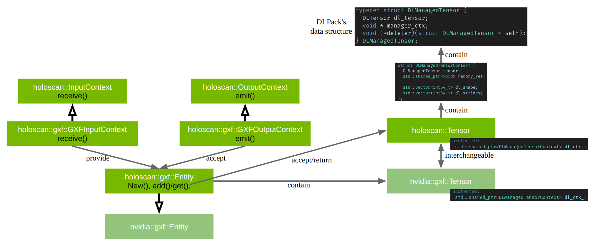

(holoscan-create-operators)=
# Creating Operators

:::{tip}
Creating a custom operator is also illustrated in the [ping_custom_op](./examples/ping_custom_op.md) example.
:::

(holoscan-defining-operators-cpp)=
## C++ Operators

When assembling a C++ application, two types of operators can be used:

 1. **{ref}`Native C++ operators<native-cpp-operators>`**: custom operators defined in C++ without using the GXF API, by creating a subclass of {cpp:class}`holoscan::Operator`. These C++ operators can pass arbitrary C++ objects around between operators.
 2. **{ref}`GXF Operators<wrap-gxf-codelet-as-operator>`**: operators defined in the underlying C++ library by inheriting from the {cpp:class}`holoscan::ops::GXFOperator <holoscan::ops::GXFOperator>` class. These operators wrap GXF codelets from GXF extensions. Examples are {cpp:class}`~holoscan::ops::VideoStreamReplayerOp` for replaying video files, {cpp:class}`~holoscan::ops::FormatConverterOp` for format conversions, and {cpp:class}`~holoscan::ops::HolovizOp` for visualization.

:::{note}
It is possible to create an application using a mixture of GXF operators and native operators. In this case, some special consideration to cast the input and output tensors appropriately must be taken, as shown in {ref}`a section below<interoperability-with-gxf-operators-cpp>`.
:::

(native-cpp-operators)=
### Native C++ Operators

#### Operator Lifecycle (C++)

The lifecycle of a {cpp:class}`holoscan::Operator` is made up of three stages:

* {cpp:func}`~holoscan::Operator::start` is called once when the operator starts, and is used for initializing heavy tasks such as allocating memory resources and using parameters.
* {cpp:func}`~holoscan::Operator::compute` is called when the operator is triggered, which can occur any number of times throughout the operator lifecycle between `start()` and `stop()`.
* {cpp:func}`~holoscan::Operator::stop` is called once when the operator is stopped, and is used for deinitializing heavy tasks such as deallocating resources that were previously assigned in `start()`.

All operators on the workflow are scheduled for execution. When an operator is first executed, the `start()` method is called, followed by the `compute()` method. When the operator is stopped, the `stop()` method is called. The `compute()` method is called multiple times between `start()` and `stop()`.

If any of the scheduling conditions specified by {ref}`Conditions <holoscan-concepts-condition>` are not met (for example, the {cpp:class}`~holoscan::CountCondition` would cause the scheduling condition to not be met if the operator has been executed a certain number of times), the operator is stopped and the `stop()` method is called.

We will cover how to use {ref}`Conditions <exhale_class_classholoscan_1_1Condition>` in the {ref}`specifying-operator-inputs-and-outputs-cpp` section of the user guide.

Typically, the `start()` and the `stop()` functions are only called once during the application's lifecycle. However, if the scheduling conditions are met again, the operator can be scheduled for execution, and the `start()` method will be called again.

```{digraph} lifecycle
:align: center
:caption: The sequence of method calls in the lifecycle of a Holoscan Operator

    rankdir="LR"
    node [shape=Mrecord];

    start [label="start"]
    compute [label="compute"]
    stop [label="stop"]

    start -> compute
    compute -> compute
    compute -> stop
```

:::{warning}
If Python bindings are going to be created for this C++ operator, it is recommended to put any cleanup of resources allocated in the `initialize()` and/or `start()` methods into the `stop()` method of the operator and **not** in its destructor. This is necessary as a workaround to a current issue where it is not guaranteed that the destructor always gets called prior to Python application termination. The `stop()` method will always be explicitly called, so we can be assured that any cleanup happens as expected.
:::

We can override the default behavior of the operator by implementing the above methods. The following example shows how to implement a custom operator that overrides start, stop, and compute methods.


```{code-block} cpp
:caption: The basic structure of a Holoscan Operator (C++)
:linenos: true

#include "holoscan/holoscan.hpp"

using holoscan::Operator;
using holoscan::OperatorSpec;
using holoscan::InputContext;
using holoscan::OutputContext;
using holoscan::ExecutionContext;
using holoscan::Arg;
using holoscan::ArgList;

class MyOp : public Operator {
 public:
  HOLOSCAN_OPERATOR_FORWARD_ARGS(MyOp)

  MyOp() = default;

  void setup(OperatorSpec& spec) override {
  }

  void start() override {
    HOLOSCAN_LOG_TRACE("MyOp::start()");
  }

  void compute(InputContext&, OutputContext& op_output, ExecutionContext&) override {
    HOLOSCAN_LOG_TRACE("MyOp::compute()");
  };

  void stop() override {
    HOLOSCAN_LOG_TRACE("MyOp::stop()");
  }
};
```

#### Creating a custom operator (C++)

To create a custom operator in C++, it is necessary to create a subclass of
{cpp:class}`holoscan::Operator`. The following example demonstrates how to use native operators (the operators that do not have an underlying, pre-compiled GXF Codelet).

**Code Snippet:** [**examples/ping_multi_port/cpp/ping_multi_port.cpp**](https://github.com/nvidia-holoscan/holoscan-sdk/blob/main/examples/ping_multi_port/cpp/ping_multi_port.cpp)

```{code-block} cpp
:caption: examples/ping_multi_port/cpp/ping_multi_port.cpp
:linenos: true
:lineno-start: 21
:emphasize-lines: 33-34,53,57,75,85-89,93-94,103-104,116-117
:name: ping-multi-port-cpp

#include "holoscan/holoscan.hpp"

class ValueData {
 public:
  ValueData() = default;
  explicit ValueData(int value) : data_(value) {
    HOLOSCAN_LOG_TRACE("ValueData::ValueData(): {}", data_);
  }
  ~ValueData() { HOLOSCAN_LOG_TRACE("ValueData::~ValueData(): {}", data_); }

  void data(int value) { data_ = value; }

  int data() const { return data_; }

 private:
  int data_;
};

namespace holoscan::ops {

class PingTxOp : public Operator {
 public:
  HOLOSCAN_OPERATOR_FORWARD_ARGS(PingTxOp)

  PingTxOp() = default;

  void setup(OperatorSpec& spec) override {
    spec.output<std::shared_ptr<ValueData>>("out1");
    spec.output<std::shared_ptr<ValueData>>("out2");
  }

  void compute(InputContext&, OutputContext& op_output, ExecutionContext&) override {
    auto value1 = std::make_shared<ValueData>(index_++);
    op_output.emit(value1, "out1");

    auto value2 = std::make_shared<ValueData>(index_++);
    op_output.emit(value2, "out2");
  };
  int index_ = 1;
};

class PingMxOp : public Operator {
 public:
  HOLOSCAN_OPERATOR_FORWARD_ARGS(PingMxOp)

  PingMxOp() = default;

  void setup(OperatorSpec& spec) override {
    spec.input<std::shared_ptr<ValueData>>("in1");
    spec.input<std::shared_ptr<ValueData>>("in2");
    spec.output<std::shared_ptr<ValueData>>("out1");
    spec.output<std::shared_ptr<ValueData>>("out2");
    spec.param(multiplier_, "multiplier", "Multiplier", "Multiply the input by this value", 2);
  }

  void compute(InputContext& op_input, OutputContext& op_output, ExecutionContext&) override {
    auto value1 = op_input.receive<std::shared_ptr<ValueData>>("in1").value();
    auto value2 = op_input.receive<std::shared_ptr<ValueData>>("in2").value();

    HOLOSCAN_LOG_INFO("Middle message received (count: {})", count_++);

    HOLOSCAN_LOG_INFO("Middle message value1: {}", value1->data());
    HOLOSCAN_LOG_INFO("Middle message value2: {}", value2->data());

    // Multiply the values by the multiplier parameter
    value1->data(value1->data() * multiplier_);
    value2->data(value2->data() * multiplier_);

    op_output.emit(value1, "out1");
    op_output.emit(value2, "out2");
  };

 private:
  int count_ = 1;
  Parameter<int> multiplier_;
};

class PingRxOp : public Operator {
 public:
  HOLOSCAN_OPERATOR_FORWARD_ARGS(PingRxOp)

  PingRxOp() = default;

  void setup(OperatorSpec& spec) override {
    // // Since Holoscan SDK v2.3, users can define a multi-receiver input port using 'spec.input()'
    // // with 'IOSpec::kAnySize'.
    // // The old way is to use 'spec.param()' with 'Parameter<std::vector<IOSpec*>> receivers_;'.
    // spec.param(receivers_, "receivers", "Input Receivers", "List of input receivers.", {});
    spec.input<std::vector<std::shared_ptr<ValueData>>>("receivers", IOSpec::kAnySize);
  }

  void compute(InputContext& op_input, OutputContext&, ExecutionContext&) override {
    auto value_vector =
        op_input.receive<std::vector<std::shared_ptr<ValueData>>>("receivers").value();

    HOLOSCAN_LOG_INFO("Rx message received (count: {}, size: {})", count_++, value_vector.size());

    HOLOSCAN_LOG_INFO("Rx message value1: {}", value_vector[0]->data());
    HOLOSCAN_LOG_INFO("Rx message value2: {}", value_vector[1]->data());
  };

 private:
  // // Since Holoscan SDK v2.3, the following line is no longer needed.
  // Parameter<std::vector<IOSpec*>> receivers_;
  int count_ = 1;
};

}  // namespace holoscan::ops

class MyPingApp : public holoscan::Application {
 public:
  void compose() override {
    using namespace holoscan;

    // Define the tx, mx, rx operators, allowing the tx operator to execute 10 times
    auto tx = make_operator<ops::PingTxOp>("tx", make_condition<CountCondition>(10));
    auto mx = make_operator<ops::PingMxOp>("mx", Arg("multiplier", 3));
    auto rx = make_operator<ops::PingRxOp>("rx");

    // Define the workflow
    add_flow(tx, mx, {{"out1", "in1"}, {"out2", "in2"}});
    add_flow(mx, rx, {{"out1", "receivers"}, {"out2", "receivers"}});
  }
};

int main(int argc, char** argv) {
  auto app = holoscan::make_application<MyPingApp>();
  app->run();

  return 0;
}
```

In this application, three operators are created: `PingTxOp`, `PingMxOp`, and `PingRxOp`

  1. The `PingTxOp` operator is a source operator that emits two values every time it is invoked. The values are emitted on two different output ports, `out1` (for odd integers) and `out2` (for even integers).
  2. The `PingMxOp` operator is a middle operator that receives two values from the `PingTxOp` operator and emits two values on two different output ports. The values are multiplied by the `multiplier` parameter.
  3. The `PingRxOp` operator is a sink operator that receives two values from the `PingMxOp` operator. The values are received on a single input, `receivers`, which is a vector of input ports. The `PingRxOp` operator receives the values in the order they are emitted by the `PingMxOp` operator.

As covered in more detail below, the inputs to each operator are specified in the {cpp:func}`~holoscan::Operator::setup` method
of the operator. Then inputs are received within the {cpp:func}`~holoscan::Operator::compute`
method via {cpp:func}`op_input.receive() <holoscan::InputContext::receive>` and outputs are emitted via {cpp:func}`op_output.emit() <holoscan::OutputContext::emit>`.

Note that for native C++ operators as defined here, any object including a shared pointer can be
emitted or received. For large objects such as tensors, it may be preferable from a performance
standpoint to transmit a shared pointer to the object rather than making a copy. When shared
pointers are used and the same tensor is sent to more than one downstream operator, you should
avoid in-place operations on the tensor or race conditions between operators may occur.


If you need to configure arguments or perform other setup tasks before or after the operator is initialized, you can override the `initialize()` method. This method is called once before the `start()` method.

Example:

```cpp
  void initialize() override {
    // Register custom type and codec for serialization
    register_converter<std::array<float, 3>>();
    gxf::GXFExecutor::register_codec<std::vector<InputSpec>>(
        "std::vector<holoscan::ops::HolovizOp::InputSpec>", true);

    // Set up prerequisite parameters before calling Operator::initialize()
    auto frag = fragment();

    // Check if an argument for 'allocator' exists
    auto has_allocator = std::find_if(
        args().begin(), args().end(), [](const auto& arg) { return (arg.name() == "allocator"); });
    // Create the allocator if no argument is provided
    if (has_allocator == args().end()) {
      allocator_ = frag->make_resource<UnboundedAllocator>("allocator");
      add_arg(allocator_.get());
    }

    // Call the parent class's initialize() method to complete the initialization.
    // Operator::initialize must occur after all arguments have been added.
    Operator::initialize();

    // After Operator::initialize(), the operator is ready for use and the parameters are set
    int multiplier = multiplier_;
    HOLOSCAN_LOG_INFO("Multiplier: {}", multiplier);
  }
```

For details on the `register_converter()` and `register_codec()` methods, refer to {cpp:func}`holoscan::ComponentBase::register_converter` for the custom parameter type and the section on {ref}`object serialization<object-serialization>` for distributed applications.


(specifying-operator-parameters-cpp)=

#### Specifying operator parameters (C++)

In the example `holoscan::ops::PingMxOp` operator above, you have a parameter `multiplier` that is declared as part of the class as a private member using the {cpp:func}`~holoscan::OperatorSpec::param` templated type:

```cpp
Parameter<int> multiplier_;
```

It is then added to the {cpp:class}`~holoscan::OperatorSpec` attribute of the operator in its {cpp:func}`~holoscan::Operator::setup` method, where an associated string key must be provided. Other properties can also be mentioned such as description and default value:

```cpp
// Provide key, and optionally other information
spec.param(multiplier_, "multiplier", "Multiplier", "Multiply the input by this value", 2);
```

:::{note}
If your parameter is of a custom type, you must register that type and provide a YAML encoder/decoder, as documented under {cpp:func}`holoscan::ComponentBase::register_converter`
:::

*See the {ref}`configuring-app-operator-parameters` section to learn how an application can set these parameters.*

(specifying-operator-inputs-and-outputs-cpp)=

#### Specifying operator inputs and outputs (C++)

To configure the input(s) and output(s) of C++ native operators, call the {cpp:func}`spec.input() <holoscan::OperatorSpec::input>` and {cpp:func}`spec.output() <holoscan::OperatorSpec::output>` methods within the {cpp:func}`~holoscan::Operator::setup` method of the operator.

The {cpp:func}`spec.input() <holoscan::OperatorSpec::input>` and {cpp:func}`spec.output() <holoscan::OperatorSpec::output>` methods should be called once for each input and output to be added. The {cpp:class}`~holoscan::OperatorSpec` object and the {cpp:func}`~holoscan::Operator::setup` method will be initialized and called automatically by the {cpp:class}`~holoscan::Application` class when its {cpp:func}`~holoscan::Application::run` method is called.

These methods ({cpp:func}`spec.input() <holoscan::OperatorSpec::input>` and {cpp:func}`spec.output() <holoscan::OperatorSpec::output>`) return an {cpp:class}`~holoscan::IOSpec` object that can be used to configure the input/output port.

By default, the {cpp:class}`holoscan::MessageAvailableCondition` and {cpp:class}`holoscan::DownstreamMessageAffordableCondition` conditions are applied (with a `min_size` of `1`) to the input/output ports. This means that the operator's {cpp:func}`~holoscan::Operator::compute` method will not be invoked until a message is available on the input port and the downstream operator's input port (queue) has enough capacity to receive the message.

```cpp
  void setup(OperatorSpec& spec) override {
    spec.input<std::shared_ptr<ValueData>>("in");
    // Above statement is equivalent to:
    //   spec.input<std::shared_ptr<ValueData>>("in")
    //       .condition(ConditionType::kMessageAvailable, Arg("min_size") = static_cast<uint64_t>(1));

    spec.output<std::shared_ptr<ValueData>>("out");
    // Above statement is equivalent to:
    //   spec.output<std::shared_ptr<ValueData>>("out")
    //       .condition(ConditionType::kDownstreamMessageAffordable, Arg("min_size") = static_cast<uint64_t>(1));
    ...
  }
```

In the above example, the {cpp:func}`spec.input() <holoscan::OperatorSpec::input>` method is used to configure the input port to have the {cpp:class}`holoscan::MessageAvailableCondition` with a minimum size of 1. This means that the operator's {cpp:func}`~holoscan::Operator::compute` method will not be invoked until a message is available on the input port of the operator. Similarly, the {cpp:func}`spec.output() <holoscan::OperatorSpec::output>` method is used to configure the output port to have the {cpp:class}`holoscan::DownstreamMessageAffordableCondition` with a minimum size of 1. This means that the operator's {cpp:func}`~holoscan::Operator::compute` method will not be invoked until the downstream operator's input port has enough capacity to receive the message.

If you want to change this behavior, use the {cpp:func}`IOSpec::condition() <holoscan::IOSpec::condition>` method to configure the conditions. For example, to configure the input and output ports to have no conditions, you can use the following code:

```cpp
  void setup(OperatorSpec& spec) override {
    spec.input<std::shared_ptr<ValueData>>("in")
        .condition(ConditionType::kNone);

    spec.output<std::shared_ptr<ValueData>>("out")
        .condition(ConditionType::kNone);
    // ...
  }
```

The example code in the {cpp:func}`~holoscan::Operator::setup` method configures the input port to have no conditions, which means that the {cpp:func}`~holoscan::Operator::compute` method will be called as soon as the operator is ready to compute. Since there is no guarantee that the input port will have a message available, the {cpp:func}`~holoscan::Operator::compute` method should check if there is a message available on the input port before attempting to read it.

The {cpp:func}`~holoscan::InputContext::receive` method of the {cpp:class}`~holoscan::InputContext`
object can be used to access different types of input data within the
{cpp:func}`~holoscan::Operator::compute` method of your operator class, where its template argument
(`DataT`) is the data type of the input. This method takes the name of the input port as an argument
(which can be omitted if your operator has a single input port), and returns the input data.
If input data is not available, the method returns an object of the `holoscan::expected<std::shared_ptr<ValueData>, holoscan::RuntimeError>` type.
The `holoscan::expected<T, E>` class template is used to represent expected objects, which can either hold a value of type `T` or an error of type `E`.
The expected object is used to return and propagate errors in a more structured way than using error codes or exceptions.
In this case, the expected object can hold either a `std::shared_ptr<ValueData>` object or a {cpp:class}`holoscan::RuntimeError` class that contains an error message describing the reason for the failure.

The `holoscan::RuntimeError` class is a derived class of `std::runtime_error` and supports accessing more error information, for example, with the {cpp:func}`~holoscan::RuntimeError::what` method.

In the example code fragment below, the `PingRxOp` operator receives input on a port called "in"
with data type `std::shared_ptr<ValueData>`. The {cpp:func}`~holoscan::InputContext::receive` method is used to
access the input data.
The `maybe_value` is checked to be valid or not with the `if` condition. If there is an error in the input data, the error message is logged and the operator throws the error.
If the input data is valid, we can access the reference of the input data using the `value()` method of the `expected` object.
To avoid copying the input data (or creating another shared pointer), the reference of the input data is stored in the `value` variable (using `auto& value = maybe_value.value()`).
The `data()` method of the `ValueData` class is then called to get the value of the input data.

```cpp
// ...

class PingRxOp : public holoscan::Operator {
 public:
  HOLOSCAN_OPERATOR_FORWARD_ARGS(PingRxOp)
  PingRxOp() = default;

  void setup(holoscan::OperatorSpec& spec) override {
    spec.input<std::shared_ptr<ValueData>>("in");
  }

  void compute(holoscan::InputContext& op_input, holoscan::OutputContext&,
               holoscan::ExecutionContext&) override {
    auto maybe_value = op_input.receive<std::shared_ptr<ValueData>>("in");

    if (!maybe_value) {
      HOLOSCAN_LOG_ERROR("Failed to receive message - {}", maybe_value.error().what());
      // [error] Failed to receive message - InputContext receive() Error: No message is received from the input port with name 'in'
      throw maybe_value.error(); // or `return;`
    }

    auto& value = maybe_value.value();
    HOLOSCAN_LOG_INFO("Message received (value: {})", value->data());
  }
};
```

Internally, message passing in Holoscan is implemented using the {cpp:class}`~holoscan::Message` class, which wraps a `std::any` object and provides a type-safe interface to access the input data. The `std::any` class is a type-safe container for single values of any type and is used to store the input and output data of operators. The `std::any` class is part of the C++ standard library and is defined in the `any` header file.

Since the Holoscan SDK uses GXF as an execution engine, the `holoscan::Message` object is also encapsulated in a `nvidia::gxf::Entity` object when passing data among Holoscan native operators and GXF operators. This ensures that the data is compatible with the GXF framework.

If the input data is expected to be from a GXF operator or a tensor (in both cases, the data is an instance of `nvidia::gxf::Entity`), the `holoscan::gxf::Entity` class can be used in the template argument of the `receive` method to access the input data. The `holoscan::gxf::Entity` class is a wrapper around the `nvidia::gxf::Entity` class (which is like a dictionary object) and provides a way to get a tensor and to add a tensor to the entity.

(holoscan-tensor-cpp)=

The Holoscan SDK provides built-in data types called **{ref}`Domain Objects<api/holoscan_cpp_api:Domain Objects>`**, defined in the `include/holoscan/core/domain` directory. For example, the {cpp:class}`holoscan::Tensor` is a Domain Object class that represents a multi-dimensional array of data, which is interoperable with the underlying GXF class (`nvidia::gxf::Tensor`). The `holoscan::Tensor` class provides methods to access the tensor data, shape, and other properties. Passing {cpp:class}`holoscan::Tensor` objects to/from {ref}`GXF operators<wrap-gxf-codelet-as-operator>` is supported.

:::{tip}
The {cpp:class}`holoscan::Tensor` class is a wrapper around the {cpp:type}`~holoscan::DLManagedTensorContext` struct holding a [DLManagedTensor](https://dmlc.github.io/dlpack/latest/c_api.html#c.DLManagedTensor) object. As such, it provides a primary interface to access tensor data and is interoperable with other frameworks that support the [DLPack interface](https://dmlc.github.io/dlpack/latest/).

See the {ref}`interoperability section<interoperability-with-gxf-operators-cpp>` for more details.
:::

In the example below, the TensorRx operator receives input on a port called "in" with data type {cpp:class}`holoscan::gxf::Entity`.


```cpp
// ...

class TensorRxOp : public holoscan::Operator {
 public:
  HOLOSCAN_OPERATOR_FORWARD_ARGS(TensorRxOp)
  TensorRxOp() = default;

  void setup(holoscan::OperatorSpec& spec) override {
    spec.input<holoscan::gxf::Entity>("in");
  }

  void compute(holoscan::InputContext& op_input, holoscan::OutputContext&,
               holoscan::ExecutionContext&) override {
    // Type of 'maybe_entity' is holoscan::expected<holoscan::gxf::Entity, holoscan::RuntimeError>
    auto maybe_entity = op_input.receive<holoscan::gxf::Entity>("in");
    if (maybe_entity) {
      auto& entity = maybe_entity.value();  // holoscan::gxf::Entity&
      // Get a tensor from the entity if it exists.
      // Can pass a tensor name as an argument to get a specific tensor.
      auto tensor = entity.get<holoscan::Tensor>();  // std::shared_ptr<holoscan::Tensor>
      if (tensor) {
        HOLOSCAN_LOG_INFO("tensor nbytes: {}", tensor->nbytes());
      }
    }
  }
};
```

If the entity contains a tensor, the `get` method of the `holoscan::gxf::Entity` class can be used to retrieve the tensor. The `get` method returns a `std::shared_ptr<holoscan::Tensor>` object, which can be used to access the tensor data. The `nbytes` method of the `holoscan::Tensor` class is used to get the number of bytes in the tensor.

By using the {cpp:class}`holoscan::TensorMap` class, which stores a map of tensor names to tensors (`std::unordered_map<std::string, std::shared_ptr<holoscan::Tensor>>`), the code that receives an entity object containing one or more tensor objects can be updated to receive a `holoscan::TensorMap` object instead of a `holoscan::gxf::Entity` object. The `holoscan::TensorMap` class provides a way to access the tensor data by name, using a `std::unordered_map`-like interface.

```cpp
// ...

class TensorRxOp : public holoscan::Operator {
 public:
  HOLOSCAN_OPERATOR_FORWARD_ARGS(TensorRxOp)
  TensorRxOp() = default;

  void setup(holoscan::OperatorSpec& spec) override {
    spec.input<holoscan::TensorMap>("in");
  }

  void compute(holoscan::InputContext& op_input, holoscan::OutputContext&,
               holoscan::ExecutionContext&) override {
    // Type of 'maybe_entity' is holoscan::expected<holoscan::TensorMap, holoscan::RuntimeError>
    auto maybe_tensor_map = op_input.receive<holoscan::TensorMap>("in");
    if (maybe_tensor_map) {
      auto& tensor_map = maybe_tensor_map.value();  // holoscan::TensorMap&
      for (const auto& [name, tensor] : tensor_map) {
        HOLOSCAN_LOG_INFO("tensor name: {}", name);
        HOLOSCAN_LOG_INFO("tensor nbytes: {}", tensor->nbytes());
      }
    }
  }
};
```

In the above example, the `TensorRxOp` operator receives input on a port called "in" with data type `holoscan::TensorMap`. The `receive` method of the `InputContext` object is used to access the input data. The `receive` method returns an `expected` object that can hold either a `holoscan::TensorMap` object or a `holoscan::RuntimeError` object. The `holoscan::TensorMap` class is a wrapper around the `std::unordered_map<std::string, std::shared_ptr<holoscan::Tensor>>` class and provides a way to access the tensor data. The `nbytes` method of the `holoscan::Tensor` class is used to get the number of bytes in the tensor.

If the type [std::any](https://en.cppreference.com/w/cpp/utility/any) is used for the template argument of the `receive` method, the {cpp:func}`~holoscan::InputContext::receive` method will return a `std::any` object containing the input of the specified name. In the example below, the `PingRxOp` operator receives input on a port called "in" with data type `std::any`. The `type()` method of the `std::any` object is used to determine the actual type of the input data, and the [std::any_cast<T>()](https://en.cppreference.com/w/cpp/utility/any/any_cast) function is used to retrieve the value of the input data.

```cpp
// ...

class AnyRxOp : public holoscan::Operator {
 public:
  HOLOSCAN_OPERATOR_FORWARD_ARGS_SUPER(AnyRxOp, holoscan::ops::GXFOperator)
  AnyRxOp() = default;
  void setup(holoscan::OperatorSpec& spec) override {
    spec.input<std::any>("in");
  }
  void compute(holoscan::InputContext& op_input, holoscan::OutputContext&, holoscan::ExecutionContext&) override {
    auto maybe_any = op_input.receive<std::any>("in");
    if (!maybe_any) {
      HOLOSCAN_LOG_ERROR("Failed to receive message - {}", maybe_any.error().what());
      return;
    }

    auto& in_any = maybe_any.value();
    const auto& in_any_type = in_any.type();

    try {
      if (in_any_type == typeid(holoscan::gxf::Entity)) {
        auto in_entity = std::any_cast<holoscan::gxf::Entity>(in_any);
        auto tensor = in_entity.get<holoscan::Tensor>();  // std::shared_ptr<holoscan::Tensor>
        if (tensor) {
          HOLOSCAN_LOG_INFO("tensor nbytes: {}", tensor->nbytes());
        }
      } else if (in_any_type == typeid(std::shared_ptr<ValueData>)) {
        auto in_value = std::any_cast<std::shared_ptr<ValueData>>(in_any);
        HOLOSCAN_LOG_INFO("Received value: {}", in_value->data());
      } else {
        HOLOSCAN_LOG_ERROR("Invalid message type: {}", in_any_type.name());
      }
    } catch (const std::bad_any_cast& e) {
      HOLOSCAN_LOG_ERROR("Failed to cast message - {}", e.what());
    }
  }
};
```

(retrieving-any-number-of-inputs-cpp)=
#### Receiving any number of inputs (C++)

Instead of assigning a specific number of input ports, it may be preferable to allow the ability to receive any number of objects on a port in certain situations.

##### Using `IOSpec::kAnySize` for variable input handling

One way to achieve this is to define a multi-receiver input port by calling `spec.input<std::vector<T>>("port_name", IOSpec::kAnySize)` with `IOSpec::kAnySize` as the second argument in the `setup()` method of the operator, where `T` is the type of the input data (as done for `PingRxOp` in the {ref}`native operator ping example <ping-multi-port-cpp>`).

```cpp
  void setup(OperatorSpec& spec) override {
    spec.input<std::vector<std::shared_ptr<ValueData>>>("receivers", IOSpec::kAnySize);
  }
```

```{code-block} cpp
:caption: examples/ping_multi_port/cpp/ping_multi_port.cpp
:linenos: true
:lineno-start: 98
:emphasize-lines: 8-12,16-17,26-27,45

class PingRxOp : public Operator {
 public:
  HOLOSCAN_OPERATOR_FORWARD_ARGS(PingRxOp)

  PingRxOp() = default;

  void setup(OperatorSpec& spec) override {
    // // Since Holoscan SDK v2.3, users can define a multi-receiver input port using 'spec.input()'
    // // with 'IOSpec::kAnySize'.
    // // The old way is to use 'spec.param()' with 'Parameter<std::vector<IOSpec*>> receivers_;'.
    // spec.param(receivers_, "receivers", "Input Receivers", "List of input receivers.", {});
    spec.input<std::vector<std::shared_ptr<ValueData>>>("receivers", IOSpec::kAnySize);
  }

  void compute(InputContext& op_input, OutputContext&, ExecutionContext&) override {
    auto value_vector =
        op_input.receive<std::vector<std::shared_ptr<ValueData>>>("receivers").value();

    HOLOSCAN_LOG_INFO("Rx message received (count: {}, size: {})", count_++, value_vector.size());

    HOLOSCAN_LOG_INFO("Rx message value1: {}", value_vector[0]->data());
    HOLOSCAN_LOG_INFO("Rx message value2: {}", value_vector[1]->data());
  };

 private:
  // // Since Holoscan SDK v2.3, the following line is no longer needed.
  // Parameter<std::vector<IOSpec*>> receivers_;
  int count_ = 1;
};

}  // namespace holoscan::ops

class MyPingApp : public holoscan::Application {
 public:
  void compose() override {
    using namespace holoscan;

    // Define the tx, mx, rx operators, allowing the tx operator to execute 10 times
    auto tx = make_operator<ops::PingTxOp>("tx", make_condition<CountCondition>(10));
    auto mx = make_operator<ops::PingMxOp>("mx", Arg("multiplier", 3));
    auto rx = make_operator<ops::PingRxOp>("rx");

    // Define the workflow
    add_flow(tx, mx, {{"out1", "in1"}, {"out2", "in2"}});
    add_flow(mx, rx, {{"out1", "receivers"}, {"out2", "receivers"}});
  }
};
```

Then, once the following configuration is provided in the `compose()` method,

```cpp
    add_flow(mx, rx, {{"out1", "receivers"}, {"out2", "receivers"}});
```

the `PingRxOp` will receive two inputs on the `receivers` port in the `compute()` method:

```cpp
    auto value_vector =
        op_input.receive<std::vector<std::shared_ptr<ValueData>>>("receivers").value();
```

:::{tip}
When an input port is defined with `IOSpec::kAnySize`, the framework creates a new input port for each input object received on the port. The input ports are named using the format `<port_name>:<index>`, where `<port_name>` is the name of the input port and `<index>` is the index of the input object received on the port. For example, if the `receivers` port receives two input objects, the input ports will be named `receivers:0` and `receivers:1`.

The framework internally creates a parameter (`receivers`) with the type `std::vector<holoscan::IOSpec*>`, implicitly creates input ports (`receivers:0` and `receivers:1`), and connects them (adding references of the input ports to the `receivers` vector). This way, when the `receive()` method is called, the framework can return the input data from the corresponding input ports as a vector.

```
auto value_vector =
        op_input.receive<std::vector<std::shared_ptr<ValueData>>>("receivers").value();
```
If you add `HOLOSCAN_LOG_INFO(rx->description());` at the end of the `compose()` method, you will see the description of the `PingRxOp` operator as shown below:

```yaml
id: -1
name: rx
fragment: ""
args:
  []
type: kNative
conditions:
  []
resources:
  []
spec:
  fragment: ""
  params:
    - name: receivers
      type: std::vector<holoscan::IOSpec*>
      description: ""
      flag: kNone
  inputs:
    - name: receivers:1
      io_type: kInput
      typeinfo_name: N8holoscan3gxf6EntityE
      connector_type: kDefault
      conditions:
        []
    - name: receivers:0
      io_type: kInput
      typeinfo_name: N8holoscan3gxf6EntityE
      connector_type: kDefault
      conditions:
        []
    - name: receivers
      io_type: kInput
      typeinfo_name: St6vectorISt10shared_ptrI9ValueDataESaIS2_EE
      connector_type: kDefault
      conditions:
        []
  outputs:
    []
```
:::

(configuring-queue-size)=

##### Configuring input port queue size and message batch condition (C++)

If you want to receive multiple objects on a port and process them in batches, you can increase the queue size of the input port and set the `min_size` parameter of the `MessageAvailableCondition` condition to the desired batch size. This can be done by calling the `connector()` and `condition()` methods with the desired arguments, using the batch size as the `capacity` and `min_size` parameters, respectively.

Setting `min_size` to `N` will ensure that the operator receives `N` objects before the `compute()` method is called.

```cpp
  void setup(holoscan::OperatorSpec& spec) override {
    spec.input<std::shared_ptr<ValueData>>("receivers")
        .connector(holoscan::IOSpec::ConnectorType::kDoubleBuffer,
                   holoscan::Arg("capacity", static_cast<uint64_t>(2)))
        .condition(holoscan::ConditionType::kMessageAvailable,
                   holoscan::Arg("min_size", static_cast<uint64_t>(2)));
  }
```

Then, the `receive()` method can be called with the `receivers` port name to receive input data in batches.

```cpp
  void compute(holoscan::InputContext& op_input, holoscan::OutputContext&,
               holoscan::ExecutionContext&) override {
    std::vector<std::shared_ptr<ValueData>> value_vector;
    auto maybe_value = op_input.receive<std::shared_ptr<ValueData>>("receivers");
    while (maybe_value) {
      value_vector.push_back(maybe_value.value());
      maybe_value = op_input.receive<std::shared_ptr<ValueData>>("receivers");
    }

    HOLOSCAN_LOG_INFO("Rx message received (size: {})", value_vector.size());
  }
```

In the above example, the operator receives input on a port called "receivers" with a queue size of 2 and a `min_size` of 2. The `receive()` method is called in a loop to receive the input data in batches of 2. Since the operator does not know the number of objects to be received in advance, the `receive()` method is called in a loop until it returns an error. The input data is stored in a vector, and the size of the vector is logged after all the input data is received.

To simplify the above code, the Holoscan SDK provides a `IOSpec::kPrecedingCount` constant as a second argument to the OperatorSpec's `input()` method to specify the number of preceding connections to the input port (in this case, the number of connections to the `receivers` port is 2) as the batch size. This can be used to receive the input data in batches without the need to call the `receive()` method in a loop.

```cpp
  void setup(holoscan::OperatorSpec& spec) override {
    spec.input<std::vector<std::shared_ptr<ValueData>>>("receivers", holoscan::IOSpec::kPrecedingCount);
  }
```

Then, the `receive()` method can be called with the `receivers` port name to receive the input data in batches.

```cpp
  void compute(holoscan::InputContext& op_input, holoscan::OutputContext&,
               holoscan::ExecutionContext&) override {
    auto value_vector =
        op_input.receive<std::vector<std::shared_ptr<ValueData>>>("receivers").value();

    HOLOSCAN_LOG_INFO("Rx message received (size: {})", value_vector.size());

    HOLOSCAN_LOG_INFO("Rx message value1: {}", value_vector[0]->data());
    HOLOSCAN_LOG_INFO("Rx message value2: {}", value_vector[1]->data());
  }
```

In the above example, the operator receives input on a port called "receivers" with a batch size of 2. The `receive()` method is called with the `receivers` port name to receive the input data in batches of 2. The input data is stored in a vector, and the size of the vector is logged after all the input data has been received.

If you want to use a specific batch size, you can use `holoscan::IOSpec::IOSize(int64_t)` instead of `holoscan::IOSpec::kPrecedingCount` to specify the batch size. Using IOSize in this way is equivalent to the more verbose `condition()` and `connector()` calls to update the `capacity` and `min_size` arguments shown near the start of this section.

The main reason to use `condition()` or `connector()` methods instead of the shorter `IOSize` is if additional parameter changes, such as the queue policy, need to be made. See more details on the use of the `condition()` and `connector()` methods in the advanced topics section below ({ref}`further-customizing-inputs-and-outputs`).

```cpp
  void setup(holoscan::OperatorSpec& spec) override {
    spec.input<std::vector<std::shared_ptr<ValueData>>>("receivers", holoscan::IOSpec::IOSize(2));
  }
```

If you want to receive the input data one by one, you can call the `receive()` method without using the `std::vector<T>` template argument.

```cpp
  void compute(holoscan::InputContext& op_input, holoscan::OutputContext&,
               holoscan::ExecutionContext&) override {
    while (true) {
      auto maybe_value = op_input.receive<std::shared_ptr<ValueData>>("receivers");
      if (!maybe_value) { break; }
      auto& value = maybe_value.value();
      // Process the input data
      HOLOSCAN_LOG_INFO("Rx message received (value: {})", value->data());
    }
  }
```

The above code will receive input data one by one from the `receivers` port. The `receive()` method is called in a loop until it returns an error. The input data is stored in a variable, and the value of the input data is logged.

:::{note}
This approach (receiving the input data one by one) is not applicable for the `holoscan::IOSpec::kAnySize` case. With the `holoscan::IOSpec::kAnySize` argument, the framework creates a new input port for each input object received on the port internally. Each implicit input port (named using the format `<port_name>:<index>`) is associated with a `MessageAvailableCondition` condition that has a `min_size` of `1`. Therefore, the `receive()` method needs to be called with the `std::vector<T>` template argument to receive the input data in batches at once.

If you really need to receive the input data one by one for `holoscan::IOSpec::kAnySize` case (though it is not recommended), you can receive the input data from each implicit input port (named `<port_name>:<index>`) one by one using the `receive()` method without the `std::vector<T>` template argument. (e.g., `op_input.receive<std::shared_ptr<ValueData>>("receivers:0")`, `op_input.receive<std::shared_ptr<ValueData>>("receivers:1")`, etc.).
To avoid the error message (such as `The operator does not have an input port with label 'receivers:X'`) when calling the `receive()` method for the implicit input port, you need to calculate the number of connections to the `receivers` port in advance and call the `receive()` method for each implicit input port accordingly.

```cpp
  void compute(holoscan::InputContext& op_input, holoscan::OutputContext&,
               holoscan::ExecutionContext&) override {
    int input_count = spec()->inputs().size() - 1;  // -1 to exclude the 'receivers' input port
    for (int i = 0; i < input_count; i++) {
      auto maybe_value =
          op_input.receive<std::shared_ptr<ValueData>>(fmt::format("receivers:{}", i).c_str());
      if (!maybe_value) { break; }
      auto& value = maybe_value.value();
      // Process the input data
      HOLOSCAN_LOG_INFO("Rx message received (value: {})", value->data());
    }
  }
```
:::

:::{attention}
Using `IOSpec::kPrecedingCount` or `IOSpec::IOSize(int64_t)` appears to show the same behavior as `IOSpec::kAnySize` in the above example. However, the difference is that since `IOSpec::kPrecedingCount` or `IOSpec::IOSize(int64_t)` doesn't use separate `MessageAvailableCondition` conditions for each (internal) input port, it is not guaranteed that the operator will receive the input data in order.

This means the operator may receive the input data in a different order than the order in which the connections are made in the `compose()` method. Additionally, with the multithread scheduler, it is not guaranteed that the operator will receive the input data from each of the connections uniformly. The operator may receive more input data from one connection than from another.

If the order of the input data is important, it is recommended to use `IOSpec::kAnySize` and call the `receive()` method with the `std::vector<T>` template argument to receive the input data in batches at once.
:::

Please see the [C++ system test cases](https://github.com/nvidia-holoscan/holoscan-sdk/blob/main/tests/system/multi_receiver_operator_ping_app.cpp) for more examples of receiving multiple inputs in C++ operators.

(or-port-combine-cpp)=

##### Configuring OR-combination of port conditions (C++)

When the operator has multiple input or output ports, each of which has its own condition, the default behavior of Holoscan SDK is an AND combination of all conditions. In some scenarios, it may be desirable to set some subset of ports to have instead OR combination of their conditions (e.g., an OR condition across two input ports can be used to allow an operator to execute if a message arrives on either port). Additional details of condition combination logic and the set of conditions provided by Holoscan are provided in the [condition components section](components/conditions.md).

The {cpp:func}`OperatorSpec::or_combine_port_conditions<holoscan::OperatorSpec::or_combine_port_conditions>` method can be called from within `Operator::setup` to specify that a subset of ports should have OR combination of their conditions. The only argument that must be provided is a vector containing the names of the ports whose conditions should be OR combined.

For a concrete example of OR combination, see the [multi_port_or_combiner](https://github.com/nvidia-holoscan/holoscan-sdk/blob/main/examples/conditions/or_combiner/cpp/multi_port_or_combiner.cpp) example. The relevant `setup` method from that example for the configuration of OR combination of the input ports is:

```cpp
void setup(OperatorSpec& spec) override {
  // Using size argument to explicitly set the receiver message queue size for each input.
  spec.input<int>("in1");
  spec.input<int>("in2");

  // configure Operator to execute if an input is on "in1" OR "in2"
  // (without this, the default is "in1" AND "in2")
  spec.or_combine_port_conditions({"in1", "in2"});
}
```

(or-combiner-cpp)=

#### General combination of conditions (C++)

For condition types which are not associated with an input or output port, the user creates them via {cpp:func}`Fragment::make_condition <holoscan::Fragment::make_condition>` which returns a `std::shared_ptr<Condition>`. Any number of such conditions can be passed as positional arguments to {cpp:func}`Fragment::make_operator <holoscan::Fragment::make_operator>` and the resulting status of the operator is the AND combination of these conditions. For example, the following would cause an operator to only execute of (condition1 AND condition2 AND condition3) are all ready.

```cpp
// passing multiple conditions to make_operator AND combines the conditions
auto my_cond1 = make_condition<MyCondition1>("condition1");
auto my_cond2 = make_condition<MyCondition2>("condition2");
auto my_cond3 = make_condition<MyCondition3>("condition3");
auto my_op = make_operator<MyOperator>("my_op", my_cond1, my_cond2, my_cond3);
```

If we instead want to allow OR combination of some subset of these conditions, then instead of passing all of these conditions directly to `make_operator`, we first create an {cpp:class}`OrConditionCombiner<holoscan::OrConditionCombiner>` for the terms we want OR logic to apply to and then pass that OR combiner object to `make_operator`. The following shows how one would configure ((condition1 OR condition2) AND condition3).

```cpp
// using generic MyCondition1, MyOperator, etc. class names for this example
auto my_cond1 = make_condition<MyCondition1>("condition1");
auto my_cond2 = make_condition<MyCondition2>("condition2");

// define an OR combination of the above two conditions
std::vector<std::shared_ptr<Condition>> terms({my_cond1, my_cond2});
auto or_combiner = make_resource<OrConditionCombiner>("or_combiner",  Arg{"terms", terms});

// create a third condition that will be AND combined
auto my_cond3 = make_condition<MyCondition3>("condition3");

// pass both the OR combiner and the conditions to be AND combined to MyOperator
auto my_op = make_operator<MyOperator>("my_op", or_combiner, my_cond3);
```

Note that for the above `MyOperator` example, if the operator also had input and/or output ports, then any port conditions (e.g. the default `MessageAvailableCondition` for input ports) would also be AND combined in addition to `condition3`.

Additional details of condition combination logic and the set of conditions provided by Holoscan is provided in the [condition components section](components/conditions.md).

:::{note}
Only conditions which the user has explicitly created via `make_condition` can be passed to `OrConditionCombiner`. To instead use OR combination across **implicitly** created conditions on input or output ports, see the section above regarding {cpp:func}`OperatorSpec::or_combine_port_conditions<holoscan::OperatorSpec::or_combine_port_conditions>`. A current limitation of the API is that there is not currently a way to use the input/output port conditions with the same `OrConditionCombiner` combiner as conditions explicitly created via `make_condition`.
:::

##### Configuring multi-port conditions (C++)

A subset of `Condition` types apply to multiple input ports of an operator (e.g. `MultiMessageAvailableCondition` and `MultiMessageAvailableTimeoutCondition`). In this case, rather than using the {cpp:func}`IOSpec::condition <holoscan::IOSpec::condition>` method as demonstrated above for setting a condition on a single port, the {cpp:func}`OperatorSpec::multi_port_condition <holoscan::OperatorSpec::multi_port_condition>` method should be used to configure a condition across multiple input ports. If an input port's name was included in a `multi_port_condition` call, this will automatically disable the default `MessageAvailableCondition` that would otherwise have been assigned to that port (This means it is not required to explicitly set a `ConditionType::kNone` condition on the input port via `IOSpec::condition` in order to be able to use the port with `multi_port_condition`).

Examples of use of multi-port conditions are given in the [examples/conditions/multi_message/](https://github.com/nvidia-holoscan/holoscan-sdk/blob/main/examples/conditions/multi_message) folder of the repository. An example of `Operator::setup` for a multi-message condition from `multi_message_sum_of_all.cpp` is shown below:

```cpp
  void setup(OperatorSpec& spec) override {
    // Using size argument to explicitly set the receiver message queue size for each input.
    spec.input<std::shared_ptr<std::string>>("in1", IOSpec::IOSize(10));
    spec.input<std::shared_ptr<std::string>>("in2", IOSpec::IOSize(10));
    spec.input<std::shared_ptr<std::string>>("in3", IOSpec::IOSize(10));

    // Use kMultiMessageAvailableTimeout to consider all three ports together. In this
    // "SumOfAll" mode, it only matters that `min_sum` messages have arrived across all the ports
    // {"in1", "in2", "in3"}, but it does not matter which ports the messages arrived on. The
    // "execution_frequency" is set to 30ms, so the operator can run once 30 ms has elapsed even
    // if 20 messages have not arrived. Use ConditionType::kMultiMessageAvailable instead if the
    // timeout interval is not desired.
    ArgList multi_message_args{
        holoscan::Arg("execution_frequency", std::string{"30ms"}),
        holoscan::Arg("min_sum", static_cast<size_t>(20)),
        holoscan::Arg("sampling_mode", MultiMessageAvailableTimeoutCondition::SamplingMode::kSumOfAll)};
    spec.multi_port_condition(
        ConditionType::kMultiMessageAvailableTimeout, {"in1", "in2", "in3"}, multi_message_args);
  }
```
Here, three input ports are defined, each of which has a queue size of 10. A `MultiMessageAvailableTimeoutCondition` is applied across all three of these ports via the `multi_port_condition` method. The condition is configured to allow the operator to execute when either a total of 20 messages have arrived across the three ports OR a time-out interval of 30 ms has elapsed.

#### Building your C++ operator

You can build your C++ operator using CMake, by calling `find_package(holoscan)` in your `CMakeLists.txt` to load the SDK libraries. Your operator will need to link against `holoscan::core`:

```{code-block} cmake
:caption: <src_dir>/CMakeLists.txt
# Your CMake project
cmake_minimum_required(VERSION 3.20)
project(my_project CXX)

# Finds the holoscan SDK
find_package(holoscan REQUIRED CONFIG PATHS "/opt/nvidia/holoscan")

# Create a library for your operator
add_library(my_operator SHARED my_operator.cpp)

# Link your operator against holoscan::core
target_link_libraries(my_operator
    PUBLIC holoscan::core
)
```

Once your `CMakeLists.txt` is ready in `<src_dir>`, you can build in `<build_dir>` with the command line below. You can optionally pass `Holoscan_ROOT` if the SDK installation you'd like to use differs from the `PATHS` given to `find_package(holoscan)` above.

```bash
# Configure
cmake -S <src_dir> -B <build_dir> -D Holoscan_ROOT="/opt/nvidia/holoscan"
# Build
cmake --build <build_dir> -j
```

#### Using your C++ Operator in an Application

* **If the application is configured in the same CMake project as the operator**, you can simply add the operator CMake target library name under the application executable `target_link_libraries` call, as the operator CMake target is already defined.

```cmake
  # operator
  add_library(my_op my_op.cpp)
  target_link_libraries(my_operator PUBLIC holoscan::core)

  # application
  add_executable(my_app main.cpp)
  target_link_libraries(my_operator
    PRIVATE
    holoscan::core
    my_op
  )
```

* **If the application is configured in a separate project as the operator**, you need to [export the operator](https://cmake.org/cmake/help/latest/guide/importing-exporting/index.html) in its own CMake project, and import it in the application CMake project, before being able to list it under `target_link_libraries` also. This is the same as what is done for the SDK  [built-in operators](./holoscan_operators_extensions.md#operators), available under the `holoscan::ops` namespace.

You can then include the headers to your C++ operator in your application code.

(wrap-gxf-codelet-as-operator)=

### GXF Operators

With the Holoscan C++ API, we can also wrap {ref}`GXF Codelets<holoscan-core-concepts-gxf>` from GXF extensions as Holoscan {ref}`Operators <exhale_class_classholoscan_1_1Operator>`.

:::{note}
If you do not have an existing GXF extension, we recommend developing native operators using the {ref}`C++<native-cpp-operators>` or {ref}`Python<native-python-operators>` APIs to skip the need for wrapping GXF codelets as operators. If you do need to create a GXF Extension, follow the {ref}`Creating a GXF Extension <creating-gxf-extension>` section for a detailed explanation of the GXF extension development process.
:::

:::{tip}
The manual codelet wrapping mechanism described below is no longer necessary in order to make use of a GXF Codelet as a Holoscan operator. There is a new {cpp:class}`~holoscan::ops::GXFCodeletOp` which allows directly using an existing GXF codelet via {cpp:func}`Fragment::make_operator <holoscan::Fragment::make_operator>` without having to first create a wrapper class for it. Similarly there is now also a {cpp:class}`~holoscan::GXFComponentResource` class which allows a GXF Component to be used as a Holoscan resource via {cpp:func}`Fragment::make_resource <holoscan::Fragment::make_resource>`. A detailed example of how to use each of these is provided for both C++ and Python applications in the [**examples/import_gxf_components**](https://github.com/nvidia-holoscan/holoscan-sdk/tree/main/examples/import_gxf_components) folder.
:::

Given an existing GXF extension, we can create a simple "identity" application consisting of a replayer, which reads contents from a file on disk, and our recorder from the last section, which will store the output of the replayer exactly in the same format. This allows us to see whether the output of the recorder matches the original input files.

The `MyRecorderOp` Holoscan Operator implementation below will wrap the `MyRecorder` GXF Codelet shown {ref}`here<my-recorder-hpp>`.

#### Operator definition

```{code-block} cpp
:caption: my_recorder_op.hpp
:linenos: true
:emphasize-lines: 21-22
#ifndef APPS_MY_RECORDER_APP_MY_RECORDER_OP_HPP
#define APPS_MY_RECORDER_APP_MY_RECORDER_OP_HPP

#include "holoscan/core/gxf/gxf_operator.hpp"

namespace holoscan::ops {

class MyRecorderOp : public holoscan::ops::GXFOperator {
 public:
  HOLOSCAN_OPERATOR_FORWARD_ARGS_SUPER(MyRecorderOp, holoscan::ops::GXFOperator)

  MyRecorderOp() = default;

  const char* gxf_typename() const override { return "MyRecorder"; }

  void setup(OperatorSpec& spec) override;

  void initialize() override;

 private:
  Parameter<holoscan::IOSpec*> receiver_;
  Parameter<std::shared_ptr<holoscan::Resource>> my_serializer_;
  Parameter<std::string> directory_;
  Parameter<std::string> basename_;
  Parameter<bool> flush_on_tick_;
};

}  // namespace holoscan::ops

#endif /* APPS_MY_RECORDER_APP_MY_RECORDER_OP_HPP */
```

The `holoscan::ops::MyRecorderOp` class wraps a `MyRecorder` GXF Codelet by inheriting from the {cpp:class}`holoscan::ops::GXFOperator` class. The {ref}`HOLOSCAN_OPERATOR_FORWARD_ARGS_SUPER <exhale_define_operator_8hpp_1af59d84ffa537c4b1186e2a1ae2be30ad>` macro is used to forward the arguments of the constructor to the base class.

We first need to define the fields of the `MyRecorderOp` class. You can see that fields with the same names are defined in both the `MyRecorderOp` class and the `MyRecorder` GXF codelet .

```{code-block} cpp
:caption: Parameter declarations in gxf_extensions/my_recorder/my_recorder.hpp
:linenos: true
:lineno-start: 22
:emphasize-lines: 1-2
  nvidia::gxf::Parameter<nvidia::gxf::Handle<nvidia::gxf::Receiver>> receiver_;
  nvidia::gxf::Parameter<nvidia::gxf::Handle<nvidia::gxf::EntitySerializer>> my_serializer_;
  nvidia::gxf::Parameter<std::string> directory_;
  nvidia::gxf::Parameter<std::string> basename_;
  nvidia::gxf::Parameter<bool> flush_on_tick_;
```

Comparing the `MyRecorderOp` holoscan parameter to the `MyRecorder` gxf codelet:
| Holoscan Operator                      | GXF Codelet                                                                                           |
| -------------------------------------- | ----------------------------------------------------------------------------------------------------- |
| {cpp:type}`holoscan::Parameter`        | `nvidia::gxf::Parameter`                                                                              |
| `holoscan::IOSpec*`                    | `nvidia::gxf::Handle<nvidia::gxf::Receiver>>`<br> or `nvidia::gxf::Handle<nvidia::gxf::Transmitter>>` |
| `std::shared_ptr<holoscan::Resource>>` | `nvidia::gxf::Handle<T>>`<br> example: `T` is `nvidia::gxf::EntitySerializer`                         |

We then need to implement the following functions:

- `const char* gxf_typename() const override`: return the GXF type name of the Codelet. The fully-qualified class name (`MyRecorder`) for the GXF Codelet is specified.
- `void setup(OperatorSpec& spec) override`: setup the OperatorSpec with the inputs/outputs and parameters of the Operator.
- `void initialize() override`: initialize the Operator.

#### Setting up parameter specifications

The implementation of the `setup(OperatorSpec& spec)` function is as follows:

```{code-block} cpp
:caption: my_recorder_op.cpp
:linenos: true
:emphasize-lines: 12-18
#include "./my_recorder_op.hpp"

#include "holoscan/core/fragment.hpp"
#include "holoscan/core/gxf/entity.hpp"
#include "holoscan/core/operator_spec.hpp"

#include "holoscan/core/resources/gxf/video_stream_serializer.hpp"

namespace holoscan::ops {

void MyRecorderOp::setup(OperatorSpec& spec) {
  auto& input = spec.input<holoscan::gxf::Entity>("input");
  // Above is same with the following two lines (a default condition is assigned to the input port if not specified):
  //
  //   auto& input = spec.input<holoscan::gxf::Entity>("input")
  //                     .condition(ConditionType::kMessageAvailable, Arg("min_size") = static_cast<uint64_t>(1));

  spec.param(receiver_, "receiver", "Entity receiver", "Receiver channel to log", &input);
  spec.param(my_serializer_,
             "serializer",
             "Entity serializer",
             "Serializer for serializing input data");
  spec.param(directory_, "out_directory", "Output directory path", "Directory path to store received output");
  spec.param(basename_, "basename", "File base name", "User specified file name without extension");
  spec.param(flush_on_tick_,
             "flush_on_tick",
             "Boolean to flush on tick",
             "Flushes output buffer on every `tick` when true",
             false);
}

void MyRecorderOp::initialize() {...}

}  // namespace holoscan::ops
```

Here, we set up the inputs/outputs and parameters of the Operator. Note how the content of this function is very similar to the `MyRecorder` GXF codelet's {ref}`registerInterface <my-recorder-cpp>` function.
- In the C++ API, GXF `Receiver` and `Transmitter` components (such as `DoubleBufferReceiver` and `DoubleBufferTransmitter`) are considered as input and output ports of the Operator so we register the inputs/outputs of the Operator with `input<T>` and `output<T>` functions (where `T` is the data type of the port).
- Compared to the pure {ref}`GXF application <creating-gxf-application>` that does the same job, the {ref}`SchedulingTerm <gxf/doc/scheduler/scheduler:schedulingterms>` of an Entity in the {ref}`GXF Application YAML <my-recorder-gxf-yaml>` are specified as {cpp:class}`Condition <holoscan::Condition>`s on the input/output ports (e.g., {cpp:class}`holoscan::MessageAvailableCondition` and {cpp:class}`holoscan::DownstreamMessageAffordableCondition`).

The highlighted lines in `MyRecorderOp::setup` above match the following highlighted statements of {ref}`GXF Application YAML <my-recorder-gxf-yaml>`:

```{code-block} yaml
:caption: A part of apps/my_recorder_app_gxf/my_recorder_gxf.yaml
:linenos: true
:lineno-start: 35
:emphasize-lines: 3-4,15-17,21-24
name: recorder
components:
 - name: input
   type: nvidia::gxf::DoubleBufferReceiver
 - name: allocator
   type: nvidia::gxf::UnboundedAllocator
 - name: component_serializer
   type: nvidia::gxf::StdComponentSerializer
   parameters:
     allocator: allocator
 - name: entity_serializer
   type: nvidia::gxf::StdEntitySerializer
   parameters:
     component_serializers: [component_serializer]
 - type: MyRecorder
   parameters:
     receiver: input
     serializer: entity_serializer
     out_directory: "/tmp"
     basename: "tensor_out"
 - type: nvidia::gxf::MessageAvailableSchedulingTerm
   parameters:
     receiver: input
     min_size: 1
```

In the same way, if we had a `Transmitter` GXF component, we would have the following statements (Please see available constants for {cpp:enum}`holoscan::ConditionType`):

```cpp
  auto& output = spec.output<holoscan::gxf::Entity>("output");
  // Above is same with the following two lines (a default condition is assigned to the output port if not specified):
  //
  //   auto& output = spec.output<holoscan::gxf::Entity>("output")
  //                      .condition(ConditionType::kDownstreamMessageAffordable, Arg("min_size") = static_cast<uint64_t>(1));
```

#### Initializing the operator

Next, the implementation of the `initialize()` function is as follows:

```{code-block} cpp
:caption: my_recorder_op.cpp
:linenos: true
:emphasize-lines: 15-18
#include "./my_recorder_op.hpp"

#include "holoscan/core/fragment.hpp"
#include "holoscan/core/gxf/entity.hpp"
#include "holoscan/core/operator_spec.hpp"

#include "holoscan/core/resources/gxf/video_stream_serializer.hpp"

namespace holoscan::ops {

void MyRecorderOp::setup(OperatorSpec& spec) {...}

void MyRecorderOp::initialize() {
  // Set up prerequisite parameters before calling GXFOperator::initialize()
  auto frag = fragment();
  auto serializer =
      frag->make_resource<holoscan::StdEntitySerializer>("serializer");
  add_arg(Arg("serializer") = serializer);

  GXFOperator::initialize();
}

}  // namespace holoscan::ops
```

Here we set up the pre-defined parameters such as the `serializer`. The highlighted lines above matches the highlighted statements of {ref}`GXF Application YAML <my-recorder-gxf-yaml>`:

```{code-block} yaml
:caption: Another part of apps/my_recorder_app_gxf/my_recorder_gxf.yaml
:linenos: true
:lineno-start: 35
:emphasize-lines: 5-14,18
name: recorder
components:
 - name: input
   type: nvidia::gxf::DoubleBufferReceiver
 - name: allocator
   type: nvidia::gxf::UnboundedAllocator
 - name: component_serializer
   type: nvidia::gxf::StdComponentSerializer
   parameters:
     allocator: allocator
 - name: entity_serializer
   type: nvidia::gxf::StdEntitySerializer
   parameters:
     component_serializers: [component_serializer]
 - type: MyRecorder
   parameters:
     receiver: input
     serializer: entity_serializer
     out_directory: "/tmp"
     basename: "tensor_out"
 - type: nvidia::gxf::MessageAvailableSchedulingTerm
   parameters:
     receiver: input
     min_size: 1
```

:::{note}
The Holoscan C++ API already provides the {cpp:class}`holoscan::StdEntitySerializer` class which wraps the `nvidia::gxf::StdEntitySerializer` GXF component, used here as `serializer`.
:::

#### Building your GXF operator

There are no differences in CMake between building a GXF operator and [building a native C++ operator](#building-your-c-operator), since the GXF codelet is actually loaded through a GXF extension as a plugin, and does not need to be added to `target_link_libraries(my_operator ...)`.

#### Using your GXF Operator in an Application

There are no differences in CMake between using a GXF operator and [using a native C++ operator in an application](#using-your-c-operator-in-an-application). However, the application will need to load the GXF extension library which holds the wrapped GXF codelet symbols, so the application needs to be configured to find the extension library in its yaml configuration file, as documented {ref}`here<loading-gxf-extensions>`.

(interoperability-with-gxf-operators-cpp)=

### Interoperability between GXF and native C++ operators

To support sending or receiving tensors to and from operators (both GXF and native C++ operators), the Holoscan SDK provides the C++ classes below:
- A class template called {cpp:class}`holoscan::Map` which inherits from `std::unordered_map<std::string, std::shared_ptr<T>>`. The template parameter `T` can be any type, and it is used to specify the type of the `std::shared_ptr` objects stored in the map.
- A {cpp:class}`holoscan::TensorMap` class defined as a specialization of `holoscan::Map` for the {cpp:class}`holoscan::Tensor` type.

When a message with a {cpp:class}`holoscan::TensorMap` is emitted from a native C++ operator,
the message object is always converted to a {cpp:class}`holoscan::gxf::Entity` object and sent to the
downstream operator.

Then, if the sent GXF Entity object holds only Tensor object(s) as its components, the downstream operator can receive the message data as a {cpp:class}`holoscan::TensorMap` object instead of a {cpp:class}`holoscan::gxf::Entity` object.

[{numref}`fig-holoscan-tensor-interoperability`](fig-holoscan-tensor-interoperability) shows the relationship between the {cpp:class}`holoscan::gxf::Entity` and {cpp:class}`nvidia::gxf::Entity` classes and the relationship
between the {cpp:class}`holoscan::Tensor` and {cpp:class}`nvidia::gxf::Tensor` classes.

:::{figure-md} fig-holoscan-tensor-interoperability
:align: center
:width: 100%



Supporting Tensor Interoperability
:::

Both {cpp:class}`holoscan::gxf::Tensor` and {cpp:class}`nvidia::gxf::Tensor` are interoperable with each other because they are wrappers around the same underlying {cpp:type}`~holoscan::DLManagedTensorContext` struct holding a [DLManagedTensor](https://dmlc.github.io/dlpack/latest/c_api.html#c.DLManagedTensor) object.

The `holoscan::TensorMap` class is used to store multiple tensors in a map, where each tensor is associated with a unique key. The `holoscan::TensorMap` class is used to pass multiple tensors between operators, and it is used in the same way as a `std::unordered_map<std::string, std::shared_ptr<holoscan::Tensor>>` object.

Since both {cpp:class}`holoscan::TensorMap` and {cpp:class}`holoscan::gxf::Entity` objects hold tensors which are interoperable, the message data between GXF and native C++ operators are also interoperable.

[{numref}`fig-tensor-interop-between-cpp-native-op-and-gxf-op`](fig-tensor-interop-between-cpp-native-op-and-gxf-op) illustrates the use of the `holoscan::TensorMap` class to pass multiple tensors between operators. The `GXFSendTensorOp` operator sends a `nvidia::gxf::Entity` object (containing a `nvidia::gxf::Tensor` object as a GXF component named "tensor") to the `ProcessTensorOp` operator, which processes the tensors and then forwards the processed tensors to the `GXFReceiveTensorOp` operator.

Consider the following example, where `GXFSendTensorOp` and `GXFReceiveTensorOp` are GXF operators, and where `ProcessTensorOp` is a Holoscan native operator in C++:

```{digraph} interop
:name: fig-tensor-interop-between-cpp-native-op-and-gxf-op
:align: center
:caption: The tensor interoperability between C++ native operator and GXF operator

    rankdir="LR"
    node [shape=record];

    source [label="GXFSendTensorOp| |signal(out) : gxf::Entity"];
    process [label="ProcessTensorOp| [in]in : TensorMap | out(out) : TensorMap "];
    sink [label="GXFReceiveTensorOp| [in]signal : gxf::Entity | "];

    source->process [label="signal...in"]
    process->sink [label="out...signal"]
```

The following code shows how to implement `ProcessTensorOp`'s `compute()` method as a C++ native operator communicating with GXF operators. Focus on the use of the `holoscan::gxf::Entity`:

```{code-block} cpp
:caption: examples/tensor_interop/cpp/tensor_interop.cpp
:linenos: true
:lineno-start: 86
:emphasize-lines: 4,6,8,12,17,22,23,26

  void compute(InputContext& op_input, OutputContext& op_output,
               ExecutionContext& context) override {
    // The type of `in_message` is 'holoscan::TensorMap'.
    auto in_message = op_input.receive<holoscan::TensorMap>("in").value();
    // The type of out_message is TensorMap
    TensorMap out_message;

    for (auto& [key, tensor] : in_message) {  // Process with 'tensor' here.
      cudaError_t cuda_status;
      size_t data_size = tensor->nbytes();
      std::vector<uint8_t> in_data(data_size);
      CUDA_TRY(cudaMemcpy(in_data.data(), tensor->data(), data_size, cudaMemcpyDeviceToHost));
      HOLOSCAN_LOG_INFO("ProcessTensorOp Before key: '{}', shape: ({}), data: [{}]",
                        key,
                        fmt::join(tensor->shape(), ","),
                        fmt::join(in_data, ","));
      for (size_t i = 0; i < data_size; i++) { in_data[i] *= 2; }
      HOLOSCAN_LOG_INFO("ProcessTensorOp After key: '{}', shape: ({}), data: [{}]",
                        key,
                        fmt::join(tensor->shape(), ","),
                        fmt::join(in_data, ","));
      CUDA_TRY(cudaMemcpy(tensor->data(), in_data.data(), data_size, cudaMemcpyHostToDevice));
      out_message.insert({key, tensor});
    }
    // Send the processed message.
    op_output.emit(out_message);
  };

```
- The input message is of type {cpp:class}`holoscan::TensorMap` object.
- Every {cpp:class}`holoscan::Tensor`in the `TensorMap` object is copied on the host as `in_data`.
- The data is processed (values multiplied by 2)
- The data is moved back to the {cpp:class}`holoscan::Tensor` object on the GPU.
- A new {cpp:class}`holoscan::TensorMap` object `out_message`is created to be sent to the next operator with {cpp:func}`op_output.emit() <holoscan::OutputContext::emit>`.


:::{note}
A complete example of the C++ native operator that supports interoperability with GXF operators is available in the [examples/tensor_interop/cpp](https://github.com/nvidia-holoscan/holoscan-sdk/blob/v0.4.0/examples/tensor_interop/cpp) directory.
:::

(holoscan-defining-operators-python)=

## Python Operators

When assembling a Python application, two types of operators can be used:

1. **{ref}`Native Python operators<native-python-operators>`**: custom operators defined in Python, by creating a subclass of {py:class}`holoscan.core.Operator <holoscan.core.Operator>`. These Python operators can pass arbitrary Python objects around between operators and are not restricted to the stricter parameter typing used for C++ API operators.
2. **{ref}`Python wrappings of C++ Operators<python-wrapped-operators>`**: operators defined in the underlying C++ library by inheriting from the {cpp:class}`holoscan::Operator <holoscan::Operator>` class. These operators have Python bindings available within the {py:mod}`holoscan.operators` module. Examples are {py:class}`~holoscan.operators.VideoStreamReplayerOp` for replaying video files, {py:class}`~holoscan.operators.FormatConverterOp` for format conversions, and {py:class}`~holoscan.operators.HolovizOp` for visualization.

:::{note}
It is possible to create an application using a mixture of Python wrapped C++ operators and native Python operators. In this case, some special consideration to cast the input and output tensors appropriately must be taken, as shown in {ref}`a section below<interoperability-with-wrapped-operators-python>`.
:::

(native-python-operators)=

### Native Python Operator

#### Operator Lifecycle (Python)

The lifecycle of a {py:class}`holoscan.core.Operator` is made up of three stages:

* {py:func}`~holoscan.core.Operator.start` is called once when the operator starts, and is used for initializing heavy tasks such as allocating memory resources and using parameters.
* {py:func}`~holoscan.core.Operator.compute` is called when the operator is triggered, which can occur any number of times throughout the operator lifecycle between `start()` and `stop()`.
* {py:func}`~holoscan.core.Operator.stop` is called once when the operator is stopped, and is used for deinitializing heavy tasks such as deallocating resources that were previously assigned in `start()`.

All operators on the workflow are scheduled for execution. When an operator is first executed, the `start()` method is called, followed by the `compute()` method. When the operator is stopped, the `stop()` method is called. The `compute()` method is called multiple times between `start()` and `stop()`.

If any of the scheduling conditions specified by {ref}`Conditions <holoscan-concepts-condition>` are not met (for example, the {py:class}`CountCondition <holoscan.conditions.CountCondition>` would cause the scheduling condition to not be met if the operator has been executed a certain number of times), the operator is stopped and the `stop()` method is called.

We will cover how to use {py:mod}`Conditions <holoscan.conditions>` in the {ref}`specifying-operator-inputs-and-outputs-python` section of the user guide.

Typically, the `start()` and the `stop()` functions are only called once during the application's lifecycle. However, if the scheduling conditions are met again, the operator can be scheduled for execution, and the `start()` method will be called again.

```{digraph} lifecycle2
:align: center
:caption: The sequence of method calls in the lifecycle of a Holoscan Operator

    rankdir="LR"

    node [shape=Mrecord];

    start [label="start"]
    compute [label="compute"]
    stop [label="stop"]

    start -> compute
    compute -> compute
    compute -> stop
```

We can override the default behavior of the operator by implementing the above methods. The following example shows how to implement a custom operator that overrides start, stop and compute methods.

```{code-block} python
:caption: The basic structure of a Holoscan Operator (Python)
:linenos: true

from holoscan.core import (
    ExecutionContext,
    InputContext,
    Operator,
    OperatorSpec,
    OutputContext,
)


class MyOp(Operator):

    def __init__(self, fragment, *args, **kwargs):
        super().__init__(fragment, *args, **kwargs)

    def setup(self, spec: OperatorSpec):
        pass

    def start(self):
        pass

    def compute(self, op_input: InputContext, op_output: OutputContext, context: ExecutionContext):
        pass

    def stop(self):
        pass
```
#### `setup()` method vs `initialize()` vs `__init__()`

The {py:meth}`~holoscan.core.Operator.setup` method aims to get the "operator's spec" by providing a {py:class}`~holoscan.core.OperatorSpec` object as a spec param. When {py:meth}`~holoscan.core.Operator.__init__` is called, it calls C++'s {cpp:func}`Operator::spec <holoscan::Operator::spec>` method (and also sets the {py:attr}`self.spec <holoscan.core.Operator.spec>` class member) and calls the {py:meth}`setup <holoscan.core.Operator.setup>` method so that the Operator's {py:attr}`~holoscan.core.Operator.spec` property holds the operator's specification. (See the [source code](https://github.com/nvidia-holoscan/holoscan-sdk/blob/main/python/holoscan/core/__init__.py#:~:text=class%20Operator) for more details.)


Since the {py:meth}`~holoscan.core.Operator.setup` method can be called multiple times with other {py:class}`~holoscan.core.OperatorSpec` objects (e.g., to enumerate the operator's description), in the {py:meth}`~holoscan.core.Operator.setup` method, a user shouldn't initialize something.
Such initialization needs to be done by overriding the {py:meth}`~holoscan.core.Operator.initialize` method.

```python
    def initialize(self):
        pass
```

The {py:meth}`~holoscan.core.Operator.__init__` method is for creating the Operator object and can be used to initialize the operator object itself by passing various arguments.
Note that it doesn't initialize the corresponding GXF entity object. The underlying GXF entity object is initialized when the operator is scheduled for execution.

Please do not forget to call the base class constructor (`super().__init__(fragment, *args, **kwargs)`) at the end of the `__init__` method.

#### Creating a custom operator (Python)

To create a custom operator in Python it is necessary to create a subclass of
{py:class}`holoscan.core.Operator <holoscan.core.Operator>`. A simple example of an operator that
takes a time-varying 1D input array named "signal" and applies convolution with a boxcar (i.e. rect) kernel.

For simplicity, this operator assumes that the "signal" that will be received on the input is
already a `numpy.ndarray` or is something that can be cast to one via (`np.asarray`). We will see
more details in a later section on how we can interoperate with various tensor classes, including
the GXF Tensor objects used by some of the C++\-based operators.

**Code Snippet:** [**examples/numpy_native/convolve.py**](https://github.com/nvidia-holoscan/holoscan-sdk/blob/v0.5.0/examples/numpy_native/convolve.py)

```{code-block} python
:caption: examples/numpy_native/convolve.py
:linenos: true
:lineno-start: 16
:name: convolve-native-python

import os

from holoscan.conditions import CountCondition
from holoscan.core import Application, Operator, OperatorSpec
from holoscan.logger import LogLevel, set_log_level

import numpy as np


class SignalGeneratorOp(Operator):
    """Generate a time-varying impulse.

    Transmits an array of zeros with a single non-zero entry of a
    specified `height`. The position of the non-zero entry shifts
    to the right (in a periodic fashion) each time `compute` is
    called.

    Parameters
    ----------
    fragment : holoscan.core.Fragment
        The Fragment (or Application) the operator belongs to.
    height : number
        The height of the signal impulse.
    size : number
        The total number of samples in the generated 1d signal.
    dtype : numpy.dtype or str
        The data type of the generated signal.
    """

    def __init__(self, fragment, *args, height=1, size=10, dtype=np.int32, **kwargs):
        self.count = 0
        self.height = height
        self.dtype = dtype
        self.size = size
        super().__init__(fragment, *args, **kwargs)

    def setup(self, spec: OperatorSpec):
        spec.output("signal")

    def compute(self, op_input, op_output, context):

        # single sample wide impulse at a time-varying position
        signal = np.zeros((self.size,), dtype=self.dtype)
        signal[self.count % signal.size] = self.height
        self.count += 1

        op_output.emit(signal, "signal")


class ConvolveOp(Operator):
    """Apply convolution to a tensor.

    Convolves an input signal with a "boxcar" (i.e. "rect") kernel.

    Parameters
    ----------
    fragment : holoscan.core.Fragment
        The Fragment (or Application) the operator belongs to.
    width : number
        The width of the boxcar kernel used in the convolution.
    unit_area : bool, optional
        Whether or not to normalize the convolution kernel to unit area.
        If False, all samples have implitude one and the dtype of the
        kernel will match that of the signal. When True the sum over
        the kernel is one and a 32-bit floating point data type is used
        for the kernel.
    """

    def __init__(self, fragment, *args, width=4, unit_area=False, **kwargs):
        self.count = 0
        self.width = width
        self.unit_area = unit_area
        super().__init__(fragment, *args, **kwargs)

    def setup(self, spec: OperatorSpec):
        spec.input("signal_in")
        spec.output("signal_out")

    def compute(self, op_input, op_output, context):

        signal = op_input.receive("signal_in")
        assert isinstance(signal, np.ndarray)

        if self.unit_area:
            kernel = np.full((self.width,), 1/self.width, dtype=np.float32)
        else:
            kernel = np.ones((self.width,), dtype=signal.dtype)

        convolved = np.convolve(signal, kernel, mode='same')

        op_output.emit(convolved, "signal_out")


class PrintSignalOp(Operator):
    """Print the received signal to the terminal."""

    def setup(self, spec: OperatorSpec):
        spec.input("signal")

    def compute(self, op_input, op_output, context):
        signal = op_input.receive("signal")
        print(signal)


class ConvolveApp(Application):
    """Minimal signal processing application.

    Generates a time-varying impulse, convolves it with a boxcar kernel, and
    prints the result to the terminal.

    A `CountCondition` is applied to the generate to terminate execution
    after a specific number of steps.
    """

    def compose(self):
        signal_generator = SignalGeneratorOp(
            self,
            CountCondition(self, count=24),
            name="generator",
            **self.kwargs("generator"),
        )
        convolver = ConvolveOp(self, name="conv", **self.kwargs("convolve"))
        printer = PrintSignalOp(self, name="printer")
        self.add_flow(signal_generator, convolver)
        self.add_flow(convolver, printer)


def main(config_file):
    app = ConvolveApp()
    # if the --config command line argument was provided, it will override this config_file`
    app.config(config_file)
    app.run()


if __name__ == "__main__":
    config_file = os.path.join(os.path.dirname(__file__), 'convolve.yaml')
    main(config_file=config_file)
```

**Code Snippet:** [**examples/numpy_native/convolve.yaml**](https://github.com/nvidia-holoscan/holoscan-sdk/blob/v0.5.0/examples/numpy_native/convolve.yaml)

```{code-block} yaml
:caption: examples/numpy_native/convolve.yaml
:linenos: true
:lineno-start: 17
:name: ping-native-python-yaml

signal_generator:
  height: 1
  size: 20
  dtype: int32

convolve:
  width: 4
  unit_area: false
```

In this application, three native Python operators are created: `SignalGeneratorOp`, `ConvolveOp`
and `PrintSignalOp`. The `SignalGeneratorOp` generates a synthetic signal such as
``[0, 0, 1, 0, 0, 0]`` where the position of the non-zero entry varies each time it is called.
`ConvolveOp` performs a 1D convolution with a boxcar (i.e. rect) function of a specified width.
`PrintSignalOp` just prints the received signal to the terminal.

As covered in more detail below, the inputs to each operator are specified in the {py:func}`~holoscan.core.Operator.setup` method
of the operator. Then inputs are received within the {py:class}`~holoscan.core.Operator.compute`
method via {py:func}`op_input.receive() <holoscan.core.InputContext.receive>` and outputs are emitted via {py:func}`op_output.emit() <holoscan.core.OutputContext.emit>`.

Note that for native Python operators as defined here, any Python object can be emitted or
received. When transmitting between operators, a shared pointer to the object is transmitted rather
than a copy. In some cases, such as sending the same tensor to more than one downstream operator,
it may be necessary to avoid in-place operations on the tensor in order to avoid any potential
race conditions between operators.

(specifying-operator-parameters-python)=

#### Specifying operator parameters (Python)

In the example `SignalGeneratorOp` operator above, we added three keyword arguments in the operator's `__init__` method, used inside the `compose()` method of the operator to adjust its behavior:

```py
def __init__(self, fragment, *args, width=4, unit_area=False, **kwargs):
    # Internal counter for the time-dependent signal generation
    self.count = 0

    # Parameters
    self.width = width
    self.unit_area = unit_area

    # To forward remaining arguments to any underlying C++ Operator class
    super().__init__(fragment, *args, **kwargs)
```

:::{note}
As an alternative closer to C++, these parameters can be added through the {py:class}`~holoscan.core.OperatorSpec` attribute of the operator in its {py:func}`~holoscan.core.Operator.setup` method, where an associated string key must be provided as well as a default value.

```py
def setup(self, spec: OperatorSpec):
    spec.param("width", 4)
    spec.param("unit_area", False)
```

The parameters can then be accessed on the `self` object in the operator's methods (including `initialize()`, `start()`, `compute()`, `stop()`) as `self.width` and `self.unit_area`.

Other `kwargs` properties can also be passed to `spec.param`, such as `headline`, `description` (used by GXF applications), or `kind` (used when {ref}`retrieving-any-number-of-inputs-python`, which is deprecated since v2.3.0).
:::

:::{note}
Native operator parameters added via either of these methods must **not** have a name that overlaps with any of the existing attribute or method names of the base {py:class}`~holoscan.core.Operator` class.
:::

*See the {ref}`configuring-app-operator-parameters` section to learn how an application can set these parameters.*

(specifying-operator-inputs-and-outputs-python)=

#### Specifying operator inputs and outputs (Python)

To configure the input(s) and output(s) of Python native operators, call the {py:func}`spec.input() <holoscan.core.OperatorSpec.input>` and {py:func}`spec.output() <holoscan.core.OperatorSpec.output>` methods within the {py:func}`~holoscan.core.Operator.setup` method of the operator.

The {py:func}`spec.input() <holoscan.core.OperatorSpec.input>` and {py:func}`spec.output() <holoscan.core.OperatorSpec.output>` methods should be called once for each input and output to be added. The {py:class}`holoscan.core.OperatorSpec` object and the {py:func}`~holoscan.core.Operator.setup` method will be initialized and called automatically by the {py:class}`~holoscan.core.Application` class when its {py:func}`~holoscan.core.Application.run` method is called.

These methods ({py:func}`spec.input() <holoscan.core.OperatorSpec.input>` and {py:func}`spec.output() <holoscan.core.OperatorSpec.output>`) return an {py:class}`~holoscan.core.IOSpec` object that can be used to configure the input/output port.

By default, the {py:class}`holoscan.conditions.MessageAvailableCondition` and {py:class}`holoscan.conditions.DownstreamMessageAffordableCondition` conditions are applied (with a `min_size` of `1`) to the input/output ports. This means that the operator's {py:func}`~holoscan.core.Operator.compute` method will not be invoked until a message is available on the input port and the downstream operator's input port (queue) has enough capacity to receive the message.

```python
    def setup(self, spec: OperatorSpec):
        spec.input("in")
        # Above statement is equivalent to:
        #   spec.input("in")
        #       .condition(ConditionType.MESSAGE_AVAILABLE, min_size = 1)
        spec.output("out")
        # Above statement is equivalent to:
        #   spec.output("out")
        #       .condition(ConditionType.DOWNSTREAM_MESSAGE_AFFORDABLE, min_size = 1)
```

In the above example, the {py:func}`spec.input() <holoscan.core.OperatorSpec.input>` method is used to configure the input port to have the {py:class}`holoscan.conditions.MessageAvailableCondition` with a minimum size of 1. This means that the operator's {py:func}`~holoscan.core.Operator.compute` method will not be invoked until a message is available on the input port of the operator. Similarly, the {py:func}`spec.output() <holoscan.core.OperatorSpec.output>` method is used to configure the output port to have a {py:class}`holoscan.conditions.DownstreamMessageAffordableCondition` with a minimum size of 1. This means that the operator's {py:func}`~holoscan.core.Operator.compute` method will not be invoked until the downstream operator's input port has enough capacity to receive the message.

If you want to change this behavior, use the {py:func}`IOSpec.condition() <holoscan.core.IOSpec.condition>` method to configure the conditions. For example, to configure the input and output ports to have no conditions, you can use the following code:

```python
from holoscan.core import ConditionType, OperatorSpec
#   ...
    def setup(self, spec: OperatorSpec):
        spec.input("in").condition(ConditionType.NONE)
        spec.output("out").condition(ConditionType.NONE)
```

The example code in the {py:func}`~holoscan.core.Operator.setup` method configures the input port to have no conditions, which means that the {py:func}`~holoscan.core.Operator.compute` method will be called as soon as the operator is ready to compute. Since there is no guarantee that the input port will have a message available, the {py:func}`~holoscan.core.Operator.compute` method should check if there is a message available on the input port before attempting to read it.

The {py:func}`~holoscan.core.InputContext.receive` method of the {py:class}`~holoscan.core.InputContext` object can be used to access different types of input data within the {py:func}`~holoscan.core.Operator.compute` method of your operator class. This method takes the name of the input port as an argument (which can be omitted if your operator has a single input port).

For standard Python objects, {py:func}`~holoscan.core.InputContext.receive` will directly return the Python object for input of the specified name.

(holoscan-tensor-python)=

The Holoscan SDK also provides built-in data types called **{ref}`Domain Objects<api/holoscan_cpp_api:Domain Objects>`**, defined in the `include/holoscan/core/domain` directory. For example, the {py:class}`~holoscan.core.Tensor` is a Domain Object class that is used to represent a multi-dimensional array of data, which can be used directly by `OperatorSpec`, `InputContext`, and `OutputContext`.

:::{tip}
This {py:class}`holoscan.core.Tensor` class supports both [DLPack](https://dmlc.github.io/dlpack/latest/) and NumPy's array interface ([`__array_interface__`](https://numpy.org/doc/stable/reference/arrays.interface.html) and [`__cuda_array_interface__`](https://numba.readthedocs.io/en/stable/cuda/cuda_array_interface.html)) so that it can be used with other Python libraries such as [CuPy](https://docs.cupy.dev/en/stable/user_guide/interoperability.html), [PyTorch](https://github.com/pytorch/pytorch/issues/15601), [JAX](https://github.com/google/jax/issues/1100#issuecomment-580773098), [TensorFlow](https://github.com/tensorflow/community/pull/180), and [Numba](https://numba.readthedocs.io/en/stable/cuda/cuda_array_interface.html). See the {ref}`interoperability section<interoperability-with-wrapped-operators-python>` for more details.
:::

In both cases, it will return `None` if there is no message available on the input port:

```python
#   ...
    def compute(self, op_input, op_output, context):
        msg = op_input.receive("in")
        if msg:
            # Do something with msg
```

(retrieving-any-number-of-inputs-python)=
#### Receiving any number of inputs (Python)

Instead of assigning a specific number of input ports, it may be preferable to allow the ability to receive any number of objects on a port in certain situations.

##### Using `IOSpec.ANY_SIZE` for variable input handling

One way to achieve this is to define a multi-receiver input port by calling `spec.input("port_name", IOSpec.ANY_SIZE)` with `IOSpec.ANY_SIZE` as the second argument in the `setup()` method of the operator (as done for `PingRxOp` in the {ref}`native operator ping example <ping-multi-port-python>`).


```python
    def setup(self, spec: OperatorSpec):
        spec.input("receivers", size=IOSpec.ANY_SIZE)
```

**Code Snippet:** [**examples/ping_multi_port/python/ping_multi_port.py**](https://github.com/nvidia-holoscan/holoscan-sdk/blob/main/examples/ping_multi_port/python/ping_multi_port.py)

```{code-block} python
:caption: examples/ping_multi_port/python/ping_multi_port.py
:linenos: true
:lineno-start: 113
:emphasize-lines: 17-21,24,43
:name: ping-multi-port-python

class PingRxOp(Operator):
    """Simple receiver operator.

    This operator has:
        input: "receivers"

    This is an example of a native operator that can dynamically have any
    number of inputs connected to is "receivers" port.
    """

    def __init__(self, fragment, *args, **kwargs):
        self.count = 1
        # Need to call the base class constructor last
        super().__init__(fragment, *args, **kwargs)

    def setup(self, spec: OperatorSpec):
        # # Since Holoscan SDK v2.3, users can define a multi-receiver input port using
        # # 'spec.input()' with 'size=IOSpec.ANY_SIZE'.
        # # The old way is to use 'spec.param()' with 'kind="receivers"'.
        # spec.param("receivers", kind="receivers")
        spec.input("receivers", size=IOSpec.ANY_SIZE)

    def compute(self, op_input, op_output, context):
        values = op_input.receive("receivers")
        print(f"Rx message received (count: {self.count}, size: {len(values)})")
        self.count += 1
        print(f"Rx message value1: {values[0].data}")
        print(f"Rx message value2: {values[1].data}")


# Now define a simple application using the operators defined above


class MyPingApp(Application):
    def compose(self):
        # Define the tx, mx, rx operators, allowing the tx operator to execute 10 times
        tx = PingTxOp(self, CountCondition(self, 10), name="tx")
        mx = PingMxOp(self, name="mx", multiplier=3)
        rx = PingRxOp(self, name="rx")

        # Define the workflow
        self.add_flow(tx, mx, {("out1", "in1"), ("out2", "in2")})
        self.add_flow(mx, rx, {("out1", "receivers"), ("out2", "receivers")})
```

Then, once the following configuration is provided in the `compose()` method,

```python
    self.add_flow(mx, rx, {("out1", "receivers"), ("out2", "receivers")})
```

the `PingRxOp` will receive two inputs on the `receivers` port in the `compute()` method:

```python
    values = op_input.receive("receivers")
```

:::{tip}

When an input port is defined with `IOSpec.ANY_SIZE`, the framework creates a new input port for each input object received on the port. The input ports are named using the format `<port_name>:<index>`, where `<port_name>` is the name of the input port and `<index>` is the index of the input object received on the port. For example, if the `receivers` port receives two input objects, the input ports will be named `receivers:0` and `receivers:1`.

The framework internally creates a parameter (`receivers`) with the type `std::vector<holoscan::IOSpec*>`, implicitly creates input ports (`receivers:0` and `receivers:1`), and connects them (adding references of the input ports to the `receivers` vector). This way, when the `receive()` method is called, the framework can return the input data from the corresponding input ports as a tuple.

```python
    values = op_input.receive("receivers")
```

If you add `print(rx.description)` at the end of the `compose()` method, you will see the description of the `PingRxOp` operator as shown below:

```yaml
id: -1
name: rx
fragment: ""
args:
  []
type: kNative
conditions:
  []
resources:
  []
spec:
  fragment: ""
  params:
    - name: receivers
      type: std::vector<holoscan::IOSpec*>
      description: ""
      flag: kNone
  inputs:
    - name: receivers:1
      io_type: kInput
      typeinfo_name: N8holoscan3gxf6EntityE
      connector_type: kDefault
      conditions:
        []
    - name: receivers:0
      io_type: kInput
      typeinfo_name: N8holoscan3gxf6EntityE
      connector_type: kDefault
      conditions:
        []
    - name: receivers
      io_type: kInput
      typeinfo_name: N8holoscan3gxf6EntityE
      connector_type: kDefault
      conditions:
        []
  outputs:
    []
```
:::


##### Configuring input port queue size and message batch condition (Python)

If you want to receive multiple objects on a port and process them in batches, you can increase the queue size of the input port and set the `min_size` parameter of the `MessageAvailableCondition` condition to the desired batch size. This can be done by calling the `connector()` and `condition()` methods with the desired arguments, using the batch size as the `capacity` and `min_size` parameters, respectively.

Setting `min_size` to `N` will ensure that the operator receives `N` objects before the `compute()` method is called.

```python
    def setup(self, spec: OperatorSpec):
        spec.input("receivers").connector(IOSpec.ConnectorType.DOUBLE_BUFFER, capacity=2).condition(
            ConditionType.MESSAGE_AVAILABLE, min_size=2
        )
```

Then, the `receive()` method can be called with the `receivers` port name to receive input data in batches.

```python
    def compute(self, op_input, op_output, context):
        values = []
        value = op_input.receive("receivers")
        while value:
            values.append(value)
            value = op_input.receive("receivers")

        print(f"Rx message received (size: {len(values)})")
```

In the above example, the operator receives input on a port called "receivers" with a queue size of 2 and a `min_size` of 2. The `receive()` method is called in a loop to receive the input data in batches of 2. Since the operator does not know the number of objects to be received in advance, the `receive()` method is called in a loop until it returns a `None` value. The input data is stored in a list, and the size of the list is logged after all the input data is received.

To simplify the above code, the Holoscan SDK provides a `IOSpec.PRECEDING_COUNT` constant as a second argument to the `spec.input()` method to specify the number of preceding connections to the input port (in this case, the number of connections to the `receivers` port is 2) as the batch size. This can be used to receive the input data in batches without the need to call the `receive()` method in a loop.

```python
    def setup(self, spec: OperatorSpec):
        spec.input("receivers", size=IOSpec.PRECEDING_COUNT)
```

Then, the `receive()` method can be called with the `receivers` port name to receive the input data in batches.

```python
    def compute(self, op_input, op_output, context):
        values = op_input.receive("receivers")

        print(f"Rx message received (size: {len(values)})")

        print(f"Rx message value1: {values[0].data}")
        print(f"Rx message value2: {values[1].data}")

```

In the above example, the operator receives input on a port called "receivers" with a batch size of 2. The `receive()` method is called with the `receivers` port name to receive the input data in batches of 2. The input data is stored in a tuple, and the size of the tuple is logged after all the input data has been received.

If you want to use a specific batch size, you can use `holoscan.IOSpec.IOSize(size : int)` instead of `holoscan.IOSpec.PRECEDING_COUNT` to specify the batch size. Using `IOSize` in this way is equivalent to the more verbose `condition()` and `connector()` calls to update the `capacity` and `min_size` arguments shown near the start of this section.

The main reason to use `condition()` or `connector()` methods instead of the shorter `IOSize` is if additional parameter changes, such as the queue policy, need to be made. See more details on the use of the `condition()` and `connector()` methods in the advanced topics section below ({ref}`further-customizing-inputs-and-outputs`).

```python
    def setup(self, spec: OperatorSpec):
        spec.input("receivers", size=IOSpec.IOSize(2))
```

If you want to receive the input data one by one, you can call the `receive()` method with the `kind="single"` argument.

```python
    def compute(self, op_input, op_output, context):
        while True:
            value = op_input.receive("receivers", kind="single")
            if value is None:
                break
            # Process the input data
            print(f"Rx message received (value: {value.data})")
```

The above code will receive the input data one by one from the `receivers` port. The `receive()` method is called in a loop until it returns a `None` value.
The input data is stored in a variable, and the value of the input data is logged.

:::{note}
This approach (receiving the input data one by one) is not applicable for the `IOSpec.ANY_SIZE` case. With the `IOSpec.ANY_SIZE` argument, the framework creates a new input port for each input object received internally. Each implicit input port (named using the format `<port_name>:<index>`) is associated with a `MessageAvailableCondition` condition that has a `min_size` of `1`. Therefore, the `receive()` method **cannot** be called with the `kind="single"` keyword argument to receive the input data one by one. Instead, it can be called without any `kind` argument or with the `kind="multi"` argument for the `IOSpec.ANY_SIZE` case.

If you really need to receive the input data one by one for `IOSpec.ANY_SIZE` case (though it is not recommended), you can receive the input data from each implicit input port (named `<port_name>:<index>`) one by one using the `receive()` method without the `kind` argument. (e.g., `op_input.receive("receivers:0")`, `op_input.receive("receivers:1")`, etc.).
To avoid the error message (such as `The operator does not have an input port with label 'receivers:X'`) when calling the `receive()` method for the implicit input port, you need to calculate the number of connections to the `receivers` port in advance and call the `receive()` method for each implicit input port accordingly.

```python
    def compute(self, op_input, op_output, context):
        input_count = len(self.spec.inputs) - 1  # -1 to exclude the 'receivers' input port
        for i in range(input_count):
            value = op_input.receive(f"receivers:{i}")
            if value is None:
                break
            # Process the input data
            print(f"Rx message received (value: {value.data})")
```
:::

:::{attention}
Using `IOSpec.PRECEDING_COUNT` or `IOSpec.IOSize(2)` appears to show the same behavior as `IOSpec.ANY_SIZE` in the above example. However, the difference is that since `IOSpec.PRECEDING_COUNT` or `IOSpec.IOSize(2)` doesn't use separate `MessageAvailableCondition` conditions for each (internal) input port, it is not guaranteed that the operator will receive the input data in order.

This means the operator may receive the input data in a different order than the order in which the connections are made in the `compose()` method. Additionally, with the multithread scheduler, it is not guaranteed that the operator will receive the input data from each of the connections uniformly. The operator may receive more input data from one connection than from another.

If the order of the input data is important, it is recommended to use `IOSpec.ANY_SIZE` and call the `receive()` method to receive the input data in batches at once.
:::

Please see the [Python system test cases](https://github.com/nvidia-holoscan/holoscan-sdk/blob/main/python/tests/system/test_application_multi_receiver_ping.py) for more examples of receiving multiple inputs in Python operators.

(or-port-combine-python)=

##### Configuring OR-combination of port conditions (Python)

When an operator has multiple input or output ports, each of which has its own condition, the default behavior of Holoscan SDK is AND combination of all conditions. In some scenarios, it may be desirable to set some subset of ports to instead have OR combination of their conditions (e.g. an OR condition across two input ports can be used to allow an operator to execute if a message arrives on either port).

The {py:func}`OperatorSpec.or_combine_port_conditions<holoscan.core.OperatorSpec.or_combine_port_conditions>` method can be called from within `Operator.setup` to specify that a subset of ports should have OR combination of their conditions. The only argument that must be provided is a vector containing the names of the ports whose conditions should be OR combined.

For a concrete example of OR combination, see the [multi_port_or_combiner](https://github.com/nvidia-holoscan/holoscan-sdk/blob/main/examples/conditions/or_combiner/python/multi_port_or_combiner.py) example. The relevant `setup` method from that example for the configuration of OR combination of the input ports is:

```python
def setup(self, spec: OperatorSpec):
  # Using size argument to explicitly set the receiver message queue size for each input.
  spec.input("in1")
  spec.input("in2")

  # configure Operator to execute if an input is on "in1" OR "in2"
  # (without this, the default is "in1" AND "in2")
  spec.or_combine_port_conditions(("in1", "in2"))
```

(or-combiner-python)=
##### General combination of conditions (Python)

For condition types which are not associated with an input or output port, the user creates them via construction of `Condition` objects provided via `holoscan.conditions` (or via a custom native Python `Condition` class). Any number of such conditions can be passed as positional arguments to an operator's constructor and the resulting status of the operator is the AND combination of these conditions. For example, the following would cause an operator to only execute of (condition1 AND condition2 AND condition3) are all ready.

```python
# passing multiple conditions as positional arguments to an operator AND combines them
my_cond1 = MyCondition1(fragment=self, name="condition1")
my_cond2 = MyCondition2(fragment=self, name="condition2")
my_cond3 = MyCondition3(fragment=self, name="condition3")
my_op = MyOperator(fragment=self, my_cond1, my_cond2, my_cond3, name="my_op")
```

If we instead want to allow OR combination of some subset of these conditions, then instead of passing all of these conditions directly to the `MyOperator` constructor, we would first create an {py:class}`OrConditionCombiner<holoscan.resources.OrConditionCombiner>` for the terms we want OR logic to apply to and then pass that OR combiner object to the `MyOperator` constructor. The following shows how one would configure ((condition1 OR condition2) AND condition3).

```python
from holoscan.resources import OrConditionCombiner

# ...

# using generic MyCondition1, MyOperator, etc. class names for this example
my_cond1 = MyCondition1(fragment=self, name="condition1")
my_cond2 = MyCondition2(fragment=self, name="condition2")

# define an OR combination of the above two conditions
or_combiner = OrConditionCombiner(
    fragment=self,
    name="or_combiner",
    terms=[my_cond1, my_cond2]
)

# create a third condition that will be AND combined
my_cond3 = MyCondition3(fragment=self, name="condition3")

# pass both the OR combiner and the conditions to be AND combined to MyOperator
my_op = MyOperator(fragment=self, or_combiner, my_cond3, name="my_op")
```

Note that for the above `MyOperator` example, if the operator also had input and/or output ports, then any port conditions (e.g. the default `MessageAvailableCondition` for input ports) would also be AND combined in addition to `condition3`.

Additional details of condition combination logic and the set of conditions provided by Holoscan is provided in the [condition components section](components/conditions.md).

:::{note}
Only conditions which the user has explicitly constructed with `Fragment.compose` can be passed to `OrConditionCombiner`. To instead use OR combination across **implicitly** created conditions on input or output ports, see the section above regarding {py:func}`OperatorSpec.or_combine_port_conditions<holoscan.core.OperatorSpec.or_combine_port_conditions>`. A current limitation of the API is that there is not currently a way to use the input/output port conditions with the same `OrConditionCombiner` combiner as conditions explicitly created via `make_condition`.
:::

##### Configuring multi-port conditions (Python)

A subset of `Condition` types apply to multiple input ports of an operator (e.g. `MultiMessageAvailableCondition` and `MultiMessageAvailableTimeoutCondition`). In this case, rather than using the {py:func}`IOSpec.condition <holoscan.core.IOSpec.condition>` method as demonstrated above for setting a condition on a single port, the {py:func}`OperatorSpec.multi_port_condition <holoscan.core.OperatorSpec.multi_port_condition>` method should be used to configure a condition across multiple input ports. If an input port's name was included in a `multi_port_condition` call, this will automatically disable the default `MessageAvailableCondition` that would otherwise have been assigned to that port (This means it is not required to explicitly set a `ConditionType.NONE` condition on the input port via `IOSpec.condition` in order to be able to use the port with `multi_port_condition`).

Examples of use of multi-port conditions are given in the [examples/conditions/multi_message/](https://github.com/nvidia-holoscan/holoscan-sdk/blob/main/examples/conditions/multi_message) folder of the repository. An example of `Operator.setup` for a multi-message condition from `multi_message_sum_of_all.py` is shown below:

```python
    def setup(self, spec):
        # Using size argument to explicitly set the receiver message queue size for each input.
        spec.input("in1", size=IOSpec.IOSize(20))
        spec.input("in2", size=IOSpec.IOSize(20))
        spec.input("in3", size=IOSpec.IOSize(20))

        # Use kMultiMessageAvailableTimeout to consider all three ports together. In this
        # "SumOfAll" mode, it only matters that `min_sum` messages have arrived across all the
        # ports that are listed in `input_port_names` below, but it does not matter which ports the
        # messages arrived on. The "execution_frequency" is set to 30ms, so the operator can run
        # once 30 ms has elapsed even if 20 messages have not arrived. Use
        # ConditionType.MULTI_MESSAGE_AVAILABLE instead if the timeout interval is not desired.
        spec.multi_port_condition(
            kind=ConditionType.MULTI_MESSAGE_AVAILABLE_TIMEOUT,
            execution_frequency="30ms",
            port_names=["in1", "in2", "in3"],
            sampling_mode="SumOfAll",
            min_sum=20,
        )
```
Here, three input ports are defined, each of which has a queue size of 20. A `MultiMessageAvailableTimeoutCondition` is applied across all three of these ports via the `multi_port_condition` method. The condition is configured to allow the operator to execute when either a total of 20 messages have arrived across the three ports OR a time-out interval of 30 ms has elapsed.

(cpp-python-tensor-interop)=

### Important note on sending tensor objects between Python and C++ operators

Holoscan's C++ API does not have any Python dependency and thus operators implemented in C++ will not be capable of directly receiving any Python objects. For a case such as a native Python operator that emits a CuPy or NumPy tensor, the default behavior is to emit that Python object type directly as that is preferable for a pure Python operator workflow. However, emitting the Python object is problematic if the downstream operator is a C++-based one like `PingTensorRxOp` as it will not be able to handle this Python object. For interoperability of tensors with C++ operators, the `emitter_name="holoscan::Tensor"` kwarg should be provided to the `op_output.emit` call in the Python operator's `compute` method so that any tensors emitted are compatible with downstream C++-based operators. In practice this "holoscan::Tensor" emitter is configured to emit a C++ `holoscan::TensorMap` containing the tensor (no data copy is required for this). This means that any downstream C++ operator can receive this tensor either as a `TensorMap`
```cpp
    auto maybe_tensormap = op_input.receive<TensorMap>(port_name);
```
or (since Holoscan v3.1) directly as a `std::shared_ptr<holsocan::Tensor>`
```cpp
    auto maybe_tensor = op_input.receive<Tensor>(port_name);
```

One exception to the above behavior is for the transmit of tensors between fragments of a distributed application. In this distributed case even for Python tensors like CuPy or NumPy arrays, the `emitter_name="holoscan::Tensor"` option will always automatically be used because the components used to serialize tensors over the network require a C++ tensor type.

One other important detail when `emitter_name="holoscan::Tensor"` is used is that the name of the key in the `TensorMap` that is transmitted will depend on whether the Python tensor-like object transmitted was a host tensor (any tensor-like object having `__array_interface__`) or device tensor (any tensor-like object having `__cuda_array_interface__`). This key name information is used by any downstream Python operator to automatically convert the received tensor to a NumPy or CuPy array for the host or device case, respectively. This behavior was originally introduced to make the behavior of sending tensors between fragments of a distributed application comparable to sending those same tensors within-fragment (i.e. if a CuPy array was sent a CuPy array is also received at the other end despite the intermediate representation as a C++ `holoscan::Tensor`). The one downside to the approach currently used for `emitter_name="holoscan::Tensor` is that a host or device array from some other third-party library like PyTorch will not preserve its original type. It will instead be received as a NumPy (for host data) or CuPy (for device data) array on receive.


(cpp-python-data-type-interop)=

### Interoperation of C++ and Python types for Python API applications

It is possible for native Python operators to receive many basic C++ data types as described in the table below. By default, emitting basic Python types from a native Python operator results in (a shared pointer to) the Python object itself being emitted. In some cases, if the downstream operator is wrapping a C++ implementation that expects a C++ type as input, it is desired to instead have the native Python operator emit a specific C++ type. This can be done by specifying the "emitter_type" kwarg to `Operator.emit` to specify which C++ type the Python object should be emitted as. Because Python has a single `int` type, for instance, this "emitter_type" keyword is needed to unambiguously specify which C++ integer type to cast it to when emitting.

For more information on extending this C++/Python type compatibility with general C++ types for Python operators there is a dedicated section on {ref}`how to register emit/receive capabilities for custom C++ types from Python <customizing-python-emit-receive-of-cpp-types>`.

By default receive and emit logic is provided for the following basic C++ types. The left column lists a C++ type emitted by a wrapped C++ operator and the right column lists the type a native Python operator would receive. By default native Python operators emitting one of the types in the rightmost column will emit the Python object directly. However, to send data as a C++ type to a downstream wrapped C++ operator, the `Operator.emit` call can specify the `emitter_name` kwarg with one of the strings in the middle column in order to force output of the Python object as the specified C++ type.


| C++ Type                                                             | emitter_name                                            | Received Python Type         |
|----------------------------------------------------------------------|---------------------------------------------------------|------------------------------|
| bool                                                                 | "bool"                                                  | bool                         |
| int8_t                                                               | "int8_t"                                                | int                          |
| int16_t                                                              | "int16_t"                                               | int                          |
| int32_t                                                              | "int32_t"                                               | int                          |
| int64_t                                                              | "int64_t"                                               | int                          |
| uint8_t                                                              | "uint8_t"                                               | int                          |
| uint16_t                                                             | "uint16_t"                                              | int                          |
| uint32_t                                                             | "uint32_t"                                              | int                          |
| uint64_t                                                             | "uint64_t"                                              | int                          |
| float                                                                | "float"                                                 | float                        |
| double                                                               | "double"                                                | float                        |
| std::complex&lt;float&gt;                                            | "std::complex&lt;float&gt;"                             | complex                      |
| std::complex&lt;double&gt;                                           | "std::complex&lt;float&gt;"                             | complex                      |
| std::string                                                          | "std::string"                                           | str                          |
| std::vector&lt;T&gt; for T any of the types above                    | "std::vector&lt;double&gt;", etc.                       | list[T]                      |
| std::vector&lt;std::vector&lt;T&gt;&gt; for T any of the types above | "std::vector&lt;std::vector&lt;double&gt;&gt;", etc.    | list[list[T]]                |
| std::unordered_map&lt;std::string, std::string&gt;                   | "std::unordered_map&lt;std::string, std::string&gt;"    | dict[str, str]               |
| std::shared_ptr&lt;T&gt; for the types above                         | "std::shared_ptr&lt;std::vector&lt;float&gt;&gt;", etc. | same as without `shared_ptr` |
| std::nullptr_t                                                       | "std::nullptr_t"                                        | None                         |

All of the types in the table above also appear in the {ref}`table of UCX serialization codecs<object-serialization>`, so it is also possible to send these types between native Python and wrapped C++ operators in different fragments of a distributed application.

:::{note}
Receive of C++ `std::shared_ptr` of the types in the table above is supported for Python native operators, but the value is extracted and cast to the Python type, so the native Python operator will be working with a copy of the contained data. Similarly, a `std::shared_ptr` can be transmitted, but this is done via `std::make_shared<T>` on the C++ object cast from the Python one. Wrapped C++ operators emitting a `std::shared_ptr<holoscan::Tensor>` or `holosan::TensorMap` is one case where a special code path is used to avoid any copying of the tensor data when interoperating between Python and C++ wrapped operators.
:::


(python-wrapped-operators)=
### Python wrapping of a C++ operator

Wrapping an operator developed in C++ for use from Python is covered in a separate section on {ref}`creating C++ operator Python bindings<holoscan-create-operators-python-bindings>`.

:::{tip}
As of Holoscan 2.1, there is a {py:class}`~holoscan.operators.GXFCodeletOp` class which can be used to easily wrap an existing GXF codelet from Python without having to first write an underlying C++ wrapper class for it. Similarly there is now also a {py:class}`~holoscan.resources.GXFComponentResource` class which allows a GXF Component to be used as a Holoscan resource from Python applications. A detailed example of how to use each of these is provided for Python applications in the [**examples/import_gxf_components**](https://github.com/nvidia-holoscan/holoscan-sdk/tree/main/examples/import_gxf_components/python) folder.
:::

(interoperability-with-wrapped-operators-python)=
### Interoperability between wrapped and native Python operators

As described in the {ref}`Interoperability between GXF and native C++ operators<interoperability-with-gxf-operators-cpp>` section, {cpp:class}`holoscan::Tensor` objects can be passed to GXF operators using a {cpp:class}`holoscan::TensorMap` message that holds the tensor(s). In Python, this is done by sending `dict` type objects that have tensor names as the keys and holoscan Tensor or array-like objects as the values. Similarly, when a wrapped C++ operator that transmits a single {cpp:class}`holoscan::Tensor` is connected to the input port of a Python native operator, calling {py:func}`op_input.receive` on that port will return a Python dict containing a single item. That item's key is the tensor name and its value is the corresponding {py:class}`holoscan.core.Tensor`.

Consider the following example, where `VideoStreamReplayerOp` and `HolovizOp` are Python wrapped C++ operators, and where `ImageProcessingOp` is a Python native operator:

```{digraph} interop2
:align: center
:caption: The tensor interoperability between Python native operator and C++\-based Python GXF operator

    rankdir="LR"
    node [shape=record];

    video [label="VideoStreamReplayerOp| |output_tensor(out) : Tensor"];
    processop [label="ImageProcessingOp| [in]input_tensor : dict[str,Tensor] | output_tensor(out) : dict[str,Tensor]"];
    viz [label="HolovizOp| [in]receivers : Tensor | "];

    video->processop [label="output_tensor...input_tensor"]
    processop->viz [label="output_tensor...receivers"]
```

The following code shows how to implement `ImageProcessingOp`'s `compute()` method as a Python native operator communicating with C++ operators:

```{code-block} python
:caption: examples/tensor_interop/python/tensor_interop.py
:linenos: true
:lineno-start: 62
:emphasize-lines: 1,3,9,11,15,18,20
    def compute(self, op_input, op_output, context):
        # in_message is a dict of tensors
        in_message = op_input.receive("input_tensor")

        # smooth along first two axes, but not the color channels
        sigma = (self.sigma, self.sigma, 0)

        # out_message will be a dict of tensors
        out_message = dict()

        for key, value in in_message.items():
            print(f"message received (count: {self.count})")
            self.count += 1

            cp_array = cp.asarray(value)

            # process cp_array
            cp_array = ndi.gaussian_filter(cp_array, sigma)

            out_message[key] = cp_array

        op_output.emit(out_message, "output_tensor")
```
- The {py:func}`op_input.receive() <holoscan.core.InputContext.receive>` method call returns a {py:class}`dict` object.
- The {py:class}`holoscan.core.Tensor` object is converted to a CuPy array by using `cupy.asarray()` method call.
- The CuPy array is used as an input to the `ndi.gaussian_filter()` function call with a parameter `sigma`. The result of the [`ndi.gaussian_filter()`](https://docs.scipy.org/doc/scipy/reference/generated/scipy.ndimage.gaussian_filter.html) function call is a CuPy array.
- Finally, a new {py:class}`dict` object is created ,`out_message`, to be sent to the next operator with {py:func}`op_output.emit() <holoscan.core.OutputContext.emit>`. The CuPy array, `cp_array`, is added to it where the key is the tensor name. CuPy arrays do not have to explicitly be converted to a {py:class}`holocan.core.Tensor` object first since they implement a DLPack (and `__cuda__array_interface__`) interface.

:::{note}
A complete example of the Python native operator that supports interoperability with Python wrapped C++ operators is available in the [examples/tensor_interop/python](https://github.com/nvidia-holoscan/holoscan-sdk/blob/v0.4.0/examples/tensor_interop/python) directory.
:::
You can add multiple tensors to a single {py:class}`dict` object , as in the example below:

Operator sending a message:

```python
           out_message = {
            "video": output_array,
            "labels": labels,
            "bbox_coords": bbox_coords,
        }

        # emit the tensors
        op_output.emit(out_message, "outputs")
```

Operator receiving the message, assuming the `outputs` port above is connected to the `inputs` port below with {py:func}`~holoscan.core.Fragment.add_flow`has the corresponding tensors:

```python
    in_message = op_input.receive("inputs")
    # Tensors and tensor names
    video_tensor = in_message["video"]
    labels_tensor = in_message["labels"]
    bbox_coords_tensor = in_message["bbox_coords"]
```

:::{note}
Some existing operators allow {ref}`configuring<configuring-an-application>` the name of the tensors they send/receive. An example is the `tensors` parameter of {py:class}`~holoscan.operators.HolovizOp`, where the name for each tensor maps to the names of the tensors in the {py:class}`~holoscan.gxf.Entity` (see the `holoviz` entry in [apps/endoscopy_tool_tracking/python/endoscopy_tool_tracking.yaml](https://github.com/nvidia-holoscan/holoscan-sdk/blob/v0.4.0/apps/endoscopy_tool_tracking/python/endoscopy_tool_tracking.yaml)).

A complete example of a Python native operator that emits multiple tensors to a downstream C++ operator is available in the [examples/holoviz/python](https://github.com/nvidia-holoscan/holoscan-sdk/blob/main/examples/holoviz/python) directory.

There is a special serialization code for tensor types for emit/receive of tensor objects over a UCX connection that avoids copying the tensor data to an intermediate buffer. For distributed apps, we cannot just send the Python object as we do between operators in a single fragment app, but instead we need to cast it to `holoscan::Tensor` to use a special zero-copy code path. However, we also transmit a header indicating if the type was originally some other array-like object and attempt to return the same type again on the other side so that the behavior remains more similar to the non-distributed case.

| **Transmitted object**                                     | **Received Object**     |
|------------------------------------------------------------|-------------------------|
| holoscan.Tensor                                            | holoscan.Tensor         |
| dict of array-like                                         | dict of holoscan.Tensor |
| host array-like object (with `__array_interface__`)        | numpy.ndarray           |
| device array-like object (with `__cuda_array_interface__`) | cupy.ndarray            |


This avoids NumPy or CuPy arrays being serialized to a string via cloudpickle so that they can efficiently be transmitted and the same type is returned again on the opposite side. Worth mentioning is that ,if the type emitted was e.g. a PyTorch host/device tensor on emit, the received value will be a numpy/cupy array since ANY object implementing the interfaces returns those types.
:::

### Automated operator class creation from a function using the `@create_op` decorator

Holoscan also provides a `holoscan.decorator` module which provides ways to autogenerate Operators by adding decorators to an existing function or class. Please see the separate section on {ref}`operator creation via holoscan.decorator.create_op <holoscan-operator-from-decorator>`.

## Advanced Topics

(further-customizing-inputs-and-outputs)=
### Further customizing inputs and outputs

This section complements the information above on basic input and output port configuration given separately in the C++ and Python operator creation guides. The concepts described here are the same for either the C++ or Python APIs.

By default, both the input and output ports of an Operator will use a double-buffered queue that has a capacity of one message and a policy that is set to error if a message arrives while the queue is already full. A single `MessageAvailableCondition` ({cpp:class}`C++ <holoscan::gxf::MessageAvailableCondition>`/{py:class}`Python <holoscan.conditions.MessageAvailableCondition>`)) condition is automatically placed on the operator for each input port so that the `compute` method will not be called until a single message is available at each port. Similarly each output port has a `DownstreamMessageAffordableCondition` ({cpp:class}`C++ <holoscan::gxf::DownstreamMessageAffordableCondition>`/{py:class}`Python <holoscan.conditions.DownstreamMessageAffordableCondition>`) condition that does not let the operator call `compute` until any operators connected downstream have space in their receiver queue for a single message. These default conditions ensure that messages never arrive at a queue when it is already full and that a message has already been received whenever the `compute` method is called. These default conditions make it relatively easy to connect a pipeline where each operator calls compute in turn, but may not be suitable for all applications. This section covers how the default behavior can be overridden on request.

It is possible to modify the global default queue policy via the `HOLOSCAN_QUEUE_POLICY` environment variable. Valid options (case insensitive) are:
  - "pop": a new item that arrives when the queue is full replaces the oldest item
  - "reject": a new item that arrives when the queue is discarded
  - "fail": terminate the application if a new item arrives when the queue is full

The default behavior is "fail" when `HOLOSCAN_QUEUE_POLICY` is not specified. If an operator's `setup` method explicitly sets a receiver or transmitter via the `connector` ({cpp:func}`C++ <holoscan::IOSpec::connector>`/{py:func}`Python <holoscan.core.IOSpec.connector>`) method as describe below, that connector's policy will not be overridden by the default. As of Holoscan 3.0, rather than specifying a custom policy via `connector`, it is preferred to just specify the `policy` argument to `OperatorSpec::input` or `OperatorSpec::output` directly and that policy will be applied to whichever connector type is assigned by the SDK (e.g. the receiver/transmitter class chosen by the SDK depends on whether connections are made within a fragment or across fragments of a distributed application). An `IOSpec::QueuePolicy` ({cpp:enum}`C++ <holoscan::IOSpec::QueuePolicy>`/{py:class}`Python <holoscan.core.IOSpec.QueuePolicy>`) enum is provided for specifying the policy.

:::{note}
Overriding operator port properties is an advanced topic. Developers may want to skip this section until they come across a case where the default behavior is not sufficient for their application.
:::

To override the properties of the queue used for a given port, the `connector` ({cpp:func}`C++ <holoscan::IOSpec::connector>`/{py:func}`Python <holoscan.core.IOSpec.connector>`) method can be used as shown in the example below. This example also shows how the `condition` ({cpp:func}`C++ <holoscan::IOSpec::condition>`/{py:func}`Python <holoscan.core.IOSpec.condition>`) method can be used to change the condition type placed on the Operator by a port. In general, when an operator has multiple conditions, they are AND combined, so the conditions on **all** ports must be satisfied before an operator can call `compute`.


`````{tab-set}
````{tab-item} C++ Example
Consider the following code from within the {cpp:func}`holoscan::Operator::setup` method of an operator.
```{code-block} cpp
spec.output<TensorMap>("out1")

spec.output<TensorMap>("out2").condition(ConditionType::kNone);

// specify a specific non-default capacity (2) and policy (reject) for the Receiver queue
spec.input<TensorMap>("in", IOSpec::IOSize(2), IOSpec::QueuePolicy::kReject)
      // can specify a specific connector type with capacity and policy arguments as in the commented
      // code below, but it is better to just supply these arguments to the `input` method instead.
      //  .connector(IOSpec::ConnectorType::kDoubleBuffer,
      //             Arg("capacity", static_cast<uint64_t>(2)),
      //             Arg("policy", static_cast<uint64_t>(1)))  // 0=pop, 1=reject, 2=fault (default)
        .condition(ConditionType::kMessageAvailable,
                   Arg("min_size", static_cast<uint64_t>(2)),
                   Arg("front_stage_max_size", static_cast<size_t>(2)));
```
This would define
- an output port named "out1" with the default properties
- an output port named "out2" that still has the default connector (a {cpp:class}`holoscan::gxf::DoubleBufferTransmitter`), but the default condition of `ConditionType::kDownstreamMessageAffordable` is removed by setting `ConditionType::kNone`. This indicates that the operator will not check if any port downstream of "out2" has space available in its receiver queue before calling `compute`.
- an input port named "in" where both the connector and condition have parameters different from the default. For example, the queue size is increased to 2, and `policy=1` is "reject", indicating that if a message arrives when the queue is already full, that message will be rejected in favor of the message already in the queue. The actual default Receiver class type (e.g. `DoubleBufferReceiver` for local connections or `UcxReceiver` for distributed connections) will still be automatically determined by the SDK.

Note that if the `connector` method was **not** used to set a specific `Receiver` or `Transmitter` class, then it is also possible to change a port's queue policy after an operator has been constructed via the {cpp:func}`Operator::queue_policy <holoscan::Operator::queue_policy>` method.

```{code-block} cpp
    // (from within Application.compose or Fragment.compose)

    op = make_operator<MyOperator>("my_op");

    // modify the queue policy that would be applied to the default Receiver for a specific input port
    op->queue_policy("in", IOSpec::IOType::kInput, IOSpec::QueuePolicy::kReject);
```
````

````{tab-item} Python Example
Consider the following code from within the {cpp:func}`holoscan::Operator::setup` method of an operator.
```{code-block} python
spec.output("out1")

spec.output("out2").condition(ConditionType.NONE)

# specify a specific non-default capacity (2) and policy (reject) for the Receiver queue
spec.input("in", capacity=2, policy=IOSpec.QueuePolicy.REJECT).condition(
    ConditionType.MESSAGE_AVAILABLE, min_size=2, front_stage_max_size=2
)
# Could specify a specific connector type with capacity and policy arguments as in the commented
# code below, but it is better to just supply these arguments to the `input` method as shown
# above instead.
#    .connector(
#        IOSpec.ConnectorType.DOUBLE_BUFFER,
#        capacity=2,
#        policy=1,  # 0=pop, 1=reject, 2=fault (default)
#    )

```
This would define
- an output port named "out1" with the default properties
- an output port named "out2" that still has the default connector (a {py:class}`holoscan.resources.DoubleBufferTransmitter`), but the default condition of `ConditionType.DOWNSTREAM_MESSAGE_AFFORDABLE` is removed by setting `ConditionType.NONE`. This indicates that the operator will not check if any port downstream of "out2" has space available in its receiver queue before calling `compute`.
- an input port named "in1" where both the connector and condition have parameters different from the default. For example, the queue size is increased to 2, and `policy=1` is "reject", indicating that if a message arrives when the queue is already full, that message will be rejected in favor of the message already in the queue. The actual default Receiver class type (e.g. `DoubleBufferReceiver` for local connections or `UcxReceiver` for distributed connections) will still be automatically determined by the SDK.

Note that if the `connector` method was **not** used to set a specific `Receiver` or `Transmitter` class, then it is also possible to change a port's queue policy after an operator has been constructed via the {py:func}`Operator.queue_policy <holoscan.core.Operator.queue_policy>`

```{code-block} python
    # (from within Application.compose or Fragment.compose)

    op = MyOperator(self, name="my_op")

    # modify the queue policy that would be applied to the default Receiver for a specific input port
    op.queue_policy(port_name="in", port_type=IOSpec.IOType.INPUT, policy=IOSpec.QueuePolicy.REJECT)
```
````
`````

To learn more about overriding connectors and/or conditions there is a [multi_branch_pipeline](https://github.com/nvidia-holoscan/holoscan-sdk/blob/main/examples/multi_branch_pipeline) example which overrides default conditions to allow two branches of a pipeline to run at different frame rates. There is also an example of increasing the queue sizes available in [this Python queue policy test application](https://github.com/nvidia-holoscan/holoscan-sdk/blob/main/python/tests/system/test_application_with_repeated_emit_on_same_port.py).

### Using the Holoscan SDK with Other Libraries

The Holoscan SDK enables seamless integration with various powerful, GPU-accelerated libraries to build efficient, high-performance pipelines.

This guide provides a detailed example of integrating the [MatX](https://github.com/NVIDIA/MatX) library below. For more examples, please refer to the [Best Practices to Integrate External Libraries into Holoscan Pipelines](https://github.com/nvidia-holoscan/holohub/blob/main/tutorials/integrate_external_libs_into_pipeline/README.md) tutorial in the [HoloHub](https://github.com/nvidia-holoscan/holohub) repository. This tutorial covers libraries such as [CUDA Python](https://github.com/NVIDIA/cuda-python), [CuPy](https://cupy.dev/), [cuCIM](https://github.com/rapidsai/cucim), [CV-CUDA](https://github.com/CVCUDA/CV-CUDA), and [OpenCV](https://opencv.org/) for integration into Holoscan applications.

(interoperability-with-matx)=
#### MatX Integration (C++, since v3.5)

The {cpp:class}`holoscan::Tensor`'s support for the [DLPack standard](https://dmlc.github.io/dlpack/latest/) enables zero-copy data sharing with libraries like [MatX](https://github.com/NVIDIA/MatX). MatX is a high-performance C++17 library for numerical computing on NVIDIA GPUs that you can use within Holoscan operators for computationally intensive tasks.

To use MatX in your Holoscan application, you need to link against the `holoscan::matx` interface library in your `CMakeLists.txt`:

```{code-block} cmake
target_link_libraries(my_application
  PRIVATE
  holoscan::core
  holoscan::matx
)
```

##### Converting from `matx::tensor` to `holoscan::Tensor`

You can convert a `matx::tensor` to a `holoscan::Tensor` without a data copy by using the `ToDlPack()` method. This is useful when you have a MatX tensor and want to send it to a downstream Holoscan operator.

```{code-block} cpp
:caption: Converting from matx::tensor to holoscan::Tensor
// In a transmitter operator's compute() method:

// Create a MatX tensor on the GPU
auto matx_tensor = matx::make_tensor<float>({10});
matx_tensor.SetVals({1, 2, 3, 4, 5, 6, 7, 8, 9, 10});

// Convert the MatX tensor to a holoscan::Tensor using DLPack.
// This is a zero-copy operation.
auto holoscan_tensor = std::make_shared<holoscan::Tensor>(matx_tensor.ToDlPack());

// Create a holoscan::TensorMap to hold the tensor
holoscan::TensorMap out_message;
out_message.insert({"tensor", holoscan_tensor});

// Emit the holoscan::TensorMap
op_output.emit(out_message, "out");
```

##### Converting from `holoscan::Tensor` to `matx::tensor`

Conversely, you can create a `matx::tensor` view from a `holoscan::Tensor` without copying data. This is useful when you receive a `holoscan::Tensor` and want to perform computations using MatX.

```{code-block} cpp
:caption: Converting from holoscan::Tensor to matx::tensor
// In a receiver operator's compute() method:
auto maybe_tensor_map = op_input.receive<holoscan::TensorMap>("in");

if (maybe_tensor_map) {
  auto& tensor_map = maybe_tensor_map.value();
  for (const auto& [name, tensor] : tensor_map) {
    HOLOSCAN_LOG_INFO("tensor name: {}", name);
    HOLOSCAN_LOG_INFO("tensor nbytes: {}", tensor->nbytes());

    // Create a MatX tensor view from the holoscan::Tensor's data pointer and shape.
    // This is a zero-copy operation.
    auto matx_tensor =
        matx::make_tensor<float>(static_cast<float*>(tensor->data()), {tensor->shape()[0]});
    HOLOSCAN_LOG_INFO("MatX tensor: ");
    matx::print(matx_tensor);

    // Perform a simple calculation on the GPU: matx_tensor = matx_tensor * 2.0 + 1
    (matx_tensor = matx_tensor * 2.f + matx::ones()).run();

    HOLOSCAN_LOG_INFO("Result of 'matx_tensor * 2 + 1':");
    matx::print(matx_tensor);
  }
}
```

:::{note}
A complete example is available in the `examples/matx/matx_basic/cpp/matx_basic.cu` file.
:::


(holoscan-operator-execution-control)=
### Operator Execution Control and Monitoring

Holoscan provides several APIs for controlling and monitoring operator execution at runtime. These APIs are particularly useful for implementing advanced control flow and dynamic behavior in your application.

#### Operator Execution Control

Operators can control their own execution using the following methods:

##### async_condition

The `async_condition()` ({cpp:func}`C++ <holoscan::Operator::async_condition>`/{py:func}`Python <holoscan.core.Operator.async_condition>`) method allows an operator to get the internal asynchronous condition:

(Please refer to {ref}`AsynchronousCondition <holoscan-conditions-asynchronous>` for more information on the asynchronous condition.)

`````{tab-set}
````{tab-item} C++
```cpp
std::shared_ptr<holoscan::AsynchronousCondition> async_condition()
```

This method returns the internal asynchronous condition that controls when the operator executes.
This can be useful for custom scheduling logic or coordinating execution with other components.

Example usage:
```cpp
// Example of using async_condition to control operator execution

class MyOperator : public holoscan::Operator {
 public:
  HOLOSCAN_OPERATOR_FORWARD_ARGS(MyOperator)

  MyOperator() = default;

  void initialize() override {
    Operator::initialize();  // Always call the parent class initialize

    // Get the asynchronous condition for this operator
    auto condition = async_condition();

    // Set the initial state if needed
    if (condition) {
      // Set the AsynchronousCondition to 'WAIT' to block the operator from running.
      condition->event_state(holoscan::AsynchronousEventState::WAIT);
    }

    // You could also share it with external components that need to control this operator.
    // For example, you could set the condition to 'READY' to allow the operator to run:
    //
    //   condition->event_state(holoscan::AsynchronousEventState::READY);
  }
  ...
};

```
````

````{tab-item} Python
```python
Operator.async_condition  # property
```

This property returns the internal asynchronous condition that controls when the operator executes.
This can be useful for custom scheduling logic or coordinating execution with other components.

Example usage:
```python
class MyOperator(Operator):
    def __init__(self, *args, **kwargs):
        ...
        super().__init__(*args, **kwargs)

        # Note that `self.async_condition` is not set until the operator is initialized
        # so we need to check for it in the `initialize()` method

    def initialize(self):
        # `self.async_condition` is available inside `initialize()` method

        # Set the initial state if needed
        if self.async_condition:
            # Set the AsynchronousCondition to 'WAIT' to block the operator from running.
            self.async_condition.event_state = AsynchronousEventState.WAIT

        # You could also share it with external components that need to control this operator
        # For example, you could set the condition to 'READY' to allow the operator to run:
        #
        #   self.async_condition.event_state = AsynchronousEventState.READY
    ...
```
````
`````

For a complete example of how to use these methods to implement advanced control over operator execution, see the [async_operator_execution_control](https://github.com/nvidia-holoscan/holoscan-sdk/tree/main/examples/execution_control/async_operator_execution_control) example.

##### stop_execution

The `stop_execution()` ({cpp:func}`C++ <holoscan::Operator::stop_execution>`/{py:func}`Python <holoscan.core.Operator.stop_execution>`) method allows an operator to stop its own execution:

`````{tab-set}
````{tab-item} C++
```cpp
void Operator::stop_execution();
```

This method can be called from within the `compute()` method to signal that the operator should stop executing. It works by modifying the internal asynchronous condition of the operator to prevent the operator from being scheduled again.

Example usage:
```cpp
void compute(holoscan::InputContext& op_input, holoscan::OutputContext& op_output,
             holoscan::ExecutionContext& context) override {
  // Logic to determine if operator should stop
  if (should_stop_condition) {
    // Stop this operator from executing further
    stop_execution();
  }
  // ... rest of compute logic ...
}
```

::::{note}
What it actually does is set the internal asynchronous condition of the operator to `EVENT_NEVER`, which is a special state that prevents the operator from being scheduled again.

```cpp
async_condition()->event_state(holoscan::AsynchronousEventState::EVENT_NEVER);
```
::::

````

````{tab-item} Python
```python
def stop_execution(self)
```

This method can be called from within the `compute()` method to signal that the operator should stop executing. It works by modifying the internal asynchronous condition of the operator to prevent the operator from being scheduled again.

Example usage:
```python
def compute(self, op_input, op_output, context):
    # Logic to determine if operator should stop
    if should_stop_condition:
        # Stop this operator from executing further
        self.stop_execution()
    # ... rest of compute logic ...
```
````
`````

##### execution_context

The `execution_context()` ({cpp:func}`C++ <holoscan::Operator::execution_context>`/{py:attr}`Python <holoscan.core.Operator.execution_context>`) property allows an operator to access its execution context:

`````{tab-set}
````{tab-item} C++
```cpp
std::shared_ptr<holoscan::ExecutionContext> execution_context();
```

This method returns the execution context that the operator is running in. The execution context provides access to information about the execution environment and other operators in the application.

Example usage:
```cpp
void initialize() override {
  Operator::initialize();

  auto context = execution_context();
  if (context) {
    // Use the execution context to find other operators
    auto other_op = context->find_operator("mx");
    if (other_op) {
      // Store a reference to the other operator for later use
      other_operator_ = other_op;
      HOLOSCAN_LOG_INFO("Found other operator: {}", other_op->name());
    }
  }
}

private:
  std::shared_ptr<holoscan::Operator> other_operator_;
```
````

````{tab-item} Python
```python
execution_context  # property
```

This property returns the execution context that the operator is running in. The execution context provides access to information about the execution environment and other operators in the application.

Example usage:
```python
def initialize(self):
    # Note that unlike C++, you don't need to call super().initialize() in the initialize() method
    # because it is called automatically by the Operator class constructor before calling
    # the initialize() method
    context = self.execution_context

    # Use the execution context to find other operators
    other_op = context.find_operator("other_operator")
    if other_op:
        # Store a reference to the other operator for later use
        self.other_operator = other_op
```
````
`````

#### ExecutionContext Methods for Operator Monitoring

The `ExecutionContext` ({cpp:class}`C++ <holoscan::ExecutionContext>`/{py:class}`Python <holoscan.core.ExecutionContext>`) provides an interface for operators to interact with the execution environment, including other operators in the application. The ExecutionContext object can be accessed by calling the `execution_context()` ({cpp:func}`C++ <holoscan::Operator::execution_context>`/{py:func}`Python <holoscan.core.Operator.execution_context>`) method on the operator. Once the operator is initialized, the execution context object is available in various lifecycle methods such as `initialize()`, `start()`, and `stop()`. Additionally, the ExecutionContext object is directly passed as a parameter to the `compute()` method for convenience.

Using the ExecutionContext, operators can find other operators in the application, check their status, and interact with them, enabling complex coordination patterns between operators. This is particularly useful for implementing dynamic behaviors such as conditional processing branches, adaptive execution rates, or coordinated shutdowns.

The `ExecutionContext` object passed to the `compute()` method provides several methods for monitoring and manipulating other operators in the application:

##### find_operator

The `find_operator()` ({cpp:func}`C++ <holoscan::ExecutionContext::find_operator>`/{py:func}`Python <holoscan.core.ExecutionContext.find_operator>`) method allows an operator to find another operator in the application by its name:

`````{tab-set}
````{tab-item} C++
```cpp
virtual std::shared_ptr<Operator> find_operator(const std::string& op_name = "") = 0;
```

Returns a shared pointer to the operator with the given name, or `nullptr` if no such operator exists.

Example usage:
```cpp
void compute(holoscan::InputContext& op_input, holoscan::OutputContext& op_output,
             holoscan::ExecutionContext& context) override {
  auto other_op = context.find_operator("other_operator");
  if (other_op) {
    // Interact with the other operator
  }
}
```
````

````{tab-item} Python
```python
def find_operator(self, op_name="")
```

Returns the operator with the given name, or `None` if no such operator exists.

Example usage:
```python
def compute(self, op_input, op_output, context):
    other_op = context.find_operator("other_operator")
    if other_op:
        # Interact with the other operator
```
````
`````

##### get_operator_status

The `get_operator_status()` ({cpp:func}`C++ <holoscan::ExecutionContext::get_operator_status>`/{py:func}`Python <holoscan.core.ExecutionContext.get_operator_status>`) method allows an operator to check the current execution status of another operator:

`````{tab-set}
````{tab-item} C++
```cpp
virtual expected<holoscan::OperatorStatus, RuntimeError> get_operator_status(const std::string& op_name) = 0;
```

Returns an `expected` containing the `OperatorStatus` of the operator with the given name, or an error if no such operator exists.

The `OperatorStatus` enum includes the following values:
- `kNotStarted`: Operator is created but not started
- `kStartPending`: Operator is pending to start
- `kStarted`: Operator is started
- `kTickPending`: Operator is pending to tick
- `kTicking`: Operator is currently ticking
- `kIdle`: Operator is idle
- `kStopPending`: Operator is pending to stop

Example usage:
```cpp
void compute(holoscan::InputContext& op_input, holoscan::OutputContext& op_output,
             holoscan::ExecutionContext& context) override {
  auto status = context.get_operator_status("other_operator");
  if (status && status.value() == holoscan::OperatorStatus::kIdle) {
    // React to the other operator being idle
  }
}
```
````

````{tab-item} Python
```python
def get_operator_status(self, op_name)
```

Returns the `OperatorStatus` of the operator with the given name, or raises an exception if no such operator exists.

The `OperatorStatus` enum includes the following values:
- `OperatorStatus.NOT_STARTED`: Operator is created but not started
- `OperatorStatus.START_PENDING`: Operator is pending to start
- `OperatorStatus.STARTED`: Operator is started
- `OperatorStatus.TICK_PENDING`: Operator is pending to tick (call Operator.compute)
- `OperatorStatus.TICKING`: Operator is currently ticking (running Operator.compute)
- `OperatorStatus.IDLE`: Operator is idle
- `OperatorStatus.STOP_PENDING`: Operator is pending to stop

Example usage:
```python
def compute(self, op_input, op_output, context):
    status = context.get_operator_status("other_operator")
    if status == OperatorStatus.IDLE:
        # React to the other operator being idle
```
````
`````

:::{attention}

Currently, there's no way to retrieve the computed SchedulingCondition status from the
operator (i.e., whether the computed scheduling condition status is NEVER, which means the operator is terminated).


A better approach for checking an operator's computed scheduling condition will be
available in a future release.
:::

For a complete example of how to use these methods to implement advanced monitoring behavior, see the [operator_status_tracking](https://github.com/nvidia-holoscan/holoscan-sdk/tree/main/examples/execution_control/operator_status_tracking) example.
