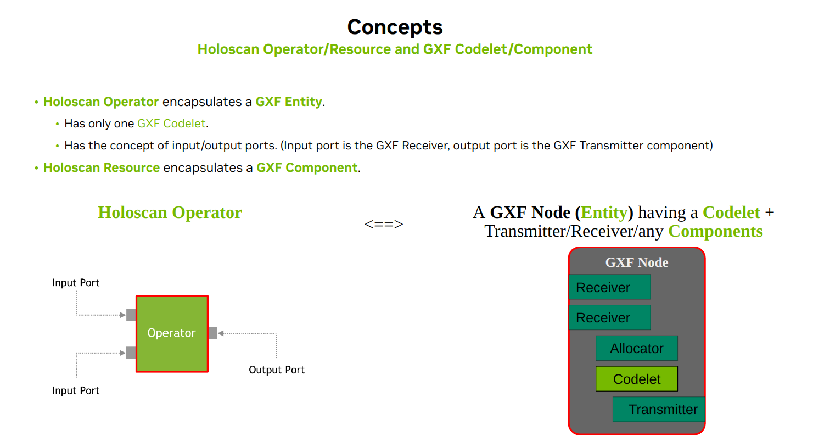
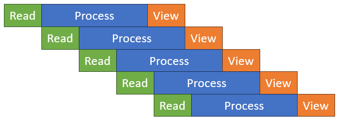
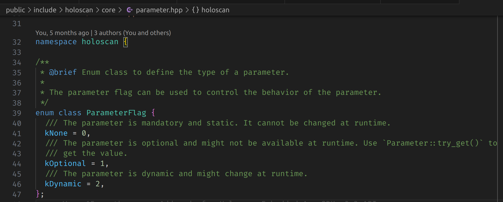
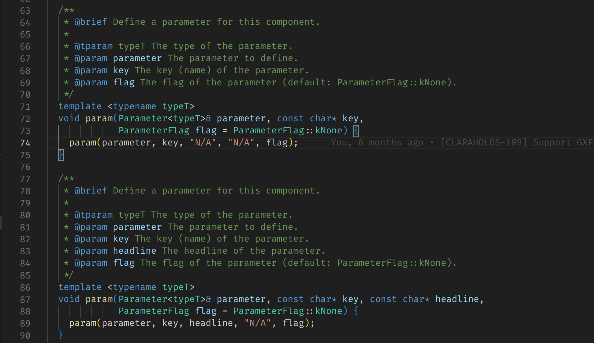
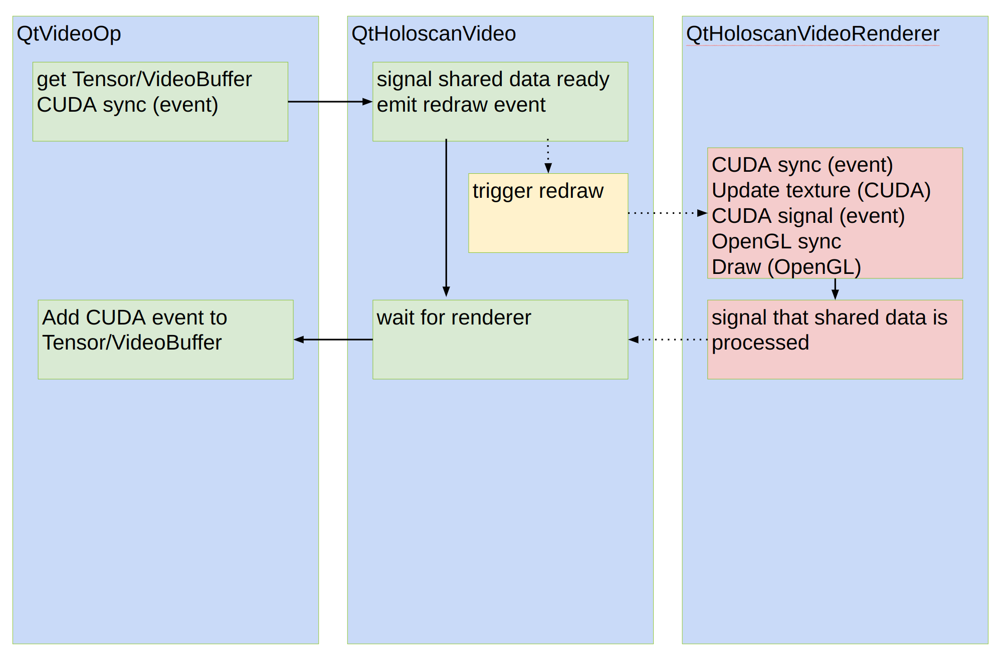
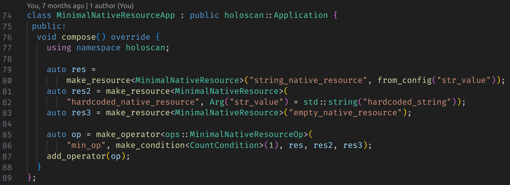
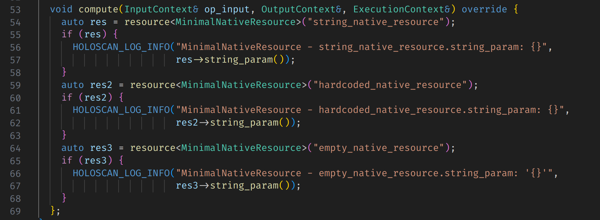

# Holoscan SDK FAQs

## General

**Q1: What is the Holoscan SDK?**

A1: The Holoscan SDK is a comprehensive software development kit from NVIDIA designed for developing real-time AI applications, particularly in the healthcare sector. It includes acceleration libraries, pre-trained AI models, and reference applications for various medical imaging modalities like ultrasound, endoscopy, surgical robotics, and more.

**Q2: What are the core components of the Holoscan SDK?**

A2: The core components include:

* **Application:** A collection of Fragments that acquire and process streaming data.A single fragment application executes in a single process while multi-fragment (distributed) applications can span multiple processes and/or physical nodes.
* **Fragments:** Directed graphs of Operators, which can be allocated to physical nodes in a Holoscan cluster.
* **Operators:** Basic units of work that process streaming data.
* **Conditions:** Components that determine conditions under which a given Operator will be considered ready to execute.
* **Resources:** Components that provide shared functionality which can be reused across operators. Examples are device memory pools, CUDA stream pools and components for serialization/deserialization of data.
* **Ports:** An operator's input ports are used to receive data from upstream operators. Input ports consist of a receiver and any associated conditions. An operator's output ports are used to emit data to downstream operators. An output port consists of a transmitter and any associated Conditions.

**Q3: How is the Holoscan SDK different from other SDKs?**

A3: The Holoscan SDK is a domain and sensor agnostic SDK optimized for the easy construction and deployment of high-performance, high bandwidth, and real-time AI applications. By marrying high speed instruments to NVIDIA software, Holoscan is the platform for a future of self-driving, software defined, and scalable sensor processing solutions, touching industries from scientific computing and instrumentation to medical devices.


## Installation and Setup

**Q1: How do I install the Holoscan SDK?**

A1: There are multiple ways to  install the Holoscan SDK:

* Using NGC containers :
  * For **dGPU** (x86_64, IGX Orin dGPU, Clara AGX dGPU, GH200)

```
docker pull nvcr.io/nvidia/clara-holoscan/holoscan:v3.2.0-dgpu
```

  * For **iGPU** (Jetson, IGX Orin iGPU, Clara AGX iGPU)

```
docker pull nvcr.io/nvidia/clara-holoscan/holoscan:v3.2.0-igpu
```

For more information, please refer to details and usage instructions on [**NGC**](https://catalog.ngc.nvidia.com/orgs/nvidia/teams/clara-holoscan/containers/holoscan).

* Using Debian packages

```
sudo apt update
sudo apt install holoscan
```

If `holoscan` is not found, try the following before repeating the steps above:

* **IGX Orin**: Ensure the [**compute stack is properly installed**](https://docs.nvidia.com/igx-orin/user-guide/latest/base-os.html\#installing-the-compute-stack) which should configure the L4T repository source. If you still cannot install the Holoscan SDK, use the [arm64-sbsa](https://developer.nvidia.com/holoscan-downloads?target_os=Linux\&target_arch=arm64-sbsa\&Compilation=Native\&Distribution=Ubuntu\&target_version=22.04\&target_type=deb_network) from the CUDA repository.
* **Jetson**: Ensure [**JetPack is properly installed**](https://developer.nvidia.com/embedded/jetpack) which should configure the L4T repository source. If you still cannot install the Holoscan SDK, use the [aarch64-jetson](https://developer.nvidia.com/holoscan-downloads?target_os=Linux\&target_arch=aarch64-jetson\&Compilation=Native\&Distribution=Ubuntu\&target_version=22.04\&target_type=deb_network) from the CUDA repository.
* **GH200**: Use the [arm64-sbsa](https://developer.nvidia.com/holoscan-downloads?target_os=Linux\&target_arch=arm64-sbsa\&Compilation=Native\&Distribution=Ubuntu\&target_version=22.04\&target_type=deb_network) from the CUDA repository.
* **x86_64**: Use the [x86_64](https://developer.nvidia.com/holoscan-downloads?target_os=Linux\&target_arch=x86_64\&Distribution=Ubuntu\&target_version=22.04\&target_type=deb_network) from the CUDA repository.

Please note that , to leverage the python module included in the debian package (instead of installing the python wheel), include the path below to your python path.

```
export PYTHONPATH="/opt/nvidia/holoscan/python/lib"
```

* Using Python wheels

```
pip install holoscan
```

For more details and troubleshooting , please refer to  [PyPI](https://pypi.org/project/holoscan).For x86_64, ensure that the [CUDA Toolkit is installed](https://developer.nvidia.com/cuda-12-6-3-download-archive?target_os=Linux&target_arch=x86_64&Distribution=Ubuntu&target_version=22.04&target_type=deb_network).

If you are unsure of which installation option to use, please refer to the considerations below:

* The **Holoscan container image on NGC** is the safest way to ensure all the dependencies are present with the expected versions (including Torch and ONNX Runtime), and should work on most Linux distributions. It is the simplest way to run the embedded examples, while still allowing you to create your own C++ and Python Holoscan applications on top of it. These benefits come at a cost:
  * Large image size due to the numerous (some of them optional) dependencies. If you need a lean runtime image, see the **section below**.
  * Standard inconveniences that exist when using Docker, such as more complex run instructions for proper configuration.
* If you are confident in your ability to manage dependencies on your own in your host environment, the **Holoscan Debian package** should provide all the capabilities needed to use the Holoscan SDK, assuming you are using Ubuntu 22.04.
* If you are not interested in the C++ API but just need to work in Python, or want to use a different version than Python 3.10, you can use the **Holoscan Python wheels** on PyPI. While they are the easiest solution for installing the SDK, they might require the most work to set up your environment with extra dependencies based on your needs. Finally, they are only formally supported on Ubuntu 22.04, though they should support other Linux distributions with glibc 2.35 or above.

**Q2: What are the prerequisites for installing the Holoscan SDK?**

A2: The prerequisites include:

* If you are installing Holoscan SDK on a Developer kit, please refer to the details below

| Developer Kit | User Guide  | OS | GPU mode |
| :---- | :---- | :---- | :---- |
| [NVIDIA IGX Orin](https://www.nvidia.com/en-us/edge-computing/products/igx/) | [Link](https://developer.nvidia.com/igx-orin-developer-kit-user-guide) to User Guide | [IGX Software](https://developer.nvidia.com/igx-downloads) 1.1 Production Release | iGPU **or**\* dGPU |
| [NVIDIA Jetson AGX Orin and Orin Nano](https://www.nvidia.com/en-us/autonomous-machines/embedded-systems/jetson-orin/) | [Link](https://developer.nvidia.com/embedded/learn/jetson-agx-orin-devkit-user-guide/index.html) to User Guide | [JetPack](https://developer.nvidia.com/embedded/jetpack) 6.0 | iGPU |
| [NVIDIA Clara AGX](https://www.nvidia.com/en-gb/clara/intelligent-medical-instruments) | [Link](https://github.com/nvidia-holoscan/holoscan-docs/blob/main/devkits/clara-agx/clara_agx_user_guide.md) to User Guide | [Holopack](https://developer.nvidia.com/drive/sdk-manager) 1.2 | iGPU **or**\* dGPU |

* If you are installing Holoscan SDK on NVIDIA SuperChips, please note that HSDK 2.2 has only been tested with the Grace-Hopper SuperChip (GH200) with Ubuntu 22.04. Follow setup instructions [**here**](https://docs.nvidia.com/grace-ubuntu-install-guide.pdf).
* If you are installing Holsocan SDK on Linux x86_64 workstations, please refer to the details below for supported distributions

| OS | NGC Container | Debian/RPM Package | Python wheel | Build from source |
| :---- | :---- | :---- | :---- | :---- |
| Ubuntu 22.04 | Yes | Yes | Yes | No |
| RHEL 9.x | Yes | No | No | No |
| Other Linux distros | No | No | No | No |

   For specific NVIDIA discrete GPU (dGPU) requirements, please check below :

* Ampere or above recommended for best performance
* [Quadro/NVIDIA RTX](https://www.nvidia.com/en-gb/design-visualization/desktop-graphics/) necessary for GPUDirect RDMA support
* Tested with [NVIDIA Quadro RTX 6000](https://www.nvidia.com/content/dam/en-zz/Solutions/design-visualization/quadro-product-literature/quadro-rtx-6000-us-nvidia-704093-r4-web.pdf) and [NVIDIA RTX A6000](https://www.nvidia.com/en-us/design-visualization/rtx-a6000/)
* [NVIDIA dGPU drivers](https://docs.nvidia.com/datacenter/tesla/tesla-installation-notes): 535 or above

**Q3: Are there any additional setup steps required?**

A3: Additional setup steps to achieve peak performance may include:

* [Enabling RDMA](https://docs.nvidia.com/holoscan/sdk-user-guide/set_up_gpudirect_rdma.html)
* [Enabling G-SYNC](https://docs.nvidia.com/holoscan/sdk-user-guide/enable_gsync.html)
* [Disabling Variable Backlight](https://docs.nvidia.com/holoscan/sdk-user-guide/disable_variable_backlight.html)
* [Enabling Exclusive Display Mode](https://docs.nvidia.com/holoscan/sdk-user-guide/enable_exclusive_display.html)
* [Use both Integrated and Discrete GPUs on NVIDIA Developer Kits](https://docs.nvidia.com/holoscan/sdk-user-guide/use_igpu_with_dgpu.html)
* [Deployment Software Stack](https://docs.nvidia.com/holoscan/sdk-user-guide/deployment_stack.html)


## Getting Started

**Q1: How do I get started with developing applications using the Holoscan SDK?**

A1: To get started:

1. Set up the SDK and your development environment.
1. Follow the "Getting Started" [guide](https://docs.nvidia.com/holoscan/sdk-user-guide/holoscan_core.html) and tutorials provided in the SDK documentation.
1. Explore the [example applications](https://github.com/nvidia-holoscan/holohub/tree/main/applications) in Holohub to understand the framework and its capabilities.

**Q2: Are there any pre-trained models available in the SDK?**

A2: Yes, the SDK includes pre-trained AI models for various medical imaging tasks such as segmentation, classification, and object detection. These models can be fine-tuned or used directly in your applications. For more details, please refer to the endoscopy tool tracking [example](https://github.com/nvidia-holoscan/holohub/tree/main/applications/endoscopy_tool_tracking) in Holohub and the body pose estimation [example](https://github.com/nvidia-holoscan/holohub/tree/main/applications/body_pose_estimation).


## Development

**Q1: How do I create a new application with the Holoscan SDK?**

A1: To create a new application:

1. Define the core concepts such as Operators, Fragments, and their interactions.
1. Use the provided templates and examples as a starting point.

For more details, please refer to the [Holoscan by Example section](./holoscan_by_example.md).

**Q2: What are some example applications provided in the SDK?**

A2: Example applications include:

* Hello World: Basic introduction to the SDK.
* Ping Simple and Ping Custom Op: Demonstrates simple data processing.
* Video Replayer: Shows how to process and display video streams.
* Medical imaging examples like ultrasound and endoscopy processing

For a list of example applications, please visit the [Holoscan by Example section](./holoscan_by_example.md).

**Q3: How can I integrate my own AI models into the Holoscan SDK?**

A3: Integrating your own AI models involves:

1. Converting your model to a compatible format (e.g., TensorRT, ONNX).
1. Ensuring that your data preprocessing and postprocessing steps align with the model's requirements.

For more information on how to bring your own model in Holsocan SDK and build an inference example, please refer to [this](https://github.com/nvidia-holoscan/holoscan-sdk/tree/main/examples/bring_your_own_model) example .

**Q4: How can I update the VideoStreamReplayerOp and the VideoStreamRecorderOp to use a custom file format ?**

A4: Holoscan SDK depends on GXF.GXF is using [Entity-Component-System](https://www.simplilearn.com/entity-component-system-introductory-guide-article) paradigm.
Holoscan uses GXF as an execution engine and Holoscan's API abstracts Entity-Component-System and abstracts GXF node as Operator with input/output ports.



Most messages between Codelets(Operator in Holoscan) are also an entity object.
An entity can hold multiple components/types. In VideoStreamReplayerOp and VideoStreamRecorderOp, an entity object that holds one or more GXF Tensor objects (as a component) is sent/received \- you can think that an entity as a dictionary of objects \-- \<key,object\> map.For VideoStreamReplayerOp and VideoStreamRecorderOp, it currently uses a custom file type ( `.gxf_entities` and `.gxf_index` files) to load and store a sequence of entity objects (in this case, an entity has one GXF Tensor object).
 `.gxf_index` file include a file offset/timestamp information for each entity and `.gxf_entities` includes a series of (serialized) entity data.Serializing/deserializing an entity object is done by using `nvidia::gxf::EntitySerializer` class (with StdEntitySerializer implementation), and nvidia::gxf::FileStream endpoint.The official way to support GDS in GXF would be to extend nvidia::gxf::FileStream class so it uses cufile(GDS) internally.
However, setting the development environment wouldn't be straightforward. This are the steps you would need to follow:

* Update VideoStreamRecorderOp::compute() to use your own implementation to save an entity (as a single tensor) to the file system.
  * Example

```c
auto in_message = op_input.receive<holoscan::TensorMap>("in").value();
```

* Update VideoStreamReplayerOp::compute() to use your own implementation to read the file (with the custom format) and emit it as an entity (holding tensor(s) as a component \-- it is called TensorMap).
  * Example:

```c
nvidia::gxf::Expected<nvidia::gxf::Entity> out_message =
      CreateTensorMap(context.context(),
                      pool.value(),
                      {{out_tensor_name_.get(),
                        nvidia::gxf::MemoryStorageType::kDevice,
                        out_shape,
                        out_primitive_type_,
                        0,
                        nvidia::gxf::ComputeTrivialStrides(out_shape, dst_typesize)}},
                      false);
```

* You need to update initialize() and other methods to get rid of nvidia::gxf::FileStream and nvidia::gxf::FileStream endpoint.For testing VideoStreamReplayerOp, you can just use VideoReplayerApp example.You can develop/test/create operator (release) binaries by following the user guide: [https://github.com/nvidia-holoscan/holoscan-sdk/blob/main/DEVELOP.md](https://github.com/nvidia-holoscan/holoscan-sdk/blob/main/DEVELOP.md)

```c
class VideoReplayerApp : public holoscan::Application {
 public:
  void compose() override {
    using namespace holoscan;

    // Sets the data directory to use from the environment variable if it is set
    ArgList args;
    auto data_directory = std::getenv("HOLOSCAN_INPUT_PATH");
    if (data_directory != nullptr && data_directory[0] != '\0') {
      auto video_directory = std::filesystem::path(data_directory);
      video_directory /= "racerx";
      args.add(Arg("directory", video_directory.string()));
    }

    // Define the replayer and holoviz operators and configure using yaml configuration
    auto replayer =
        make_operator<ops::VideoStreamReplayerOp>("replayer", from_config("replayer"), args);
    auto visualizer = make_operator<ops::HolovizOp>("holoviz", from_config("holoviz"));

    // Define the workflow: replayer -> holoviz
    add_flow(replayer, visualizer, {{"output", "receivers"}});
  }
};


```


```
./run build
./run launch
 # inside the container
 ./examples/video_replayer/cpp/video_replayer
```

* As an alternative, you can create a separate Holoscan Operator and apply it with other sample applications (such as endoscopy tool tracking app) by following HoloHub's guide ([https://github.com/nvidia-holoscan/holohub](https://github.com/nvidia-holoscan/holohub)).You can also use Holoscan SDK's installation binary with [holoscan install dir](https://github.com/nvidia-holoscan/holohub?tab=readme-ov-file\#glossary) created by ./run build with Holoscan SDK repo.

**Q5: How can I use the Inference Operator with Python tensor?**

A5: The Inference Operator accepts holoscan::Entity or holoscan::TensorMap (similar to the dictionary of Array-like objects in Python) as an input message.

For example, you can define an operator processing input video (as a tensor).You can find a more detailed example of this type of operator together with an example by referencing the tensor interop [example](https://github.com/nvidia-holoscan/holoscan-sdk/tree/main/examples/tensor_interop/python).

    This operator has:
        inputs:  "input_tensor"
        outputs: "output_tensor"

    The data from each input is processed by a CuPy gaussian filter and
    the result is sent to the output.

    ```
    def compute(self, op_input, op_output, context):
        # in_message is of dict
        in_message = op_input.receive("input_tensor")

        # smooth along first two axes, but not the color channels
        sigma = (self.sigma, self.sigma, 0)

        # out_message is of dict
        out_message = dict()

        for key, value in in_message.items():
            print(f"message received (count: {self.count})")
            self.count += 1

            cp_array = cp.asarray(value)

            # process cp_array
            cp_array = ndi.gaussian_filter(cp_array, sigma)

            out_message[key] = cp_array

        op_output.emit(out_message, "output_tensor")
    ```

**Q6: Is there support in the Holoscan SDK, particularly for models written as Triton Python backends like NVIDIA's FoundationPose?**

A6: Triton backends are not currently supported.The Inference Operator supports TensorRT (trt), ONNX Runtime (onnxrt), and Torch backends.

 For more information on the Inference Operator please refer to the [section](https://docs.nvidia.com/holoscan/sdk-user-guide/inference.html) in the User Guide regarding the Inference Operator .

**Q7: Can I directly use a .pth (PyTorch) model file with the Holoscan SDK's inference operator?**
A7:No, you cannot use a .pth model file directly with the Holoscan SDK. Here's why and what you can do instead:

1. Holoscan SDK's Torch backend is based on libtorch, which requires models to be in TorchScript format.
1. Converting a .pth model to TorchScript is a manual process and cannot be done automatically within the SDK.
1. For the best performance and ease of use, it's recommended to: a) Use a TensorRT (TRT) model if available. b) If you have an ONNX model, you can convert it to TRT automatically within the SDK.
1. Using a TRT model (or converting from ONNX to TRT) will likely provide the fastest inference and be the easiest to set up with the Holoscan SDK.

In summary, while direct .pth file usage isn't supported, converting to TensorRT or using ONNX with automatic TRT conversion are the recommended approaches for optimal performance and compatibility with the Holoscan SDK.

**Q8: Can I use multiple models with the Inference Operator?**

A8: Yes, you can use multiple models by specifying them in the `model_path_map` parameter. For more information, please refer to the [Parameters section](https://docs.nvidia.com/holoscan/sdk-user-guide/inference.html\#parameters-and-related-features) of the Inference Operator in the Holoscan User Guide.

**Q9: How can I enable parallel inference for multiple models?**

A9: Parallel inference is enabled by default. To disable it, set `parallel_inference`: false in the parameter set. For more information, please refer to the [Parameters section](https://docs.nvidia.com/holoscan/sdk-user-guide/inference.html\#parameters-and-related-features) of the Inference Operator in the Holoscan User Guide.

**Q9: Can I use different backends for different models in the same application?**

A9: Yes, you can specify different backends for different models using the `backend_map` parameter.For more information, please refer to the [Parameters section](https://docs.nvidia.com/holoscan/sdk-user-guide/inference.html\#parameters-and-related-features) of the Inference Operator in the Holoscan User Guide.

**Q10: Can I perform inference on the CPU?**

A10: Yes, you can perform inference on the CPU by setting  `infer_on_cpu`: true and use either the ONNX Runtime or PyTorch backend.For more information, please refer to the [Parameters section](https://docs.nvidia.com/holoscan/sdk-user-guide/inference.html\#parameters-and-related-features) of the Inference Operator in the Holoscan User Guide.

**Q11:Can I control where the input and output data is stored (CPU vs GPU memory)?**

A11: Yes, use the `input_on_cuda,` `output_on_cuda`, and `transmit_on_cuda` parameters to control data location.For more information, please refer to the [Parameters section](https://docs.nvidia.com/holoscan/sdk-user-guide/inference.html\#parameters-and-related-features) of the Inference Operator in the Holoscan User Guide.

**Q12: How can I use the Optional flag?**

A12: In Python, there are two ways to define parameter:

* Using spec.param() method in Python's setup() method of the operator , usually done when wrapping the existing C++ operator.
* Parameters are passed to the Constructor (`__init__()` ) directly. In Python there is no `try_get()` method in the parameter.
  Instead, the default value is set to None, allowing us to check whether the parameter is set by users by verifying if the parameter value is None.

**Q13:How can I define an Operator's creator for passing custom arguments?**

A13:Feeding custom data to the constructor of an Operator in the `compose()` method is crucial. When you use the `make_operator<>()` template method in C++ or the Python Operator constructor, the `setup()` method is called internally, which prevents you from passing custom data (such as configuration values) after `make_operator<>()` is called. In C++, to pass non-condition/argument data to the constructor of a C++ Operator class, you need to define an additional constructor to accept your custom data. For example, you can define a constructor that accepts a `std::vector<std::string>` argument for the list of output port names as a second parameter.

**Q14:How can I stop an application?**

A14:There are two approaches to stopping an application:

* using BooleanCondition on replayer operator

```c

    std::string op_name = "replayer";
    std::string param_name = "boolean_scheduling_term";

    // get the operator
    holoscan::Operator* op = nullptr;
    auto& app_graph = fragment()->graph();
    if (!app_graph.is_empty()) { op = app_graph.find_node(op_name).get(); }
    if (!op) {
        HOLOSCAN_LOG_ERROR("Operator '{}' is not defined", op_name);
        return;
    }

      // Stop executing compute() for 'replayer' operator

    auto boolean_condition = op->condition<holoscan::BooleanCondition>(param_name);
    boolean_condition->disable_tick();

    // Stop executing compute() for this operator
    boolean_condition = condition<holoscan::BooleanCondition>(param_name);
    boolean_condition->disable_tick();
    return;

```

To terminate the application smoothly, it is recommended to rely on the stop-on-deadlock feature in the scheduler. By default, the `stop_on_deadlock` parameter of `GreedyScheduler` is set to true. In case the `VideoReplayer` Operator stops, the entire pipeline will stop.

* using interrupt()

```c
fragment()->executor().interrupt();
```
Please note that  using interrupt() forces to terminate the execution and can cause error messages,
and the recommendation is using  deadlock-based approach.

As an alternative, you can also use the `CountCondition`.Please refer to the [section](https://docs.nvidia.com/holoscan/sdk-user-guide/components/conditions.html#countcondition).
At a high level, this is how attaching a `CountCondition` to an operator works:

The operator starts in a READY state.
Each time the operator executes, the count decreases by 1.
When the count reaches 0, the operator's state changes to NEVER.
In the NEVER state, the operator stops executing.

For example, if you want to run the application 100 times and then stop it:

```c
auto my_operator = make_operator<MyOperator>("my_operator", make_condition<CountCondition>(100));
```


**Q15:How can I loop an output.emit() call within the operator?**

A15: Each input or output port has its own queue. Internally, the process works as follows:

1. Before the `compute()` method of an operator A is triggered, for each input port (usually backed by `DoubleBufferReceiver`), data (messages) in the backstage of the input port's queue are moved to the main stage of the queue. This is done using `router->syncInbox(entity)`.
1. The `compute()` method of operator A is triggered.
1. For each output port of operator A, data in the output port's queue are moved to the queue (backstage) of the downstream operator's input port using `router->syncOutbox(entity)`.

By default, the queue capacity of the input/output port is set to 1, although this can be configured in the `setup()` method. This is why we cannot call `output.emit()` multiple times in a `compute()` method, as doing so can cause a `GXF_EXCEEDING_PREALLOCATED_SIZE` error.

With the `GreedyScheduler`, which is the default scheduler using a single thread to trigger an operator's `compute()` method, no other operator can be scheduled until the `compute()` method of the current operator returns.

To address this challenge, we might consider creating a utility method or class designed to accept a generator or iterator object. This approach would be particularly effective within a `compute()` method, especially if the operator is a source operator without input ports. It would enable the method to preserve the state of the input and either call `output.emit()` for each yielded value in a single `compute()` invocation or return without blocking the thread.

The Python API code to override the connector would be something like this if we wanted a queue with capacity 20 and policy of "reject" (discard) the item if the queue is full:

```py
from holoscan.core import IOSpec

# and then within the setup method define the output using the connector method like this

spec.output("out1").connector(
    IOSpec.ConnectorType.DOUBLE_BUFFER, capacity=20, policy=1
)
```

For the policy options:

* 0 \= pop (if the queue is full, remove an item from the queue to make room for the incoming one)
* 1 \= reject (if the queue is full, reject the new item)
* 2 \= fault (terminate the application if the queue is full and a new item is added)

For completeness, to explicitly specify both the connector and its conditions, the syntax should be:

```py
# The default setting for an output should be equivalent to explicitly specifying
spec.output("out1").connector(
    IOSpec.ConnectorType.DOUBLE_BUFFER, capacity=1, policy=2
).condition(
    ConditionType.DOWNSTREAM_MESSAGE_AFFORDABLE, min_size=1, front_stage_max_size=1
)

```

**Q16:  How can I add a green border and a small image to a corner to a Holoviz Operator?**

A16: You can follow the Holoviz examples here:

* Holoviz geometry example : [https://github.com/nvidia-holoscan/holoscan-sdk/blob/main/examples/holoviz/python/holoviz_geometry.py](https://github.com/nvidia-holoscan/holoscan-sdk/blob/main/examples/holoviz/python/holoviz_geometry.py) for border examples
* Holoviz views example [https://github.com/nvidia-holoscan/holoscan-sdk/blob/main/examples/holoviz/python/holoviz_views.py](https://github.com/nvidia-holoscan/holoscan-sdk/blob/main/examples/holoviz/python/holoviz_views.py) for view/image example

**Q17 : What is the difference between `setup` vs `initialize` vs `__init__` ?**

A17: Since v0.6 release, Holoscan Operator does "lazy initialization" and Operator instance creation ( `super().__init__(*args, **kwargs)` ) doesn't initialize (calling  Operator.initialize(self) ) the corresponding GXF entity anymore.
Currently, [setting the class members in Python](https://github.com/nvidia-holoscan/holoscan-sdk/blob/ccead5608b6f00d1c5b40465f68904d550c65236/python/holoscan/core/arg.cpp#L68) is done when Operator is [initialized by GXF Executor](https://github.com/nvidia-holoscan/holoscan-sdk/blob/ccead5608b6f00d1c5b40465f68904d550c65236/src/core/executors/gxf/gxf_executor.cpp#L1650).The purpose of setup method is for getting "operator's spec" by providing OperatorSpec object (spec param) to the method. When `__init__`  is called, it calls C++'s `Operator::spec(const std::shared_ptr<OperatorSpec>& spec)` method (and also sets `self.spec` class member), and call `setup` method so that Operator's `spec()` method hold the operator's specification.
Since setup method can be called multiple times with other OperatorSpec object (e.g., to enumerate the description of the operator), in the setup method, user shouldn't initialize something in the Operator object.
Such initialization needs to be done in initialize method.
`__init__`  method is for creating Operator object. it can be used for initializing operator object itself by passing miscellaneous arguments, but it doesn't 'initialize' corresponding GXF entity object.

**Q18:I’d like to use a CUDA stream allocated by the Holoscan SDK in a non-Holoscan library (OpenCV, CuPy, PyTorch). All these 3rd party libraries support CUDA streams, allocators etc. but they have different objects to represent that CUDA Stream (such as a `cupy.cuda.Stream`). I need to get the Holoscan CUDA stream and convert it to a `cupy.cuda.Stream` in a similar way a Holoscan Tensor is converted to a CuPy array with memory pointers.Please propose a solution.**

A18:There is a CudaStreamHandler utility that works via GXF APIs in the C++ layer. We have not currently created a Python API to allow users to use it from the compute methods of native Python operators.In general, the underlying GXF library is currently refactoring how CUDA streams are handled and we plan to then improve the stream handling on Holoscan SDK after that.You can use CuPy or other 3rd party stream APIs within their own native operators and pass the stream objects as a Python object between your own native operators. I think this doesn't help with the issue you are facing as you want to reuse a stream allocated by some upstream wrapped C++ operator provided by the SDK there is currently no proper way to do that from Python.

**Q19:What is the purpose of the `activation_map` parameter in the Holoscan Holoinfer operator?**
A19: The `activation_map` parameter allows users to enable or disable model inferences dynamically at runtime. It can be used to decide on which frames to run inference for each model.

**Q20:Is there an existing example or template that demonstrates the simultaneous use of integrated GPU (iGPU) and discrete GPU (dGPU) in a Holoscan application pipeline? Specifically, I am looking for a sample workflow that includes:**

1. **Receiving and processing data on the iGPU of an AGX Orin**
1. **Transferring the processed data to a dGPU**
1. **Running multiple AI models on the dGPU**
1. **Displaying results using the dGPU**

A20:To leverage both the integrated GPU (iGPU) and discrete GPU (dGPU) on your IGX system with Holoscan, please refer to the [IGX user guide](https://docs.nvidia.com/igx-orin/user-guide/latest/igpu-dgpu.html). This guide provides detailed instructions on utilizing the iGPU in containers when the IGX developer kit is configured in dGPU mode.

For Holoscan applications, there are two primary approaches to utilize both GPUs:

1. Concurrent Application Execution: Run separate applications simultaneously, as outlined in the IGX documentation. The iGPU application must be executed within the Holoscan iGPU container, while the dGPU application can be run either natively or within the Holoscan dGPU container.
1. Distributed Application: Develop a single distributed application that utilizes both GPUs by executing distinct fragments on the iGPU and dGPU respectively.

To illustrate the second approach, consider the following example using the 'ping' distributed application. This demonstrates communication between the iGPU and dGPU using Holoscan containers:

```
COMMON_DOCKER_FLAGS="--rm -i --init --net=host
--runtime=nvidia -e NVIDIA_DRIVER_CAPABILITIES=all
--cap-add CAP_SYS_PTRACE --ipc=host --ulimit memlock=-1 --ulimit stack=67108864
"
HOLOSCAN_VERSION=2.2.0
HOLOSCAN_IMG="nvcr.io/nvidia/clara-holoscan/holoscan:v$HOLOSCAN_VERSION"
HOLOSCAN_DGPU_IMG="$HOLOSCAN_IMG-dgpu"
HOLOSCAN_IGPU_IMG="$HOLOSCAN_IMG-igpu"

# Pull necessary images
docker pull $HOLOSCAN_DGPU_IMG
docker pull $HOLOSCAN_IGPU_IMG

# Execute ping distributed (Python) in dGPU container
# Note: This instance serves as the 'driver', but the iGPU could also fulfill this role
# The '&' allows for non-blocking execution, enabling subsequent iGPU command
docker run \
 $COMMON_DOCKER_FLAGS \
 $HOLOSCAN_DGPU_IMG \
 bash -c "python3 ./examples/ping_distributed/python/ping_distributed.py --gpu --worker --driver" &

# Execute ping distributed (C++) in iGPU container
docker run \
 $COMMON_DOCKER_FLAGS \
 -e NVIDIA_VISIBLE_DEVICES=nvidia.com/igpu=0 \
 $HOLOSCAN_IMG-igpu \
 bash -c "./examples/ping_distributed/cpp/ping_distributed --gpu --worker"

```

**Q21:Is there an efficient method to configure Holoscan to enable concurrent processing pipelines? My objective is to implement a system where frame acquisition and processing can occur simultaneously. Specifically, I aim to initiate the reading of a subsequent frame while the current frame is still undergoing processing through the InferenceOp.To illustrate:**



1. **Is it possible to begin reading Frame N+1 while Frame N is still being processed by the InferenceOp?**
1. **Or does Holoscan require the completion of all operations on Frame N before initiating any operations on Frame N+1?**

**If concurrent processing is achievable, what would be the recommended approach to implement such a system within the Holoscan framework?**

A21: The NVIDIA GXF framework provides a `nvidia::gxf::BroadcastCodelet` with a "round robin" mode that offers an alternative to the standard broadcast behavior. This mode sequentially directs input messages to different output ports in rotation. While this functionality was accessible in Holoscan 2.1 through the GXFCodeletOp, we could also develop a native operator that provides equivalent utility.

The GXF source defines the modes as follows:

```
enum struct BroadcastMode {
  kBroadcast = 0,   // publishes incoming message to all transmitters
  kRoundRobin = 1,  // publishes incoming message to one transmitter in round-robin fashion
};

```

For the gathering operation, GXF implements the `nvidia::gxf::Gather` codelet. This codelet transfers any messages from the receive ports to the output port. The `tick_source_limit` parameter can be configured to cease checking for additional received messages on other ports once a specified maximum number of messages to output has been reached.

It's important to note that the GXF Gather codelet may not inherently preserve the order in which inference operations were called. While messages might naturally be processed in the order they were received if inference operations complete sequentially, this behavior is not guaranteed.

To ensure strict ordering, we could develop a custom native operator. This operator would sequentially check for messages on each port, beginning with port 1, and only move to the next port once a message has been received on the current port. This approach would guarantee that frames are processed and displayed in the correct order.

This custom implementation would provide greater control over the message flow and ensure the integrity of the processing pipeline, particularly in scenarios where maintaining the original frame order is critical.

**Q22: How can I use other libraries in my Holoscan SDK application pipeline?**
A22: Refer to the dedicated [HoloHub tutorial](https://github.com/nvidia-holoscan/holohub/tree/main/tutorials/integrate_external_libs_into_pipeline) for an overview of how to use external C++ or Python libraries in your custom Holoscan SDK application.

**Q23: How can I ensure proper data flow and handling in a Holoscan pipeline with branching paths, especially when inline updates are performed on shared data?**

A23:In a Holoscan pipeline with branching paths, such as:

```
A -> B -> C -> D
      \
       -> E
```

There are several considerations and potential solutions to ensure proper data flow and handling, especially when operators like C or D perform inline updates to the data.

1. Data Access Guarantee: E is guaranteed to access the data egressing from B. However, in a multithreaded scheduler, careful attention must be paid to potential data race conditions.
1. Execution Order: The current implementation maintains the order of root nodes, but the creation of GXF connections between B \-\> C and B \-\> E is randomly determined due to the use of `std::unordered_map` as the graph data structure. This randomness can affect which connection is prioritized in GXF.
1. Potential Solutions: a. PeriodicCondition: One approach is to use a PeriodicCondition to control the execution timing of operators. Here's an example:

```
from holoscan.conditions import CountCondition, PeriodicCondition
from holoscan.core import Application
from holoscan.operators import PingRxOp, PingTxOp

class MyPingApp(Application):
    def compose(self):
        b = PingTxOp(self, CountCondition(self, 10), name="B")
        c = PingRxOp(self, PeriodicCondition(self, 20_000_000), name="C")
        e = PingRxOp(self, name="E")

        self.add_flow(b, c)
        self.add_flow(b, e)

```

In this example, the PeriodicCondition is used to ensure that C executes only after a specified period (20 milliseconds in this case) has elapsed. This can help control the timing of data processing between different branches. b. Custom Operator: Developing a custom native operator could provide more control over the message flow. This operator could sequentially check for messages on each port, ensuring that frames are processed and displayed in the correct order. c. Data Copying: To avoid issues with inline updates affecting shared data, consider implementing a mechanism to create copies of the data for each branch. This ensures that modifications in one branch don't unintentionally affect the other.

1. Limitations and Considerations:
* The GXF Gather codelet may not inherently preserve the order in which inference operations were called.
* When using mock objects for testing (as mentioned in the background information), modifying the original pipeline structure might be challenging. In such cases, focusing on data copying or careful timing control might be more feasible.
1. Future Improvements: Updating the graph structure to use std::map instead of `std::unordered_map` for `succ_` and `pred_` could potentially provide more predictable behavior in terms of connection creation order.

**Q24:I'm inquiring about the availability of a Holoscan example that demonstrates distributed processing across two networked computers. Specifically, I'm interested in a scenario where:**

1. **One computer captures a frame, potentially using an AJA capture card.**
1. **The captured frame is then transferred over a local network to a second computer.**
1. **The second computer receives and displays the frame.**

**Additionally, I have some questions regarding the networking aspects of such a setup:**

1. **Does Holoscan provide flexibility in selecting the transport layer for this inter-computer communication?**
1. **Is it possible to utilize WebRTC as the transport protocol in this scenario?**

A24: There are two relevant approaches:

1. WebRTC Implementation: A reference application demonstrating WebRTC-based video streaming is available in the HoloHub repository. You can find this example at: [https://github.com/nvidia-holoscan/holohub/tree/main/applications/webrtc_video_server](https://github.com/nvidia-holoscan/holohub/tree/main/applications/webrtc_video_server) This application showcases how WebRTC can be utilized for inter-computer communication within the Holoscan framework.
1. Distributed Application Approach: An alternative method involves creating a distributed application with separate fragments running on each node. For more information, please refer to the [section](https://docs.nvidia.com/holoscan/sdk-user-guide/holoscan_create_distributed_app.html) in the User guide on Creating Distributed applications .

**Q25: How can I use `run_async()` to launch an application in a separate thread and stop the application?**

A25:We can set the event state to `EVENT_WAITING` (request sent to an async service, pending event done notification) and then `EVENT_DONE` (event done notification received, entity ready to be ticked) to allow a specific operator to wait/resume its operation. In the example, it calls `AsynchronousCondition::event_state(AsynchronousEventState::EVENT_NEVER)` to set the status of the condition to NEVER. (BooleanCondition does the same by setting the status of the condition to NEVER when `BooleanCondition::disable_tick()` is called). This means the operator does not want to be ticked again (end of execution).Once the state of the condition goes to NEVER (internally, SchedulingConditionType::NEVER), it marks the end of execution and cannot be undone.

**Q26:Are there any existing applications or examples in the Holoscan ecosystem that demonstrate the ability to utilize multiple GPUs concurrently within a single application?**

A26:The multi ai ultrasound application has [settings](https://github.com/nvidia-holoscan/holohub/blob/f5f27b85b68bc8fcd62239ed56da2cef29a3d45f/applications/multiai_ultrasound/cpp/mgpu_multiai_ultrasound.yaml#L65) for multi GPU in a different YAML file. It can be controlled by the inference parameters.

**Q27: What is the role of a scheduler in Holoscan?**

A27: The scheduler is responsible for determining when each operator in an application will execute.

**Q28: How many types of schedulers are available in the Holoscan SDK?**

A28: There are three [schedulers](https://docs.nvidia.com/holoscan/sdk-user-guide/components/schedulers.html) available: Greedy Scheduler, Multi-Thread Scheduler, and Event-Based Scheduler.

**Q29:Which scheduler is used by default for non-distributed applications?**

A29:Non-distributed applications use the Greedy Scheduler by default.

**Q30:What is the main characteristic of the Greedy Scheduler?**

A30: The Greedy Scheduler has only a single worker thread that executes operators sequentially in a deterministic order.

**Q31:How does the Multi-Thread Scheduler work?**

A31: It's a polling-based scheduler with a user-defined number of worker threads and a dedicated thread that polls operators at a user-defined interval.

**Q32:What is unique about the Event-Based Scheduler?**

A32:The Event-Based Scheduler waits for events indicating changes in operator readiness, rather than constantly polling.

**Q33:How can the Event-Based Scheduler reduce CPU overhead?**

A33:By eliminating the need for constant polling, it can significantly reduce CPU usage compared to the Multi-Thread Scheduler in certain scenarios.

**Q34:In what situations do Multi-thread and Event-Based Schedulers show benefits?**

A34:They show benefits in scenarios with multiple operators that can run simultaneously, potentially providing significant speedup compared to the Greedy Scheduler.

**Q35:How do the Multi-Thread and Event-Based Schedulers compare in terms of performance?**

A35:They often have similar runtime performance, but the Event-Based Scheduler tends to have lower CPU overhead on average.

**Q36:Are there scenarios where using multi-thread schedulers might not be beneficial?**

A36: Yes, for linear inference pipelines or applications with minimal computation per operator, multi-thread schedulers might not provide significant benefits and could even introduce overhead.

**Q37: How does the number of worker threads affect performance in multi-thread schedulers?**

A37:  Increasing the number of worker threads can improve performance up to a point, but it also increases CPU usage.

**Q38: Is there any memory pool (allocator) that supports both host and device memory?**

Please use `RMMAllocator` for this purpose. It supports simultaneous memory pools for CUDA device memory and pinned host memory. A `BlockMemoryPool` can be used on either host or device memory, but cannot support both types at the same time. `UnboundedAllocator` also supports both host and device memory, but is not a memory pool (it allocates and frees new memory each time).

## Performance

**Q1: What performance tools are available in Holoscan SDK?**

A1: Holoscan SDK provides several performance tools, including Data Flow Tracking and GXF job statistics.

**Q2: What is Data Flow Tracking in Holoscan SDK?**

A2: Data Flow Tracking is a mechanism to profile applications and analyze fine-grained timing properties and data flow between operators in a fragment's graph.For more detailed information, please refer to the [Data Flow Tracking section](https://docs.nvidia.com/holoscan/sdk-user-guide/flow_tracking.html) in the Holoscan User Guide.

**Q3: How do I enable Data Flow Tracking in my Holoscan application?**

A3:You can enable Data Flow Tracking by calling the `track()` method in C++ or using the `Tracker` class in Python before running your application.

**Q4: What metrics can I retrieve using Data Flow Tracking?**

A4: You can retrieve metrics such as maximum, average, and minimum end-to-end latencies, as well as the number of messages sent from root operators.

**Q5: How can I customize Data Flow Tracking?**

A5:You can customize Data Flow Tracking by configuring parameters such as the number of messages to skip at the start and end, and setting a latency threshold to ignore outliers.

**Q6: How do I enable GXF job statistics?**

A6:You can enable GXF job statistics by setting the environment variable `HOLOSCAN_ENABLE_GXF_JOB_STATISTICS` to true.

**Q7: Can I save GXF job statistics to a file?**

A7:Yes, you can save GXF job statistics to a JSON file by setting the `HOLOSCAN_GXF_JOB_STATISTICS_PATH` environment variable. For more information on the GXF job statistics, please refer to [this](https://docs.nvidia.com/holoscan/sdk-user-guide/gxf_job_statistics.html) section in the User Guide.

**Q11:How do NVTX markers work in Holoscan SDK?**

A11:This is how NVTX markers added to a Holoscan application work:

* The multithreaded scheduler starts a worker thread, checks the status of entities (also known as Holoscan Operators), and executes each entity using `EntityExecutor::executeEntity()` method in GXF.
* `EntityExecutor::executeEntity()` calls the `EntityExecutor::EntityItem::execute()` GXF method for the given entity ID
* The `EntityExecutor::EntityItem::execute()` method checks the scheduling status of the entity (Holoscan Operator) and then calls the `EntityExecutor::EntityItem::tick()` method in GXF
* In the EntityExecutor::EntityItem::tick() method it is where the annotation happens, the following steps occur:
1. router-\>syncInbox(entity); is called to synchronize the inbox. For example, for the given Holoscan operator, UCXReceiver (input port) receives data from the network and pushes it into the queue in the UCXReceiver object. Data in the queue can be retrieved by calling the receive() method within the Operator::compute() method.
1. For each codelet in the entity (in Holoscan, an entity can have only one codelet), EntityExecutor::EntityItem::tickCodelet() is called, which in turn calls Codelet::tick() (in Holoscan, this is the Operator::compute() method) (Figure 5).
1. router-\>syncOutbox(entity); is called to synchronize the outbox. For example, for the given Holoscan operator, the data pushed to the queue in the UCXTransmitter object (output port) via emit() method calls in the Operator::compute() method is sent to the network using UCX.

During these calls, the system measures statistics, executes monitors (if any), and executes controllers (if any).

It is important to note that the tick codelet NVTX annotation doesn't cover router-\>syncInbox(entity); and router-\>syncOutbox(entity);. This means that the time range captured by NVTX measures only the duration for executing the Codelet::tick(). The time for sending and receiving data via UCXTransmitter/UCXReceiver is not measured by looking at the annotation range.

**Q12:During the performance analysis of my Holoscan application, I've observed significant latency issues that are negatively impacting real-time performance. I've compiled a timing breakdown for each operator in the pipeline, which I've included below for reference.**

**Initially, I had assumed that each Holoscan Operator processed frames independently and concurrently. However, my observations suggest that the entire pipeline is processing each frame sequentially, which appears to be suboptimal for my real-time requirements.**

**Currently, my visualization component is only achieving approximately 15 fps, which falls short of my performance target. Given that my pipeline has a total execution time of approximately 70ms, I'm concerned that it may only be capable of processing one frame every 70ms.**

**Could you provide more detailed information about the implementation and potential benefits of Schedulers in Holoscan (as referenced in the NVIDIA documentation on Schedulers)? Specifically, I'm interested in understanding if and how Schedulers could be leveraged to address my performance concerns.**

**Here's the timing breakdown for each operator in my pipeline:**

* **Replayer: 24.145 ms**
* **ImageProcessing: 18.289 ms**
* **Preprocessor: 1.213 ms**
*  **Inference: 23.861 ms**
*  **Postprocessor: 0.275 ms**
*  **PostImageProcessing: 2.695 ms**
*  **Viz: 1.575 ms**

A12: The following scheduler mechanisms can potentially impact the performance of your application:

1. Frame Processing Parallelization: The Multi-threaded Scheduler (MTS) and Event-based Scheduler (EBS) are designed to enable concurrent processing of multiple frames. These schedulers allow the initiation of processing for subsequent frames while preceding frames are still being processed by other operators in the pipeline.
1. Latency vs. Throughput Considerations: It's important to distinguish between end-to-end latency and throughput in the context of application performance. While MTS and EBS can potentially enhance the overall throughput of an application (defined as the number of frames processed per unit time), they do not necessarily reduce the end-to-end latency. End-to-end latency refers to the time required for a single frame to traverse the entire pipeline from source to sink.
1. Current Scheduler Implementation Status: Please note that the MTS and EBS are currently undergoing optimization. In their present state, they may exhibit higher latency compared to the greedy scheduler.
1. Inter-Operator Dependencies: It's crucial to understand that operators within a pipeline do not function in complete isolation. The pipeline architecture incorporates double-buffer queues between operators, with scheduling conditions applied to these queues. This design introduces data dependencies between adjacent nodes in the application graph, which influences the overall execution flow and timing.

**Q13:How can I improve the performance of VideoStreamRecorderOp by reusing GPU memory?**

A13:The VideoStreamReplayerOp can reuse the CUDA device buffers and avoid alloc/free for each frame by using [BlockMemoryPool](https://docs.nvidia.com/holoscan/sdk-user-guide/components/resources.html\#blockmemorypool).

The VideoStreamReplayerOp does not have a parameter (such as allocator) to use a custom allocator, even though the user can specify `entity_serializer`.

* The current implementation always uses holoscan::StdEntitySerializer and holoscan::StdComponentSerializer with UnboundedAllocator, regardless of the user-specified `entity_serializer` parameter.
* The storage type of the tensor (GPU or CPU) created by the VideoStreamReplayerOp depends on the input video file to which the tensor object is serialized. Therefore, without updating the `holoscan::StdComponentSerializer` implementation, VideoStreamReplayerOp cannot blindly use a specific memory pool allocator that requires memory storage type, memory pool size, etc.

**Q14: I've observed some CUPVA-CUDA interop-related latencies in this application that are not present in our CUPVA test applications. One notable difference between the Holohub application and the CUPVA test application lies in the method of CUDA stream creation.**

**In the CUPVA test application, we create the CUDA stream as follows:**

```
cudaStreamCreateWithFlags(&cuStream, cudaStreamNonBlocking)
```

**In contrast, the Holohub application utilizes a CudaStreamPool, created in this manner:**

```
const std::shared_ptr<CudaStreamPool> cuda_stream_pool = make_resource<CudaStreamPool>("cuda_stream", 0, 0, 0, 1, 5);
// or
const std::shared_ptr<CudaStreamPool> cuda_stream_pool = make_resource<CudaStreamPool>("cuda_stream", 0, cudaStreamNonBlocking, 0, 1, 5);

```

**The CUDA stream is then retrieved in the compute API using:**

```
auto cudaStream = cuda_stream_handler_.get_cuda_stream(context.context());
```

 **I would like to clarify the following points:**

1. **When calling `get_cuda_stream(..)`, will the default stream be utilized, or will it be a non-default stream?**
1. **Is there a method to ensure that the default CUDA stream is not used in the pool, given that we currently lack support for it in CUPVA?**

A14:It is important to know that CUDA stream management in both GXF and Holoscan is currently in a state of evolution.

In the current Holoscan implementation, CUDA streams are managed through the `holoscan::CudaStreamHandler` class. This class offers utility methods to define the operator specification with `CudaStreamPool`.

To utilize non-default streams, the application's `compose()` method should create a `cuda_stream_pool` as follows:

```
const std::shared_ptr<CudaStreamPool> cuda_stream_pool = make_resource<CudaStreamPool>("cuda_stream", 0, cudaStreamNonBlocking, 0, 1, 5);
```

Note that using `1` or `cudaStreamNonBlocking` for the flag parameter ensures the use of non-default streams.

For proper CUDA stream creation and sharing across operators in the application workflow:

1. In the Application's `compose()` method:
   * Create `CudaMemoryPool` and pass it as a parameter to the operators in the workflow graph.
1. For each operator in the workflow:
   * Define a `holoscan::CudaStreamHandler` member variable in the operator class (e.g., `cuda_stream_handler_`).
   * Call `cuda_stream_handler_.define_params(spec);` in the `setup(OperatorSpec& spec)` method.
   * In the `compute()` method, use the following calls:
     * `cuda_stream_handler_.from_message(context.context(), in_message);` to retrieve CUDA stream information from the input message.
     * `cuda_stream_handler_.get_cuda_stream(context.context());` to obtain the CUDA stream.
     * `cuda_stream_handler_.to_message(out_message);` to set the currently used CUDA stream to the output message for subsequent operators.

Regarding your specific concern about forcing non-use of the default CUDA stream in the pool due to lack of support in CUPVA, there are two potential approaches:

1. Ensure that your application uses an appropriate CUDA stream pool configuration.
1. Implement error handling or exceptions at the application/operator level to prevent the use of the default CUDA stream.

It's worth noting that the `VideoReplayerOp` currently doesn't support this CUDA stream handling. Consideration is being given to supporting it alongside CUDA memory pool support in future updates.

**Q15:I'm seeking to understand the memory allocation strategies employed within the Holoscan framework. Specifically, I'd like clarification on the following points:**

1. **How is memory allocated across different components of Holoscan?**
1. **What is the timing of memory allocation in relation to the compute() method execution? Is memory allocated: a) Each time compute() is called, or b) Once at the beginning of execution and then reused?**
1. **What types of CUDA memory are utilized in Holoscan operations? Specifically: a) Is pinned memory used? b) Is CUDA managed memory employed? c) Do all memory exchanges remain within device (GPU) memory?**


A15:Memory allocation can be done either once and reused or separately on each compute call. It depends on how the user write the compute method. We provide a BlockMemoryPool allocator class that allows reusing the same memory blocks on each call.  Similarly there is ability to use CUDA streams and asynchronous memory allocation calls (CudaStreamPool). We hope to refactor over the coming months to make these easier to use than they are currently, but the capability is there now. BlockMemoryPool currently uses on device memory only. There is an UnboundedAllocator that can allocate on one of three places

* system memory (i.e. C++ new/delete)
* pinned host memory (cudaMallocHost / cudaFreeHost)
* device memory (cudaMalloc / cudaFree)


**Q16: I'm running  the endoscopy tool tracking application with a configuration that separates compute and graphics operations onto two distinct GPUs. I have a query about the data transfer mechanism between these GPUs:**

1. **Is there an explicit use of memcpy for transferring data from the compute GPU to the graphics GPU?**
1. **In my analysis of the nsys profiler report, I've observed `MemcpyDToH` and `MemcpyHToD` operations. This leads me to question whether the inter-GPU data transfer is actually being routed through the host system.**

A16:The tool tracking post process is doing device to host copies [here](https://github.com/nvidia-holoscan/holohub/blob/main/operators/tool_tracking_postprocessor/tool_tracking_postprocessor.cpp\#L113) and [here](https://github.com/nvidia-holoscan/holohub/blob/main/operators/tool_tracking_postprocessor/tool_tracking_postprocessor.cpp\#L124) . This operations are also executed when the app is running on a single GPU.
Holoviz is not doing any device to host operations, neither single nor multi GPU.

## Troubleshooting

**Q1: How can I debug Holoscan SDK examples and tests using Visual Studio Code?**

A1: You can use the

```
./run vscode
```

command to launch VSCode in a development container. Configure CMake, build the source code, and use the Run and Debug view to start debugging sessions.

`-j <# of workers>` or `--parallel <# of workers>` can be used to specify the number of parallel jobs to run during the build process.
For more information, refer to the instructions from `./run vscode -h`.

**Q2: How can I get started with debugging my Holoscan application?**

For debugging applications in Holoscan repo, refer to the [Debugging Section](https://docs.nvidia.com/holoscan/sdk-user-guide/holoscan_debugging.html).  For debugging applications in Holohub, refer to HoloHub [tutorials](https://github.com/nvidia-holoscan/holohub/tree/main/tutorials/debugging) for strategies to set up debugging with Visual Studio Code or other tools such as GDB.

**Q3: Is it possible to debug both C++ and Python components simultaneously in Holoscan SDK?**

A3:Yes, you can use the Python C++ Debugger extension in VSCode to debug both C++ and Python components simultaneously. For more information, please refer to the Debugging [section](https://docs.nvidia.com/holoscan/sdk-user-guide/holoscan_debugging.html) in the Holoscan SDK User Guide.


**Q4: How do I analyze a core dump file when my application crashes?**

A4:Use the gdb command with your application and core dump file, e.g.,

```
gdb <application> <coredump_file>
```

 This will allow you to examine the stack trace and other debugging information.

**Q5: What should I do if core dumps are not being generated?**

A5: Enable core dumps by setting

```
ulimit -c unlimited
```

 and configuring the `core_pattern value`. You may need to do this on the host system if working in a Docker container. For more information, please refer to the Debugging section in the [Holoscan User Guide](https://docs.nvidia.com/holoscan/sdk-user-guide/holoscan\_debugging.html).

**Q6: How can I debug a distributed application using UCX?**

A6: Set the `UCX_HANDLE_ERRORS` environment variable to control UCX's behavior during crashes. Options include printing backtraces, attaching a debugger, or freezing the application. For more information, please refer to the Debugging section in the [Holoscan User Guide](https://docs.nvidia.com/holoscan/sdk-user-guide/holoscan_debugging.html).

The [`UCX_LOG_LEVEL`](https://openucx.readthedocs.io/en/master/faq.html\#how-can-i-tell-which-protocols-and-transports-are-being-used-for-communication) environment variable can be set to “info” or higher level to see more detailed information about UCX transports used (the default level for UCX logging is “warn”). The full set of available UCX logging levels correspond to the list [here](https://github.com/openucx/ucx/blob/de7d3a10e4b10bbc9ec7e1a567b2d1a7514a3710/src/ucs/debug/log_def.h\#L44-L54).

**Q7:  What tools are available for profiling Python applications in Holoscan?**

A7: You can use tools like pyinstrument, pprofile, yappi, cProfile, or line_profiler. Each has different strengths and may be more suitable depending on your specific needs. For more information , please refer to the [Python debugging section](https://docs.nvidia.com/holoscan/sdk-user-guide/holoscan_debugging.html\#profiling-a-holoscan-python-application) in the Holoscan User Guide.

Each profiler has its strengths and is suitable for different debugging scenarios, from high-level overviews to detailed line-by-line analysis.Please find below more details:

1. pyinstrument:
   * Call stack profiler that highlights performance bottlenecks
   * Provides easily understandable output directly in the terminal
   * Multithreading-aware, suitable for use with multithreaded schedulers
   * Visualizes the execution tree, showing time spent in each function
1. pprofile:
   * Line-granularity profiler
   * Thread-aware and deterministic
   * Provides detailed statistics for each line of code
   * Shows hit counts, time per hit, and percentage of total time for each line
1. yappi:
   * Tracing profiler that is multithreading, asyncio, and gevent aware
   * Can handle complex threading scenarios in Holoscan applications
   * Provides hit counts for methods across different threads
   * Requires setting a context ID callback for accurate thread identification
1. cProfile:
   * Deterministic profiling module built into Python
   * Provides a high-level overview of function calls and time spent
   * Easy to use with minimal setup
   * Good for identifying which functions are taking the most time overall
1. line_profiler:
   * Offers line-by-line profiling of specific functions
   * Provides detailed timing information for each line within a function
   * Useful for pinpointing exact lines causing performance issues
   * Requires adding @profile decorators to functions of interest

**Q8:  How do I measure code coverage for my Holoscan Python application?**

A8: You can use

```
 Coverage.py
```

 to measure code coverage.

* install it with pip
* run your application with coverage
*  generate reports using commands like coverage report or coverage html

  For more detailed information, please refer to [Measuring Code Coverage](https://docs.nvidia.com/holoscan/sdk-user-guide/holoscan_debugging.html\#measuring-code-coverage) section in the Holoscan User Guide.


**Q9: How can I trace function calls in my Python application?**

**A9:**You can use the trace module to track function calls. Run your application with

```
 python -m trace --trackcalls
```

or use the trace module programmatically in your code.

**Q10:  How can I leverage a large language model (LLM) to assist in debugging a complex and lengthy task implemented with the Holoscan SDK?**

A10: Holoscan SDK offers to do the task piecemeal and get feedback from you as it completes each part of the task. This allows for step-by-step debugging of complex, lengthy processes. For Holochat links , please refer to  to [Holochat-GPT](https://chatgpt.com/g/g-M6hMJimGa-holochatgpt) to ask questions and receive feedback on building and debugging Holoscan SDK applications. Note that Holochat-GPT is not confidential and may not be trained on the latest Holoscan SDK release. Please refer to the [Holoscan SDK User Guide](https://docs.nvidia.com/holoscan/sdk-user-guide/) for latest APIs.

**Q11: How can I use Python’s \`coverage.py\` with the Holoscan SDK?**

**A4**:In Python, both coverage measurement and Python debugger is using [sys.settrace()](https://docs.python.org/3/library/sys.html\#sys.settrace) or [PyEval_SetTrace()](https://docs.python.org/3/c-api/init.html\#c.PyEval_SetTrace) method to register a trace method for the current thread. When [coverage.py](https://github.com/nedbat/coveragepy) or Python debugger is running, it calls those method (and [threading.settrace](https://docs.python.org/3/library/threading.html\#threading.settrace) for newly-created threads) for tracing Python code execution.However, when Python methods (such as compute()) are called by the threads (worker(s) of GreedyScheduler/MultiThreadScheduler) in Holoscan SDK, which is not derived from the Python's main thread, [sys.settrace()](https://docs.python.org/3/library/sys.html\#sys.settrace) (or [PyEval_SetTrace()](https://docs.python.org/3/c-api/init.html\#c.PyEval_SetTrace)) is not called properly for those threads.The resolution is:

1\.	Capture the current trace method (by using sys.gettrace(), let's say `CURR_TRACE_METHOD`- if it exists when `Application.run()` method is called.
2\.	When Python methods (such as Operator.compute()/Fragment.compose()/Operator.initialize()/Operator.start()/Operator.stop()) are called, get current trace method (by using sys.gettrace()) and call [sys.settrace](https://docs.python.org/3/library/sys.html\#sys.settrace)(`CURR_TRACE_METHOD`) and set current stack frame's `f_trace` to `CURR_TRACE_METHOD` (current stack frame is available through [inspect.currentframe()](https://docs.python.org/3/library/inspect.html\#inspect.currentframe)) if no trace method was set before.

* This process can be sped up by storing thread id-\> \<trace method\> map (or using thread local variable) and checking if trace method is already registered to the current thread.


Python's cProfile module is using [sys.setprofile()](https://github.com/python/cpython/blob/main/Lib/profile.py\#L422) instead of [sys.settrace()](https://docs.python.org/3/library/sys.html\#sys.settrace) (because the profile method is called per method, which is more effective), and we can apply similar approach for enabling profiler on Holoscan's Python Operator methods.

**Q12:How does Holoscan SDK reconcile command line arguments for multi-fragment applications?**

**A12:** The CLI arguments (such as \--driver, \--worker,  \--fragments)  are parsed by the Application class and the remaining arguments are available as app.argv property.

```py
import argparse
import sys
from holoscan.core import Application

class MyApp(Application):
    def compose(self):
        pass

if __name__ == "__main__":
    app = MyApp()

    print("sys.argv:", sys.argv)
    print("app.argv:", app.argv)

    parser = argparse.ArgumentParser()
    parser.add_argument("--input")
    args = parser.parse_args(app.argv[1:])
    print("args:", args)

    app.run()

# $ python cli_test.py --address 12.3.0 --input a
# sys.argv: ['cli_test.py', '--address', '12.3.0', '--input', 'a']
# app.argv: ['cli_test.py', '--input', 'a']
args: Namespace(input='a')
```

**Q13:Why is the Inference Operator rejecting the input shape for a CNN-LSTM model with a 5-dimensions input (batch, temporal_dim, channels, width, height) ?**
A13: In Holoscan SDK v2.4 and earlier, the InferenceOp supports rank only between 2 and 4\.

**Q14: I am attempting to profile a Holoscan application in a container using NVIDIA NSight Systems. I'm following the documentation available at [https://github.com/nvidia-holoscan/holohub/blob/main/doc/developer.md](https://github.com/nvidia-holoscan/holohub/blob/main/doc/developer.md) and using a recent checkout of Holohub with the Holoscan v2.1 NGC image.**

**My process is as follows:**

1. **Initiate the development container with NSight profiling enabled:**

```
./dev_container launch --nsys_profile
```

1. **Launch the endoscopy tool tracking application with NSight profiling:**

```
./run launch endoscopy_tool_tracking python --nsys_profile
```

**However, I encounter the following error:**

```
ERROR: For Nsight Systems profiling the Linux operating system's perf_event_paranoid level must be 2 or less.
See https://docs.nvidia.com/nsight-systems/InstallationGuide/index.html#linux-requirements for more information.
```

**How can I fix it ?**

A14: The

```

sudo sh -c 'echo 2 >/proc/sys/kernel/perf_event_paranoid'
```

command needs to be executed on the host system, not inside the container.

* Check the current value

```

cat /proc/sys/kernel/perf_event_paranoid
```

* To temporarily change the value to 2 (which allows kernel profiling by unprivileged users):

```
sudo sh -c 'echo 2 >/proc/sys/kernel/perf_event_paranoid'
```

*  To make the change permanent, edit `/etc/sysctl.conf`: Add or modify the line:

```
update /etc/sysctl.conf
```


* Then apply the changes:

```
sudo sysctl -p
```


* If you need to allow use of almost all events by all users, you can set the value to \-1 instead of 2\.
* The values and their meanings:
  * \-1: Allow use of (almost) all events by all users
  * 0 or higher: Disallow ftrace function tracepoint by users without CAP_SYS_ADMIN
  * 1 or higher: Also disallow CPU event access by users without CAP_SYS_ADMIN
  * 2 or higher: Also disallow kernel profiling by users without CAP_SYS_ADMIN
* After making changes, you may need to restart your application or services that depend on these performance events.
* Refer to the [perf_event_open manpage](https://man7.org/linux/man-pages/man2/perf_event_open.2.html) for more detailed information.

Remember that lowering this value increases the access unprivileged users have to performance data, which could potentially be a security concern in some environments. Always consider the security implications before making such changes. Refer to the [NVIDIA Nsight Systems installation guide](https://docs.nvidia.com/nsight-systems/InstallationGuide/index.html\#requirements-for-x86-64-and-arm-sbsa-targets-on-linux) for more information.

**Q15: I am developing an application utilizing two distinct processing graphs:**

1. **VideoReplayerOp \-\> HolovizOp**
1. **CameraOp  \-\> HolovizOp**

**The first graph displays source video for camera observation, while the second applies AI processing  to enhance camera input. Currently, I am employing two separate Holoviz instances, with the instance for source video (graph 1\) exclusively utilizing the second monitor (DP-4).**

**I've encountered an issue during application termination: when pressing 'Esc' to exit, the main Holoviz instance on the primary screen closes as expected, but the source video continues playing on the secondary screen. While I can force quit the application using 'Ctrl+C', I am seeking a more elegant solution for proper termination.**

**Is there a recommended method for gracefully closing the entire application?**

A15:To address your concerns about graceful application termination with multiple Holoviz instances, let's first understand how the ESC key functions in Holoviz:

1. ESC Key Behavior:
   * Holoviz monitors for window closure requests via the ESC key.
   * When pressed, it deactivates the associated HolovizOp by setting a boolean scheduling term to false.
1. Termination Scenarios:
   * Single HolovizOp: ESC key press closes the entire application.
   * Multiple HolovizOps: ESC only terminates the specific Holoviz instance, leaving others running.

Proposed Solution:

To achieve synchronized termination across all Holoviz instances:

1. Create a shared boolean scheduling condition.
1. For each HolovizOp in your application:
   * Set this condition as a general execution condition.
   * Importantly, also set it as the `window_close_condition` parameter (Note: this parameter was named `window_close_scheduling_term` in releases prior to v2.7).

**Q16:I'm trying to use the `render_buffer_output` from Holoviz Python operator, but I get the following error :**

```
[error] [entity.hpp:90] Unable to find component from the name 'render_buffer_output' (error code: 24)

```

A16:The reason why you are getting this error is because HolovizOp returns a gxf::VideoBuffer which is not yet supported by Python in Holoscan SDK.

**Q17:I am using an AGX Orin with an MST board, with 2 display monitors \- DP-0.1 (touch screen) and DP-0.2 (an external main display). I am trying  to force Holoviz to display on monitor DP-0.2, by setting `use_exclusive_display = True`, `display_name = "DP-0.2"`. But this results in error below:**

```
[info] [exclusive_window.cpp:125] ____________________
[info] [exclusive_window.cpp:126] Available displays :
[info] [exclusive_window.cpp:129] ADA (DP-0.1)
[info] [exclusive_window.cpp:129] LG Electronics LG ULTRAWIDE (DP-0.2)
[info] [exclusive_window.cpp:134]
[info] [exclusive_window.cpp:135] Using display "LG Electronics LG ULTRAWIDE (DP-0.2)"
[info] [exclusive_window.cpp:148] X server is running, trying to acquire display
[error] [context.cpp:56] VkResult -13 - unknown
[error] [gxf_wrapper.cpp:57] Exception occurred when starting operator: 'holoviz' - Failed to acquire display from X-Server.

```

**As a potential fix, I have disabled the main display in nvidia-settings for the compositor, but the application still crashes with the following error:**

```

[error] [context.cpp:56] /workspace/holoscan-sdk/modules/holoviz/thirdparty/nvpro_core/nvvk/swapchain_vk.cpp(172): Vulkan Error : unknown
[error] [context.cpp:56] /workspace/holoscan-sdk/modules/holoviz/thirdparty/nvpro_core/nvvk/swapchain_vk.cpp(172): Vulkan Error : unknown
[error] [context.cpp:56] /workspace/holoscan-sdk/modules/holoviz/thirdparty/nvpro_core/nvvk/swapchain_vk.cpp(172): Vulkan Error : unknown
[error] [gxf_wrapper.cpp:57] Exception occurred when starting operator: 'holoviz' - Failed to update swap chain.
```

A17:The progress indicated by the message "\[info\] \[exclusive_window.cpp:161\] Using display mode 1920x1080 60.000 Hz" is a positive sign. However, the failure of Vulkan swap chain creation with an unknown error is concerning. While we regularly test exclusive display with discrete GPUs (dGPUs), this is seldom tested with integrated GPUs (iGPUs). In the past, we've encountered issues with Vulkan features on iGPUs.

An alternative option would be to use fullscreen mode, which is known to work on iGPUs. It's important to note that Holoviz always opens in fullscreen mode on the primary display, and display name selection is not currently supported.

Given that the display they want to use for Holoviz appears to be the primary display, you could try setting `fullscreen = True` instead of `use_exclusive_display = True`.

**Q18: How can I use CuPy arrays with Holoscan SDK’s InferenceOp?**
**A18:** Both CuPy and Holoscan SDK support `_cuda_array_interface` to facilitate seamless array integration among libraries. Refer to the [HoloHub library integration tutorial CuPy section](https://github.com/nvidia-holoscan/holohub/tree/main/tutorials/integrate_external_libs_into_pipeline\#integrate-cupy-library) for details on using CuPy arrays in a Holoscan SDK application.

**Q19:I am running into these errors when using the Holoscan Packager in my networking environment:**

```
curl: (6) Could not resolve host: github.com.
Failed to establish a new connection:: [Errno -3] Temporary failure in name solution...


```

A19:To resolve these errors, edit the `/etc/docker/daemon.json` file to include `dns` and `dns-search` fields as follows:

```
{
    "default-runtime": "nvidia",
    "runtimes": {
        "nvidia": {
            "args": [],
            "path": "nvidia-container-runtime"
        }
    },
    "dns": ["IP-1", "IP-n"],
    "dns-search": ["DNS-SERVER-1", "DNS-SERVER-n"]
}

```

You may need to consult your IT team and replace `IP-x` and `DNS-SERVER-x` with the provided values.

**Q20:I am seeing the following error when trying to use the `RMMAllocator`**

When running the application, if it fails to start with an error like the following being logged:

```cpp
[error] [rmm_allocator.cpp:74] Unexpected error while initializing RMM Allocator rmm_allocator: std::bad_alloc: out_of_memory: RMM failure at:bazel-out/k8-opt/bin/external/rmm/_virtual_includes/rmm/rmm/mr/device/pool_memory_resource.hpp:424: Maximum pool size exceeded
```

This indicates that the requested memory sizes on host and/or device exceed the available memory. Please make sure that your device supports the specified memory size. Also check that the specified the values for `device_memory_initial_size`, `device_memory_max_size`, `host_memory_initial_size` and `host_memory_max_size` were specified using the intended units (B, KB, MB, GB or TB).


## Miscellaneous

**Q1: Can I use DLA cores with the Holoscan SDK?**

A1: There are 2 situations in which Holsocan SDK can support Deep Learning Accelerator (DLA) cores. You can configure your application to offload certain inference tasks to DLA cores to improve performance and efficiency.

* User created engine file:
If the TensorRT engine file is created with `–useDLACore=0` and the engine file is used in the Holsocan SDK inference framework, then it will use DLA (core 0) as HoloInfer just guides the execution to TensorRT and it will automatically pick it up.The user must give the path to engine file in `model_path_map` and enable the flag `is_engine_path=true` in the inference parameter set.

* If user is creating engine file via HoloInfer:
HoloInfer currently does not support using any DLA cores for engine creation (even if it’s available) and it defaults to GPU.

**Q2: How can I generate HSDK applications from Graph Composer?**

A2:In Graph Composer, graph nodes (entities) are based on GXF Codelets/Components (from GXF extensions) that are registered in the Graph Composer registry. Currently, none of the Holoscan operators are registered in this registry. However, we have a method to convert Holoscan Operators into GXF extensions. Please find example code below :

* [https://github.com/nvidia-holoscan/holoscan-sdk/tree/main/examples/wrap_operator_as_gxf_extensio](https://github.com/nvidia-holoscan/holoscan-sdk/tree/main/examples/wrap_operator_as_gxf_extension)
* [https://github.com/nvidia-holoscan/holoscan-sdk/tree/main/gxf_extensions/gxf_holoscan_wrapper](https://github.com/nvidia-holoscan/holoscan-sdk/tree/main/gxf_extensions/gxf_holoscan_wrapper)

To generate or run an application graph (pipeline) described in Graph Composer, we need a method to import GXF Codelets/Components as Holoscan Operators/Resources. Currently, users need to manually wrap GXF Codelets/Resources to convert them into Holoscan Operators/Resources.

**Q3: How can I support external events like React?**

A3:Regarding parameter flags, we support GXF's optional/dynamic parameter flag (Figure 1\) and can set it in the `Operator::setup(OperatorSpec& spec)` method using `spec.param(..., ParameterFlag::kDynamic);` (Figure 2). However, this parameter flag is primarily for wrapping GXF Codelets. When implementing a Holoscan Native operator, there is no runtime check for parameter value changes, allowing us to update parameter values and use them without setting the parameter flag (`holoscan::Parameter<T>` simply acts as a value holder using `std::any`).

To support external events/controls (such as for Qt), we can implement a Holoscan Resource (GXF Component) that handles events and state management. This would allow a Holoscan operator to update the state based on events and use it, similar to React's state management approach. QtHoloscanVideo (Figure 3\) could be a good candidate for such a Holoscan Resource.

For reference, CudaStreamPool is an example of a Holoscan Resource (wrapping the GXF CudaStreamPool component), and the object is passed to the operator as an argument (Figure 4). However, it's not necessary to pass Holoscan resources as arguments. Instead, we can provide them to the operator (Figure 5\) and access them through the `resource<T>()` method inside the `compute()` method (Figure 6). In Python, resources can be accessed via the `op.resources` property (which is of type `dict[str, Resource]`).

Holoscan supports Native Resources for C++ (with an example demonstrating this feature), but Native Python resources have not been implemented yet.

Given this situation, it might be preferable to implement it as a GXF Component and expose it as a C++/Python Holoscan Resource. This approach would allow QtVideoOp (in Figure 3\) to define a public method for accessing the event/control Holoscan resource object from the Qt app logic (possibly through a `HoloscanVideo*` object in QtVideoOp).


Figure 1


Figure 2


Figure 3


Figure 4


Figure 5


Figure 6


**Q5: I'm encountering difficulties implementing the `PYBIND11_OVERRIDE_PURE` mechanism in pybind11. Specifically, I'm trying to override a pure virtual C++ method with a Python subclass, but it's not working as expected. The Python subclass doesn't seem to be successfully overriding the C++ method.**
A5:A potential fix is to keep a global reference to the Python object.Please refer to the fix provide [here](https://github.com/pybind/pybind11/issues/1333).


This code addresses a potential issue in pybind11's handling of class inheritance and instance management. The problem arises when mocking the C++ `RoceReceiverOp` class with a Python `InstrumentedReceiverOperator` class. Here's a breakdown of the situation:

1. Issue: When the Holoscan app runs, it calls methods from `RoceReceiverOp` instead of the intended `InstrumentedReceiverOperator` methods.
1. Cause: The `InstrumentedReceiverOperator` instance seems to disappear from pybind11's internal registry during app execution. This occurs despite expectations that passing it to C++ should maintain its lifecycle.
1. Debugging attempts: Efforts to track the instance deregistration (via breakpoints in pybind11's `deregister_instance()`) were unsuccessful, leaving the exact cause unclear.
1. Workaround: To prevent the premature destruction of the `InstrumentedReceiverOperator` instance, the code maintains a global reference to it.

This solution ensures the mocked class instance remains available throughout the app's lifecycle, allowing proper method overriding and execution.

## Additional Resources

**Q1: Where can I find additional resources and support for the Holoscan SDK?**

 A1: Additional resources and support can be found on:

* The NVIDIA developer page.For more information, please refer to [this](https://developer.nvidia.com/join-nvidia-developer-program?ncid=pa-srch-goog-433786&\_bt=699127533347&\_bk=nvidia%20inception&\_bm=b&\_bn=g&\_bg=161777607269\&gad\_source=1\&gclid=EAIaIQobChMI9Yrtk6PIhwMV0c\_CBB3VHgd4EAAYASAAEgJoSPD\_BwE) link.
* Holoscan SDK GitHub repository.Please refer to [this](https://github.com/nvidia-holoscan/holoscan-sdk) link.
* NVIDIA Developer Forums for community support and discussions. For the Holoscan SDK forum, please refer to [this](https://forums.developer.nvidia.com/c/healthcare/holoscan-sdk/320/all) link.

**Q2: How can I contribute to the Holoscan SDK?**

A2: The Holoscan SDK is open-source. You can contribute by:
* Submitting pull requests for bug fixes or new features. For more detailed information on how to contribute, please refer to [this](https://www.google.com/url?q=https://github.com/nvidia-holoscan/holohub/blob/main/CONTRIBUTING.md\&sa=D\&source=docs\&ust=1722121019335970\&usg=AOvVaw1XzBLsoVDnaqHi74NpGCLq) link.
* Participating in community discussions on the [Holoscan SDK forum](https://forums.developer.nvidia.com/c/healthcare/holoscan-sdk/320/all)
