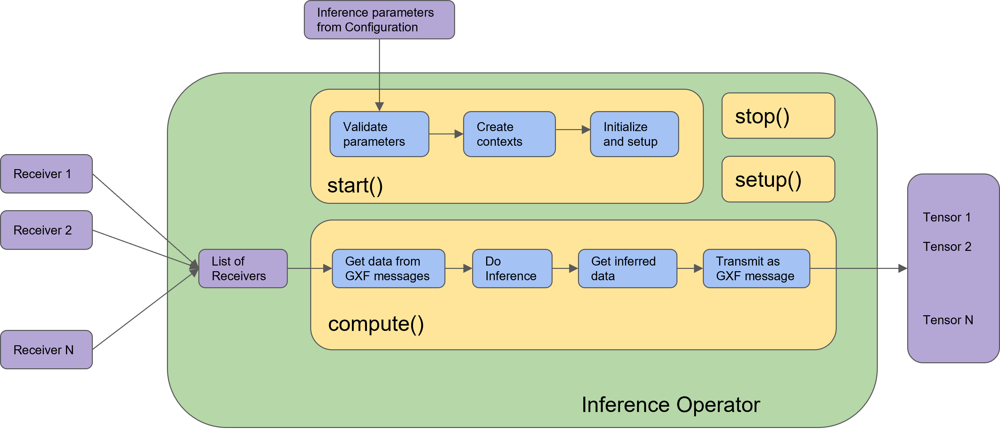

(holoinfer)=
# Inference

## Overview

A Holoscan application that needs to run inference will use an inference operator. The built-in [Inference operator](#inference-operator) (`InferenceOp`) can be used, and several related use cases are documented in the Inference operator section below. The use cases are created using the [parameter set](#parameters-and-related-features) that must be defined in the configuration file of the Holoscan application. If the built-in `InferenceOp` doesn't cover a specific use case, users can create their own custom inference operator as documented in the [Creating an Inference Operator](#creating-an-inference-operator) section.

The core inference functionality in the Holoscan SDK is provided by the Inference Module, which is a framework that facilitates designing and executing inference and processing applications through its APIs. It is used by the built-in `InferenceOp` which supports the same parameters as the Inference Module.  All parameters required by the Holoscan Inference Module are passed through a parameter set in the configuration file of an application.

## Parameters and Related Features

Required parameters and related features available with the Holoscan Inference Module are listed below.

- Data Buffer Parameters: Parameters are provided in the inference settings to enable data buffer locations at several stages of the inference. As shown in the figure below, three parameters `input_on_cuda`, `output_on_cuda` and `transmit_on_cuda` can be set by the user.
    - `input_on_cuda` refers to the location of the data going into the inference.
        - If value is `true`, it means the input data is on the device.
        - If value is `false`, it means the input data is on the host.
        - Default value: `true`
    - `output_on_cuda` refers to the data location of the inferred data.
        - If value is `true`, it means the inferred data is on the device.
        - If value is `false`, it means the inferred data is on the host.
        - Default value: `true`
    - `transmit_on_cuda` refers to the data transmission.
        - If value is `true`, it means the data transmission from the inference extension will be on __Device__.
        - If value is `false`, it means the data transmission from the inference extension will be on __Host__.
        - Default value: `true`
- Inference Parameters
    - `backend` parameter is set to either `trt` for TensorRT, `onnxrt` for ONNX runtime, or `torch` for libtorch. If there are multiple models in the inference application, all models will use the same backend. If it is desired to use different backends for different models, specify the `backend_map` parameter instead.
        - TensorRT:
            - CUDA-based inference supported both on x86_64 and aarch64.
            - End-to-end CUDA-based data buffer parameters supported. `input_on_cuda`, `output_on_cuda` and `transmit_on_cuda` will all be true for end-to-end CUDA-based data movement.
            - `input_on_cuda`, `output_on_cuda` and `transmit_on_cuda` can be either `true` or `false`.
            - TensorRT backend expects input models to be in `tensorrt engine file` format or `onnx` format.
                - if models are in `tensorrt engine file` format, parameter `is_engine_path` must be set to `true`.
                - if models are in `onnx` format, it will be automatically converted into `tensorrt engine file` by the Holoscan inference module.
        - Torch:
            - CUDA and CPU based inference supported both on x86_64 and aarch64.
            - End-to-end CUDA-based data buffer parameters supported. `input_on_cuda`, `output_on_cuda` and `transmit_on_cuda` will all be true for end-to-end CUDA-based data movement.
            - `input_on_cuda`, `output_on_cuda` and `transmit_on_cuda` can be either `true` or `false`.
            - Libtorch and TorchVision are included in the Holoscan NGC container, initially built as part of the [PyTorch NGC container](https://catalog.ngc.nvidia.com/orgs/nvidia/containers/pytorch). To use the Holoscan SDK torch backend outside of these containers, we recommend you download libtorch and torchvision binaries from [Holoscan's third-party repository](https://edge.urm.nvidia.com/artifactory/sw-holoscan-thirdparty-generic-local/).
            - Torch backend expects input models to be in `torchscript` format.
                - It is recommended to use the same version of torch for `torchscript` model generation, as used in the HOLOSCAN SDK on the respective architectures.
                - Additionally, it is recommended to generate the `torchscript` model on the same architecture on which it will be executed. For example, `torchscript` model must be generated on `x86_64` to be executed in an application running on `x86_64` only.
        - __Model Configuration Requirement__: The torch backend requires a companion `model.yaml` configuration file alongside each torchscript model file.
          - The YAML file must have the same name as the model file but with a `.yaml` extension (e.g., if the model is `my_model.pt`, the configuration file should be `my_model.yaml`).
          - The configuration file defines the input and output tensor formats, dimensions, and data types, enabling support for complex tensor structures beyond simple tensors.
          - The system automatically validates that the YAML configuration matches the actual model schema extracted from the torchscript model.
          - See [Torch Backend Model Configuration](#torch-backend-model-configuration) for detailed configuration examples and supported formats.
        - ONNX runtime:
            - CUDA and CPU based inference supported both on x86_64 and aarch64.
            - End-to-end CUDA-based data buffer parameters supported. `input_on_cuda`, `output_on_cuda` and `transmit_on_cuda` will all be true for end-to-end CUDA-based data movement.
            - `input_on_cuda`, `output_on_cuda` and `transmit_on_cuda` can be either `true` or `false`.

    - `infer_on_cpu` parameter is set to `true` if CPU based inference is desired.

        The tables below demonstrate the supported features related to the data buffer and the inference with `trt`, `torch` and `onnxrt` based backend.

        |  | `input_on_cuda`  | `output_on_cuda`  | `transmit_on_cuda` | `infer_on_cpu` |
        |---|---|---|---|---|
        | Supported values for `trt`  | `true` or `false`  | `true` or `false` | `true` or `false` | `false` |
        | Supported values for `torch`  | `true` or `false`  | `true` or `false` | `true` or `false` | `true` or `false` |
        | Supported values for `onnxrt`  | `true` or `false`  | `true` or `false` | `true` or `false` | `true` or `false` |

    - `model_path_map`: User can design single or multi AI inference pipeline by populating `model_path_map` in the config file.
        - With a single entry, it is single inference; with more than one entry, multi AI inference is enabled.
        - Each entry in `model_path_map` has a unique keyword as key (used as an identifier by the Holoscan Inference Module), and the path to the model as value.
        - All model entries must have the models either in __onnx__ or __tensorrt engine file__ or __torchscript__ format.
    - `pre_processor_map`: input tensor to the respective model is specified in `pre_processor_map` in the config file.
        - The Holoscan Inference Module supports same input for multiple models or unique input per model.
        - Each entry in `pre_processor_map` has a unique keyword representing the model (same as used in `model_path_map`), and a vector of tensor names as the value.
        - The Holoscan Inference Module supports multiple input tensors per model.
    - `inference_map`: output tensors per model after inference is specified in `inference_map` in the config file.
        - Each entry in `inference_map` has a unique keyword representing the model (same as used in `model_path_map` and `pre_processor_map`), and a vector of the output tensor names as the value.
        - The Holoscan Inference Module supports multiple output tensors per model.
    - `parallel_inference`: Parallel or Sequential execution of inferences.
        - If multiple models are input, you can execute models in parallel.
        - Parameter `parallel_inference` can be either `true` or `false`. Default value is `true`.
        - Inferences are launched in parallel without any check of the available GPU resources. You must ensure that there is enough memory and compute available to run all the inferences in parallel.
    - `enable_fp16`: Generation of the TensorRT engine files with FP16 option
        - If `backend` is set to `onnx` or `trt` if the input models are in __onnx__ format, then you can generate the engine file with fp16 option to accelerate inferencing.
        - It takes few minutes to generate the engine files for the first time.
        - It can be either `true` or `false`. Default value is `false`.
    - `enable_cuda_graphs`: Enable usage of CUDA Graphs for backends which support it.
        - Enabled by default for the TensorRT backend.
        - Using CUDA Graphs reduces CPU launch costs and enables optimizations which might not be possible with the piecewise work submission mechanism of streams.
        - Models including loops or conditions are not supported with CUDA Graphs. For these models usage of CUDA Graphs needs to be disabled.
        - It can be either `true` or `false`. Default value is `true`.
    - `dla_core`: The DLA core index to execute the engine on, starts at `0`.
        - It can be either `-1` or the DLA core index. Default value is `-1`.
    - `dla_gpu_fallback`: Enable DLA GPU fallback
        - If DLA is enabled, use the GPU if a layer cannot be executed on DLA. If the fallback is disabled, engine creation will fail if a layer cannot executed on DLA.
        - It can be either `true` or `false`. Default value is `true`.
    - `is_engine_path`: if the input models are specified in __trt engine format__ in `model_path_map`, this flag must be set to `true`. Default value is `false`.
    - `in_tensor_names`: Input tensor names to be used by `pre_processor_map`. This parameter is optional. If absent in the parameter map, values are derived from `pre_processor_map`.
    - `out_tensor_names`: Output tensor names to be used by `inference_map`. This parameter is optional. If absent in the parameter map, values are derived from `inference_map`.
    - `device_map`: Multi-GPU inferencing is enabled if `device_map` is populated in the parameter set.
        - Each entry in `device_map` has a unique keyword representing the model (same as used in `model_path_map` and `pre_processor_map`), and GPU identifier as the value. This GPU ID is used to execute the inference for the specified model.
        - GPUs specified in the `device_map` must have P2P (peer to peer) access and they must be connected to the same PCIE configuration. If P2P access is not possible among GPUs, the host (CPU memory) will be used to transfer the data.
        - Multi-GPU inferencing is supported for all backends.
    - `dla_core_map`: DLA cores are used for inferencing if `dla_core_map` is populated in the parameter set.
        - Each entry in `dla_core_map` has a unique keyword representing the model (same as used in `model_path_map` and `pre_processor_map`), and a DLA core index as the value. This DLA core index is used to execute the inference for the specified model.
    - `temporal_map`: Temporal inferencing is enabled if `temporal_map` is populated in the parameter set.
        - Each entry in `temporal_map` has a unique keyword representing the model (same as used in `model_path_map` and `pre_processor_map`), and frame delay as the value. Frame delay represents the frame count that are skipped by the operator in doing the inference for that particular model. A model with the value of 1, is inferred per frame. A model with a value of 10 is inferred for every 10th frame coming into the operator, which is the 1st frame, 11th frame, 21st frame and so on. Additionally, the operator will transmit the last inferred result for all the frames that are not inferred. For example, a model with a value of 10 will be inferred at 11th frame and from 12th to 20th frame, the result from 11th frame is transmitted.
        - If the `temporal_map` is absent in the parameter set, all models are inferred for all the frames.
        - All models are not mandatory in the `temporal_map`.  The missing models are inferred per frame.
        - Temporal map based inferencing is supported for all backends.
    - `activation_map`: Dynamic inferencing can be enabled with this parameter. It is populated in the parameter set and is updated at runtime.
        - Each entry in `activation_map` has a unique keyword representing the model (same as used in `model_path_map` and `pre_processor_map`), and activation state as the value. Activation state represents whether the model will be used for inferencing or not on a given frame. Any model(s) with a value of 1 will be active and will be used for inference, and any model(s) with a value of 0 will not run. The activation map must be initialized in the parameter set for all the models that need to be activated or deactivated dynamically.
        - When the activation state is 0 for a particular model in the `activation_map`, the inference operator will not launch the inference for the model and will emits the last inferred result for the model.
        - If the `activation_map` is absent in the parameter set, all of the models are inferred for all frames.
        - All models are not mandatory in the `activation_map`.  The missing models are active on every frame.
        - Dynamic inferenceing based on `activation_map` along with the `model_activation_specs` input port is supported for all backends.
    - `backend_map`: Multiple backends can be used in the same application with this parameter.
        - Each entry in `backend_map` has a unique keyword representing the model (same as used in `model_path_map`), and the `backend` as the value.
        - A sample backend_map is shown below. In the example, model_1 uses the `tensorRT` backend, and model 2 and model 3 uses the `torch` backend for inference.
            ```yaml
                backend_map:
                    "model_1_unique_identifier": "trt"
                    "model_2_unique_identifier": "torch"
                    "model_3_unique_identifier": "torch"
            ```
    - `trt_opt_profile`: This parameter is optional and is activated with TensorRT backend. This parameter is applicable on models with dynamic input shapes.
        - Parameter is specified as a vector of 3 integers. First is the minimum batch size for the input, second is the optimum batch size and third value is the maximum batch size.
        - Users can specify a batch profile for dynamic input. This profile is then used in engine creation. User must clear the cache to apply the updated optimization profile.
        - Default value: {1,1,1}

- Other features: The table below illustrates other features and supported values in the current release.

    | Feature  | Supported values  |
    |---|---|
    | Data type  | `float32`, `int32`, `int8`  |
    | Inference Backend  | `trt`, `torch`, `onnxrt`  |
    | Inputs per model  | Multiple  |
    | Outputs per model  | Multiple  |
    | GPU(s) supported  | Multi-GPU on same PCIE network |
    | Tensor data dimension | Max 8 supported for `onnx` and `trt` backend, 3 (CHW) or 4 (NCHW) for `torch`.  |
    | Model Type  | `All onnx` or `all torchscript` or `all trt engine` type or a `combination of torch and trt engine`  |

- Multi Receiver and Single Transmitter support
    - The Holoscan Inference Module provides an API to extract the data from multiple receivers.
    - The Holoscan Inference Module provides an API to transmit multiple tensors via a single transmitter.
    - The Holoscan Inference Module provides an API to allow selecting the set of active models for inference at runtime (see example under the directory `examples/activation_map`).

### Parameter Specification

All required inference parameters of the inference application must be specified. Below is a sample parameter set for an application that uses three models for inferencing. You must populate all required fields with appropriate values.

```yaml
inference:
    backend: "trt"
    model_path_map:
        "model_1_unique_identifier": "path_to_model_1"
        "model_2_unique_identifier": "path_to_model_2"
        "model_3_unique_identifier": "path_to_model_3"
    pre_processor_map:
        "model_1_unique_identifier": ["input_tensor_1_model_1_unique_identifier"]
        "model_2_unique_identifier": ["input_tensor_1_model_2_unique_identifier"]
        "model_3_unique_identifier": ["input_tensor_1_model_3_unique_identifier"]
    inference_map:
        "model_1_unique_identifier": ["output_tensor_1_model_1_unique_identifier"]
        "model_2_unique_identifier": ["output_tensor_1_model_2_unique_identifier"]
        "model_3_unique_identifier": ["output_tensor_1_model_3_unique_identifier"]
    parallel_inference: true
    infer_on_cpu: false
    enable_fp16: false
    input_on_cuda: true
    output_on_cuda: true
    transmit_on_cuda: true
    is_engine_path: false
```

## Torch Backend Model Configuration

When using the `torch` backend, a companion `model.yaml` configuration file is required alongside each torchscript model. This file defines the model's input and output tensor specifications and supports complex tensor structures required for Pythonic I/O.

On the operator side, each tensor is still specified individually in `pre_processor_map` and `inference_map`, but during inference the torch backend will reconstruct them into the defined Pythonic structure.

### YAML Configuration Structure

The configuration file must contain an `inference` section with the following components:

- `input_nodes`: Defines the input tensor specifications including names, dimensions, and data types
- `output_nodes`: Defines the output tensor specifications including names, dimensions, and data types
- `input_format` *(optional)*: Specifies how input tensors are structured and organized (defaults to passing each tensor individually).
- `output_format` *(optional)*: Specifies how output tensors are structured and organized (defaults to expecting individual tensors returned)

### Basic Example

For a simple model with single tensor input and output:

```yaml
inference:
  input_nodes:
    input_tensor:
      dim: "3,224,224"
      dtype: kFloat32
  output_nodes:
    output_tensor:
      dim: "1000"
      dtype: kFloat32
```

### Complex Structure Examples
#### Dictionary Input
This corresponds to calling the model with a dictionary:
```python
result = model.forward({"input1": feature1, "input2": feature2})
```
```yaml
inference:
  input_nodes:
    feature1:
      dim: "3,224,224"
      dtype: kFloat32
    feature2:
      dim: "128"
      dtype: kFloat32
  output_nodes:
    result:
      dim: "10"
      dtype: kFloat32
  input_format: [{"input1": "feature1", "input2": "feature2"}]
  output_format: "result"
```

#### List Input
This corresponds to calling the model with a list:
```python
result = model.forward([tensor1, tensor2])
```
```yaml
inference:
  input_nodes:
    tensor1:
      dim: "3,224,224"
      dtype: kFloat32
    tensor2:
      dim: "3,224,224"
      dtype: kFloat32
  output_nodes:
    result:
      dim: "10"
      dtype: kFloat32
  input_format: [["tensor1", "tensor2"]]
  output_format: "result"
```

#### Nested Structures
The system supports complex nested combinations of lists and dictionaries for both inputs and outputs:
This corresponds to the following function call where detections is a dictionary.
```python
classification_result, detections = model.forward([{"feature1": tensor1}, {"feature1": tensor2, "feature2": tensor3}])
```

```yaml
inference:
  input_nodes:
    tensor1:
      dim: "3,224,224"
      dtype: kFloat32
    tensor2:
      dim: "128"
      dtype: kFloat32
    tensor3:
      dim: "64"
      dtype: kFloat32
  output_nodes:
    classification_result:
      dim: "10"
      dtype: kFloat32
    detection_boxes:
      dim: "100,4"
      dtype: kFloat32
    detection_scores:
      dim: "100"
      dtype: kFloat32
  input_format: [[{"feature1": "tensor1"}, {"feature1": "tensor2", "feature2": "tensor3"}]]
  output_format: ["classification_result", {"detections": {"boxes": "detection_boxes", "scores": "detection_scores"}}]
```

#### Ignoring outputs
There may be cases where some outputs of a model should not be forwarded. In these cases, enter a null value in the YAML to ignore an entire subtree on the output.
```python
_, detections = model.forward([img])
```

```yaml
inference:
  input_nodes:
    img:
      dim: "1080 1920 3"
      dtype: kFloat32
  output_nodes:
    boxes:
      dtype: kFloat32
    labels:
      dtype: kInt64
    scores:
      dtype: kFloat32
  input_format: [["img"]]
  output_format: [null, [{"boxes": "boxes", "labels": "labels", "scores": "scores"}]]
```

### Supported Input/Output Formats

The torch backend supports the following tensor structure types:
- `Tensor`: Single tensor
- `Tensor[]`: List of tensors
- `Dict(str, Tensor)`: Dictionary mapping strings to tensors
- `Dict(str, Tensor[])`: Dictionary mapping strings to lists of tensors
- `Dict(str, Dict(str, Tensor))`: Nested dictionary structures
- `Dict(str, Tensor)[]`: List of dictionaries
- `Tensor[][]`: Nested lists of tensors

## Inference Operator

In Holoscan SDK, the built-in Inference operator (`InferenceOp`) is designed using the Holoscan Inference Module APIs. The Inference operator ingests the inference parameter set (from the configuration file) and the data receivers (from previous connected operators in the application), executes the inference and transmits the inferred results to the next connected operators in the application.

`InferenceOp` is a generic operator that serves multiple use cases via the parameter set. Parameter sets for some key use cases are listed below:

:::{note}
Some parameters have default values set for them in the `InferenceOp`. For any parameters not mentioned in the example parameter sets below, their default is used by the `InferenceOp`. These parameters are used to enable several use cases.
:::

- Single model inference using `TensorRT` backend.

    ```yaml
        backend: "trt"
        model_path_map:
            "model_1_unique_identifier": "path_to_model_1"
        pre_processor_map:
            "model_1_unique_identifier": ["input_tensor_1_model_1_unique_identifier"]
        inference_map:
            "model_1_unique_identifier": ["output_tensor_1_model_1_unique_identifier"]
    ```

    The value of `backend` can be modified for other supported backends, and other parameters related to each backend. You must ensure the correct model type and model path are provided into the parameter set, along with supported values of all parameters for the respective backend.

    In this example, `path_to_model_1` must be an `onnx` file, which will be converted to a `tensorRT` engine file at first execution. During subsequent executions, the Holoscan inference module will automatically find the tensorRT engine file (if `path_to_model_1` has not changed). Additionally, if you have a pre-built `tensorRT` engine file, `path_to_model_1` must be path to the engine file and the parameter `is_engine_path` must be set to `true` in the parameter set.

    :::{note}
    When using the `torch` backend, ensure that a corresponding `model.yaml` configuration file exists alongside your torchscript model file. The YAML file must define the input and output tensor specifications as described in the [Torch Backend Model Configuration](#torch-backend-model-configuration) section.
    :::


- Single model inference using `TensorRT` backend with multiple outputs.
    ``` yaml
        backend: "trt"
        model_path_map:
            "model_1_unique_identifier": "path_to_model_1"
        pre_processor_map:
            "model_1_unique_identifier": ["input_tensor_1_model_1_unique_identifier"]
        inference_map:
            "model_1_unique_identifier": ["output_tensor_1_model_1_unique_identifier",
                                          "output_tensor_2_model_1_unique_identifier",
                                          "output_tensor_3_model_1_unique_identifier"]
    ```

    As shown in example above, the Holoscan Inference module automatically maps the model outputs to the named tensors in the parameter set. You must be sure to use the named tensors in the same sequence in which the model generates the output. Similar logic holds for multiple inputs.

- Single model inference using fp16 precision.
    ``` yaml
        backend: "trt"
        model_path_map:
            "model_1_unique_identifier": "path_to_model_1"
        pre_processor_map:
            "model_1_unique_identifier": ["input_tensor_1_model_1_unique_identifier"]
        inference_map:
            "model_1_unique_identifier": ["output_tensor_1_model_1_unique_identifier",
                                          "output_tensor_2_model_1_unique_identifier",
                                          "output_tensor_3_model_1_unique_identifier"]
        enable_fp16: true
    ```

    If a `tensorRT` engine file is not available for fp16 precision, it will be automatically generated by the Holoscan Inference module on the first execution. The file is cached for future executions.

- Single model inference on CPU.
    ``` yaml
        backend: "onnxrt"
        model_path_map:
            "model_1_unique_identifier": "path_to_model_1"
        pre_processor_map:
            "model_1_unique_identifier": ["input_tensor_1_model_1_unique_identifier"]
        inference_map:
            "model_1_unique_identifier": ["output_tensor_1_model_1_unique_identifier"]
        infer_on_cpu: true
    ```

    Note that the backend can only be `onnxrt` or `torch` for CPU-based inference.

- Single model inference with input/output data on Host.
    ```yaml
        backend: "trt"
        model_path_map:
            "model_1_unique_identifier": "path_to_model_1"
        pre_processor_map:
            "model_1_unique_identifier": ["input_tensor_1_model_1_unique_identifier"]
        inference_map:
            "model_1_unique_identifier": ["output_tensor_1_model_1_unique_identifier"]
        input_on_cuda: false
        output_on_cuda: false
    ```

    Data in the core inference engine is passed through the host and is received on the host. Inference can happen on the GPU. Parameters `input_on_cuda` and `output_on_cuda` define the location of the data before and after inference respectively.

- Single model inference with data transmission via Host.
    ```yaml
        backend: "trt"
        model_path_map:
            "model_1_unique_identifier": "path_to_model_1"
        pre_processor_map:
            "model_1_unique_identifier": ["input_tensor_1_model_1_unique_identifier"]
        inference_map:
            "model_1_unique_identifier": ["output_tensor_1_model_1_unique_identifier"]
        transmit_on_host: true
    ```

    Data from inference operator to the next connected operator in the application is transmitted via the host.


- Multi model inference with a single backend.
    ```yaml
        backend: "trt"
        model_path_map:
            "model_1_unique_identifier": "path_to_model_1"
            "model_2_unique_identifier": "path_to_model_2"
            "model_3_unique_identifier": "path_to_model_3"
        pre_processor_map:
            "model_1_unique_identifier": ["input_tensor_1_model_1_unique_identifier"]
            "model_2_unique_identifier": ["input_tensor_1_model_2_unique_identifier"]
            "model_3_unique_identifier": ["input_tensor_1_model_3_unique_identifier"]
        inference_map:
            "model_1_unique_identifier": ["output_tensor_1_model_1_unique_identifier"]
            "model_2_unique_identifier": ["output_tensor_1_model_2_unique_identifier"]
            "model_3_unique_identifier": ["output_tensor_1_model_3_unique_identifier"]
    ```

    By default, multiple model inferences are launched in parallel. The backend specified via parameter `backend` is used for all models in the application.


- Multi model inference with sequential inference.
    ```yaml
        backend: "trt"
        model_path_map:
            "model_1_unique_identifier": "path_to_model_1"
            "model_2_unique_identifier": "path_to_model_2"
            "model_3_unique_identifier": "path_to_model_3"
        pre_processor_map:
            "model_1_unique_identifier": ["input_tensor_1_model_1_unique_identifier"]
            "model_2_unique_identifier": ["input_tensor_1_model_2_unique_identifier"]
            "model_3_unique_identifier": ["input_tensor_1_model_3_unique_identifier"]
        inference_map:
            "model_1_unique_identifier": ["output_tensor_1_model_1_unique_identifier"]
            "model_2_unique_identifier": ["output_tensor_1_model_2_unique_identifier"]
            "model_3_unique_identifier": ["output_tensor_1_model_3_unique_identifier"]
        parallel_inference: false
    ```

    `parallel_inference` is set to `true` by default. To launch model inferences in sequence, `parallel_inference` must be set to `false`.

- Multi model inference with multiple backends.
    ```yaml
        backend_map:
            "model_1_unique_identifier": "trt"
            "model_2_unique_identifier": "torch"
            "model_3_unique_identifier": "torch"
        model_path_map:
            "model_1_unique_identifier": "path_to_model_1"
            "model_2_unique_identifier": "path_to_model_2"
            "model_3_unique_identifier": "path_to_model_3"
        pre_processor_map:
            "model_1_unique_identifier": ["input_tensor_1_model_1_unique_identifier"]
            "model_2_unique_identifier": ["input_tensor_1_model_2_unique_identifier"]
            "model_3_unique_identifier": ["input_tensor_1_model_3_unique_identifier"]
        inference_map:
            "model_1_unique_identifier": ["output_tensor_1_model_1_unique_identifier"]
            "model_2_unique_identifier": ["output_tensor_1_model_2_unique_identifier"]
            "model_3_unique_identifier": ["output_tensor_1_model_3_unique_identifier"]
    ```

    In the above sample parameter set, the first model will do inference using the `tensorRT` backend, and model 2 and 3 will do inference using the `torch` backend.

    :::{note}
    The combination of backends in `backend_map` must support all other parameters that will be used during the inference. For example, `onnxrt` and `tensorRT` combination with CPU-based inference is not supported.
    :::

- Multi model inference with a single backend on multi-GPU.
    ```yaml
        backend: "trt"
        device_map:
            "model_1_unique_identifier": "1"
            "model_2_unique_identifier": "0"
            "model_3_unique_identifier": "1"
        model_path_map:
            "model_1_unique_identifier": "path_to_model_1"
            "model_2_unique_identifier": "path_to_model_2"
            "model_3_unique_identifier": "path_to_model_3"
        pre_processor_map:
            "model_1_unique_identifier": ["input_tensor_1_model_1_unique_identifier"]
            "model_2_unique_identifier": ["input_tensor_1_model_2_unique_identifier"]
            "model_3_unique_identifier": ["input_tensor_1_model_3_unique_identifier"]
        inference_map:
            "model_1_unique_identifier": ["output_tensor_1_model_1_unique_identifier"]
            "model_2_unique_identifier": ["output_tensor_1_model_2_unique_identifier"]
            "model_3_unique_identifier": ["output_tensor_1_model_3_unique_identifier"]
    ```

    In the sample above, model 1 and model 3 will do inference on the GPU with ID 1 and model 2 will do inference on the GPU with ID 0. GPUs must have P2P (peer to peer) access among them. If it is not enabled, the Holoscan inference module enables it by default. If P2P access is not possible between GPUs, then the data transfer will happen via the Host.

- Multi model inference with multiple backends on multiple GPUs.
    ```yaml
        backend_map:
            "model_1_unique_identifier": "trt"
            "model_2_unique_identifier": "torch"
            "model_3_unique_identifier": "torch"
        device_map:
            "model_1_unique_identifier": "1"
            "model_2_unique_identifier": "0"
            "model_3_unique_identifier": "1"
        model_path_map:
            "model_1_unique_identifier": "path_to_model_1"
            "model_2_unique_identifier": "path_to_model_2"
            "model_3_unique_identifier": "path_to_model_3"
        pre_processor_map:
            "model_1_unique_identifier": ["input_tensor_1_model_1_unique_identifier"]
            "model_2_unique_identifier": ["input_tensor_1_model_2_unique_identifier"]
            "model_3_unique_identifier": ["input_tensor_1_model_3_unique_identifier"]
        inference_map:
            "model_1_unique_identifier": ["output_tensor_1_model_1_unique_identifier"]
            "model_2_unique_identifier": ["output_tensor_1_model_2_unique_identifier"]
            "model_3_unique_identifier": ["output_tensor_1_model_3_unique_identifier"]
    ```

    In the sample above, three models are used during the inference. Model 1 uses the trt backend and runs on the GPU with ID 1, model 2 uses the torch backend and runs on the GPU with ID 0, and model 3 uses the torch backend and runs on the GPU with ID 1.

## Creating an Inference Operator

The Inference operator is the core inference unit in an inference application. The built-in Inference operator (`InferenceOp`) can be used for inference, or you can create your own custom inference operator as explained in this section. In Holoscan SDK, the inference operator can be designed using the Holoscan Inference Module APIs.

Arguments in the code sections below are referred to as __...__.

- Parameter Validity Check: Input inference parameters via the configuration (from step 1) are verified for correctness.

    ```cpp
    auto status = HoloInfer::inference_validity_check(...);
    ```

- Inference specification creation: For a single AI, only one entry is passed into the required entries in the parameter set. There is no change in the API calls below. Single AI or multi AI is enabled based on the number of entries in the parameter specifications from the configuration (in step 1).

    ```cpp
    // Declaration of inference specifications
    std::shared_ptr<HoloInfer::InferenceSpecs> inference_specs_;

    // Creation of inference specification structure
    inference_specs_ = std::make_shared<HoloInfer::InferenceSpecs>(...);
    ```

- Inference context creation.

    ```cpp
    // Pointer to inference context.
    std::unique_ptr<HoloInfer::InferContext> holoscan_infer_context_;
    // Create holoscan inference context
    holoscan_infer_context_ = std::make_unique<HoloInfer::InferContext>();
    ```

- Parameter setup with inference context: All required parameters of the Holoscan Inference Module are transferred in this step, and relevant memory allocations are initiated in the inference specification.

    ```cpp
    // Set and transfer inference specification to inference context
    auto status = holoscan_infer_context_->set_inference_params(inference_specs_);
    ```

- Data extraction and allocation: The following API is used from the Holoinfer utility to extract and allocate data for the specified tensor.

    ```cpp
    // Extract relevant data from input, and update inference specifications
    gxf_result_t stat = HoloInfer::get_data_per_model(...);
    ```

- Inference execution

    ```cpp
    // Execute inference and populate output buffer in inference specifications
    auto status = holoscan_infer_context_->execute_inference(inference_specs_->data_per_model_,
                                                             inference_specs_->output_per_model_);
    ```

- Transmit inferred data:

    ```cpp
    // Transmit output buffers
    auto status = HoloInfer::transmit_data_per_model(...);
    ```

The figure below demonstrates the Inference operator in the Holoscan SDK. All blocks with `blue` color are the API calls from the Holoscan Inference Module.


