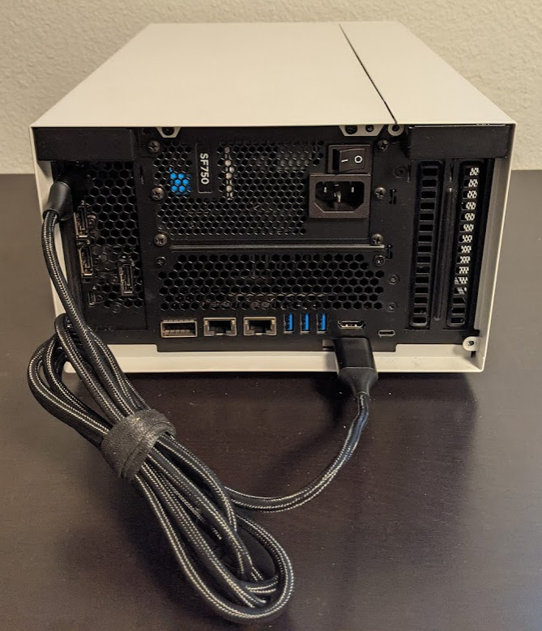
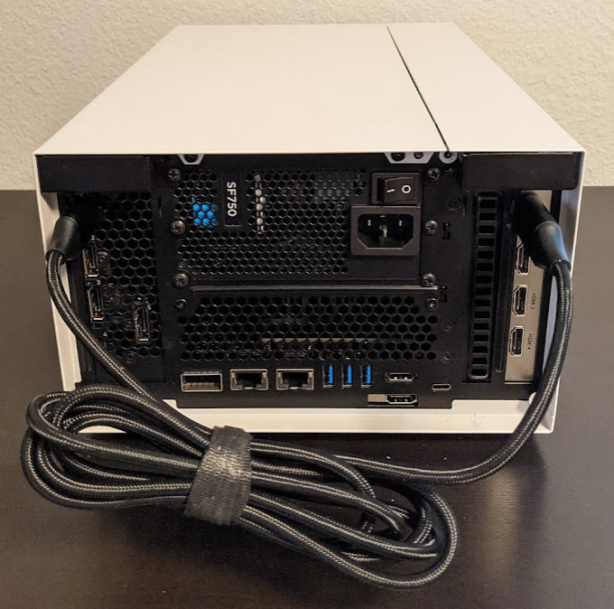
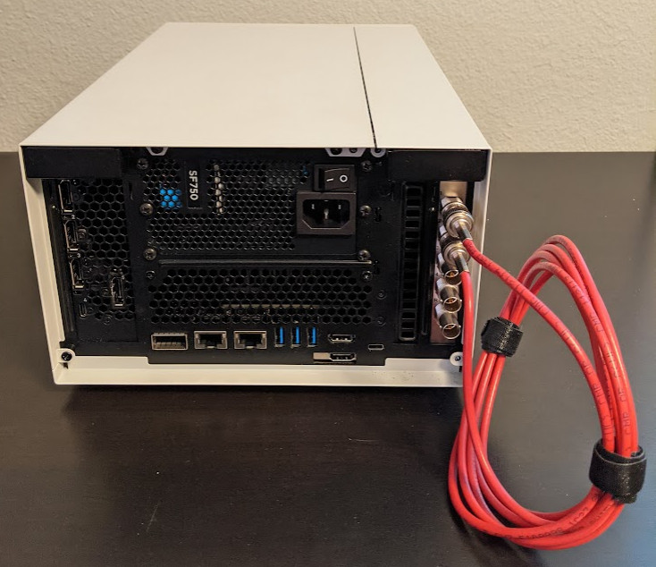
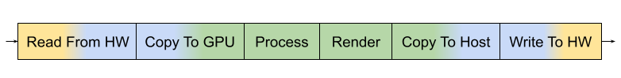
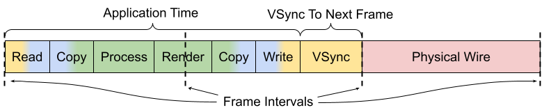
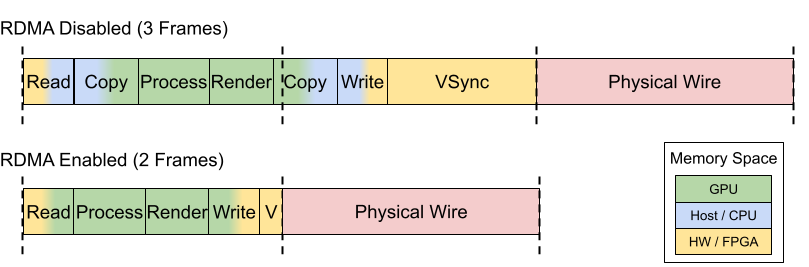
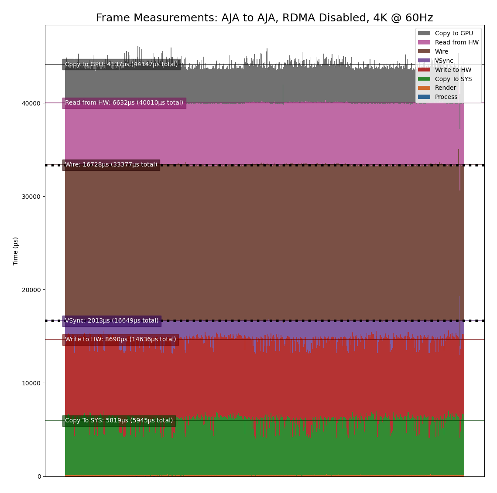
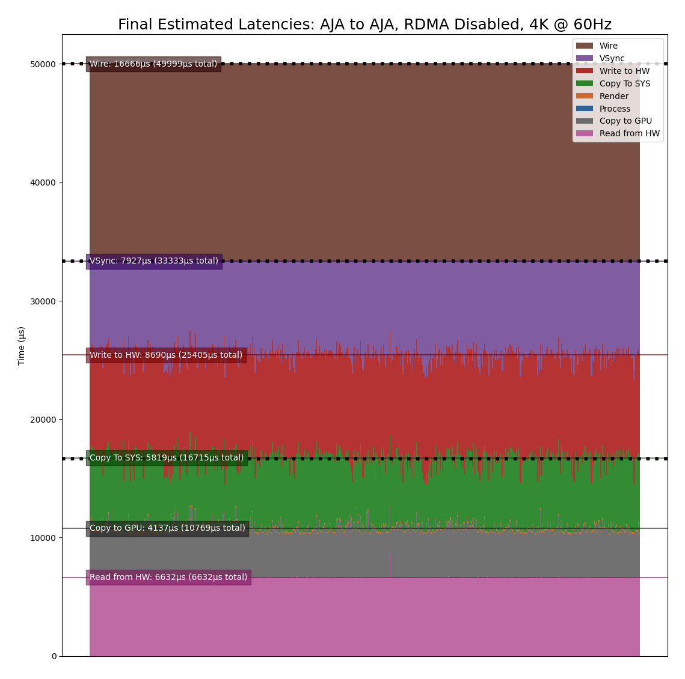
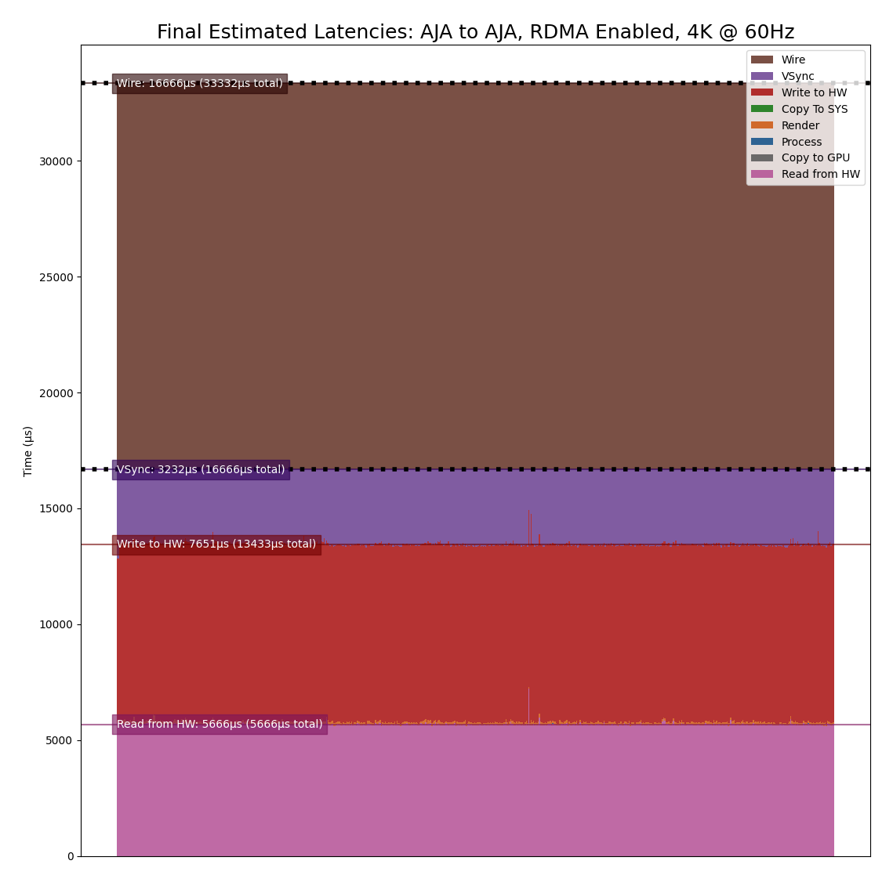
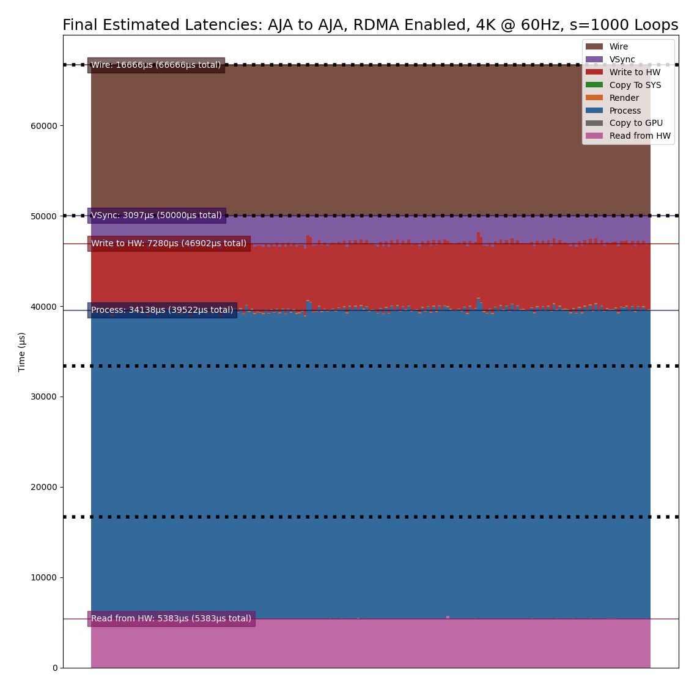

.. _latency_tool:

Video Pipeline Latency Tool
===========================

The Holoscan Developer Kits excel as a high-performance computing platform
by combining high-bandwidth video I/O components and the compute capabilities
of an NVIDIA GPU to meet the needs of the most demanding video processing and
inference applications.

For many video processing applications located at the edge--especially
those designed to augment medical instruments and aid live medical 
procedures--minimizing the latency added between image capture and
display, often referred to as the end-to-end latency, is of the utmost
importance.

While it is generally easy to measure the individual processing time of
an isolated compute or inference algorithm by simply measuring the time that
it takes for a single frame (or a sequence of frames) to be processed, it is
not always so easy to measure the complete end-to-end latency when the video
capture and display is incorporated as this usually involves external capture
hardware (e.g. cameras and other sensors) and displays.

In order to establish a baseline measurement of the minimal end-to-end latency
that can be achieved with the Holoscan Developer Kits and various video I/O
hardware and software components, the Holoscan SDK includes a sample
latency measurement tool.

Requirements
------------

Hardware
^^^^^^^^

The latency measurement tool requires the use of a Holoscan Developer Kit in
dGPU mode, and operates by having an output component generate a sequence of
known video frames that are then transferred back to an input component using a
physical loopback cable.

Testing the latency of any of the HDMI modes that output from the GPU requires
a DisplayPort to HDMI adapter or cable (see `Example Configurations`_, below).
Note that this cable must support the mode that is being tested --- for example,
the UHD mode will only be available if the cable is advertised to support "4K
Ultra HD (3840 x 2160) at 60 Hz".

Testing the latency of an optional AJA Video Systems device requires a supported
AJA SDI or HDMI capture device (see :ref:`aja_video_systems` for the list of
supported devices), along with the HDMI or SDI cable that is required for the
configuration that is being tested (see `Example Configurations`_, below).

Software
^^^^^^^^

The following additional software components are required and are installed
either by the Holoscan SDK installation or in the `Installation`_ steps
below:

* CUDA 11.1 or newer (https://developer.nvidia.com/cuda-toolkit)
* CMake 3.10 or newer (https://cmake.org/)
* GLFW 3.2 or newer (https://www.glfw.org/)
* GStreamer 1.14 or newer (https://gstreamer.freedesktop.org/)
* GTK 3.22 or newer (https://www.gtk.org/)
* pkg-config 0.29 or newer (https://www.freedesktop.org/wiki/Software/pkg-config/)

The following is optional to enable DeepStream support (for RDMA support
from the :ref:`GStreamer Producer <producer_gst>`):

* DeepStream 5.1 or newer (https://developer.nvidia.com/deepstream-sdk)

The following is optional to enable AJA Video Systems support:

* AJA NTV2 SDK 16.1 or newer (See :ref:`aja_video_systems` for details on
  installing the AJA NTV2 SDK and drivers).

Installation
------------

Downloading the Source
^^^^^^^^^^^^^^^^^^^^^^

The Video Pipeline Latency Tool can be found in the :code:`loopback-latency`
folder of the `Holoscan Performance Tools`_ GitHub repository, which is
cloned with the following:

.. code::

   $ git clone https://github.com/nvidia-holoscan/holoscan-perf-tools.git

.. _Holoscan Performance Tools: https://github.com/nvidia-holoscan/holoscan-perf-tools

Installing Software Requirements
^^^^^^^^^^^^^^^^^^^^^^^^^^^^^^^^

CUDA is installed automatically during the dGPU setup. The rest of the software
requirements are installed with the following:

.. code::

   $ sudo apt-get update && sudo apt-get install -y \
       cmake \
       libglfw3-dev \
       libgstreamer1.0-dev \
       libgstreamer-plugins-base1.0-dev \
       libgtk-3-dev \
       pkg-config

Building
^^^^^^^^

Start by creating a :code:`build` folder within the :code:`loopback-latency`
directory:

.. code::

   $ cd clara-holoscan-perf-tools/loopback-latency
   $ mkdir build
   $ cd build

CMake is then used to build the tool and output the :code:`loopback-latency`
binary to the current directory:

.. code::

   $ cmake ..
   $ make -j

.. Note:: If the error :code:`No CMAKE_CUDA_COMPILER could be found` is
   encountered, make sure that the :code:`nvcc` executable can be found by
   adding the CUDA runtime location to your :code:`PATH` variable:

   .. code::

      $ export PATH=$PATH:/usr/local/cuda/bin

Enabling DeepStream Support
~~~~~~~~~~~~~~~~~~~~~~~~~~~

DeepStream support enables RDMA when using the :ref:`GStreamer Producer
<producer_gst>`. To enable DeepStream support, the :code:`DEEPSTREAM_SDK` path
must be appended to the :code:`cmake` command with the location of the
DeepStream SDK. For example, when building against DeepStream 5.1, replace the
:code:`cmake` command above with the following:

.. code::

   $ cmake -DDEEPSTREAM_SDK=/opt/nvidia/deepstream/deepstream-5.1 ..

Enabling AJA Support
~~~~~~~~~~~~~~~~~~~~

To enable AJA support, the :code:`NTV2_SDK` path must be appended to the
:code:`cmake` command with the location of the NTV2 SDK in which both the
headers and compiled libraries (i.e. :code:`libajantv2`) exist. For example, if
the NTV2 SDK is in :code:`/home/nvidia/ntv2`, replace the :code:`cmake` command
above with the following:

.. code::

   $ cmake -DNTV2_SDK=/home/nvidia/ntv2 ..

Example Configurations
----------------------

.. Note:: When testing a configuration that outputs from the GPU, the tool
   currently only supports a display-less environment in which the loopback
   cable is the only cable attached to the GPU. Because of this, any tests that
   output from the GPU must be performed using a remote connection such as SSH
   from another machine. When this is the case, make sure that the
   :code:`DISPLAY` environment variable is set to the ID of the X11 display you
   are using (e.g. in :code:`~/.bashrc`):

   .. code::

      export DISPLAY=:0

   .. _disable_lock_screen:

   It is also required that the system is logged into the desktop and that the
   system does not sleep or lock when the latency tool is being used. This can
   be done by temporarily attaching a display to the system to do the following:

   1. Open the **Ubuntu System Settings**

   2. Open **User Accounts**, click **Unlock** at the top right, and enable
      **Automatic Login**:

      .. image:: images/ubuntu_automatic_login.png

   3. Return to **All Settings** (top left), open **Brightness & Lock**,
      and disable sleep and lock as pictured:

      .. image:: images/ubuntu_lock_settings.png

   Make sure that the display is detached again after making these changes.

   See the `Producers`_ section for more details about GPU-based producers
   (i.e. :ref:`OpenGL <producer_gl>` and :ref:`GStreamer <producer_gst>`).

GPU To Onboard HDMI Capture Card
^^^^^^^^^^^^^^^^^^^^^^^^^^^^^^^^

In this configuration, a DisplayPort to HDMI cable is connected from the GPU
to the onboard HDMI capture card. This configuration supports the
:ref:`OpenGL <producer_gl>` and :ref:`GStreamer <producer_gst>` producers, and
the :ref:`V4L2 <consumer_v4l2>` and :ref:`GStreamer <consumer_gst>` consumers. 

   DP-to-HDMI Cable Between GPU and Onboard HDMI Capture Card

For example, an :ref:`OpenGL producer <producer_gl>` to
:ref:`V4L2 consumer <consumer_v4l2>` can be measured using this configuration
and the following command:

  :code:`$ ./loopback-latency -p gl -c v4l2`

GPU to AJA HDMI Capture Card
^^^^^^^^^^^^^^^^^^^^^^^^^^^^

In this configuration, a DisplayPort to HDMI cable is connected from the GPU
to an HDMI input channel on an AJA capture card. This configuration supports the
:ref:`OpenGL <producer_gl>` and :ref:`GStreamer <producer_gst>` producers, and
the :ref:`AJA consumer <consumer_aja>` using an AJA HDMI capture card.

   DP-to-HDMI Cable Between GPU and AJA KONA HDMI Capture Card (Channel 1)

For example, an :ref:`OpenGL producer <producer_gl>` to
:ref:`AJA consumer <consumer_aja>` can be measured using this configuration and
the following command:

  :code:`$ ./loopback-latency -p gl -c aja -c.device 0 -c.channel 1`

AJA SDI to AJA SDI
^^^^^^^^^^^^^^^^^^

In this configuration, an SDI cable is attached between either two channels on
the same device or between two separate devices (pictured is a loopback between
two channels of a single device). This configuration must use the
:ref:`AJA producer <producer_aja>` and :ref:`AJA consumer <consumer_aja>`.

   SDI Cable Between Channel 1 and 2 of a Single AJA Corvid 44 Capture Card

For example, the following can be used to measure the pictured configuration
using a single device with a loopback between channels 1 and 2. Note that
the tool defaults to use channel 1 for the producer and channel 2 for the
consumer, so the :code:`channel` parameters can be omitted.

  :code:`$ ./loopback-latency -p aja -c aja`

If instead there are two AJA devices being connected, the following can be
used to measure a configuration in which they are both connected to channel
1:

  :code:`$ ./loopback-latency -p aja -p.device 0 -p.channel 1 -c aja -c.device 1 -c.channel 1`

Operation Overview
------------------

The latency measurement tool operates by having a **producer** component
generate a sequence of known video frames that are output and then transferred
back to an input **consumer** component using a physical loopback cable.
Timestamps are compared throughout the life of the frame to measure the overall
latency that the frame sees during this process, and these results are
summarized when all of the frames have been received and the measurement
completes.  See `Producers`_, `Consumers`_, and `Example Configurations`_ for 
more details.

Frame Measurements
^^^^^^^^^^^^^^^^^^

Each frame that is generated by the tool goes through the following steps in
order, each of which has its time measured and then reported when all frames
complete.

  .. figure:: images/latency_frame_lifespan_nordma.png
     :align: center

     Latency Tool Frame Lifespan (RDMA Disabled)

1. **CUDA Processing**

   In order to simulate a real-world GPU workload, the tool first runs a CUDA
   kernel for a user-specified amount of loops (defaults to zero). This step
   is described below in `Simulating GPU Workload`_.

2. **Render on GPU**

   After optionally simulating a GPU workload, every producer then generates
   its frames using the GPU, either by a common CUDA kernel or by another
   method that is available to the producer's API (such as the OpenGL producer).

   This step is expected to be very fast (<100us), but higher times may be seen
   if overall system load is high.

3. **Copy To Host**

   Once the frame has been generated on the GPU, it may be necessary to copy
   the frame to host memory in order for the frame to be output by the producer
   component (for example, an AJA producer with RDMA disabled).

   If a host copy is not required (i.e. RDMA is enabled for the producer), this
   time should be zero.

4. **Write to HW**

   Some producer components require frames to be copied to peripheral memory
   before they can be output (for example, an AJA producer requires frames to
   be copied to the external frame stores on the AJA device). This copy may
   originate from host memory if RDMA is disabled for the producer, or from GPU
   memory if RDMA is enabled.

   If this copy is not required, e.g. the producer outputs directly from the
   GPU, this time should be zero.

5. **VSync Wait**

   Once the frame is ready to be output, the producer hardware must wait for the
   next VSync interval before the frame can be output.

   The sum of this VSync wait and all of the preceding steps is expected to be
   near a multiple of the frame interval. For example, if the frame rate is 60Hz
   then the sum of the times for steps 1 through 5 should be near a multiple of
   16666us.

6. **Wire Time**

   The wire time is the amount of time that it takes for the frame to transfer
   across the physical loopback cable. This should be near the time for a single
   frame interval.

7. **Read From HW**

   Once the frame has been transferred across the wire and is available to the
   consumer, some consumer components require frames to be copied from
   peripheral memory into host (RDMA disabled) or GPU (RDMA enable) memory. For
   example, an AJA consumer requires frames to be copied from the external frame
   store of the AJA device.

   If this copy is not required, e.g. the consumer component writes received
   frames directly to host/GPU memory, this time should be zero.

8. **Copy to GPU**

   If the consumer received the frame into host memory, the final step required
   for processing the frame with the GPU is to copy the frame into GPU memory.

   If RDMA is enabled for the consumer and the frame was previously written
   directly to GPU memory, this time should be zero.

Note that if RDMA is enabled on the producer and consumer sides then the
GPU/host copy steps above, 3 and 8 respectively, are effectively removed since
RDMA will copy directly between the video HW and the GPU. The following shows
the same diagram as above but with RDMA enabled for both the producer and
consumer.

  .. figure:: images/latency_frame_lifespan_rdma.png
     :align: center

     Latency Tool Frame Lifespan (RDMA Enabled)

Interpreting The Results
^^^^^^^^^^^^^^^^^^^^^^^^

The following shows example output of the above measurements from the tool when
testing a 4K stream at 60Hz from an AJA producer to an AJA consumer, both
with RDMA disabled, and no GPU/CUDA workload simulation. Note that all time
values are given in microseconds.

  :code:`$ ./loopback-latency -p aja -p.rdma 0 -c aja -c.rdma 0 -f 4k`

  .. image:: images/latency_sample_nordma_raw.png

While this tool measures the producer times followed by the consumer times, the
expectation for real-world video processing applications is that this order
would be reversed. That is to say, the expectation for a real-world application
is that it would capture, process, and output frames in the following order
(with the component responsible for measuring that time within this tool given
in parentheses):

1. **Read from HW** (consumer)
2. **Copy to GPU** (consumer)
3. **Process Frame** (producer)
4. **Render Results to GPU** (producer)
5. **Copy to Host** (producer)
6. **Write to HW** (producer)

   Real Application Frame Lifespan

To illustrate this, the tool sums and displays the total producer and consumer
times, then provides the **Estimated Application Times** as the total sum of
all of these steps (i.e. steps 1 through 6, above).

  :code:`(continued from above)`

  .. image:: images/latency_sample_nordma_application.png

Once a real-world application captures, processes, and outputs a frame, it
would still be required that this final output waits for the next VSync
interval before it is actually sent across the physical wire to the display
hardware. Using this assumption, the tool then estimates one final value for the
**Final Estimated Latencies** by doing the following:

1. Take the **Estimated Application Time** (from above)
2. Round it up to the next VSync interval
3. Add the physical wire time (i.e. a frame interval)

   Final Estimated Latency with VSync and Physical Wire Time

Continuing this example using a frame interval of 16666us (60Hz), this means
that the average **Final Estimated Latency** is determined by:

1. Average application time = **26772**
2. Round up to next VSync interval = **33332**
3. Add physical wire time (+16666) = **49998**

These times are also reported as a multiple of frame intervals.

  :code:`(continued from above)`

  .. image:: images/latency_sample_nordma_estimate.png

Using this example, we should then expect that the total end-to-end latency that
is seen by running this pipeline using these components and configuration is 3
frame intervals (49998us).

Reducing Latency With RMDA
^^^^^^^^^^^^^^^^^^^^^^^^^^

The previous example uses an AJA producer and consumer for a 4K @ 60Hz stream,
however RDMA was disabled for both components. Because of this, the additional
copies between the GPU and host memory added more than 10000us of latency to
the pipeline, causing the application to exceed one frame interval of processing
time per frame and therefore a total frame latency of 3 frames. If RDMA is
enabled, these GPU and host copies can be avoided so the processing latency is
reduced by more than 10000us. More importantly, however, this also allows the
total processing time to fit within a single frame interval so that the total
end-to-end latency can be reduced to just 2 frames.

   Reducing Latency With RDMA

The following shows the above example repeated with RDMA enabled.

  :code:`$ ./loopback-latency -p aja -p.rdma 1 -c aja -c.rdma 1 -f 4k`

  .. image:: images/latency_sample_rdma.png

Simulating GPU Workload
^^^^^^^^^^^^^^^^^^^^^^^

By default the tool measures what is essentially a pass-through video pipeline;
that is, no processing of the video frames is performed by the system. While
this is useful for measuring the minimum latency that can be achieved by the
video input and output components, it's not very indicative of a real-world
use case in which the GPU is used for compute-intensive processing operations
on the video frames between the input and output --- for example, an object
detection algorithm that applies an overlay to the output frames.

While it may be relatively simple to measure the runtime latency of the
processing algorithms that are to be applied to the video frames --- by simply
measuring the runtime of running the algorithm on a single or stream of frames
--- this may not be indicative of the effects that such processing might have
on the overall system load, which may further increase the latency of the video
input and output components.

In order to estimate the total latency when an additional GPU workload is added
to the system, the latency tool has an :code:`-s {count}` option that can be
used to run an arbitrary CUDA loop the specified number of times before the
producer actually generates a frame. The expected usage for this option is as
follows:

1. The per-frame runtime of the actual GPU processing algorithm is measured
   outside of the latency measurement tool.

2. The latency tool is repeatedly run with just the :code:`-s {count}`
   option, adjusting the :code:`{count}` parameter until the time that it takes
   to run the simulated loop approximately matches the actual processing time
   that was measured in the previous step.

     :code:`$ ./loopback-latency -s 2000`

     .. image:: images/latency_simulated_calibration.png

3. The latency tool is run with the full producer (:code:`-p`) and consumer
   (:code:`-c`) options used for the video I/O, along with the
   :code:`-s {count}` option using the loop count that was determined in the
   previous step.

     .. Note::

        The following example shows that approximately half of the frames
        received by the consumer were duplicate/repeated frames. This is due to
        the fact that the additional processing latency of the producer causes
        it to exceed a single frame interval, and so the producer is only able
        to output a new frame every second frame interval.

     :code:`$ ./loopback-latency -p aja -c aja -s 2000`

     .. image:: images/latency_simulated_runtime.png

.. tip:: To get the most accurate estimation of the latency that would be seen
   by a real world application, the best thing to do would be to run the actual
   frame processing algorithm used by the application during the latency
   measurement. This could be done by modifying the :code:`SimulateProcessing`
   function in the latency tool source code.

Graphing Results
----------------

The latency tool includes a :code:`-o {file}` option that can be used to output
a CSV file with all of the measured times for every frame. This file can then be
used with the :code:`graph_results.py` script that is included with the tool in
order to generate a graph of the measurements.

For example, if the latencies are measured using:

  :code:`$ ./loopback-latency -p aja -c aja -o latencies.csv`

The graph can then be generated using the following, which will open a window on
the desktop to display the graph:

  :code:`$ ./graph_results.py --file latencies.csv`

The graph can also be output to a PNG image file instead of opening a window on
the desktop by providing the :code:`--png {file}` option to the script. The
following shows an example graph for an AJA to AJA measurement of a 4K @ 60Hz
stream with RDMA disabled (as shown as an example in `Interpreting The
Results`_, above).

Note that this is showing the times for 600 frames, from left to right, with the
life of each frame beginning at the bottom and ending at the top. The dotted
black lines represent frame VSync intervals (every 16666us).

The above example graphs the times directly as measured by the tool. To instead
generate a graph for the **Final Estimated Latencies** as described above in
`Interpreting The Results`_, the :code:`--estimate` flag can be provided to the
script. As is done by the latency tool when it reports the estimated latencies,
this reorders the producer and consumer steps then adds a VSync interval
followed by the physical wire latency.

The following graphs the **Final Estimated Latencies** using the same data file
as the graph above. Note that this shows a total of 3 frames of expected
latency.

For the sake of comparison, the following graph shows the same test but with
RDMA enabled. Note that the **Copy To GPU** and **Copy To SYS** times are now
zero due to the use of RDMA, and this now shows just 2 frames of expected
latency.

As a final example, the following graph duplicates the above test with RDMA
enabled, but adds roughly 34ms of additional GPU processing time
(:code:`-s 1000`) to the pipeline to produce a final estimated latency of 4
frames.

Producers
---------

There are currently 3 producer types supported by the Holoscan latency tool.
See the following sections for a description of each supported producer.

.. _producer_gl:

OpenGL GPU Direct Rendering (HDMI)
^^^^^^^^^^^^^^^^^^^^^^^^^^^^^^^^^^

This producer (:code:`gl`) uses OpenGL to render frames directly on the GPU for
output via the HDMI connectors on the GPU. This is currently expected to be the
lowest latency path for GPU video output.

OpenGL Producer Notes:

* The video generated by this producer is rendered full-screen to the primary
  display. As of this version, this component has only been tested in a
  display-less environment in which the loop-back HDMI cable is the only cable
  attached to the GPU (and thus is the primary display). It may also be required
  to use the :code:`xrandr` tool to configure the HDMI output --- the tool will
  provide the :code:`xrandr` commands needed if this is the case.

* Since OpenGL renders directly to the GPU, the :code:`p.rdma` flag is not
  supported and RDMA is always considered to be enabled for this producer.

.. _producer_gst:

GStreamer GPU Rendering (HDMI)
^^^^^^^^^^^^^^^^^^^^^^^^^^^^^^

This producer (:code:`gst`) uses the :code:`nveglglessink` GStreamer component
that is included with Holopack in order to render frames that originate from
a GStreamer pipeline to the HDMI connectors on the GPU.

GStreamer Producer Notes:

* The tool must be built with DeepStream support in order for this producer to
  support RDMA (see `Enabling DeepStream Support`_ for details).

* The video generated by this producer is rendered full-screen to the primary
  display. As of this version, this component has only been tested in a
  display-less environment in which the loop-back HDMI cable is the only cable
  attached to the GPU (and thus is the primary display). It may also be required
  to use the :code:`xrandr` tool to configure the HDMI output --- the tool will
  provide the :code:`xrandr` commands needed if this is the case.

* Since the output of the generated frames is handled internally by the
  :code:`nveglglessink` plugin, the timing of when the frames are output from
  the GPU are not known. Because of this, the `Wire Time` that is reported by
  this producer includes all of the time that the frame spends between being
  passed to the :code:`nveglglessink` and when it is finally received by the
  consumer.

.. _producer_aja:

AJA Video Systems (SDI)
^^^^^^^^^^^^^^^^^^^^^^^^^^^^^^^^

This producer (:code:`aja`) outputs video frames from an AJA Video Systems
device that supports video playback.

AJA Producer Notes:

* The latency tool must be built with AJA Video Systems support in order for
  this producer to be available (see `Building`_ for details).

* The following parameters can be used to configure the AJA device and channel
  that are used to output the frames:

  :code:`-p.device {index}`

    Integer specifying the device index (i.e. 0 or 1). Defaults to 0.

  :code:`-p.channel {channel}`

    Integer specifying the channel number, starting at 1 (i.e. 1 specifies
    NTV2_CHANNEL_1). Defaults to 1.

* The :code:`p.rdma` flag can be used to enable (1) or disable (0) the use of
  RDMA with the producer. If RDMA is to be used, the AJA drivers loaded on the
  system must also support RDMA.

* The only AJA device that have currently been verified to work with this
  producer is the `Corvid 44 12G BNC`_ (SDI).

Consumers
---------

There are currently 3 consumer types supported by the Holoscan latency tool.
See the following sections for a description of each supported consumer.

.. _consumer_v4l2:

V4L2 (Onboard HDMI Capture Card)
^^^^^^^^^^^^^^^^^^^^^^^^^^^^^^^^

This consumer (:code:`v4l2`) uses the V4L2 API directly in order to capture
frames using the HDMI capture card that is onboard the Holoscan Developer Kits.

V4L2 Consumer Notes:

* The onboard HDMI capture card is locked to a specific frame resolution and
  and frame rate (1080p @ 60Hz), and so :code:`1080` is the only supported
  format when using this consumer.

* The :code:`-c.device {device}` parameter can be used to specify the path to
  the device that is being used to capture the frames (defaults to
  :code:`/dev/video0`).

* The V4L2 API does not support RDMA, and so the :code:`c.rdma` option is
  ignored.

.. _consumer_gst:

GStreamer (Onboard HDMI Capture Card)
^^^^^^^^^^^^^^^^^^^^^^^^^^^^^^^^^^^^^

This consumer (:code:`gst`) also captures frames from the onboard HDMI capture
card, but uses the :code:`v4l2src` GStreamer plugin that wraps the V4L2 API to
support capturing frames for using within a GStreamer pipeline.

GStreamer Consumer Notes:

* The onboard HDMI capture card is locked to a specific frame resolution and
  and frame rate (1080p @ 60Hz), and so :code:`1080` is the only supported
  format when using this consumer.

* The :code:`-c.device {device}` parameter can be used to specify the path to
  the device that is being used to capture the frames (defaults to
  :code:`/dev/video0`).

* The :code:`v4l2src` GStreamer plugin does not support RDMA, and so the
  :code:`c.rdma` option is ignored.

.. _consumer_aja:

AJA Video Systems (SDI and HDMI)
^^^^^^^^^^^^^^^^^^^^^^^^^^^^^^^^

This consumer (:code:`aja`) captures video frames from an AJA Video Systems
device that supports video capture. This can be either an SDI or an HDMI video
capture card.

AJA Consumer Notes:

* The latency tool must be built with AJA Video Systems support in order for
  this producer to be available (see `Building`_ for details).

* The following parameters can be used to configure the AJA device and channel
  that are used to capture the frames:

  :code:`-c.device {index}`

    Integer specifying the device index (i.e. 0 or 1). Defaults to 0.

  :code:`-c.channel {channel}`

    Integer specifying the channel number, starting at 1 (i.e. 1 specifies
    NTV2_CHANNEL_1). Defaults to 2.

* The :code:`c.rdma` flag can be used to enable (1) or disable (0) the use of
  RDMA with the consumer. If RDMA is to be used, the AJA drivers loaded on the
  system must also support RDMA.

* The only AJA devices that have currently been verified to work with this
  consumer are the `KONA HDMI`_ (for HDMI) and `Corvid 44 12G BNC`_ (for SDI).

Troubleshooting
---------------

If any of the :code:`loopback-latency` commands described above fail with
errors, the following steps may help resolve the issue.

1. **Problem:** The following error is output:

   .. code::

      ERROR: Failed to get a handle to the display (is the DISPLAY environment variable set?)

   **Solution:** Ensure that the :code:`DISPLAY` environment variable is set
   with the ID of the X11 display you are using; e.g. for display ID :code:`0`:

   .. code::

      $ export DISPLAY=:0

   If the error persists, try changing the display ID; e.g. replacing :code:`0`
   with :code:`1`:

   .. code::

      $ export DISPLAY=:1

   It might also be convenient to set this variable in your :code:`~/.bashrc`
   file so that it is set automatically whenever you login.

2. **Problem:** An error like the following is output:

   .. code::

      ERROR: The requested format (1920x1080 @ 60Hz) does not match
             the current display mode (1024x768 @ 60Hz)
             Please set the display mode with the xrandr tool using
             the following command:

                 $ xrandr --output DP-5 --mode 1920x1080 --panning 1920x1080 --rate 60

   But using the :code:`xrandr` command provided produces an error:

   .. code::

       $ xrandr --output DP-5 --mode 1920x1080 --panning 1920x1080 --rate 60
       xrandr: cannot find mode 1920x1080

   **Solution:** Try the following:

   1. Ensure that no other displays are connected to the GPU.

   2. Check the output of an :code:`xrandr` command to see that the requested
      format is supported. The following shows an example of what the onboard
      HDMI capture card should support. Note that each row of the supported
      modes shows the resolution on the left followed by all of the supported
      frame rates for that resolution to the right.

      .. code::

         $ xrandr
         Screen 0: minimum 8 x 8, current 1920 x 1080, maximum 32767 x 32767
         DP-0 disconnected (normal left inverted right x axis y axis)
         DP-1 disconnected (normal left inverted right x axis y axis)
         DP-2 disconnected (normal left inverted right x axis y axis)
         DP-3 disconnected (normal left inverted right x axis y axis)
         DP-4 disconnected (normal left inverted right x axis y axis)
         DP-5 connected primary 1920x1080+0+0 (normal left inverted right x axis y axis) 1872mm x 1053mm
            1920x1080     60.00*+  59.94    50.00    29.97    25.00    23.98
            1680x1050     59.95
            1600x900      60.00
            1440x900      59.89
            1366x768      59.79
            1280x1024     75.02    60.02
            1280x800      59.81
            1280x720      60.00    59.94    50.00
            1152x864      75.00
            1024x768      75.03    70.07    60.00
            800x600       75.00    72.19    60.32
            720x576       50.00
            720x480       59.94
            640x480       75.00    72.81    59.94
         DP-6 disconnected (normal left inverted right x axis y axis)
         DP-7 disconnected (normal left inverted right x axis y axis)
         USB-C-0 disconnected (normal left inverted right x axis y axis)

   3. If a UHD or 4K mode is being requested, ensure that the DisplayPort to
      HDMI cable that is being used supports that mode.

   4. If the :code:`xrandr` output still does not show the mode that is being
      requested but it should be supported by the cable and capture device, try
      rebooting the device.

3. **Problem:** One of the following errors is output:

   .. code::

      ERROR: Select timeout on /dev/video0

   .. code::

      ERROR: Failed to get the monitor mode (is the display cable attached?)

   .. code::

      ERROR: Could not find frame color (0,0,0) in producer records.

   These errors mean that either the capture device is not receiving frames, or
   the frames are empty (the producer will never output black frames,
   :code:`(0,0,0)`).

   **Solution:** Check the output of :code:`xrandr` to ensure that the loopback
   cable is connected and the capture device is recognized as a display. If the
   following is output, showing no displays attached, this could mean that the
   loopback cable is either not connected properly or is faulty. Try connecting
   the cable again and/or replacing the cable.

   .. code::

      $ xrandr
      Screen 0: minimum 8 x 8, current 1920 x 1080, maximum 32767 x 32767
      DP-0 disconnected (normal left inverted right x axis y axis)
      DP-1 disconnected (normal left inverted right x axis y axis)
      DP-2 disconnected (normal left inverted right x axis y axis)
      DP-3 disconnected (normal left inverted right x axis y axis)
      DP-4 disconnected (normal left inverted right x axis y axis)
      DP-5 disconnected primary 1920x1080+0+0 (normal left inverted right x axis y axis) 0mm x 0mm
      DP-6 disconnected (normal left inverted right x axis y axis)
      DP-7 disconnected (normal left inverted right x axis y axis)

4. **Problem:** An error like the following is output:

   .. code::

      ERROR: Could not find frame color (27,28,26) in producer records.

   Colors near this particular value :code:`(27,28,26)` are displayed on the
   Ubuntu lock screen, which prevents the latency tool from rendering frames
   properly.  Note that the color value may differ slightly from
   :code:`(27,28,26)`.

   **Solution:**

   Follow the steps provided in the note at the top of the Example
   Configurations section to :ref:`enable automatic login and disable the
   Ubuntu lock screen <disable_lock_screen>`.

.. _KONA HDMI: https://www.aja.com/products/kona-hdmi
.. _Corvid 44 12G BNC: https://www.aja.com/products/corvid-44-12g-bnc
