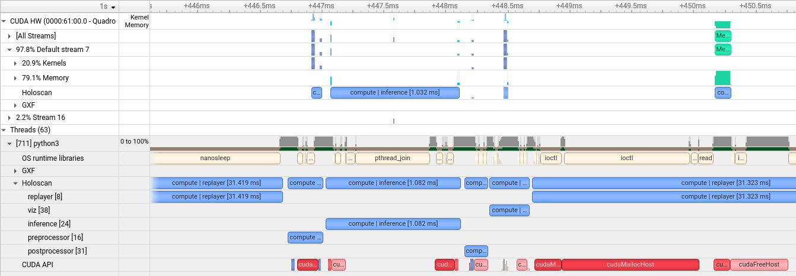

(nsight-profiling)=
# NSight Systems Profiling

The Holoscan SDK has been annotated using the [NVTX](https://github.com/NVIDIA/NVTX) API to provide runtime tracing and profiling of key application calls such as the `start`, `compute`, and `stop` callbacks made to the operators used by the application. Time spent on `emit` and `receive` calls for individual operator ports as well as timings for optional metadata handling, CUDA stream handling and data logger calls are also shown.This profiling can be captured and visualized using the tools provided by [NSight Systems](https://developer.nvidia.com/nsight-systems).

To enable profiling and output the profile results of running an application, enable the `HOLOSCAN_ENABLE_PROFILE` environment variable and use the `nsys` runtime provided with NSight Systems to run the application. For example, the following command will profile the first 3 seconds of the `bring_your_own_model` example application and write the results to `byom_profile.nsys-rep`:

```bash
export HOLOSCAN_ENABLE_PROFILE=1
nsys profile -t cuda,nvtx,osrt -o byom_profile -f true -d 3 python3 ./examples/bring_your_own_model/python/byom.py
```

The written profile can then be opened with the NSight Systems UI (`nsys-ui`) to visualize the results. This is a sample profile of the bring your own model example application, zoomed in to show the details of the CPU and CUDA runtime of the application's operators:

:::{figure-md} fig-byom-nsys-profile
:align: center



Sample profile of the `bring_your_own_model` example application

:::
