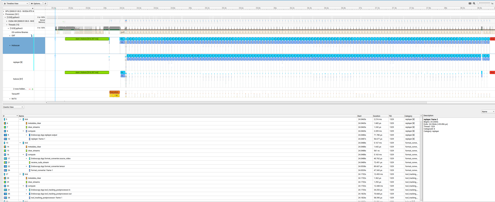
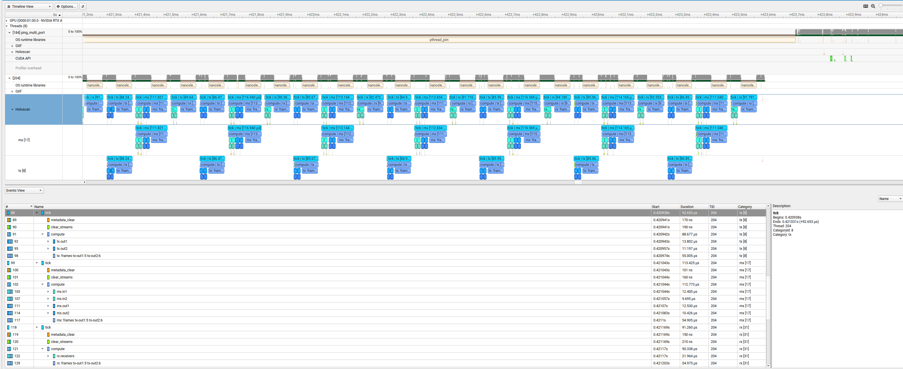

(nsight-profiling)=
# NSight Systems Profiling

The Holoscan SDK has been annotated using the [NVTX](https://github.com/NVIDIA/NVTX) API to provide runtime tracing and profiling of key application calls such as the `start`, `compute`, and `stop` callbacks made to the operators used by the application. Time spent on `emit` and `receive` calls for individual operator ports as well as timings for optional metadata handling, CUDA stream handling and data logger calls are also shown. Additionally, the SDK provides **frame-level tracking** that correlates NVTX ranges with individual data frames flowing through the application pipeline. This profiling can be captured and visualized using the tools provided by [NSight Systems](https://developer.nvidia.com/nsight-systems).

To enable profiling and output the profile results of running an application, enable the `HOLOSCAN_ENABLE_PROFILE` environment variable and use the `nsys` runtime provided with NSight Systems to run the application. For example, the following command will profile the first 3 seconds of the `bring_your_own_model` example application and write the results to `byom_profile.nsys-rep`:

```bash
export HOLOSCAN_ENABLE_PROFILE=1
nsys profile -t cuda,nvtx,osrt -o byom_profile -f true -d 3 python3 ./examples/bring_your_own_model/python/byom.py
```

The written profile can then be opened with the NSight Systems UI (`nsys-ui`) to visualize the results. This is a sample profile of the bring your own model example application, zoomed in to show the details of the CPU and CUDA runtime of the application's operators:

:::{figure-md} fig-byom-nsys-profile
:align: center


Sample profile of the `bring_your_own_model` example application

:::

## Frame-Level Tracking

The Holoscan SDK includes advanced frame-level tracking that enhances profiling by correlating NVTX ranges with individual data frames as they flow through the application pipeline. This feature provides deeper insights into per-frame processing times and helps identify performance bottlenecks at the frame level.

### How Frame Tracking Works

Frame-level tracking automatically:

1. **Assigns unique frame numbers** to data messages at root operators (operators with no predecessors)
2. **Propagates frame numbers** through the operator graph as messages flow downstream
3. **Associates NVTX ranges** with specific frame numbers, enabling frame-granular performance analysis
4. **Handles complex topologies** including cyclic graphs and multi-path flows

### Enabling Frame Tracking

Frame-level tracking is automatically enabled when **both** data flow tracking and profiling are active:

#### Enable Profiling

```bash
# Enable NVTX profiling
export HOLOSCAN_ENABLE_PROFILE=1
```

#### Enable Data Flow Tracking

In Python:

```python
# Run your application with flow tracking enabled
from holoscan.core import Tracker
app = MyHoloscanApp()
with Tracker(app) as tracker:
    app.run()
```

In C++:

```cpp
auto app = holoscan::make_application<MyHoloscanApp>();
auto& tracker = app->track(); // Enable data flow tracking
app->run();
```

### Visualizing Frame Data in NSight Systems

When frame tracking is enabled, NSight Systems will display:

- **Frame numbers** in NVTX range names (e.g., "Operator::compute [Frame 1]")  
- **Per-frame timings** for each operator's processing stages
- **Frame flow visualization** showing how frames progress through the pipeline
- **Frame correlation** across different operators processing the same data

### Key Benefits

- **Frame-level performance analysis**: Identify which specific frames cause performance issues
- **End-to-end frame tracking**: Follow individual frames through complex multi-operator pipelines  
- **Bottleneck identification**: Pinpoint operators that create frame processing delays
- **Temporal correlation**: Understand timing relationships between operators processing the same frame

### Performance Considerations

Frame tracking adds minimal overhead to applications:

- **Automatic optimization**: Frame numbers are only tracked when both profiling and data flow tracking are enabled
- **Memory efficient**: Uses lightweight frame number propagation through existing message labels
- **Thread-safe**: Designed for concurrent operator execution without performance degradation

:::{note}
Frame-level tracking requires [Data Flow Tracking](flow_tracking.md) to be enabled. If you only need basic NVTX profiling without frame correlation, you can use `HOLOSCAN_ENABLE_PROFILE=1` without enabling data flow tracking.
:::

### Results

The following images visualize the profiling results for the `Endoscopy Tool Tracking` and `Ping Multi-Port` applications using the NSight Systems UI (`nsys-ui`). The operators used in `Endoscopy Tool Tracking` are all single-port operators, whereas the operators used in `Ping Multi-Port` have 2 ports each to send and receive messages. In each of the images, the frame that is currently processed by an operator is identified using the frame number visible on expanding the `compute` section. 

#### Endoscopy Tool Tracking

:::{figure-md} fig-frame-nvtx-endoscopy-nsys-profile
:align: center
:scale: 43%



Sample profile of the `Endoscopy Tool Tracking` Application

:::

#### Ping Multi-Port

:::{figure-md} fig-frame-nvtx-ping-multiport-nsys-profile
:align: center
:scale: 43%



Sample profile of the `Ping Multi-Port` Application

:::
