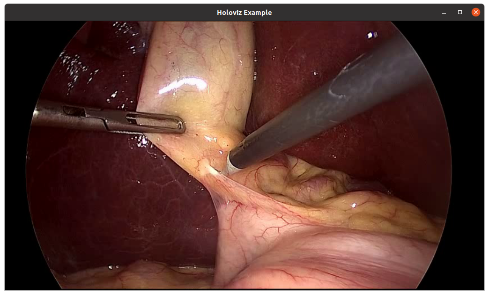

(visualization)=

```{eval-rst}
.. cpp:namespace:: holoscan
```

# Visualization

## Overview

Holoviz provides the functionality to composite real time streams of frames with multiple different other layers like segmentation mask layers, geometry layers and GUI layers.

For maximum performance Holoviz makes use of [Vulkan](https://www.vulkan.org/), which is already installed as part of the Nvidia GPU driver.

Holoscan provides the [Holoviz operator](#holoviz-operator) which is sufficient for many, even complex visualization tasks. The [Holoviz operator](#holoviz-operator) is used by multiple Holoscan [example applications](https://github.com/nvidia-holoscan/holoscan-sdk/blob/main/examples#holoscan-sdk-examples).

Additionally, for more advanced use cases, the [Holoviz module](#holoviz-module) can be used to create application specific visualization operators. The [Holoviz module](#holoviz-module) provides a C++ API and is also used by the [Holoviz operator](#holoviz-operator).

The term Holoviz is used for both the [Holoviz operator](#holoviz-operator) and the [Holoviz module](#holoviz-module) below. Both the operator and the module roughly support the same features set. Where applicable information how to use a feature with the operator and the module is provided. It's explicitly mentioned below when features are not supported by the operator.

## Layers

The core entity of Holoviz are layers. A layer is a two-dimensional image object. Multiple layers are composited to create the final output.

These layer types are supported by Holoviz:
- image layer
- geometry layer
- GUI layer

All layers have common attributes which define the look and also the way layers are finally composited.

The priority determines the rendering order of the layers. Before rendering the layers they are sorted by priority, the layers with the lowest priority are rendered first so that the layer with the highest priority is rendered on top of all other layers. If layers have the same priority then the render order of these layers is undefined.

The example below draws a transparent geometry layer on top of an image layer (geometry data and image data creation is omitted in the code). Although the geometry layer is specified first, it is drawn last because it has a higher priority (`1`) than the image layer (`0`).

`````{tab-set}
````{tab-item} Operator
The operator has a `receivers` port which accepts tensors and video buffers produced by other operators. Each tensor or video buffer will result in a layer.

The operator autodetects the layer type for certain input types (e.g. a video buffer will result in an image layer).

For other input types or more complex use cases input specifications can be provided either at initialization time as a parameter or dynamically at run time.

```cpp
std::vector<ops::HolovizOp::InputSpec> input_specs;

auto& geometry_spec =
    input_specs.emplace_back(ops::HolovizOp::InputSpec("point_tensor", ops::HolovizOp::InputType::POINTS));
geometry_spec.priority_ = 1;
geometry_spec.opacity_ = 0.5;

auto& image_spec =
    input_specs.emplace_back(ops::HolovizOp::InputSpec("image_tensor", ops::HolovizOp::InputType::IMAGE));
image_spec.priority_ = 0;

auto visualizer = make_operator<ops::HolovizOp>("holoviz", Arg("tensors", input_specs));

// the source provides two tensors named "point_tensor" and "image_tensor" at the "outputs" port.
add_flow(source, visualizer, {{"outputs", "receivers"}});
````
````{tab-item} Module
The definition of a layer is started by calling one of the layer begin functions {func}`viz::BeginImageLayer`, {func}`viz::BeginGeometryLayer` or  {func}`viz::BeginImGuiLayer`. The layer definition ends with {func}`viz::EndLayer`.

The start of a layer definition is resetting the layer attributes like priority and opacity to their defaults. So for the image layer, there is no need to set the opacity to `1.0` since the default is already `1.0`.

```cpp
namespace viz = holoscan::viz;

viz::Begin();

viz::BeginGeometryLayer();
viz::LayerPriority(1);
viz::LayerOpacity(0.5);
/// details omitted
viz::EndLayer();

viz::BeginImageLayer();
viz::LayerPriority(0);
/// details omitted
viz::EndLayer();

viz::End();
```
````
`````

### Image Layers

`````{tab-set}
````{tab-item} Operator
Image data can either be on host or device (GPU), both tensors and video buffers are accepted.

```cpp
std::vector<ops::HolovizOp::InputSpec> input_specs;

auto& image_spec =
    input_specs.emplace_back(ops::HolovizOp::InputSpec("image", ops::HolovizOp::InputType::IMAGE));

auto visualizer = make_operator<ops::HolovizOp>("holoviz", Arg("tensors", input_specs));

// the source provides an image named "image" at the "outputs" port.
add_flow(source, visualizer, {{"output", "receivers"}});
```

````
````{tab-item} Module
The function {func}`viz::BeginImageLayer` starts an image layer. An image layer displays a rectangular 2D image.

The image data is defined by calling {func}`viz::ImageCudaDevice`, {func}`viz::ImageCudaArray` or {func}`viz::ImageHost`. Various input formats are supported, see {enum}`viz::ImageFormat`.

For single channel image formats image colors can be looked up by defining a lookup table with {func}`viz::LUT`.

```cpp
viz::BeginImageLayer();
viz::ImageHost(width, height, format, data);
viz::EndLayer();
```

````
`````

#### Supported Image Formats

`````{tab-set}
````{tab-item} Operator
Supported formats for `nvidia::gxf::VideoBuffer`.

| nvidia::gxf::VideoFormat | Supported | Description |
|-|-|-|
| GXF_VIDEO_FORMAT_CUSTOM | - | |
| GXF_VIDEO_FORMAT_YUV420 | &check; | BT.601 multi planar 4:2:0 YUV |
| GXF_VIDEO_FORMAT_YUV420_ER | &check; | BT.601 multi planar 4:2:0 YUV ER |
| GXF_VIDEO_FORMAT_YUV420_709 | &check; | BT.709 multi planar 4:2:0 YUV |
| GXF_VIDEO_FORMAT_YUV420_709_ER | &check; | BT.709 multi planar 4:2:0 YUV ER |
| GXF_VIDEO_FORMAT_NV12 | &check; | BT.601 multi planar 4:2:0 YUV with interleaved UV |
| GXF_VIDEO_FORMAT_NV12_ER | &check; | BT.601 multi planar 4:2:0 YUV ER with interleaved UV |
| GXF_VIDEO_FORMAT_NV12_709 | &check; | BT.709 multi planar 4:2:0 YUV with interleaved UV |
| GXF_VIDEO_FORMAT_NV12_709_ER | &check; | BT.709 multi planar 4:2:0 YUV ER with interleaved UV |
| GXF_VIDEO_FORMAT_RGBA | &check; | RGBA-8-8-8-8 single plane |
| GXF_VIDEO_FORMAT_BGRA | &check; | BGRA-8-8-8-8 single plane |
| GXF_VIDEO_FORMAT_ARGB | &check; | ARGB-8-8-8-8 single plane |
| GXF_VIDEO_FORMAT_ABGR | &check; | ABGR-8-8-8-8 single plane |
| GXF_VIDEO_FORMAT_RGBX | &check; | RGBX-8-8-8-8 single plane |
| GXF_VIDEO_FORMAT_BGRX | &check; | BGRX-8-8-8-8 single plane |
| GXF_VIDEO_FORMAT_XRGB | &check; | XRGB-8-8-8-8 single plane |
| GXF_VIDEO_FORMAT_XBGR | &check; | XBGR-8-8-8-8 single plane |
| GXF_VIDEO_FORMAT_RGB | &check; |  RGB-8-8-8 single plane |
| GXF_VIDEO_FORMAT_BGR | &check; |  BGR-8-8-8 single plane |
| GXF_VIDEO_FORMAT_R8_G8_B8 | - | RGB - unsigned 8 bit multiplanar |
| GXF_VIDEO_FORMAT_B8_G8_R8 | - | BGR - unsigned 8 bit multiplanar |
| GXF_VIDEO_FORMAT_GRAY | &check; | 8 bit GRAY scale single plane |
| GXF_VIDEO_FORMAT_GRAY16 | &check; | 16 bit GRAY scale single plane |
| GXF_VIDEO_FORMAT_GRAY32 | - | 32 bit GRAY scale single plane |
| GXF_VIDEO_FORMAT_GRAY32F | &check; | float 32 bit GRAY scale single plane |
| GXF_VIDEO_FORMAT_RGB16 | - | RGB-16-16-16 single plane |
| GXF_VIDEO_FORMAT_BGR16 | - | BGR-16-16-16 single plane |
| GXF_VIDEO_FORMAT_RGB32 | - | RGB-32-32-32 single plane |
| GXF_VIDEO_FORMAT_BGR32 | - | BGR-32-32-32 single plane |
| GXF_VIDEO_FORMAT_R16_G16_B16 | - | RGB - signed 16 bit multiplanar |
| GXF_VIDEO_FORMAT_B16_G16_R16 | - | BGR - signed 16 bit multiplanar |
| GXF_VIDEO_FORMAT_R32_G32_B32 | - | RGB - signed 32 bit multiplanar |
| GXF_VIDEO_FORMAT_B32_G32_R32 | - | BGR - signed 32 bit multiplanar |
| GXF_VIDEO_FORMAT_NV24 | - | multi planar 4:4:4 YUV with interleaved UV |
| GXF_VIDEO_FORMAT_NV24_ER | - |  multi planar 4:4:4 YUV ER with interleaved UV |
| GXF_VIDEO_FORMAT_R8_G8_B8_D8 | - | RGBD unsigned 8 bit multiplanar |
| GXF_VIDEO_FORMAT_R16_G16_B16_D16 | - | RGBD unsigned 16 bit multiplanar |
| GXF_VIDEO_FORMAT_R32_G32_B32_D32 | - | RGBD unsigned 32 bit multiplanar |
| GXF_VIDEO_FORMAT_RGBD8 | - | RGBD 8 bit unsigned single plane |
| GXF_VIDEO_FORMAT_RGBD16 | - | RGBD 16 bit unsigned single plane |
| GXF_VIDEO_FORMAT_RGBD32 | - | RGBD 32 bit unsigned single plane |
| GXF_VIDEO_FORMAT_D32F | &check; | Depth 32 bit float single plane |
| GXF_VIDEO_FORMAT_D64F | - | Depth 64 bit float single plane |
| GXF_VIDEO_FORMAT_RAW16_RGGB | - | RGGB-16-16-16-16 single plane |
| GXF_VIDEO_FORMAT_RAW16_BGGR | - | BGGR-16-16-16-16 single plane |
| GXF_VIDEO_FORMAT_RAW16_GRBG | - | GRBG-16-16-16-16 single plane |
| GXF_VIDEO_FORMAT_RAW16_GBRG | - | GBRG-16-16-16-16 single plane |

Image format detection for `nvidia::gxf::Tensor`. Tensors don't have image format information attached. The Holoviz operator detects the image format from the tensor configuration.

| nvidia::gxf::PrimitiveType | Channels | Color format | Index for color lookup |
|-|-|-|-|
| kUnsigned8 | 1 | 8 bit GRAY scale single plane | &check; |
| kInt8 | 1 | signed 8 bit GRAY scale single plane | &check; |
| kUnsigned16 | 1 | 16 bit GRAY scale single plane | &check; |
| kInt16 | 1 | signed 16 bit GRAY scale single plane | &check; |
| kUnsigned32 | 1 | - | &check; |
| kInt32 | 1 | - | &check; |
| kFloat32 | 1 | float 32 bit GRAY scale single plane | &check; |
| kUnsigned8 | 3 | RGB-8-8-8 single plane | - |
| kInt8 | 3 | signed RGB-8-8-8 single plane | - |
| kUnsigned8 | 4 | RGBA-8-8-8-8 single plane | - |
| kInt8 | 4 | signed RGBA-8-8-8-8 single plane | - |
| kUnsigned16 | 4 | RGBA-16-16-16-16 single plane | - |
| kInt16 | 4 | signed RGBA-16-16-16-16 single plane | - |
| kFloat32 | 4 | RGBA-16-16-16-16 single plane | - |

````
````{tab-item} Module
See {enum}`viz::ImageFormat` for supported image formats. Additionally {func}`viz::ImageComponentMapping` can be used to map the color components of an image to the color components of the output.
````
`````

### Geometry Layers

A geometry layer is used to draw 2d or 3d geometric primitives. 2d primitives are points, lines, line strips, rectangles, ovals or text and are defined with 2d coordinates (x, y). 3d primitives are points, lines, line strips or triangles and are defined with 3d coordinates (x, y, z).

Coordinates start with (0, 0) in the top left and end with (1, 1) in the bottom right for 2d primitives.

`````{tab-set}
````{tab-item} Operator

See [holoviz_geometry.cpp](https://github.com/nvidia-holoscan/holoscan-sdk/blob/main/examples/holoviz/cpp/holoviz_geometry.cpp) and [holoviz_geometry.py](https://github.com/nvidia-holoscan/holoscan-sdk/blob/main/examples/holoviz/python/holoviz_geometry.py) for 2d geometric primitives and and [holoviz_geometry.py](https://github.com/nvidia-holoscan/holoscan-sdk/blob/main/examples/holoviz/python/holoviz_geometry_3d.py) for 3d geometric primitives.

````
````{tab-item} Module
The function {func}`viz::BeginGeometryLayer` starts a geometry layer.

See {enum}`viz::PrimitiveTopology` for supported geometry primitive topologies.

There are functions to set attributes for geometric primitives like color ({func}`viz::Color`), line width ({func}`viz::LineWidth`) and point size ({func}`viz::PointSize`).

The code below draws a red rectangle and a green text.

```cpp
namespace viz = holoscan::viz;

viz::BeginGeometryLayer();

// draw a red rectangle
viz::Color(1.f, 0.f, 0.f, 0.f);
const float data[]{0.1f, 0.1f, 0.9f, 0.9f};
viz::Primitive(viz::PrimitiveTopology::RECTANGLE_LIST, 1, sizeof(data) / sizeof(data[0]), data);

// draw green text
viz::Color(0.f, 1.f, 0.f, 0.f);
viz::Text(0.5f, 0.5f, 0.2f, "Text");

viz::EndLayer();
```
````
`````

### ImGui Layers

:::{note}
ImGui layers are not supported when using the Holoviz operator.
:::

The Holoviz module supports user interface layers created with [Dear ImGui](https://github.com/ocornut/imgui).

Calls to the Dear ImGui API are allowed between {func}`viz::BeginImGuiLayer` and {func}`viz::EndImGuiLayer` are used to draw to the ImGui layer. The ImGui layer behaves like other layers and is rendered with the layer opacity and priority.

The code below creates a Dear ImGui window with a checkbox used to conditionally show a image layer.

```cpp
namespace viz = holoscan::viz;

bool show_image_layer = false;
while (!viz::WindowShouldClose()) {
    viz::Begin();

    viz::BeginImGuiLayer();

    ImGui::Begin("Options");
    ImGui::Checkbox("Image layer", &show_image_layer);
    ImGui::End();

    viz::EndLayer();

    if (show_image_layer) {
        viz::BeginImageLayer();
        viz::ImageHost(...);
        viz::EndLayer();
    }

    viz::End();
}
```

ImGUI is a static library and has no stable API. Therefore the application and Holoviz have to use the same ImGUI version. Therefore the link target `holoscan::viz::imgui` is exported, make sure to link your app against that target.

### Depth Map Layers

A depth map is a single channel 2d array where each element represents a depth value. The data is rendered as a 3d object using points, lines or triangles. The color for the elements can also be specified.

Supported formats for the depth map:
- 8-bit unsigned normalized format that has a single 8-bit depth component
- 32-bit signed float format that has a single 32-bit depth component

Supported format for the depth color map:
- 32-bit unsigned normalized format that has an 8-bit R component in byte 0, an 8-bit G component in byte 1,
an 8-bit B component in byte 2, and an 8-bit A component in byte 3

Depth maps are rendered in 3D and support camera movement.

`````{tab-set}
````{tab-item} Operator
```cpp
std::vector<ops::HolovizOp::InputSpec> input_specs;

auto& depth_map_spec =
    input_specs.emplace_back(ops::HolovizOp::InputSpec("depth_map", ops::HolovizOp::InputType::DEPTH_MAP));
depth_map_spec.depth_map_render_mode_ = ops::HolovizOp::DepthMapRenderMode::TRIANGLES;

auto visualizer = make_operator<ops::HolovizOp>("holoviz",
    Arg("tensors", input_specs));

// the source provides an depth map named "depth_map" at the "output" port.
add_flow(source, visualizer, {{"output", "receivers"}});
```
````
````{tab-item} Module
See [holoviz depth map demo](https://github.com/nvidia-holoscan/holoscan-sdk/blob/main/modules/holoviz/examples/depth_map).
````
`````

## Views

By default a layer will fill the whole window. When using a view, the layer can be placed freely within the window.

Layers can also be placed in 3D space by specifying a 3D transformation matrix.
:::{note}
For geometry layers there is a default matrix which allows coordinates in the range of [0 ... 1] instead of the Vulkan [-1 ... 1] range. When specifying a matrix for a geometry layer, this default matrix is overwritten.
:::

When multiple views are specified the layer is drawn multiple times using the specified layer view.

It's possible to specify a negative term for height, which flips the image. When using a negative height, one should also adjust the y value to point to the lower left corner of the viewport instead of the upper left corner.

`````{tab-set}
````{tab-item} Operator
See [holoviz_views.py](https://github.com/nvidia-holoscan/holoscan-sdk/blob/main/examples/holoviz/python/holoviz_views.py).
````
````{tab-item} Module
Use {func}`viz::LayerAddView()` to add a view to a layer.
````
`````

## Camera

When rendering 3d geometry using a geometry layer with 3d primitives or using a depth map layer the camera properties can either be set by the application or interactively changed by the user.

To interactively change the camera, use the mouse:

- Orbit        (LMB)
- Pan          (LMB + CTRL  | MMB)
- Dolly        (LMB + SHIFT | RMB | Mouse wheel)
- Look Around  (LMB + ALT   | LMB + CTRL + SHIFT)
- Zoom         (Mouse wheel + SHIFT)

`````{tab-set}
````{tab-item} Operator
See [holoviz_camera.cpp](https://github.com/nvidia-holoscan/holoscan-sdk/blob/main/examples/holoviz/cpp/holoviz_camera.cpp).
````
````{tab-item} Module
Use {func}`viz::SetCamera()` to change the camera.
````
`````

(holoviz-display-mode)=

## Using a display in exclusive mode

Usually Holoviz opens a normal window on the Linux desktop. In that case the desktop compositor is combining the Holoviz image with all other elements on the desktop. To avoid this extra compositing step, Holoviz can render to a display directly.

### Configure a display for exclusive use

`````{tab-set}
````{tab-item} Single display
SSH into the machine and stop the X server:
```
sudo systemctl stop display-manager
```
To resume the `display manager`, run:
```bash
sudo systemctl start display-manager
```
````

````{tab-item} Multiple displays
The display to be used in exclusive mode needs to be disabled in the NVIDIA Settings application (`nvidia-settings`): open the `X Server Display Configuration` tab, select the display and under `Configuration` select `Disabled`. Press `Apply`.

````
`````

### Enable exclusive display in Holoviz

`````{tab-set}
````{tab-item} Operator
Arguments to pass to the Holoviz operator:

```cpp
auto visualizer = make_operator<ops::HolovizOp>("holoviz",
    Arg("use_exclusive_display", true), // required
    Arg("display_name", "DP-2"), // optional
    Arg("width", 2560), // optional
    Arg("height", 1440), // optional
    Arg("framerate", 240) // optional
    );

```
````
````{tab-item} Module
Provide the name of the display and desired display mode properties to {func}`viz::Init()`.

If the name is `nullptr` then the first display is selected.
````
`````

The name of the display can either be the EDID name as displayed in the NVIDIA Settings, or the output name provided by `xrandr` or
`hwinfo --monitor`.

:::{tip}
`````{tab-set}
````{tab-item} X11
In this example output of `xrandr`, `DP-2` would be an adequate display name to use:
```bash
Screen 0: minimum 8 x 8, current 4480 x 1440, maximum 32767 x 32767
DP-0 disconnected (normal left inverted right x axis y axis)
DP-1 disconnected (normal left inverted right x axis y axis)
DP-2 connected primary 2560x1440+1920+0 (normal left inverted right x axis y axis) 600mm x 340mm
   2560x1440     59.98 + 239.97*  199.99   144.00   120.00    99.95
   1024x768      60.00
   800x600       60.32
   640x480       59.94
USB-C-0 disconnected (normal left inverted right x axis y axis)
```
````
````{tab-item} Wayland and X11
In this example output of `hwinfo`, `MSI MPG343CQR would be an adequate display name to use:
```bash
$ hwinfo --monitor | grep Model
  Model: "MSI MPG343CQR"
```
````
`````
:::

## CUDA streams

By default Holoviz is using CUDA stream `0` for all CUDA operations. Using the default stream can affect concurrency of CUDA operations, see [stream synchronization behavior](https://docs.nvidia.com/cuda/cuda-runtime-api/stream-sync-behavior.html#stream-sync-behavior__default-stream) for more information.

`````{tab-set}
````{tab-item} Operator
The operator is using a {class}`holoscan::CudaStreamPool` instance if provided by the `cuda_stream_pool` argument.
The stream pool is used to create a CUDA stream used by all Holoviz operations.

```cpp
const std::shared_ptr<holoscan::CudaStreamPool> cuda_stream_pool =
    make_resource<holoscan::CudaStreamPool>("cuda_stream", 0, 0, 0, 1, 5);
auto visualizer =
    make_operator<holoscan::ops::HolovizOp>("visualizer",
        Arg("cuda_stream_pool") = cuda_stream_pool);
```

````
````{tab-item} Module
When providing CUDA resources to Holoviz through e.g. {func}`viz::ImageCudaDevice` Holoviz is using CUDA operations to use that memory. The CUDA stream used by these operations can be set by calling {func}`viz::SetCudaStream`. The stream can be changed at any time.
````
`````

## Reading the framebuffer

The rendered frame buffer can be read back. This is useful when when doing offscreen rendering or running Holoviz in a headless environment.

:::{note}
Reading the depth buffer is not supported when using the Holoviz operator.
:::

`````{tab-set}
````{tab-item} Operator

To read back the color framebuffer set the `enable_render_buffer_output` parameter to `true` and provide an allocator to the operator.

The framebuffer is emitted on the `render_buffer_output` port.

```cpp
std::shared_ptr<holoscan::ops::HolovizOp> visualizer =
    make_operator<ops::HolovizOp>("visualizer",
        Arg("enable_render_buffer_output", true),
        Arg("allocator") = make_resource<holoscan::UnboundedAllocator>("allocator"),
        Arg("cuda_stream_pool") = cuda_stream_pool);

add_flow(visualizer, destination, {{"render_buffer_output", "input"}});
```

````
````{tab-item} Module
The rendered color or depth buffer can be read back using {func}`viz::ReadFramebuffer`.
````
`````

## sRGB

The sRGB color space is supported for both images and the framebuffer. By default Holoviz is using a linear encoded framebuffer.

`````{tab-set}
````{tab-item} Operator
To switch the framebuffer color format set the `framebuffer_srgb` parameter to `true`.

To use sRGB encoded images set the `image_format` field of  the `InputSpec` structure to a sRGB image format.
````
````{tab-item} Module
Use the {func}`viz::SetSurfaceFormat()` to set the framebuffer surface format to a sRGB color format.

To use sRGB encoded images set the `fmt` parameter of {func}`viz::ImageCudaDevice()`, {func}`viz::ImageCudaArray()` or {func}`viz::ImageHost()` to a sRGB image format.
````
`````

## Holoviz operator

### Class documentation

{cpp:class}`C++ <holoscan::ops::HolovizOp>`

{py:class}`Python <holoscan.operators.HolovizOp>`.

### Holoviz Operator Examples

There are multiple [examples](https://github.com/nvidia-holoscan/holoscan-sdk/tree/main/examples/holoviz) both in Python and C++ showing how to use various features of the Holoviz operator.

## Holoviz module

### Concepts

The Holoviz module uses the concept of the immediate mode design pattern for its API, inspired by the [Dear ImGui](https://github.com/ocornut/imgui) library. The difference to the retained mode, for which most APIs are designed for, is, that there are no objects created and stored by the application. This makes it fast and easy to make visualization changes in a Holoscan application.

### Instances

The Holoviz module uses a thread-local instance object to store its internal state. The instance object is created when calling the Holoviz module is first called from a thread. All Holoviz module functions called from that thread use this instance.

When calling into the Holoviz module from other threads other than the thread from which the Holoviz module functions were first called, make sure to call {func}`viz::GetCurrent()` and {func}`viz::SetCurrent()` in the respective threads.

There are usage cases where multiple instances are needed, for example, to open multiple windows. Instances can be created by calling {func}`viz::Create()`. Call {func}`viz::SetCurrent()` to make the instance current before calling the Holoviz module function to be executed for the window the instance belongs to.

### Getting started

The code below creates a window and displays an image.

First the Holoviz module needs to be initialized. This is done by calling {func}`viz::Init()`.

The elements to display are defined in the render loop, termination of the loop is checked with {func}`viz::WindowShouldClose`.

The definition of the displayed content starts with {func}`viz::Begin` and ends with {func}`viz::End`. {func}`viz::End` starts the rendering and displays the rendered result.

Finally the Holoviz module is shutdown with {func}`viz::Shutdown`.

```cpp
#include "holoviz/holoviz.hpp"

namespace viz = holoscan::viz;

viz::Init("Holoviz Example");

while (!viz::WindowShouldClose()) {
    viz::Begin();
    viz::BeginImageLayer();
    viz::ImageHost(width, height, viz::ImageFormat::R8G8B8A8_UNORM, image_data);
    viz::EndLayer();
    viz::End();
}

viz::Shutdown();
```

Result:

:::{figure-md} holoviz-example
:align: center



Holoviz example app

:::

### API

{ref}`namespace_holoscan__viz`

### Holoviz Module Examples

There are multiple [examples](https://github.com/nvidia-holoscan/holoscan-sdk/blob/main/modules/holoviz/examples) showing how to use various features of the Holoviz module.
