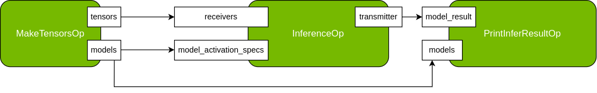

# Activation Map and ActivationSpec usage

Contains python and C++ examples to show how to select a subset models at application runtime. For example, an in real-world application usage it may be desirable to conditionally run models depending on some specific incoming data/flag.

## Data

The following datasets are used by this example:
- [(Git) First dummy ONNX model](models/dummy_addition_model_1.onnx): This model will add 1 to all values in the input float tensor (shape [1,16]).
- [(Git) Second dummy ONNX model](models/dummy_addition_model_2.onnx): This model will add 2 to all values in the input float tensor (shape [1,16]).
- [(Git) Second dummy ONNX model](models/dummy_addition_model_3.onnx): This model will add 3 to all values in the input float tensor (shape [1,16]).

For re-generating dummy models see the included script `models/gen_dummy_models.py`.

## Workflow

Fig. 1: Activation Map example workflow

`activation_map` example with input config (`activation_map.yaml`) that disables all models by default by the activation_map parameter. The application will run six times, each time it will enable a subset of models to run. On the first run, it actives only the first dummy model, on the second it actives only the second dummy model ... and finally it actives all models to inference.

Each time, the MakeTensorsOp operator will create input tensors for the `first`, `second`, and `third` models, which are connected to the input port `receivers` of the `InferenceOp`, along with a list of `ActivationSpec` data to select the model, and it connects to the input port `model_activation_specs` of the `InferenceOp`. The `PrintInferResultOp` will print the results of all models, but you will only see changes in the results of the selected models.

## Run instructions

## C++ Run instructions

* **using deb package install or NGC container**:
  ```bash
  /opt/nvidia/holoscan/examples/activation_map/cpp/activation_map
  ```
* **source (dev container)**:
  ```bash
  ./run launch # optional: append `install` for install tree
  ./examples/activation_map/cpp/activation_map
  ```
* **source (local env)**:
  ```bash
  ${BUILD_OR_INSTALL_DIR}/examples/activation_map/cpp/activation_map
  ```

## Python Run instructions
* **using python wheel**:
  ```bash
  # [Optional] Start the virtualenv where holoscan is installed
  python3 <APP_DIR>/python/activation_map.py
  ```
* **from NGC container**:
  ```bash
  python3 /opt/nvidia/holoscan/examples/activation_map/python/activation_map.py
  ```
* **source (dev container)**:
  ```bash
  ./run launch # optional: append `install` for install tree
  python3 ./examples/activation_map/python/activation_map.py
  ```
* **source (local env)**:
  ```bash
  export PYTHONPATH=${BUILD_OR_INSTALL_DIR}/python/lib
  python3 ${BUILD_OR_INSTALL_DIR}/examples/activation_map/python/activation_map.py
  ```

## Troubleshooting

### Error: `Cannot write engine file` or `Engine file creation failed`

This error may occur in Debian or Python installations that do not have write permissions to the
default model output directory at `<working_dir>/../models`. 

To fix this issue, create the directory and set the correct permissions, or run the application with
superuser permissions.

```bash
cd <working_dir>
mkdir -p ../models
sudo chown -R $(id -u):$(id -g) ../models
```
