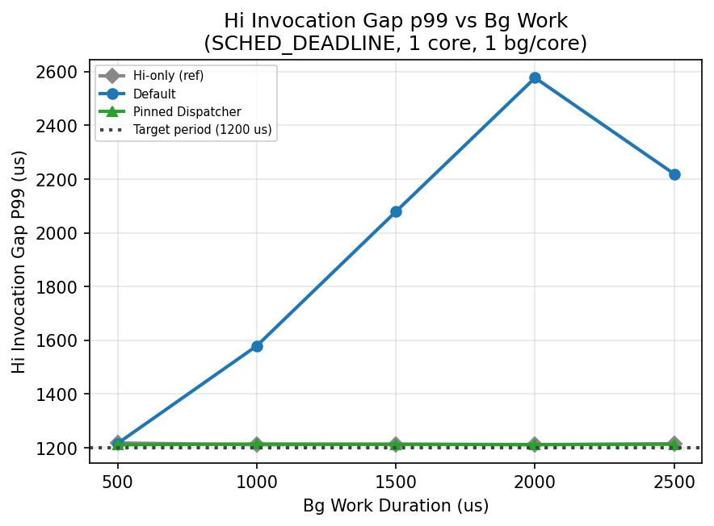
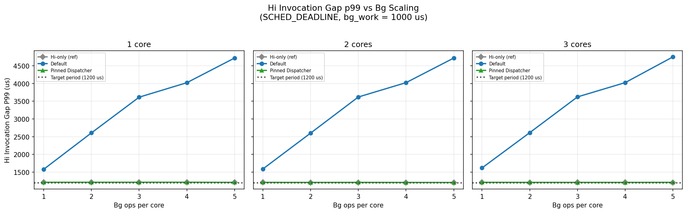
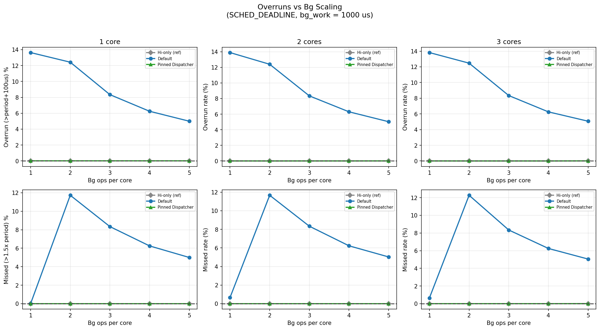
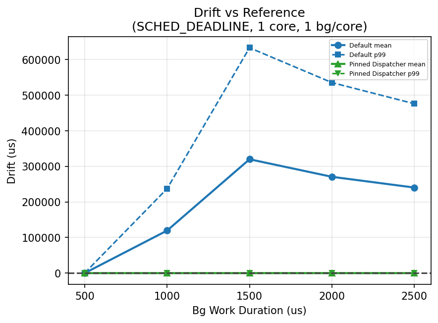

# SCHED_DEADLINE/Dispatcher Benchmark

This example benchmark measures the impact of the `EventBasedScheduler`'s
dispatcher thread on Holoscan SDK operators using `SCHED_DEADLINE` scheduling.

## Configuration

Each core runs one **high-priority** operator and N **background** operators,
all under `SCHED_DEADLINE`. Every operator is a pure CPU busy-spin
(`BusySourceOp`) pinned to its core via a per-core `ThreadPool`.

| Parameter | Hi operator | Bg operators |
|-----------|-------------|--------------|
| Count per core | 1 | N (configurable with `-n`, default 1) |
| Busy-spin duration | 500 us | configurable (`-w`, default 1000 us) |
| SCHED_DEADLINE utilization | 50% | 20% shared across N |
| Iterations | 5000 (fixed) | runs until hi finishes |

The SCHED_DEADLINE runtime parameter is set to `work + 100 us` (extra time
provided to account for overheads and Worst-case Execution Time), and
the period is derived from the target utilization.

### Benchmark passes

The benchmark runs up to three passes and prints a comparison table:

1. **Hi-only (ref)**: only hi operators, no background load. Captures
   reference invocation timings used to compute drift in later passes.
2. **Default**: hi + bg operators with the default (unpinned) dispatcher
   thread.
3. **Pinned Dispatcher** (only added when `-p CORE` is passed): same as
   Default but the GXF `EventBasedScheduler` dispatcher thread is pinned to
   the given core under `SCHED_FIFO` priority 99. The binary sets
   `GXF_EBS_DISPATCHER_CPU_CORE`, `GXF_EBS_DISPATCHER_SCHED_POLICY`, and
   `GXF_EBS_DISPATCHER_SCHED_PRIORITY` *only* around this third pass (and
   unsets them afterwards), so passes 1 and 2 remain unpinned baselines.
   Shows whether isolating the dispatcher improves the performance.

### Options

| Flag | Description | Default |
|------|-------------|---------|
| `-n N` | Background operators per core | 1 |
| `-w US` | Background busy-spin duration (us) | 1000 |
| `-p CORE` | Add a third **Pinned Dispatcher** pass for side-by-side comparison against the unpinned Default pass. The binary only sets the `GXF_EBS_DISPATCHER_*` env vars for that third pass, so the reference and default passes stay unpinned. | disabled |

> **Pinning via `-p CORE` vs. env vars:** the flag runs the benchmark as a
> three-pass comparison (`Hi-only (ref)` → `Default` → `Pinned Dispatcher`)
> in a single process. Exporting `GXF_EBS_DISPATCHER_CPU_CORE` directly in the
> shell pins the dispatcher for the *entire* process lifetime, so the
> `Hi-only (ref)` and `Default` columns printed by that run are also pinned
> (there is no unpinned baseline in the output). Use `-p` when you want to
> measure the dispatcher-pinning effect; use the env var only when you want
> a single pinned run.

### Key result metrics

- **Invocation gap** (start-to-start interval): how close the hi operator's
  periodic invocation is to the period. The mean should be close to the target
  period; large p99 values indicate jitter from dispatcher contention.
- **Overhead** (invocation gap minus target period): the extra latency
  introduced by the dispatcher and others. Ideally near zero.
- **Overrun rate**: percentage of invocations where the gap exceeds
  `period + 100 us`. A high rate means the dispatcher is regularly delaying
  operator dispatch.
- **Drift**: cumulative timing shift relative to the hi-only reference run.
  Growing drift means the dispatcher overhead is accumulating over time.
  Irrespective of the co-running operators, a `SCHED_DEADLINE`-bound operator
  should not experience a drift compared to its lone reference run.
  Drift is reported as **one-sided (late-only)**: only ticks that land *after*
  the reference offset (`offset - ref_offset > 0`) are included in the
  mean/p99/max. Early ticks are excluded so the statistic is not diluted by
  cycles where the operator happened to run slightly ahead of the reference.
  The `Drift late count` and `Drift total samples` rows (e.g. `3012` and
  `4799`) together report how many of the compared ticks were late out of
  the total number of paired comparisons, so the mean/p99/max drift values
  are conditional on that subset rather than an average over all ticks.

## Prerequisites

Real-time scheduling privileges are required. When running in a docker
container, make sure to add the `--privileged` and `--ulimit rtprio=99` flags.
On the host machine, make sure to run `sudo sysctl -w kernel.sched_rt_runtime_us=-1`.

## Quick Start

```bash
# Single DEADLINE run (3 cores starting from core 4)
sudo taskset -c 4-6 ./examples/benchmark_deadline_priority/cpp/benchmark_deadline_priority

# Single DEADLINE run with 2 bg ops/core
sudo taskset -c 4-6 ./examples/benchmark_deadline_priority/cpp/benchmark_deadline_priority -n 2

# Side-by-side comparison: ref + unpinned Default + Pinned Dispatcher (core 1),
# all in one process. Use this to measure the effect of pinning.
sudo taskset -c 4-6 ./examples/benchmark_deadline_priority/cpp/benchmark_deadline_priority -n 2 -p 1

# Single pinned run (no unpinned baseline): the env var pins the dispatcher
# for the whole process, so the Default column in the output is also pinned.
sudo GXF_EBS_DISPATCHER_CPU_CORE=1 taskset -c 4-6 ./examples/benchmark_deadline_priority/cpp/benchmark_deadline_priority -n 2

# Full sweep (writes CSVs)
sudo python3 run_benchmarks.py --binary ./benchmark_deadline_priority

# Plot results
python3 plot_benchmarks.py --input-dir benchmark_results/
```

`GXF_EBS_DISPATCHER_CPU_CORE` is separate from worker-thread `pin_cores`
configuration and is useful when measuring scheduler jitter under CPU
contention. Note that this env var affects every pass run in the same
process, unlike `-p CORE` which scopes the pinning to a dedicated
comparison pass only.

## Benchmarking

### SCHED_DEADLINE

Runs a reference (hi-only) pass and then the main pass with background
`SCHED_DEADLINE` operators:

- **Hi ops**: 1/core, 500 µs work, 50% utilization
- **Bg ops**: N/core (`-n`), configurable busy-loop duration (`-w`), sharing 20% utilization

### Helper Scripts

### `run_benchmarks.py`

Sweeps configurations and writes CSVs:

- **DEADLINE scaling**: cores 1-3, bg ops/core 1-5
- **DEADLINE work sweep**: 1 core, bg busy-loop duration 1000-3000 us

```bash
sudo python3 run_benchmarks.py --binary ./benchmark_deadline_priority
sudo python3 run_benchmarks.py --binary ./benchmark_deadline_priority --core-start 0
```

### `plot_benchmarks.py`

Reads CSVs and generates PNG plots:

- Hi invocation gap (mean, P99) with target period reference line
- Period overrun % and missed-by-huge-margin %
- Late drift vs reference: count, mean, P99

```bash
python3 plot_benchmarks.py --input-dir benchmark_results/
python3 plot_benchmarks.py --input-dir benchmark_results/ --output-dir plots/
```

## Sample Results

The numbers below are taken from a sample benchmarking run. They are intended to show the
trend, not to define absolute performance targets for every machine.

| Configuration | Scenario | Invocation gap mean | Invocation gap p99 | Drift mean vs ref | Overrun rate |
|---------------|----------|---------------------|--------------------|-------------------|--------------|
| 1 core, 1 bg/core, `bg_work=1000 us` | Default | 1249.5 us | 1579.0 us | +119.5 ms | 13.63% |
| 1 core, 1 bg/core, `bg_work=1000 us` | Pinned dispatcher | 1199.5 us | 1214.0 us | +6.9 us | 0.00% |
| 3 cores, 5 bg/core, `bg_work=1000 us` | Default | 1383.0 us | 4751.0 us | +438.3 ms | 5.07% |
| 3 cores, 5 bg/core, `bg_work=1000 us` | Pinned dispatcher | 1199.5 us | 1212.0 us | +3.6 us | 0.01% |

Representative takeaways from this sample run:

- With the default dispatcher, even the light `1 core / 1 bg/core / 1000 us`
  case is already above the 1200 us target period in both mean and p99, and it
  accumulates about `+119.5 ms` of drift relative to the hi-only reference.
- Pinning the dispatcher keeps the hi operator essentially on target across the
  sampled scaling points, with invocation gap p99 staying around `1210-1215 us`
  and drift mean staying within single-digit microseconds.
- Even when `bg_work` is increased to 1500 us, the default dispatcher
  experiences higher drift, but the pinned dispatcher still maintains the hi operator on target.

**Invocation-gap Measurements Snapshot:**





**Overrun Measurements Snapshot:**



**Drift Measurements Snapshot:**


