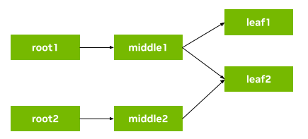

# Flow Tracker Example

This example demonstrates data flow tracking for an application graph with 2 root operators, 2 leaf operators, and 3 paths from the roots to the leaves.



*Visit the [SDK User Guide](https://docs.nvidia.com/holoscan/sdk-user-guide/flow_tracking.html) to learn more about the Data Flow Tracking feature.*

## C++ Run instructions

* **using deb package install or NGC container**:
  ```bash
  /opt/nvidia/holoscan/examples/flow_tracker/cpp/flow_tracker
  ```
* **source (dev container)**:
  ```bash
  ./run launch # optional: append `install` for install tree
  ./examples/flow_tracker/cpp/flow_tracker
  ```
* **source (local env)**:
  ```bash
  ${BUILD_OR_INSTALL_DIR}/examples/flow_tracker/cpp/flow_tracker
  ```

## Python Run instructions

* **using python wheel**:
  ```bash
  # [Prerequisite] Download example .py file below to `APP_DIR`
  # [Optional] Start the virtualenv where holoscan is installed
  python3 <APP_DIR>/flow_tracker.py
  ```
* **from NGC container**:
  ```bash
  python3 /opt/nvidia/holoscan/examples/flow_tracker/python/flow_tracker.py
  ```
* **source (dev container)**:
  ```bash
  ./run launch # optional: append `install` for install tree
  python3 ./examples/flow_tracker/python/flow_tracker.py
  ```
* **source (local env)**:
  ```bash
  export PYTHONPATH=${BUILD_OR_INSTALL_DIR}/python/lib
  python3 ${BUILD_OR_INSTALL_DIR}/examples/flow_tracker/python/flow_tracker.py
  ```
