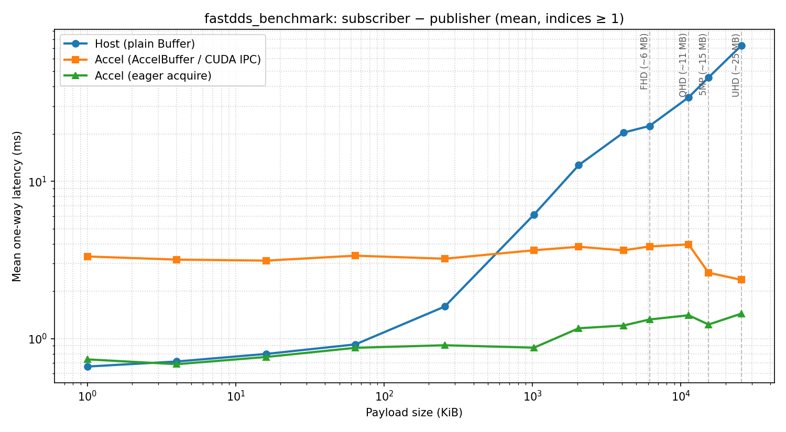

# `fastdds_benchmark` — Holoscan IPC + Fast DDS

This example builds on the usual *Fast DDS* publisher/subscriber layout (participants, topics, reader/writer) but uses **NVIDIA Holoscan IPC** (`holoscan::ipc`) to move either:

- **Plain `Buffer` samples** — payload copied **device → host** on the publisher, serialized as octets over DDS, then **host → device** on the subscriber (`flow=host`), or
- **`AccelBuffer` samples** — CUDA IPC **handles** over DDS; payload stays in device memory (`flow=accel`).

It is intended as a **latency benchmark**: stdout is almost entirely **`CUDA_BUF_LAT`** lines (see [CUDA buffer latency measurement](#cuda-buffer-latency-measurement)).

- [Description](#description-of-the-example)
- [Run the example](#run-the-example)
- [CUDA buffer latency measurement](#cuda-buffer-latency-measurement)
- [Latency sweep (example results)](#latency-sweep-example-results)
- [IPC and build options](#ipc-and-build-options)
- [XML profiles (optional)](#xml-profiles-optional)
- [IDL / `Buffer.idl` layout](USAGE.md) — `AccelBuffer`, `Buffer`, generated `gen/`, build/run shorthand

## Description of the example

Each process creates a Fast DDS **domain participant**, **publisher** or **subscriber**, and **data writer** or **data reader** on the fixed topic name `accel_buffer_topic` (see `main.cpp`). The writer uses a listener for **publication matched**; the reader uses **on_data_available** and a worker loop.

QoS in code: **reliable**, **transient-local** durability, **keep-last** history (depth 64) so a late-matching reader can still receive recent samples.

The publisher fills a reusable device buffer with byte **`0xA5`**. Payload size is **`--message-size` / `-z`** (default **1024** bytes). **`--samples` / `-s`** limits how many samples are sent/received (**0** = run until Ctrl+C).

**`--accel` / `-a`** must **match** on publisher and subscriber (both plain `Buffer` or both `AccelBuffer`).

## Run the example

Use **two terminals** (or the [automation scripts](#scripts-and-automation)). Start the **subscriber** first if you want the publisher to match immediately.

### Commands

```shell
# Terminal A — subscriber (host path, 10 samples, 1024-byte payload)
./fastdds_benchmark subscriber -s 10 -z 1024

# Terminal B — publisher (same mode and size)
./fastdds_benchmark publisher -s 10 -z 1024
```

Accel path (both sides):

```shell
./fastdds_benchmark subscriber -s 10 -z 1024 -a
./fastdds_benchmark publisher -s 10 -z 1024 -a
```

List all flags: **`./fastdds_benchmark -h`** or **`./fastdds_benchmark --help`** (as the first argument), or **`./fastdds_benchmark publisher -h`** / **`subscriber -h`** after the entity.

The publisher blocks until at least **`--matched` / `-m`** remote readers are discovered (default **1**).

### What you see on the terminal

- **stdout:** only lines matching **`CUDA_BUF_LAT …`** during a normal run (one pair per sample: publisher stamp, subscriber stamp). No “running…”, “SENT”, or “matched” chatter on stdout.
- **stderr:** CUDA/DDS/CLI problems, optional Holoscan IPC **WARN+** logs, **index gap** messages, and the **Ctrl+C** shutdown line (`… received, stopping …`).

Example (**host** path, 1024-byte payload, two samples), stdout only:

```text
CUDA_BUF_LAT kind=pub flow=host index=0 ts_ns=…
CUDA_BUF_LAT kind=sub flow=host index=0 ts_ns=…
CUDA_BUF_LAT kind=pub flow=host index=1 ts_ns=…
CUDA_BUF_LAT kind=sub flow=host index=1 ts_ns=…
```

Stopping with **Ctrl+C** prints the stop message on **stderr** for the process that receives the signal; the peer may exit when its sample count is satisfied or when the session ends. Match/unmatch is **not** printed to stdout in this build.

## CUDA buffer latency measurement

This section records **what** the `fastdds_benchmark` app measures for one-way latency and **how** it is logged for analysis.

### Goal

Measure **end-to-end latency from payload residing in CUDA memory on the publisher to payload residing in CUDA memory on the subscriber**—two processes, two GPUs (or the same device, depending on deployment). The bytes may travel through Fast DDS and, in the non-accelerated path, through host memory as serialized octets; the **measurement brackets** are still defined in terms of **CUDA source** and **CUDA destination**, not “wire only.”

### Measurement boundaries (two flows)

The log lets you compute **one-way** latency as `ts_ns(sub) − ts_ns(pub)` for the same `flow` and `index`. The tables below define where those stamps sit relative to CUDA copies (not a full network round-trip in one line).

#### Accelerated flow (`AccelBuffer`, CUDA IPC)

| Boundary | When | Meaning |
|----------|------|---------|
| **Start** | Immediately **after** the publisher’s device-to-device copy into the **per-sample** CUDA allocation | Payload is in the sample’s device buffer that will be shared via IPC / Fast DDS. Code: right after `cuda_device_memcpy_device_to_device(cuda_ptr, cuda_message_buffer_, …)` in `PublisherApp::publish`. |
| **End** | Immediately **before** `process_buffer(cuda_ptr, …)` (no D2D into `cuda_message_buffer_` in the current app; queue only) | Payload is already in **subscriber-accessible CUDA memory** via the acquired pointer. Code: in `ListenerSubscriberApp::run`, before `process_buffer`. |

**Excluded** from this interval: work before the publisher D2D into `cuda_ptr` (e.g. filling `cuda_message_buffer_`), and any future subscriber staging D2D into `cuda_message_buffer_`.

#### Non-accelerated flow (plain `Buffer`, host octets on the wire)

| Boundary | When | Meaning |
|----------|------|---------|
| **Start** | Immediately **before** the publisher’s `cudaMemcpy` **device-to-host** from `cuda_message_buffer_` into `host_data` | Last moment the payload is **only** in publisher CUDA before it is copied out for serialization. |
| **End** | Immediately **after** the subscriber’s `cudaMemcpy` **host-to-device** into `cuda_message_buffer_` | Payload has been copied from deserialized `Buffer::data()` into subscriber device memory. |

So for the non-accelerated path, the interval **begins** just before the D2H in `PublisherApp::publish`, crosses DDS as octets, and **ends** once the subscriber H2D into `cuda_message_buffer_` has **completed** (default `cudaMemcpy` is synchronous from the host thread).

### Log format (`CUDA_BUF_LAT`)

Every marker is a **single line** with a fixed token **`CUDA_BUF_LAT`**:

```text
CUDA_BUF_LAT kind=pub flow=accel index=0 ts_ns=1730000000000000000
CUDA_BUF_LAT kind=sub flow=accel index=0 ts_ns=1730000000012345678
CUDA_BUF_LAT kind=pub flow=host index=1 ts_ns=...
CUDA_BUF_LAT kind=sub flow=host index=1 ts_ns=...
```

| Field | Values | Meaning |
|-------|--------|---------|
| `kind` | `pub`, `sub` | Publisher vs subscriber stamp |
| `flow` | `accel`, `host` | AccelBuffer path vs plain Buffer path |
| `index` | `0`… | Same sample index as in the DDS message |
| `ts_ns` | int64 | **Wall-clock** nanoseconds since Unix epoch (`std::chrono::system_clock`), for cross-process comparison on a time-synced machine |

**Grep:**

```bash
grep CUDA_BUF_LAT publisher.log subscriber.log
# or merged: grep CUDA_BUF_LAT combined.log
```

Approximate one-way latency for matching `flow` and `index`: `ts_ns(sub) - ts_ns(pub)` (same host clock; use NTP/PTP if processes run on different nodes).

Implementation: `common.hpp` (`cuda_buffer_latency_log`).

### Scripts and automation

**`scripts/run_latency_benchmark.sh`** (CMake copies it **next to** `fastdds_benchmark` in the build tree; install places it beside the binary under **holoscan-examples**):

```bash
# From build/install dir (no -b needed if the binary is alongside the script):
./run_latency_benchmark.sh -s 100 -z 1024

# From repo scripts/ (pass path to the built binary):
./scripts/run_latency_benchmark.sh -s 100 -z 1024 -b /path/to/fastdds_benchmark

# AccelBuffer: add -a on both sides.
# Subscriber eager acquire (acquire_pointer_eager): add -e (requires -a).
# Optional: FASTDDS_BENCHMARK=/path/to/fastdds_benchmark
```

The script starts the subscriber, waits **`SUB_START_DELAY_SEC`** (default **2**; must be a **non-negative integer**), runs the publisher, then prints min / max / mean / median / stdev / p90 / p99 for `ts_ns(sub) − ts_ns(pub)` per `flow`. With **`-w 0`** (default) it also prints a second block with **index 0 excluded** and a **stdev ratio**. **`-w N`** uses only indices `≥ N` for the primary stats (steady-state). **`-v`** prints per-index latency. Latency aggregation uses **`python3`** if on `PATH`, else **`python`**. If **`FASTDDS_BENCHMARK_TIMEOUT_SEC`** is set to a positive integer and **`timeout`** (GNU coreutils) is on `PATH`, each of the subscriber and publisher runs is wrapped with that wall limit (SIGTERM, then kill after 10s). On failure, latency aggregation is skipped (exit 1).

**`scripts/sweep_latency_benchmark.py`** runs `run_latency_benchmark.sh` over a list of payload sizes (default: 1 KiB … 25 MiB), **20 samples** per run, **`-w 1`** mean latency, then writes a **report bundle** under a **date/time subfolder** (default name `latency_sweep_<YYYY-MM-DD_HHMMSS>`): **`REPORT.md`**, **`REPORT.html`** (same content; open in a browser), **`latency_sweep.png`** (log–log plot of mean latency: **Host** vs **Accel** vs **Accel eager** by default; use **`--no-eager`** for two series only; optional FHD/QHD/5MP/UHD guides), and **`results.csv`**. Each report includes a **System** section (OS/kernel and machine tuple, **product name** from `/sys/class/dmi/id/product_name` when present, CPU and RAM where readable from `/proc/cpuinfo` / `meminfo` on Linux, logical CPU count, **GPU** lines from **`nvidia-smi`** when available, **CUDA** driver/toolkit versions from **`nvidia-smi`** / **`nvcc`** when available, and Python version). Use **`-o DIR`** to choose the folder instead. Optional **`--timeout SEC`** caps each host/accel/eager **subprocess** (the whole `run_latency_benchmark.sh` invocation; 0 = none). That limit is **in addition to** **`FASTDDS_BENCHMARK_TIMEOUT_SEC`** inside the runner (per subscriber/publisher), if both are set. The sweep exits with a **non-zero** status if **no** successful host run was parsed, or (when Accel is enabled) if **no** successful accel run was parsed, or if accel eager is enabled and **no** successful eager run was parsed. Requires **matplotlib** (`pip install matplotlib`).

```bash
python3 sweep_latency_benchmark.py -b ./fastdds_benchmark
python3 sweep_latency_benchmark.py -b ./fastdds_benchmark -o ./my_sweep_run
```

### Runtime logging

During a normal run, **stdout** is reserved for **`CUDA_BUF_LAT`** lines only. Diagnostics (CUDA/DDS failures, index gaps, unexpected publication/subscription match counts) and the **Ctrl+C** shutdown message go to **stderr**. The app sets the Holoscan logger to **WARN** at startup (hides INFO such as ControlReader init; ERROR-level IPC/CLI messages still appear). **`HOLOSCAN_LOG_LEVEL`** overrides if set in the environment. **`-h` / `--help`** as argv[1], or after the entity, prints usage to **stdout** via `CLIParser::print_help`.

### Host vs AccelBuffer (when it pays off)

`AccelBuffer` / CUDA IPC avoids shipping full payload octets through host memory, but it has **fixed per-sample costs**. For **small payloads**, the **plain `Buffer` (host) path** is often lower latency. **Holoscan IPC (AccelBuffer) is most beneficial beyond a payload threshold** where large copies and serialization dominate; that threshold depends on GPU, driver, DDS, and load. The [latency sweep](#latency-sweep-example-results) below shows one reference system—**re-run `sweep_latency_benchmark.py` on your hardware** before choosing a path for production.

### Measurement notes

- **Async CUDA:** `cudaMemcpy` / `cuda_device_memcpy_device_to_device` as used here are **synchronous** with respect to the calling host thread before the timestamp is taken (except where the runtime documents otherwise).
- **Non-accel publisher start** is **before** D2H; **non-accel subscriber end** is **after** H2D completes.

## Latency sweep (example results)

The sweep uses the definitions and scripts in [CUDA buffer latency measurement](#cuda-buffer-latency-measurement) above.

**Typical pattern:** host latency grows roughly with payload size (copy + serialization + copy). Accel latency stays comparatively flat because the payload stays in GPU-resident memory and only descriptors cross the wire. **Accel eager** has the subscriber call **`acquire_pointer_eager`** (`--eager` on **`fastdds_benchmark` subscriber**, or **`-e`** via **`run_latency_benchmark.sh`**) instead of the default **`acquire_pointer`**, which completes the IPC open only after the ACK in the ACQUIRED/ACK/RELEASED protocol—so eager can shave that fixed latency and make Accel more competitive at small payloads (see SDK **`docs/EAGER_ACQUIRE.md`**). The latency **sweep** runs the eager path **by default**; pass **`--no-eager`** to sweep Host + Accel only.

In the reference table below, the **plain host buffer path is faster up to roughly hundreds of KiB** against default Accel acquire, while **Accel eager** tracks much closer to host at small sizes; **AccelBuffer (default or eager) wins clearly from about 1 MiB onward** on this run—see [Host vs AccelBuffer](#host-vs-accelbuffer-when-it-pays-off) for the general rule.

The figure below is from an example run (same tree as this README). **Your numbers will vary** with hardware, drivers, DDS config, and system load.



**Example run — mean latency (ms), indices ≥ 1**

| Payload | Size (bytes) | Host (ms) | Accel (ms) | Accel eager (ms) |
|--------:|-------------:|----------:|-----------:|-----------------:|
| 1.0 KiB | 1024 | 0.664584 | 3.326889 | 0.738026 |
| 4.0 KiB | 4096 | 0.715658 | 3.178750 | 0.688050 |
| 16.0 KiB | 16384 | 0.799228 | 3.131852 | 0.764708 |
| 64.0 KiB | 65536 | 0.918964 | 3.366424 | 0.874298 |
| 256.0 KiB | 262144 | 1.599092 | 3.219472 | 0.907802 |
| 1.0 MiB | 1048576 | 6.146664 | 3.644580 | 0.876356 |
| 2.0 MiB | 2097152 | 12.669152 | 3.834702 | 1.163670 |
| 4.0 MiB | 4194304 | 20.367921 | 3.638506 | 1.211079 |
| 6.0 MiB | 6291456 | 22.469214 | 3.851099 | 1.323602 |
| 11.0 MiB | 11534336 | 34.139327 | 3.969954 | 1.407461 |
| 15.0 MiB | 15728640 | 45.741102 | 2.621952 | 1.229346 |
| 25.0 MiB | 26214400 | 73.040593 | 2.363535 | 1.443030 |

**Reproduce** (from the build directory next to `fastdds_benchmark`; requires [matplotlib](https://matplotlib.org/)):

```shell
pip install matplotlib
python3 sweep_latency_benchmark.py -b ./fastdds_benchmark
```

For SSH/headless hosts, use `export MPLBACKEND=Agg` if Matplotlib complains about a display.

## IPC and build options

This example uses the **holoscan::ipc** (IPC) library for participant-scoped pointer sharing (CUDA IPC descriptors over DDS). Generated headers from IDL are treated as part of the public API and should be included with angle brackets:

- Library types (e.g. `PointerDescriptor`): `#include <holoscan/ipc/transport/fastdds/gen/pointer_descriptor.hpp>`
- App-generated types (e.g. `AccelBuffer`, `Buffer`): `#include <gen/BufferPubSubTypes.hpp>` (see `idl/Buffer.idl`)

The example target gets SDK headers via `holoscan::ipc`; ensure the build include path contains the example root (for `gen/`) and the SDK install or build tree (for `holoscan/ipc/`).

## XML profiles (optional)

Fast DDS can load participant/transport settings from XML when you set **`FASTDDS_DEFAULT_PROFILES_FILE`** to a profile file path (see *eProsima Fast DDS* documentation). **This example directory does not ship a dedicated `hello_world_profile.xml`.** You can point the variable at your own file or, under `modules/holoipc/examples/profiles/`, at files such as `fastdds_udp4_interface_whitelist.xml` if you want to experiment with transport/interface policy.

QoS for **reliability**, **durability**, and **history** are still set **in code** on the reader/writer; XML profiles mainly affect how the participant and transports are created unless you extend the app to load entity-specific profiles by name.

Changing global Fast DDS configuration can affect discovery and throughput; **latency numbers and stdout format** (`CUDA_BUF_LAT`) stay the same unless you change the application logic.
