# Holoviz

## Table of Contents

- [Module Overview](#module-overview)
- [Architecture](#architecture)
- [Core Components](#core-components)
- [Rendering Pipeline](#rendering-pipeline)
- [Layer System](#layer-system)
- [CUDA Integration](#cuda-integration)
- [Window Management](#window-management)
- [Directory Structure](#directory-structure)
- [Getting Started](#getting-started)

## Module Overview

Holoviz is a high-performance visualization module designed for real-time rendering of medical imaging and sensor data. It leverages **Vulkan** for GPU-accelerated rendering and integrates seamlessly with **CUDA** for efficient data processing and transfer.

### Key Features

- **Multi-layer compositing**: Overlay multiple data streams (images, geometry, GUI)
- **CUDA interoperability**: Direct GPU-to-GPU data transfer without CPU round-trips
- **Immediate mode API**: Simple, stateless API inspired by Dear ImGui
- **Flexible rendering**: Support for various image formats including YUV, depth maps, and LUT-based coloring
- **3D camera control**: Interactive camera manipulation for 3D visualization
- **Multiple window modes**: Windowed, fullscreen, and exclusive display modes

### Design Philosophy

Holoviz uses an **immediate mode** design pattern where you describe what to render each frame rather than managing persistent scene objects. This approach simplifies the API and makes it easy to integrate into data processing pipelines.

## Architecture

### High-Level Architecture

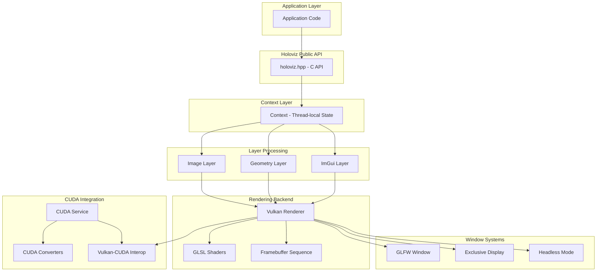

### Component Interaction Flow

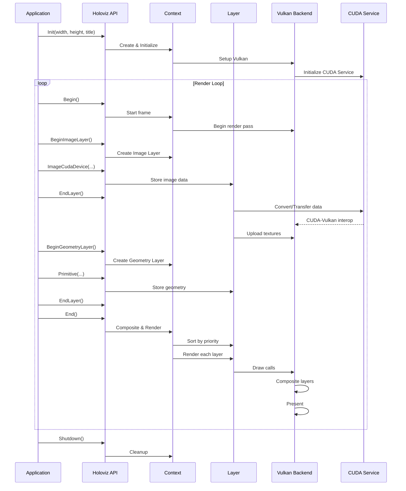

## Core Components

### 1. Context (`src/context.hpp/cpp`)

The Context is the central object that manages all state for a Holoviz instance. Key characteristics:

- **Thread-local storage**: Each thread has its own Context instance
- **Instance management**: Supports multiple instances for multiple windows
- **State management**: Maintains layers, Vulkan state, window, and callbacks

**Key responsibilities:**
- Managing the lifecycle of Window and Vulkan objects
- Storing user callbacks (keyboard, mouse, window events)
- Maintaining the current frame's layer list
- Layer reuse optimization (reusing layers across frames when possible)

```cpp
// Simplified Context structure
class Context {
    std::unique_ptr<Window> window_;       // Window backend
    std::unique_ptr<Vulkan> vulkan_;       // Vulkan renderer
    std::vector<Layer*> layers_;           // Current frame layers
    ImGuiContext* im_gui_context_;         // ImGui context
    // ... callbacks, settings, etc.
};
```

### 2. Vulkan Backend (`src/vulkan/vulkan_app.hpp/cpp`)

The Vulkan class encapsulates all Vulkan operations. It handles:

- **Device initialization**: Selects and initializes the appropriate GPU
- **Swapchain management**: Manages the presentation surface and image buffers
- **Resource management**: Textures, buffers, and their memory allocations
- **Rendering**: Command buffer recording and submission
- **CUDA interoperability**: External memory sharing between CUDA and Vulkan

**Key subsystems:**

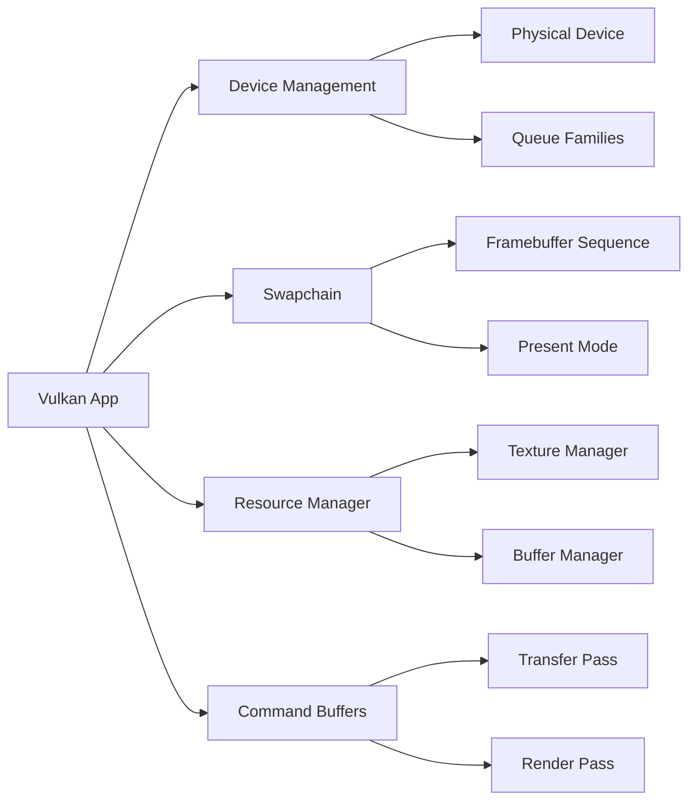

**Vulkan Pipeline:**
1. **Transfer Pass**: Upload data from CPU/CUDA to GPU textures and buffers
2. **Render Pass**: Execute draw commands to render layers
3. **Present**: Display the rendered frame

### 3. Layer System (`src/layers/`)

Layers are the fundamental rendering units. Each layer type handles specific content:

#### Layer Base Class (`layer.hpp`)

```cpp
class Layer {
    Type type_;                          // Image, Geometry, or ImGui
    int32_t priority_;                   // Render order (lower = first)
    float opacity_;                      // Layer transparency
    std::vector<View> views_;            // Viewport and transform

    virtual void render(Vulkan* vulkan) = 0;  // Rendering method
};
```

#### Image Layer (`image_layer.hpp`)

Renders 2D images with advanced features:

- **Multiple data sources**: CUDA device memory, CUDA arrays, or host memory
- **Format support**: RGB, RGBA, YUV (420/422), depth formats, single-channel
- **Color mapping**: Component swizzling, lookup tables (LUT), YUV conversion
- **Multi-planar images**: Native support for planar YUV formats
- **Depth compositing**: Optional depth buffer for proper 3D ordering

**Image data flow:**

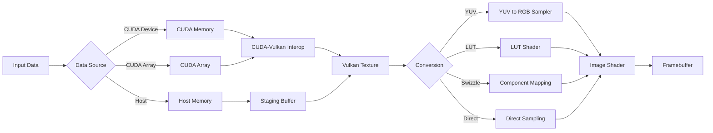

#### Geometry Layer (`geometry_layer.hpp`)

Renders vector graphics and 3D geometry:

- **Primitive types**: Points, lines, line strips, triangles, triangle strips
- **3D support**: Camera integration for 3D visualization
- **Text rendering**: ImGui-based font rendering
- **Depth maps**: Specialized rendering of depth data as 3D point clouds

**Primitive rendering:**
- Coordinates in normalized [0, 1] space (or 3D world space with camera)
- Customizable colors, line widths, and point sizes
- CUDA device memory support for dynamic geometry

#### ImGui Layer (`im_gui_layer.hpp`)

Integrates Dear ImGui for interactive UI elements:

- **Immediate mode UI**: Buttons, sliders, text inputs, etc.
- **Overlay support**: Rendered on top of other layers
- **Font atlas**: Managed through ImGui's font system

### 4. CUDA Service (`src/cuda/cuda_service.hpp/cpp`)

Manages CUDA context and device operations:

- **Device matching**: Ensures CUDA uses the same GPU as Vulkan
- **Multi-GPU handling**: Handles data transfer between different GPUs
- **Stream management**: Supports external CUDA streams
- **Memory helpers**: RAII wrappers for CUDA resources

**CUDA utility functions** (`src/cuda/`):
- `convert.cu`: Image format conversions (RGB to RGBA, BGRA to RGBA)
- `gen_depth_map.cu`: Generate 3D vertex coordinates and indices from depth maps
- `gen_primitive_vertices.cu`: Generate vertex data from primitive descriptions

### 5. Window Backends (`src/window.hpp`, `src/*_window.*`)

Abstract window interface with multiple implementations:

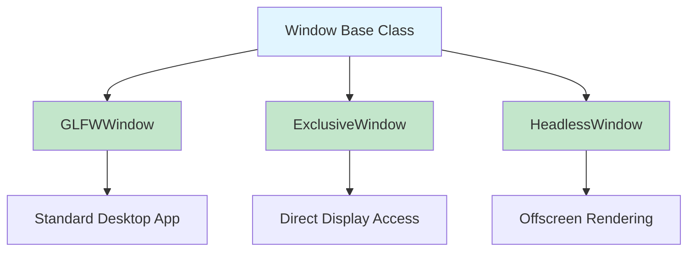

- **GLFWWindow**: Standard windowed/fullscreen mode using GLFW library
- **ExclusiveWindow**: Direct display control without a window manager (for kiosks, medical displays)
- **HeadlessWindow**: Off-screen rendering without a visible window

## Rendering Pipeline

### Frame Rendering Flow

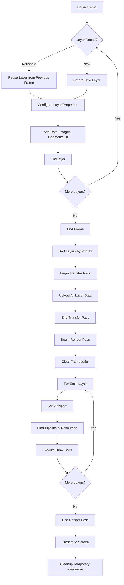

### Vulkan Rendering Details

**Render passes:**
1. **Setup phase** (once per frame):
   - Acquire next swapchain image
   - Create/update command buffer

2. **Transfer pass** (if needed):
   - Upload texture data from host or CUDA
   - Upload vertex/index buffers
   - Perform layout transitions

3. **Render pass**:
   - Bind framebuffer
   - Clear color and depth buffers
   - For each layer (sorted by priority):
     - Set viewport and scissors
     - Bind pipeline (image, geometry, or ImGui)
     - Bind descriptor sets (textures, uniforms)
     - Execute draw commands

4. **Present**:
   - End command buffer
   - Submit to graphics queue
   - Present to swapchain

**Shader Pipeline:**

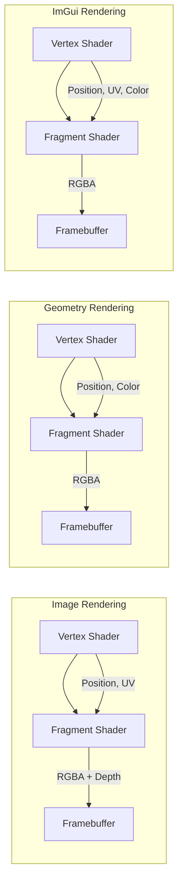

Shaders are located in `src/vulkan/shaders/`:
- `image_shader.glsl.{vert,frag}`: Image layer rendering with texture sampling
- `geometry_shader.glsl.{vert,frag}`: Geometry rendering
- `geometry_color_shader.glsl.vert`: Per-vertex color variant
- `imgui_shader.glsl.{vert,frag}`: ImGui rendering

## Layer System

### Layer Priority and Compositing

Layers are sorted by **priority** before rendering. Lower priority values are rendered first (background), higher values last (foreground).

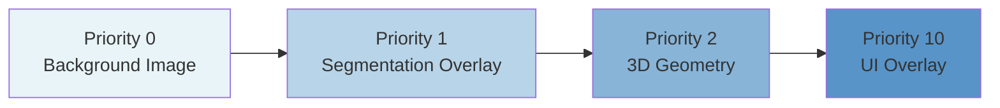

### Layer Views

Each layer can have multiple **views** that define where and how the layer is rendered:

```cpp
struct View {
    float offset_x, offset_y;        // Viewport position [0, 1]
    float width, height;             // Viewport size [0, 1]
    std::optional<mat4f> matrix;     // 3D transformation matrix
};
```

**Use cases:**
- Picture-in-picture: Render same content in multiple viewports
- Split screen: Different views of the scene
- 3D transformation: Apply custom projection matrices

### Layer Reuse Optimization

Holoviz attempts to **reuse layers** between frames to avoid reallocating GPU resources:

```cpp
bool can_be_reused(Layer& other) const {
    // Check if properties match (type, format, size, etc.)
    // If yes, reuse the layer's GPU resources
}
```

This optimization is crucial for real-time performance when rendering high-resolution images at high frame rates.

## CUDA Integration

### CUDA-Vulkan Interoperability

Holoviz uses Vulkan's **external memory** and **external semaphore** extensions to share GPU memory between CUDA and Vulkan:

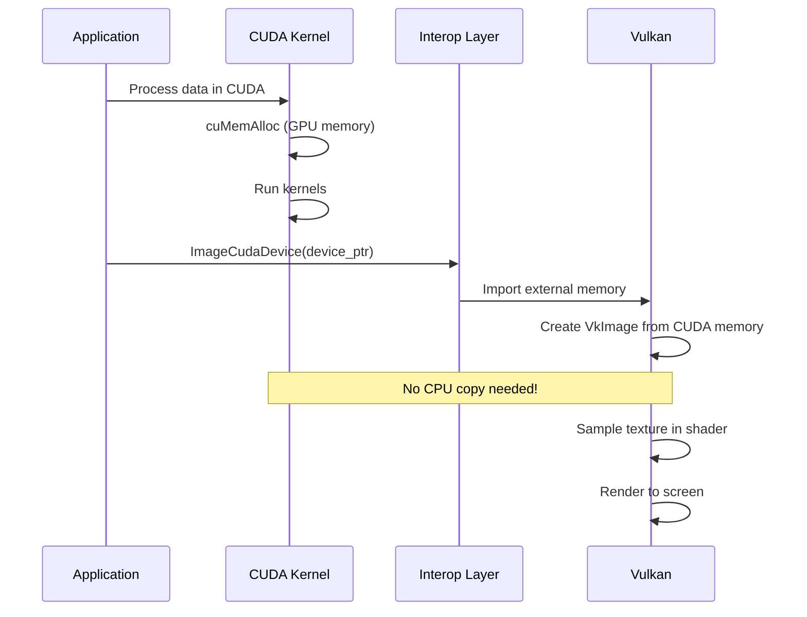

**Key advantages:**
- **Zero-copy**: Data stays on GPU, no CPU round-trip
- **Synchronization**: Proper synchronization between CUDA and Vulkan using semaphores
- **Multi-GPU support**: Automatic detection and handling of multi-GPU systems

### CUDA Conversion Functions

CUDA kernels are used for specific format conversions that cannot be handled directly by Vulkan:

- **RGB to RGBA conversion** (`convert.cu`): Convert 24-bit RGB to 32-bit RGBA by adding an alpha channel
- **BGRA to RGBA conversion** (`convert.cu`): Swap color channels from BGRA to RGBA format
- **Depth map geometry generation** (`gen_depth_map.cu`): Convert depth data into 3D vertex coordinates and indices

**Note:** YUV to RGB conversion is **not** done in CUDA. Instead, Holoviz uses Vulkan's native YUV sampler support (via `VK_KHR_sampler_ycbcr_conversion`) which performs the conversion efficiently in hardware during texture sampling.

**Example data flow with RGB to RGBA conversion:**

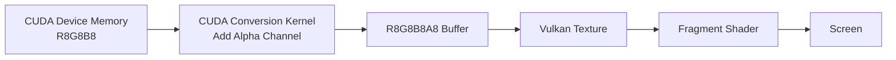

### Multi-GPU Handling

The CudaService automatically detects if data resides on a different GPU and handles the transfer:

```cpp
CUstream CudaService::select_cuda_stream(CUstream ext_stream) {
    if (IsMemOnDevice(device_ptr)) {
        return ext_stream;  // Same GPU, use external stream
    } else {
        return internal_stream_;  // Different GPU, use internal stream with copy
    }
}
```

## Window Management

### Window Initialization Modes

Holoviz supports several initialization modes:

#### 1. Standard Window (GLFW)

```cpp
// Create a 1920x1080 window
viz::Init(1920, 1080, "My Application");

// Create a fullscreen window
viz::Init(1920, 1080, "My Application", viz::InitFlags::FULLSCREEN);
```

#### 2. Exclusive Display Mode

For direct display control without a window manager:

```cpp
// Use the primary display in exclusive mode
viz::Init(nullptr, 0, 0, 0, viz::InitFlags::NONE);

// Use a specific display at 4K 60Hz
viz::Init("DP-1", 3840, 2160, 60000, viz::InitFlags::NONE);
```

**Requirements:**
- Display must be disabled in NVIDIA Settings (for multi-display setups)
- Or stop the X server for single-display setups: `sudo systemctl stop display-manager`

#### 3. External GLFW Window

```cpp
GLFWwindow* window = glfwCreateWindow(1920, 1080, "My Window", nullptr, nullptr);
viz::Init(window);
```

### Present Modes

Control how frames are presented to the screen:

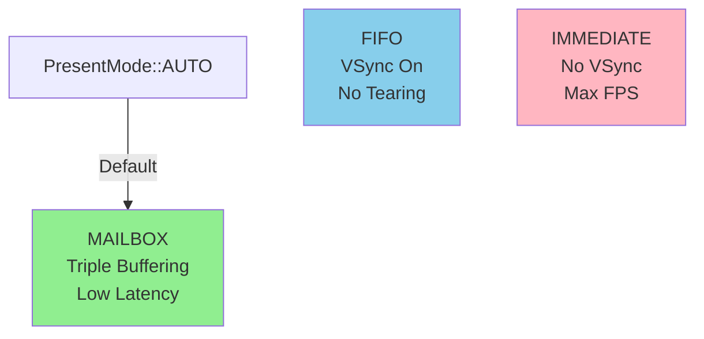

- **AUTO**: Automatically selects the best available mode (default)
- **MAILBOX**: Preferred mode - low latency, tear-free with triple buffering
- **FIFO**: VSync enabled, guaranteed tear-free (always supported)
- **IMMEDIATE**: Maximum frame rate, no VSync, possible tearing

```cpp
viz::SetPresentMode(viz::PresentMode::MAILBOX);
```

### Camera Control

Interactive 3D camera for geometry layers:

```cpp
// Set camera position
viz::SetCamera(
    0.0f, 0.0f, 3.0f,    // eye position
    0.0f, 0.0f, 0.0f,    // look at
    0.0f, 1.0f, 0.0f,    // up vector
    false                 // animate transition
);

// Get current camera pose
float matrix[16];
viz::GetCameraPose(16, matrix);
```

**Mouse controls:**
- **Orbit**: Left mouse button (LMB)
- **Pan**: LMB + CTRL or Middle mouse button (MMB)
- **Dolly**: LMB + SHIFT or Right mouse button (RMB) or Mouse wheel
- **Look Around**: LMB + ALT or LMB + CTRL + SHIFT
- **Zoom**: Mouse wheel + SHIFT

## Directory Structure

```
modules/holoviz/
├── src/
│   ├── holoviz/                    # Public API headers
│   │   ├── holoviz.hpp             # Main API header
│   │   ├── image_format.hpp        # Image format enums
│   │   ├── primitive_topology.hpp  # Geometry primitive types
│   │   ├── callbacks.hpp           # Callback type definitions
│   │   └── ...                     # Other public types
│   │
│   ├── context.hpp/cpp             # Context implementation (thread-local state)
│   ├── holoviz.cpp                 # Public API implementation
│   │
│   ├── layers/                     # Layer implementations
│   │   ├── layer.hpp/cpp           # Base layer class
│   │   ├── image_layer.hpp/cpp     # Image rendering
│   │   ├── geometry_layer.hpp/cpp  # Geometry rendering
│   │   └── im_gui_layer.hpp/cpp    # ImGui rendering
│   │
│   ├── vulkan/                     # Vulkan rendering backend
│   │   ├── vulkan_app.hpp/cpp      # Main Vulkan application
│   │   ├── buffer.hpp/cpp          # Vertex/index buffer management
│   │   ├── texture.hpp/cpp         # Texture management
│   │   ├── format_util.hpp/cpp     # Format conversion utilities
│   │   ├── framebuffer_sequence.hpp/cpp  # Swapchain framebuffer management
│   │   ├── resource.hpp/cpp        # Generic Vulkan resource wrapper
│   │   └── shaders/                # GLSL shader source files
│   │       ├── image_shader.glsl.vert/frag
│   │       ├── geometry_shader.glsl.vert/frag
│   │       ├── geometry_color_shader.glsl.vert
│   │       ├── imgui_shader.glsl.vert/frag
│   │       └── push_constants.hpp  # Shader push constant structures
│   │
│   ├── cuda/                       # CUDA integration
│   │   ├── cuda_service.hpp/cpp    # CUDA context and device management
│   │   ├── convert.cu/hpp          # Format conversion kernels
│   │   ├── gen_depth_map.cu/hpp    # Depth map to geometry conversion
│   │   └── gen_primitive_vertices.cu/hpp  # Primitive vertex generation
│   │
│   ├── window.hpp/cpp              # Window base class
│   ├── glfw_window.hpp/cpp         # GLFW window implementation
│   ├── exclusive_window.hpp/cpp    # Direct display mode
│   ├── headless_window.hpp/cpp     # Offscreen rendering
│   │
│   └── util/                       # Utility classes
│       ├── unique_value.hpp        # RAII wrapper for C-style resources
│       └── non_copyable.hpp        # Non-copyable mixin
│
├── thirdparty/                     # Third-party dependencies
│   ├── imgui/                      # Dear ImGui library
│   └── nvpro_core/                 # NVIDIA Vulkan utilities
│       ├── nvvk/                   # Vulkan helper classes
│       ├── nvh/                    # General helpers (camera, file ops)
│       ├── nvmath/                 # Math library (vectors, matrices)
│       └── nvp/                    # Platform abstractions
│
├── examples/                       # Example applications
│   ├── demo/                       # Feature demonstration
│   └── depth_map/                  # Depth map visualization
│
├── tests/                          # Unit and functional tests
│   ├── functional/                 # Integration tests
│   └── unit/                       # Unit tests
│
├── CMakeLists.txt                  # Build configuration
└── README.md                       # This file
```

## Getting Started

### Basic Usage Example

Here's a complete minimal example:

```cpp
#include <holoviz/holoviz.hpp>

namespace viz = holoscan::viz;

int main() {
    // Initialize Holoviz with a 1920x1080 window
    viz::Init(1920, 1080, "Holoviz Example");

    // Prepare some image data (RGBA, 512x512)
    const uint32_t width = 512;
    const uint32_t height = 512;
    std::vector<uint8_t> image_data(width * height * 4);

    // Fill with a gradient (example)
    for (uint32_t y = 0; y < height; ++y) {
        for (uint32_t x = 0; x < width; ++x) {
            uint32_t idx = (y * width + x) * 4;
            image_data[idx + 0] = x * 255 / width;   // R
            image_data[idx + 1] = y * 255 / height;  // G
            image_data[idx + 2] = 128;               // B
            image_data[idx + 3] = 255;               // A
        }
    }

    // Main render loop
    while (!viz::WindowShouldClose()) {
        // Begin frame
        viz::Begin();

        // Add an image layer
        viz::BeginImageLayer();
        viz::ImageHost(width, height, viz::ImageFormat::R8G8B8A8_UNORM,
                       image_data.data());
        viz::EndLayer();

        // Add a geometry layer with a line
        viz::BeginGeometryLayer();
        viz::Color(1.0f, 0.0f, 0.0f, 1.0f);  // Red color
        viz::LineWidth(2.0f);

        const float line_data[] = {
            0.1f, 0.1f,  // Start point (x, y)
            0.9f, 0.9f   // End point
        };
        viz::Primitive(viz::PrimitiveTopology::LINE_LIST, 1,
                       sizeof(line_data) / sizeof(float), line_data);
        viz::EndLayer();

        // End frame and present
        viz::End();
    }

    // Cleanup
    viz::Shutdown();
    return 0;
}
```

### CUDA Integration Example

```cpp
#include <holoviz/holoviz.hpp>
#include <cuda_runtime.h>

namespace viz = holoscan::viz;

int main() {
    viz::Init(1920, 1080, "CUDA Example");

    // Allocate CUDA device memory
    const uint32_t width = 512;
    const uint32_t height = 512;
    const size_t size = width * height * 4;

    uint8_t* d_image;
    cudaMalloc(&d_image, size);

    // ... run CUDA kernels to fill d_image ...

    while (!viz::WindowShouldClose()) {
        viz::Begin();

        // Render directly from CUDA device memory
        viz::BeginImageLayer();
        viz::ImageCudaDevice(width, height, viz::ImageFormat::R8G8B8A8_UNORM,
                            reinterpret_cast<CUdeviceptr>(d_image));
        viz::EndLayer();

        viz::End();
    }

    cudaFree(d_image);
    viz::Shutdown();
    return 0;
}
```

### Multi-Layer Example with Priority

```cpp
void RenderComplexScene() {
    viz::Begin();

    // Background image (priority 0 - rendered first)
    viz::BeginImageLayer();
    viz::LayerPriority(0);
    viz::ImageHost(bg_width, bg_height, viz::ImageFormat::R8G8B8A8_UNORM, bg_data);
    viz::EndLayer();

    // Segmentation overlay (priority 1, semi-transparent)
    viz::BeginImageLayer();
    viz::LayerPriority(1);
    viz::LayerOpacity(0.5f);  // 50% transparent
    viz::ImageHost(seg_width, seg_height, viz::ImageFormat::R8G8B8A8_UNORM, seg_data);
    viz::EndLayer();

    // 3D geometry (priority 2)
    viz::BeginGeometryLayer();
    viz::LayerPriority(2);
    viz::Color(0.0f, 1.0f, 0.0f, 1.0f);  // Green
    viz::Primitive(viz::PrimitiveTopology::TRIANGLE_LIST, triangle_count,
                   vertex_data_size, vertex_data);
    viz::EndLayer();

    // UI overlay (priority 10 - rendered last, on top)
    viz::BeginImGuiLayer();
    viz::LayerPriority(10);
    // Use ImGui functions here
    ImGui::Begin("Control Panel");
    ImGui::Text("FPS: %.1f", ImGui::GetIO().Framerate);
    ImGui::End();
    viz::EndLayer();

    viz::End();
}
```

### Advanced: LUT-based Coloring

```cpp
// Create a color lookup table (256 entries, RGBA)
std::vector<uint8_t> lut(256 * 4);
for (int i = 0; i < 256; ++i) {
    lut[i * 4 + 0] = i;           // R
    lut[i * 4 + 1] = 255 - i;     // G
    lut[i * 4 + 2] = 128;         // B
    lut[i * 4 + 3] = 255;         // A
}

// Render single-channel data with LUT coloring
viz::BeginImageLayer();
viz::ImageHost(width, height, viz::ImageFormat::R8_UNORM, grayscale_data);
viz::LUT(256, viz::ImageFormat::R8G8B8A8_UNORM, lut.size(), lut.data(), true);
viz::EndLayer();
```

### Thread Safety and Multiple Instances

```cpp
// Thread 1: Main window
void Thread1() {
    viz::Init(1920, 1080, "Window 1");
    auto instance1 = viz::GetCurrent();

    while (!viz::WindowShouldClose()) {
        viz::Begin();
        // ... render ...
        viz::End();
    }
    viz::Shutdown();
}

// Thread 2: Secondary window
void Thread2() {
    auto instance2 = viz::Create();  // Create new instance
    viz::SetCurrent(instance2);      // Make it current for this thread

    viz::Init(800, 600, "Window 2");

    while (!viz::WindowShouldClose()) {
        viz::Begin();
        // ... render ...
        viz::End();
    }
    viz::Shutdown(instance2);
}

int main() {
    std::thread t1(Thread1);
    std::thread t2(Thread2);

    t1.join();
    t2.join();
    return 0;
}
```

### Performance Tips

1. **Reuse layers**: The immediate mode API automatically reuses GPU resources when layer properties match across frames
2. **Use CUDA memory**: Prefer `ImageCudaDevice()` over `ImageHost()` to avoid CPU-GPU transfers
3. **Set appropriate present mode**: Use `MAILBOX` for low latency or `FIFO` for guaranteed VSync
4. **Minimize layer count**: Combine similar content into single layers when possible
5. **Use layer priority efficiently**: Only set priority when you need specific ordering
6. **Preallocate resources**: Keep buffers allocated between frames when their size doesn't change

### Common Pitfalls for C++ Developers New to Vulkan/CUDA

1. **CUDA stream usage**: Use explicit CUDA streams instead of the default stream for better performance
   ```cpp
   // Bad: Using default stream (synchronizes with all other streams)
   myKernel<<<grid, block>>>(d_image);
   viz::ImageCudaDevice(width, height, fmt, d_image);

   // Good: Use explicit streams
   CUstream stream;
   cudaStreamCreate(&stream);
   viz::SetCudaStream(stream);  // Tell Holoviz which stream to use

   myKernel<<<grid, block, 0, stream>>>(d_image);
   viz::ImageCudaDevice(width, height, fmt, d_image);  // No sync needed!

   cudaStreamDestroy(stream);
   ```

   **Note:** When using the default stream (0), Holoviz also uses the default stream, so no explicit synchronization is needed. However, the default stream synchronizes with all other streams, which can hurt performance in multi-stream applications.

2. **Image format matching**: Ensure your data format matches the specified `ImageFormat`
   ```cpp
   // Bad: Data is BGRA but format says RGBA
   viz::ImageHost(width, height, viz::ImageFormat::R8G8B8A8_UNORM, bgra_data);

   // Good: Use component swizzling
   viz::ImageComponentMapping(viz::ComponentSwizzle::B, viz::ComponentSwizzle::G,
                             viz::ComponentSwizzle::R, viz::ComponentSwizzle::A);
   viz::ImageHost(width, height, viz::ImageFormat::R8G8B8A8_UNORM, bgra_data);
   ```

3. **Coordinate spaces**: Geometry coordinates are normalized [0, 1] by default
   ```cpp
   // This draws a line from top-left (0,0) to bottom-right (1,1)
   const float line[] = {0.0f, 0.0f, 1.0f, 1.0f};
   viz::Primitive(viz::PrimitiveTopology::LINE_LIST, 1, 4, line);
   ```

4. **Begin/End pairing**: Always pair `Begin()` with `End()` and each `Begin*Layer()` with `EndLayer()`

5. **Context lifetime**: Don't call Holoviz functions after `Shutdown()` - the context is destroyed

### Further Reading

- See `examples/demo/` for a comprehensive feature demonstration
- See `examples/depth_map/` for depth map rendering
- Check `tests/functional/` for usage patterns and test cases
- Vulkan resources: [Vulkan Tutorial](https://vulkan-tutorial.com/), [Vulkan Guide](https://github.com/KhronosGroup/Vulkan-Guide)
- CUDA resources: [CUDA Programming Guide](https://docs.nvidia.com/cuda/cuda-c-programming-guide/), [CUDA Best Practices](https://docs.nvidia.com/cuda/cuda-c-best-practices-guide/)
